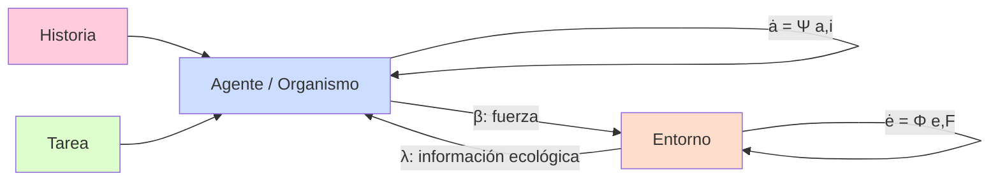
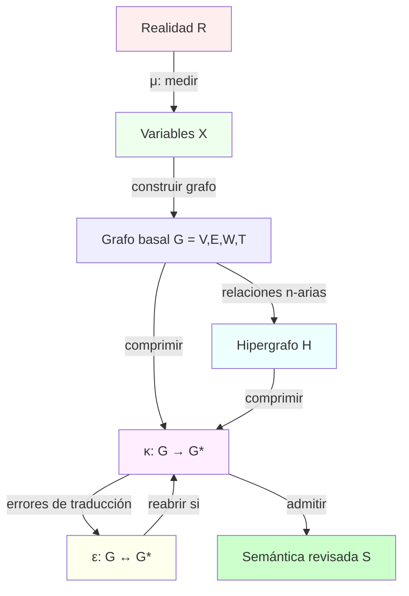
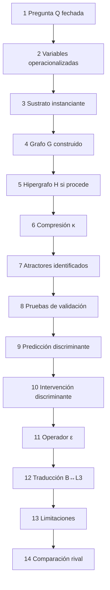
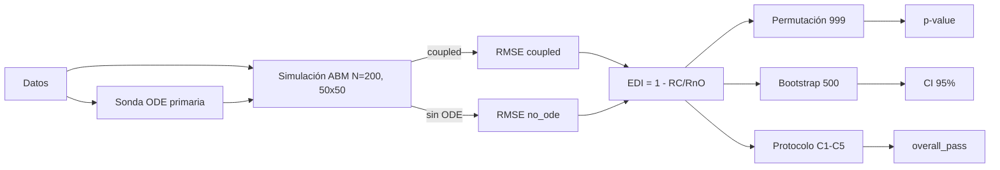
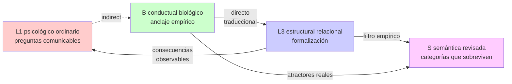
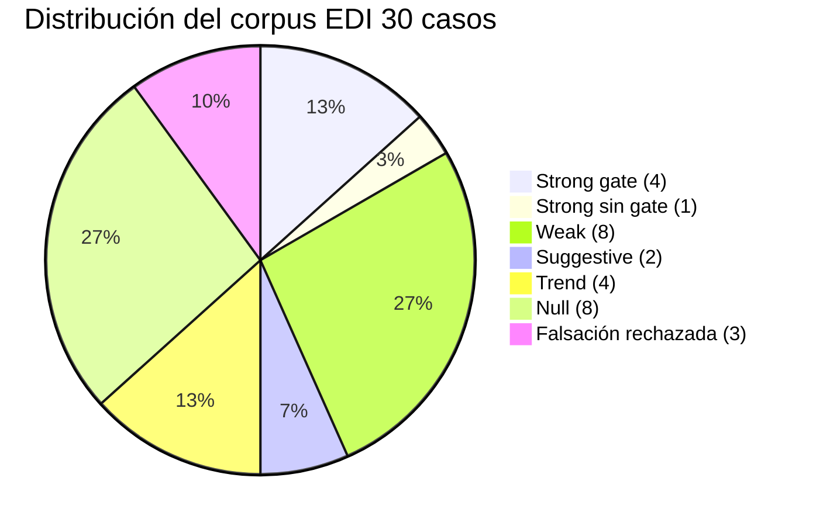
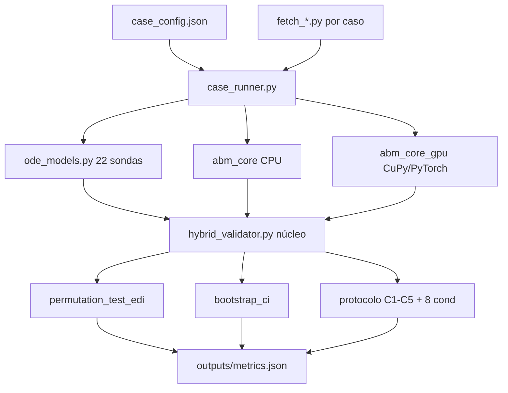
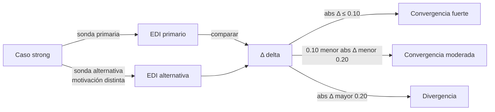
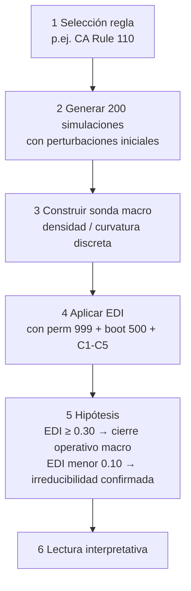

# Apéndice técnico 3. Figuras Mermaid

Diagramas formales del manuscrito en formato Mermaid (renderable directamente por GitHub, GitLab, Pandoc + filtros, y la mayoría de visores Markdown). Reemplaza los diagramas ASCII art que aparecen en el cuerpo de los capítulos.

**Versiones vectoriales pre-depósito (generadas por `@mermaid-js/mermaid-cli`):**

- SVG: `figures/mermaid_svg/figura_<NN>.svg`
- PNG (1600×1200): `figures/mermaid_png/figura_<NN>.png`
- Fuente `.mmd` extraída automáticamente: `figures/mermaid_src/figura_<NN>.mmd`

La numeración `<NN>` (01-09) corresponde al orden de aparición en este apéndice (`Figura T.3.1` → `figura_01.svg`, etc.). La regeneración es reproducible con `scripts/render_mermaid.sh`.

---

## Fig. 2.2. Acoplamiento dinámico organismo-entorno-tarea-historia (capítulo 02-04)

**Figura A.10.1.**



---

## Fig. 3.1. Mapa de operadores formales (capítulo 03-01)

**Figura A.10.2.**



---

## Fig. 3.2. Dossier de anclaje (14 componentes — capítulo 03-02)

**Figura A.10.3.**



---

## Fig. 3.3. Pipeline EDI (capítulo 03-04)

**Figura A.10.4.**



---

## Fig. 5.1. Asimetría L1↔B↔L3↔S como protocolo (capítulo 02-04)

**Figura A.10.5.**



---

## Fig. 6.1. Paisaje de emergencia del corpus (capítulo 06-01)

**Figura A.10.6.**



---

## Fig. 9.1. Arquitectura del motor ABM+ODE (capítulo 09-00)

**Figura A.10.7.**



---

## Fig. 9.31. Multi-sonda (capítulo 09-31)

**Figura A.10.8.**



---

## Fig. C.1. Esquema de convergencia EDI-Wolfram (capítulo 04-debates §14)

**Figura A.10.9.**



---

## Trazabilidad

Las figuras están versionadas en este apéndice. Cualquier cambio se ejecuta aquí y se referencia desde el capítulo que las menciona. La conversión a SVG/PNG se ejecuta pre-depósito mediante:

```bash
mmdc -i 10-apendices-tecnicos/03-figuras-mermaid.md -o figures/mermaid_svg/  # mermaid-cli
```

o automáticamente por GitHub/Pandoc con filtros mermaid.
