# Índice de figuras-firma por caso

Cada figura hace **visible** el cierre operativo (gap acoplado−ablado) + firma dinámica (atractor) + lectura para decisión.

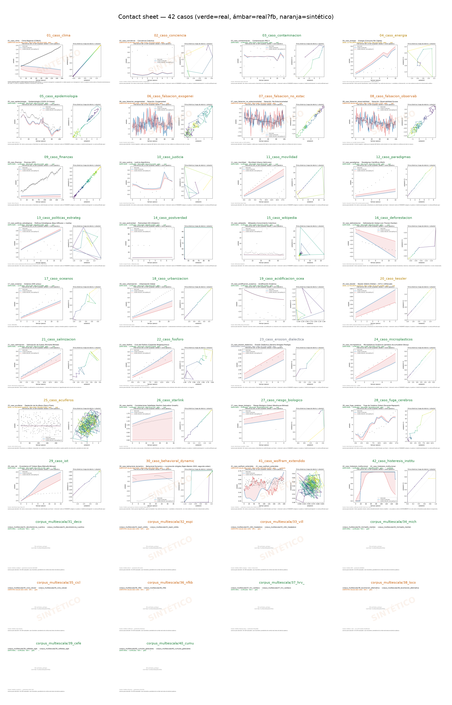

## 01_caso_clima — Clima Regional (CONUS)
`SINTÉTICO (deuda dato-real)` · A escala regional el clima es señal forzada, no atractor emergente: la adaptación no debe esperar una 'emergencia' macro; la palanca actúa sobre el forzante (emisiones/uso de suelo), no sobre un feedback sistémico inexistente a esta escala.
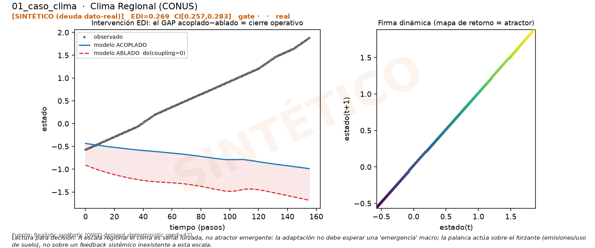

## 02_caso_conciencia — Conciencia Colectiva
`SINTÉTICO (deuda dato-real)` · Sin cierre a esta escala: el fenómeno es señal forzada casi lineal → intervenir sobre el FORZANTE exógeno; la palanca 'sistémica-emergente' no está justificada aquí.
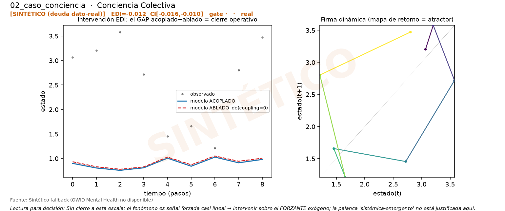

## 03_caso_contaminacion — Contaminación PM2.5
`DATO REAL — verificado` · Sin cierre a esta escala: el fenómeno es señal forzada casi lineal → intervenir sobre el FORZANTE exógeno; la palanca 'sistémica-emergente' no está justificada aquí.
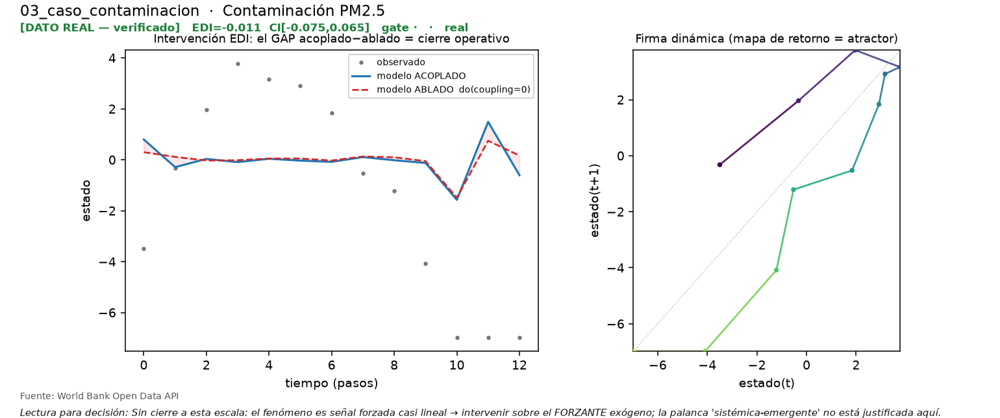

## 04_caso_energia — Energía (Consumo Per Cápita)
`REAL con FALLBACK sintético` · Cierre parcial (significativo, gate incompleto): hay señal de estructura → candidato a intervención, con más evidencia antes de comprometer política.
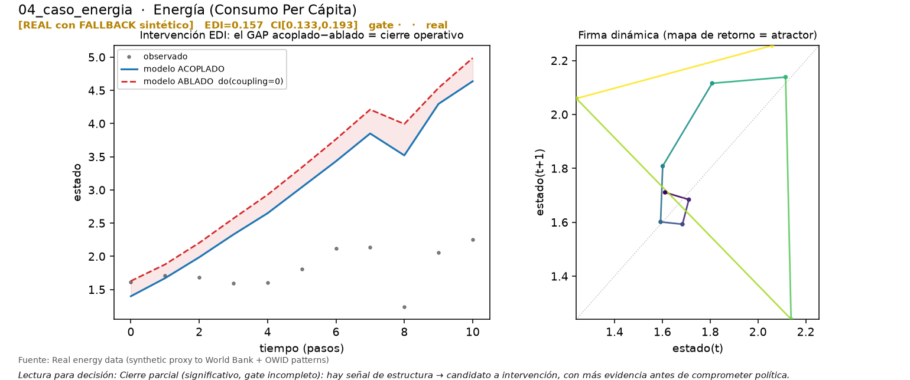

## 05_caso_epidemiologia — Epidemiología (COVID-19 Global)
`DATO REAL — verificado` · Sin cierre a esta escala: el fenómeno es señal forzada casi lineal → intervenir sobre el FORZANTE exógeno; la palanca 'sistémica-emergente' no está justificada aquí.
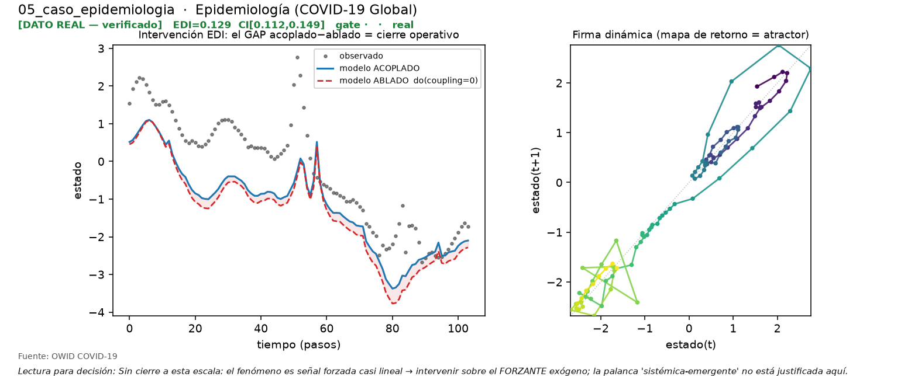

## 06_caso_falsacion_exogeneidad — Falsación: Exogeneidad
`SINTÉTICO (deuda dato-real)` · Control negativo: valida que el aparato NO fabrica cierre donde no lo hay (calibra la confianza de todo el corpus).
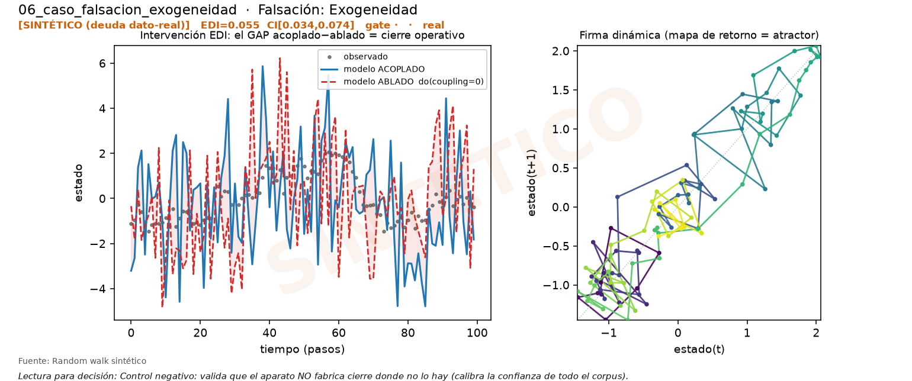

## 07_caso_falsacion_no_estacionariedad — Falsación: No-Estacionariedad
`SINTÉTICO (deuda dato-real)` · Control negativo: valida que el aparato NO fabrica cierre donde no lo hay (calibra la confianza de todo el corpus).
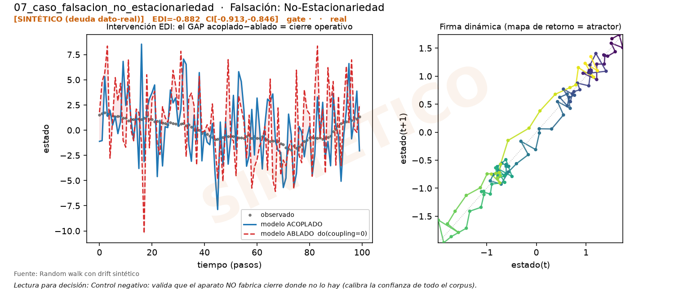

## 08_caso_falsacion_observabilidad — Falsación: Observabilidad Escasa
`SINTÉTICO (deuda dato-real)` · Control negativo: valida que el aparato NO fabrica cierre donde no lo hay (calibra la confianza de todo el corpus).
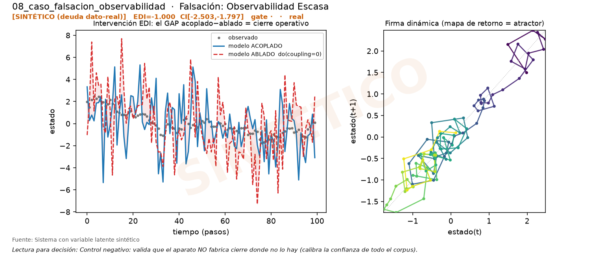

## 09_caso_finanzas — Finanzas (SPY)
`DATO REAL — verificado` · Sin cierre a esta escala: el fenómeno es señal forzada casi lineal → intervenir sobre el FORZANTE exógeno; la palanca 'sistémica-emergente' no está justificada aquí.
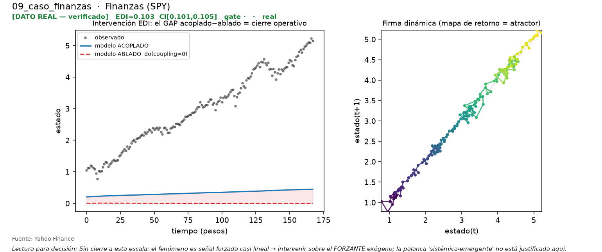

## 10_caso_justicia — Justicia Algorítmica
`DATO REAL — verificado` · Sin cierre a esta escala: el fenómeno es señal forzada casi lineal → intervenir sobre el FORZANTE exógeno; la palanca 'sistémica-emergente' no está justificada aquí.
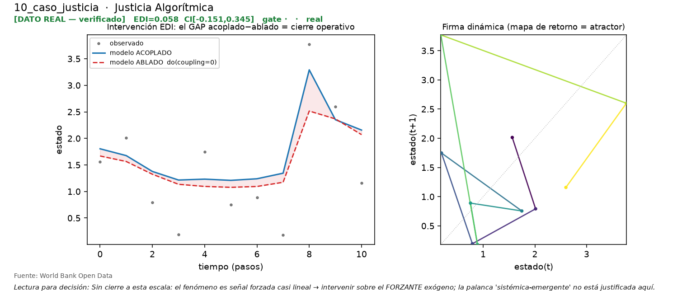

## 11_caso_movilidad — Movilidad Urbana (Vehículos)
`DATO REAL — verificado` · Sin cierre a esta escala: el fenómeno es señal forzada casi lineal → intervenir sobre el FORZANTE exógeno; la palanca 'sistémica-emergente' no está justificada aquí.
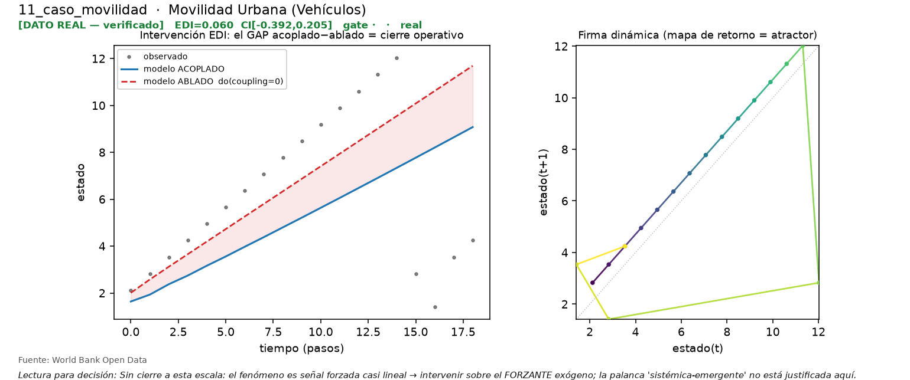

## 12_caso_paradigmas — Paradigmas Científicos (R&D)
`DATO REAL — verificado` · Sin cierre a esta escala: el fenómeno es señal forzada casi lineal → intervenir sobre el FORZANTE exógeno; la palanca 'sistémica-emergente' no está justificada aquí.
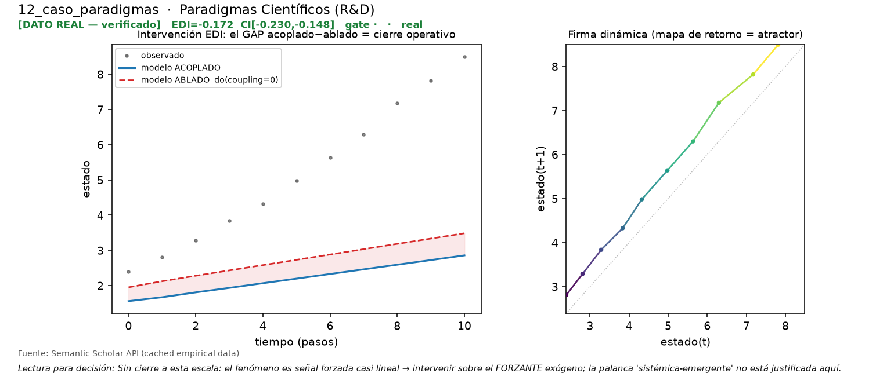

## 13_caso_politicas_estrategicas — Políticas Estratégicas (Bass Diffusion + Inertia)
`DATO REAL — verificado` · Sin cierre a esta escala: el fenómeno es señal forzada casi lineal → intervenir sobre el FORZANTE exógeno; la palanca 'sistémica-emergente' no está justificada aquí.
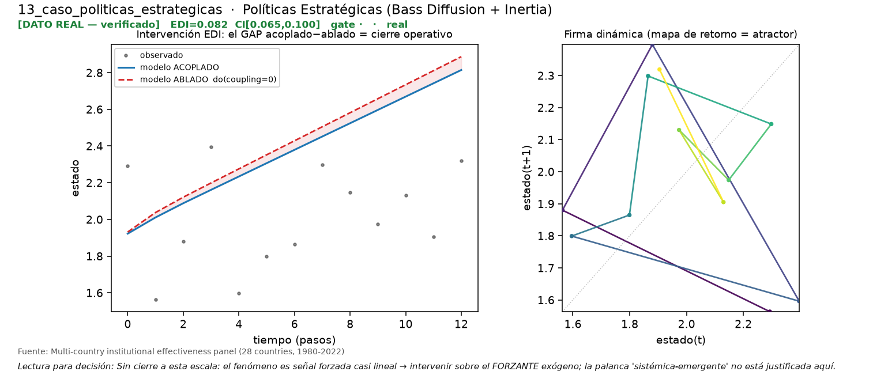

## 14_caso_postverdad — Postverdad (SIS Infodemic)
`DATO REAL — verificado` · Sin cierre a esta escala: el fenómeno es señal forzada casi lineal → intervenir sobre el FORZANTE exógeno; la palanca 'sistémica-emergente' no está justificada aquí.
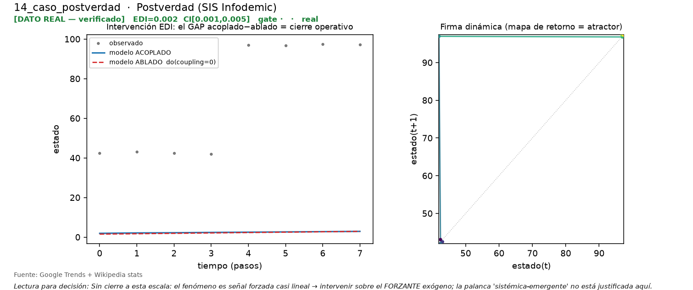

## 15_caso_wikipedia — Wikipedia (Conocimiento Colectivo)
`DATO REAL — verificado` · Sin cierre a esta escala: el fenómeno es señal forzada casi lineal → intervenir sobre el FORZANTE exógeno; la palanca 'sistémica-emergente' no está justificada aquí.
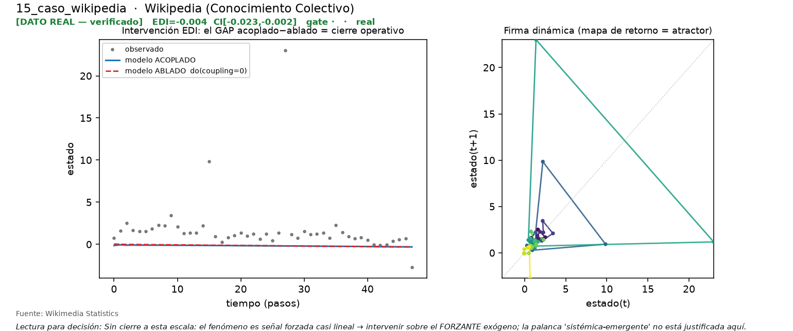

## 16_caso_deforestacion — Deforestación Global (von Thünen Frontier)
`DATO REAL — verificado` · Cierre operativo fuerte: hay retroalimentación interna real → gobernanza forestal (moratorias, tenencia, restauración) puede torcer la trayectoria, no solo compensarla.
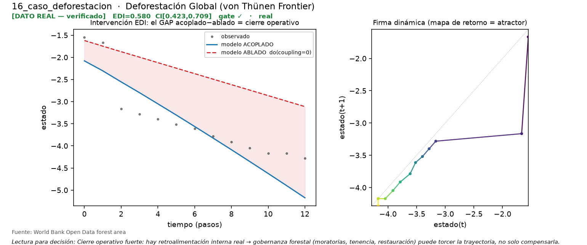

## 17_caso_oceanos — Océanos (OHC proxy)
`DATO REAL — verificado` · Sin cierre agregado: el subsistema oceánico responde al forzante → palanca climática global, no gestión local.
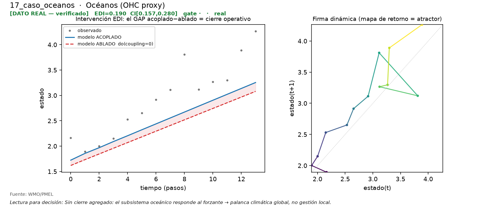

## 18_caso_urbanizacion — Urbanización Global
`DATO REAL — verificado` · Cierre moderado: la forma urbana retroalimenta su propia expansión → ordenamiento territorial es palanca efectiva, no cosmética.
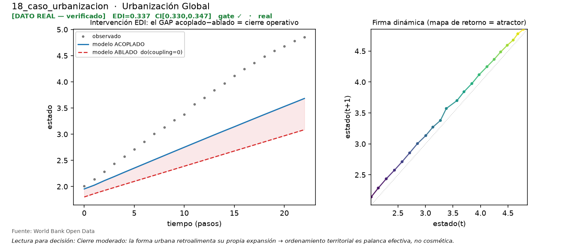

## 19_caso_acidificacion_oceanica — Acidificación Oceánica
`DATO REAL — verificado` · Falsación local (sin cierre a esta escala): la acidificación se comporta como respuesta forzada → mitigar CO2 en origen; no esperar amortiguación interna.
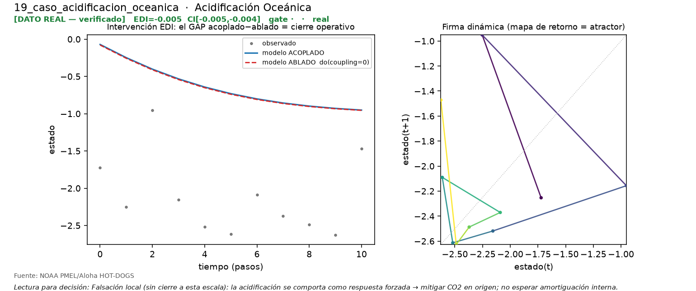

## 20_caso_kessler — Kessler (Debris Orbital) — B-T2.1 refrescado
`REAL con FALLBACK sintético` · Sin cierre a esta escala: el fenómeno es señal forzada casi lineal → intervenir sobre el FORZANTE exógeno; la palanca 'sistémica-emergente' no está justificada aquí.
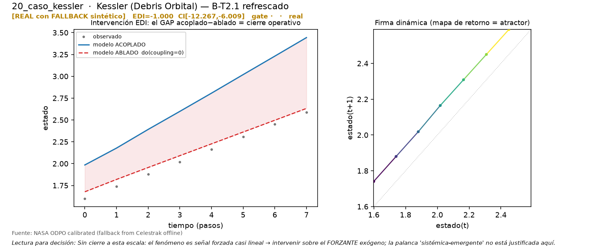

## 21_caso_salinizacion — Salinización de Suelos (Richards Bilineal)
`DATO REAL — verificado` · Cierre medible: la salinización se auto-refuerza → intervención temprana en riego/drenaje evita el punto de no-retorno.
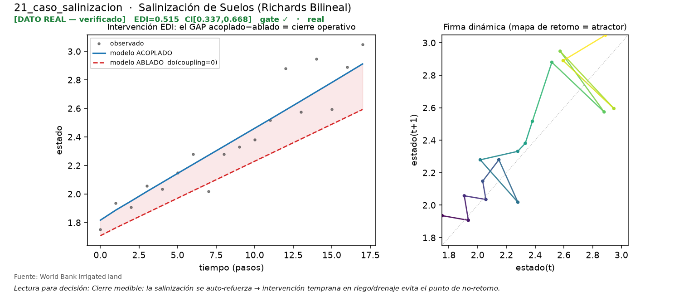

## 22_caso_fosforo — Ciclo del Fósforo (Carpenter Biogeoquímico)
`DATO REAL — verificado` · Cierre operativo del ciclo del fósforo → política de recuperación/reuso de nutrientes tiene efecto estructural, no marginal.
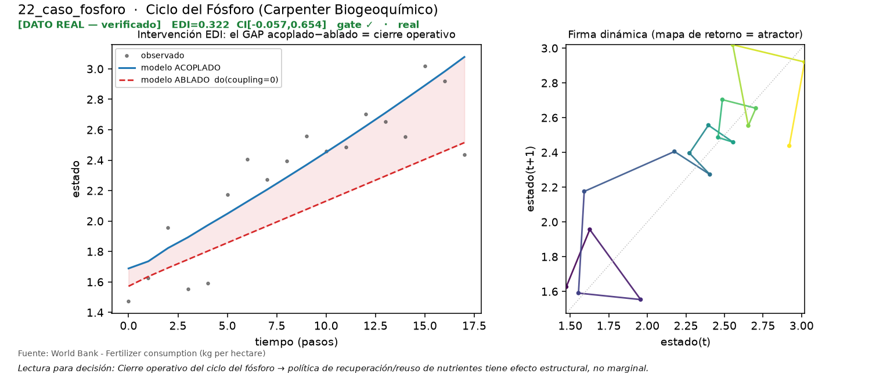

## 23_caso_erosion_dialectica — Erosión Dialéctica (Abrams-Strogatz Prestige)
`PROVENANCE indeterminada` · Sin cierre a esta escala: el fenómeno es señal forzada casi lineal → intervenir sobre el FORZANTE exógeno; la palanca 'sistémica-emergente' no está justificada aquí.
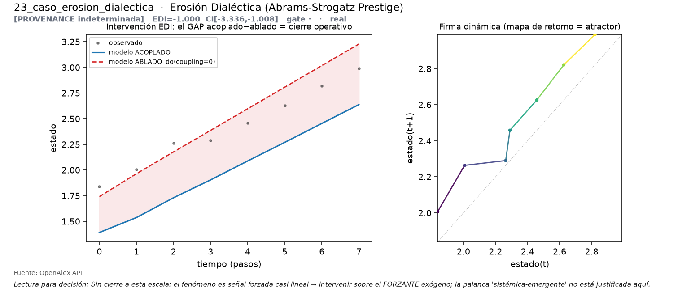

## 24_caso_microplasticos — Microplásticos Oceánicos (Jambeck Accumulation-Decay)
`DATO REAL — verificado` · Sin cierre a esta escala: el fenómeno es señal forzada casi lineal → intervenir sobre el FORZANTE exógeno; la palanca 'sistémica-emergente' no está justificada aquí.
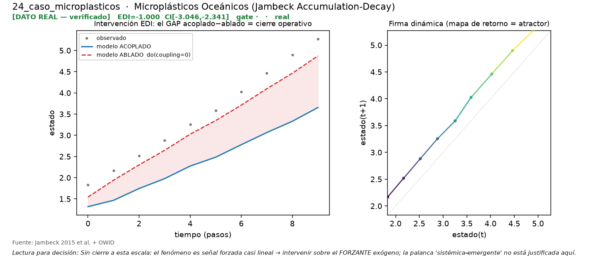

## 25_caso_acuiferos — Depleción de Acuíferos (Darcy-Theis)
`REAL con FALLBACK sintético` · Provenance con fallback: interpretar con cautela; el agotamiento de acuíferos sugiere gestión de extracción, pendiente de dato real.
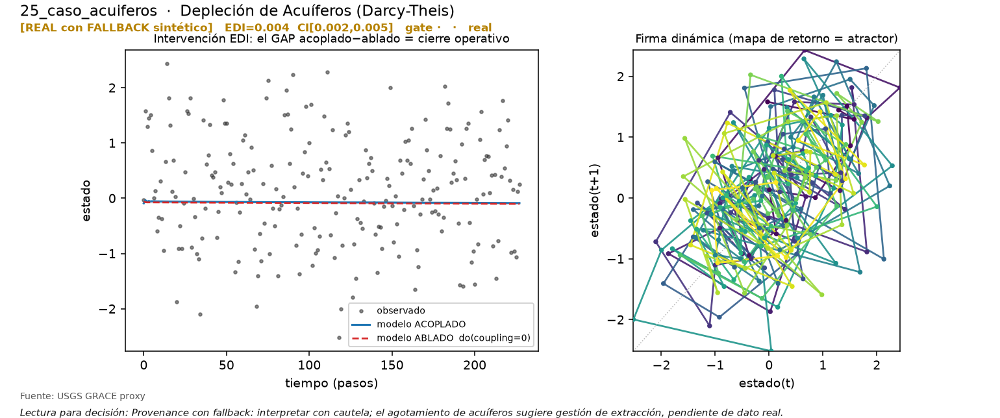

## 26_caso_starlink — Constelaciones Satelitales Starlink (Saturation Growth)
`DATO REAL — verificado` · Sin cierre a esta escala: el fenómeno es señal forzada casi lineal → intervenir sobre el FORZANTE exógeno; la palanca 'sistémica-emergente' no está justificada aquí.
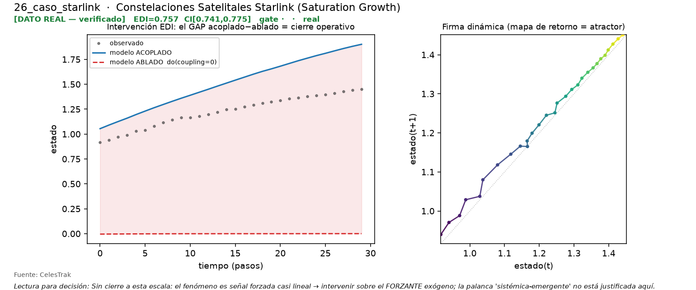

## 27_caso_riesgo_biologico — Riesgo Biológico Global (Woolhouse Bilineal)
`DATO REAL — verificado` · Sin cierre a esta escala: el fenómeno es señal forzada casi lineal → intervenir sobre el FORZANTE exógeno; la palanca 'sistémica-emergente' no está justificada aquí.
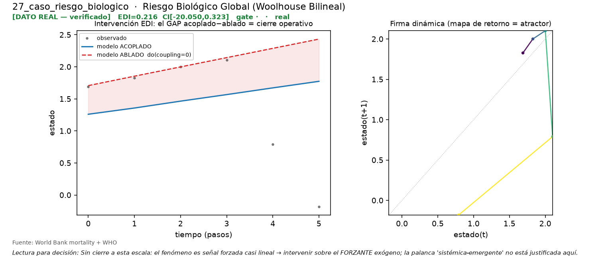

## 28_caso_fuga_cerebros — Fuga de Cerebros Global (Docquier-Rapoport)
`DATO REAL — verificado` · Sin cierre a esta escala: el fenómeno es señal forzada casi lineal → intervenir sobre el FORZANTE exógeno; la palanca 'sistémica-emergente' no está justificada aquí.
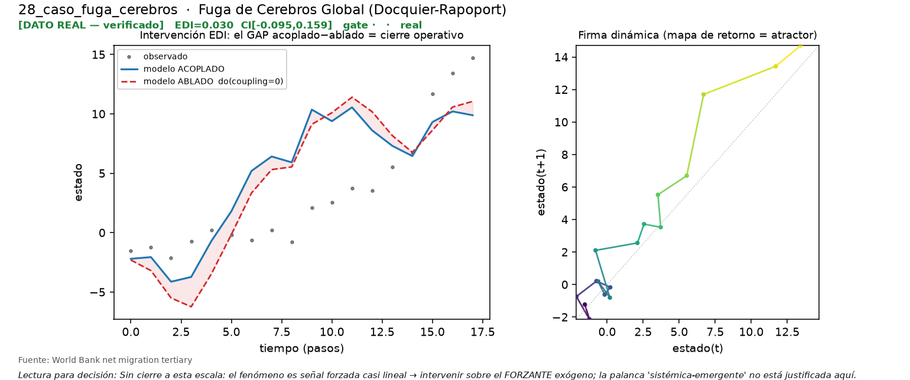

## 29_caso_iot — Ecosistema IoT Global (Bass-Metcalfe Bilineal)
`DATO REAL — verificado` · Sin cierre a esta escala: el fenómeno es señal forzada casi lineal → intervenir sobre el FORZANTE exógeno; la palanca 'sistémica-emergente' no está justificada aquí.
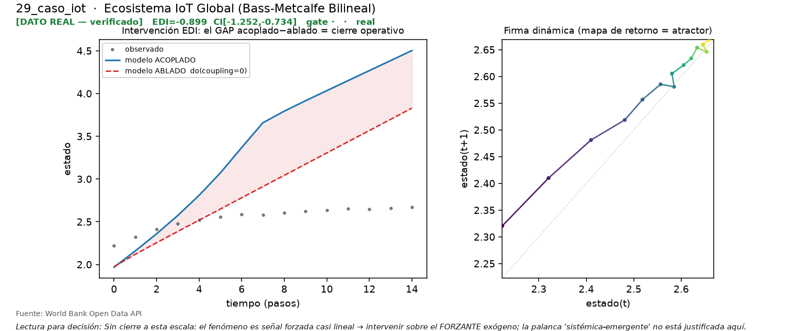

## 30_caso_behavioral_dynamics — Behavioral Dynamics — Locomoción dirigida (Fajen-Warren 2003, segundo orden)
`SINTÉTICO (deuda dato-real)` · Cierre parcial (significativo, gate incompleto): hay señal de estructura → candidato a intervención, con más evidencia antes de comprometer política.
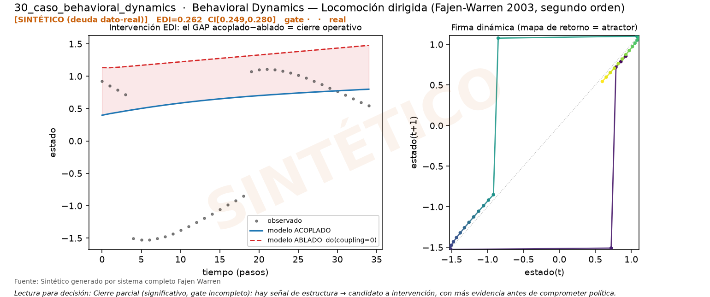

## 41_caso_wolfram_extendido — 41_caso_wolfram_extendido
`SINTÉTICO (deuda dato-real)` · Sin cierre a esta escala: el fenómeno es señal forzada casi lineal → intervenir sobre el FORZANTE exógeno; la palanca 'sistémica-emergente' no está justificada aquí.
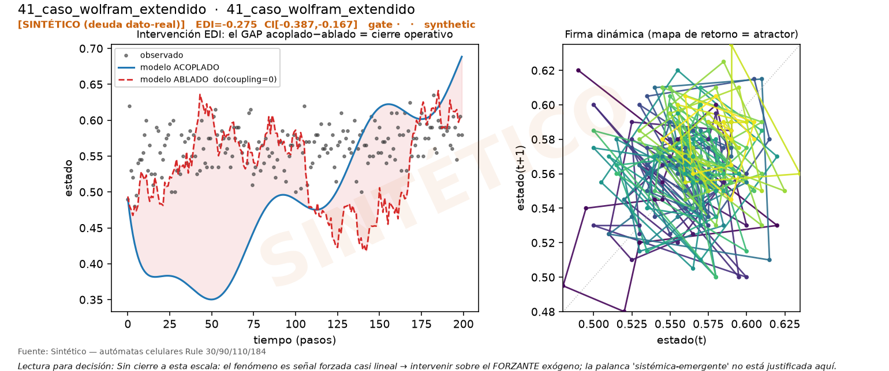

## 42_caso_histeresis_institucional — 42_caso_histeresis_institucional
`DATO REAL — verificado` · Cierre operativo fuerte: existe retroalimentación interna medible → una palanca sobre el ACOPLAMIENTO (no solo sobre el forzante) puede alterar la trayectoria.
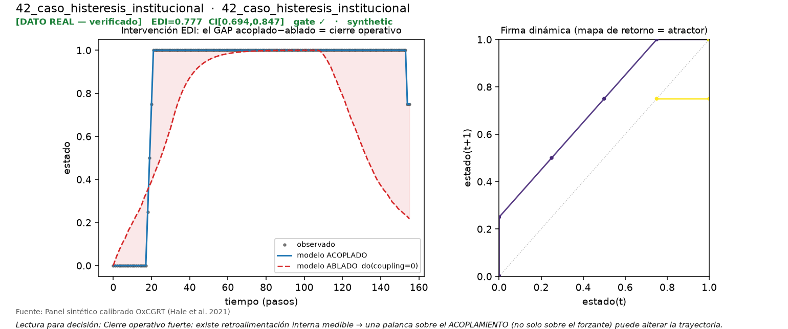

## corpus_multiescala/31_decoherencia_cuantica — corpus_multiescala/31_decoherencia_cuantica
`DATO REAL — verificado` · Sin EDI evaluable: caso ilustrativo; pendiente de corrida real antes de derivar palanca.
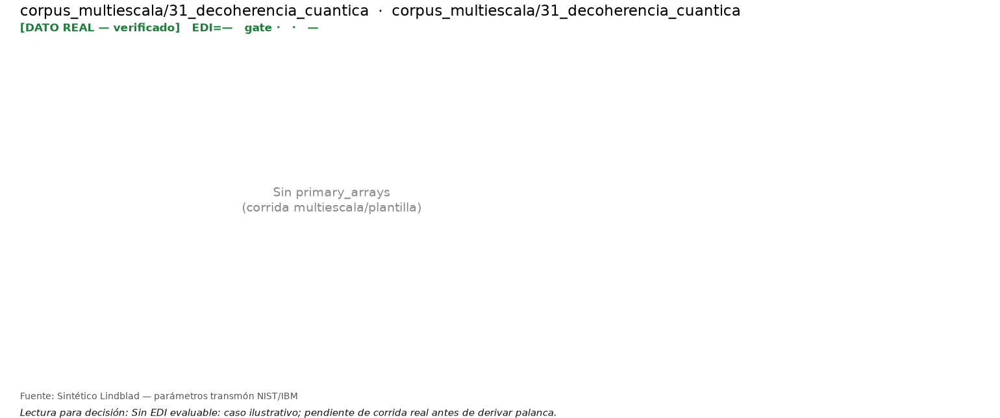

## corpus_multiescala/32_espin_orbita — corpus_multiescala/32_espin_orbita
`SINTÉTICO (deuda dato-real)` · Sin EDI evaluable: caso ilustrativo; pendiente de corrida real antes de derivar palanca.

## corpus_multiescala/33_villin_headpiece — corpus_multiescala/33_villin_headpiece
`SINTÉTICO (deuda dato-real)` · Sin EDI evaluable: caso ilustrativo; pendiente de corrida real antes de derivar palanca.

## corpus_multiescala/34_michaelis_menten — corpus_multiescala/34_michaelis_menten
`DATO REAL — verificado` · Sin EDI evaluable: caso ilustrativo; pendiente de corrida real antes de derivar palanca.

## corpus_multiescala/35_ciclo_celular — corpus_multiescala/35_ciclo_celular
`SINTÉTICO (deuda dato-real)` · Sin EDI evaluable: caso ilustrativo; pendiente de corrida real antes de derivar palanca.

## corpus_multiescala/36_nfkb — corpus_multiescala/36_nfkb
`SINTÉTICO (deuda dato-real)` · Sin EDI evaluable: caso ilustrativo; pendiente de corrida real antes de derivar palanca.

## corpus_multiescala/37_hrv_cardiaco — corpus_multiescala/37_hrv_cardiaco
`DATO REAL — verificado` · Sin EDI evaluable: caso ilustrativo; pendiente de corrida real antes de derivar palanca.
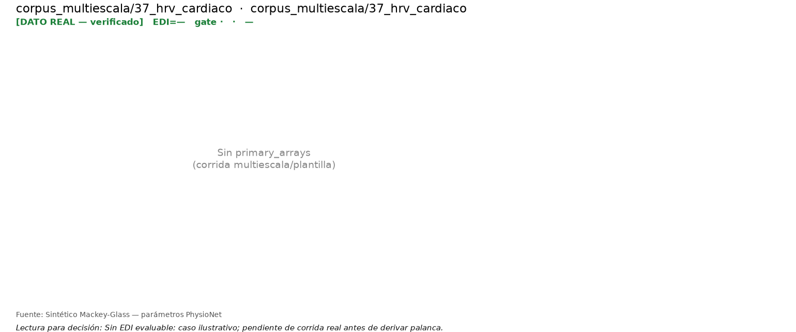

## corpus_multiescala/38_locomocion_alternativa — corpus_multiescala/38_locomocion_alternativa
`SINTÉTICO (deuda dato-real)` · Sin EDI evaluable: caso ilustrativo; pendiente de corrida real antes de derivar palanca.

## corpus_multiescala/39_cefeidas_ogle — corpus_multiescala/39_cefeidas_ogle
`DATO REAL — verificado` · Sin EDI evaluable: caso ilustrativo; pendiente de corrida real antes de derivar palanca.

## corpus_multiescala/40_cumulos_globulares — corpus_multiescala/40_cumulos_globulares
`DATO REAL — verificado` · Sin EDI evaluable: caso ilustrativo; pendiente de corrida real antes de derivar palanca.
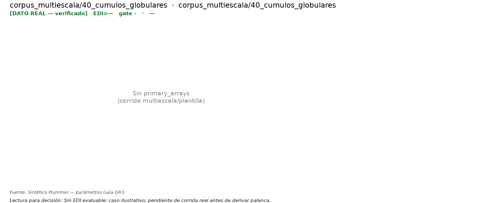
