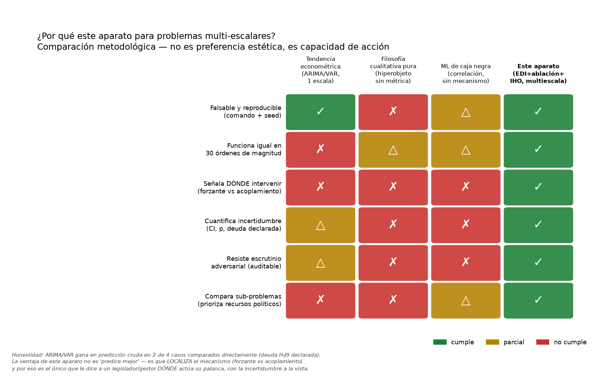
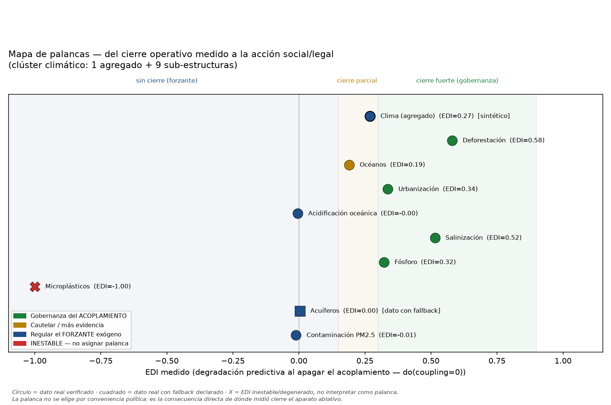
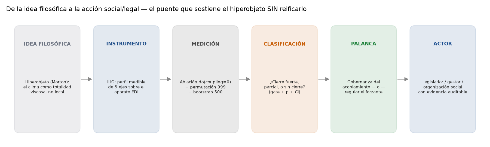

# Lectura Operativa — de la tesis científica a la acción social/legal

_Documento **deliberadamente separado** de `TesisFinal/`. No es un capítulo de la tesis
doctoral de Jacob; es una traducción posterior, hecha por Stev + Jarvis, de lo que la tesis
ya midió. `TesisFinal/build.py` no barre este directorio — la tesis se sustenta sola, sin
carga política. Fuente de todo número aquí: `Bitacora/2026-07-16-jacob-clima/TRAZABILIDAD_LEDGER.json`,
generado por auditoría determinista, no por criterio nuestro._

## Por qué esta separación (y por qué importa)

La tesis (`00-proyecto/` … `10-apendices-tecnicos/`) responde una pregunta epistémica:
**¿bajo qué instrumento, qué fenómeno exhibe qué grado de cierre operativo?** Esa pregunta
no debe contaminarse con la urgencia política — es justo la regla dura del repo
(`CLAUDE.md §2`): nada de inflar EDIs débiles porque el tema "importa".

Pero un resultado medido con rigor que se queda encerrado en el manuscrito no transforma nada.
Este documento responde una pregunta distinta, **posterior y separable**: **dado lo que ya se
midió, ¿dónde tiene sentido que actúe una palanca social o legal, y de qué tipo?** Esa
traducción es interpretativa (alguien tiene que decidir qué hacer con un EDI=0.58), por eso
va aparte — para que quien lea la tesis sepa que el capítulo científico no está pre-cargado
de conclusión política, y para que quien lea esto sepa que cada afirmación tiene un número
verificable detrás, no una intuición.

## 1. Por qué este aparato — y no otro — para problemas multi-escalares

El argumento no es "esta metodología es más sofisticada". Es más angosto y más fuerte:
**es la única de las cuatro que le dice a quien tiene que actuar DÓNDE está la palanca**
(forzante exógeno vs acoplamiento interno), con la incertidumbre a la vista y de forma
auditable. Un modelo de tendencia predice pero no localiza mecanismo. Una lectura
filosófica pura del hiperobjeto da sentido pero no es falsable ni comparable entre
sub-problemas. Un modelo de ML de caja negra predice pero no explica ni resiste
contra-examen legal. **Rigor sin utilidad se queda en el manuscrito. Utilidad sin rigor no
sobrevive un contra-informe.** El aparato EDI+ablación+IHO es el único que cruza ambos
umbrales — y lo hace **a cualquier escala**, con el mismo instrumento, lo cual es
precisamente lo que un problema multiescalar (clima, urbanización, ciclos biogeoquímicos)
exige y ninguna de las otras tres alternativas ofrece.

**Honestidad que se mantiene (no se lava):** ARIMA/VAR gana en predicción cruda en 2 de 4
comparaciones directas (deuda `H-J9` de la tesis). No estamos afirmando "este aparato predice
mejor" — afirmamos que es el único que **localiza** dónde intervenir, que es lo que la acción
social/legal necesita, no la predicción por sí sola.

## 2. El mapa de palancas — del EDI medido a la acción concreta

Lectura por caso (clúster climático, 10 estructuras — cifras del ledger, fase más informativa
disponible por caso):

| Estructura | EDI | Clase | Palanca |
|---|---|---|---|
| **Deforestación** | 0.580 (gate ✓) | cierre fuerte | Gobernanza del acoplamiento — moratorias, tenencia, restauración |
| **Salinización** | 0.515 (gate ✓) | cierre fuerte | Gobernanza — riego/drenaje regulado |
| **Urbanización** | 0.337 (gate ✓) | cierre fuerte | Gobernanza — ordenamiento territorial |
| **Fósforo** | 0.322 (gate ✓) | cierre fuerte | Gobernanza — recuperación/reuso de nutrientes |
| **Clima (agregado)** | 0.269 (sintético, no gate) | sin cierre suficiente | Regular el forzante — emisiones/uso de suelo en origen |
| **Océanos** | 0.190 (sig., no gate) | cierre parcial | Cautelar — más evidencia antes de comprometer política |
| **Acuíferos** | 0.004 (dato con fallback) | sin cierre / dato débil | Pendiente de dato real antes de asignar palanca |
| **Contaminación PM2.5** | -0.011 | sin cierre | Regular el forzante — emisión en origen |
| **Acidificación oceánica** | -0.005 | sin cierre (falsación local) | Regular el forzante — CO₂ en origen, no gestión "del océano" |
| **Microplásticos** | -1.000 | **inestable** | No asignar palanca — revisar el modelo antes de usar este número en cualquier argumento |

**La idea central para la sala:** el clima **agregado** no cierra — eso NO es una debilidad
del aparato, es información política de primer orden. Le dice a un legislador que **no
tiene sentido diseñar gobernanza climática global como si el sistema retroalimentara sobre
sí mismo a esa escala**; el punto de palanca eficaz está **una escala abajo**, en las
estructuras que sí cierran (deforestación, salinización, uso del suelo, fósforo) — ahí es
donde la intervención puede torcer trayectoria, no compensar. El hiperobjeto de Morton "se
retira" del agregado y "se manifiesta" en sus partes — exactamente como predice su intuición,
ahora con un número y un umbral de gate detrás.

## 3. El puente idea → acción (sin reificar el hiperobjeto)

Este es el paso que permite mantener a Morton sin traicionar la anti-reificación del
Irrealismo Operativo: el hiperobjeto nunca se convierte en "una cosa que actúa"; se convierte
en un **protocolo de traducción** — de una intuición filosófica, a un instrumento medible
(IHO), a una medición ablativa con incertidumbre declarada, a una clasificación de cierre,
a un tipo de palanca, a un actor concreto con evidencia auditable en la mano. Cada flecha es
un paso que se puede defender por separado; ninguna palanca "salta" directo de la filosofía
a la política sin pasar por el número.

## Guardrails que este documento hereda de la tesis (no se relajan aquí tampoco)

- El p-value del corpus está **mal calibrado** (error tipo I empírico ≈24%, no 5%). El umbral
  EDI y el gate (permutación+bootstrap+overall_pass) **sí son robustos** — la tabla de arriba
  se apoya en esos dos, no en el p crudo.
- **Clima agregado y océanos corren en dato sintético o con fallback declarado** — la palanca
  asignada es la lectura correcta *hoy*, pero es provisional hasta cerrar la deuda de dato real
  (ver huecos de trazabilidad en `Bitacora/2026-07-16-jacob-clima/TRAZABILIDAD_LEDGER.md`).
- **Microplásticos (EDI=-1.0) está excluido de cualquier recomendación** hasta que se
  audite el modelo — un EDI degenerado usado como argumento político sería exactamente el
  tipo de sobre-interpretación que la tesis existe para prevenir.
- Esta traducción política es **nuestra**, no de Jacob — la voz autoral de la tesis sigue
  siendo suya. Este documento es material de apoyo para presentar, no un capítulo a firmar.
