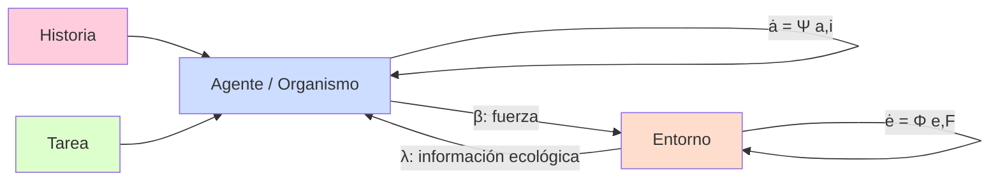
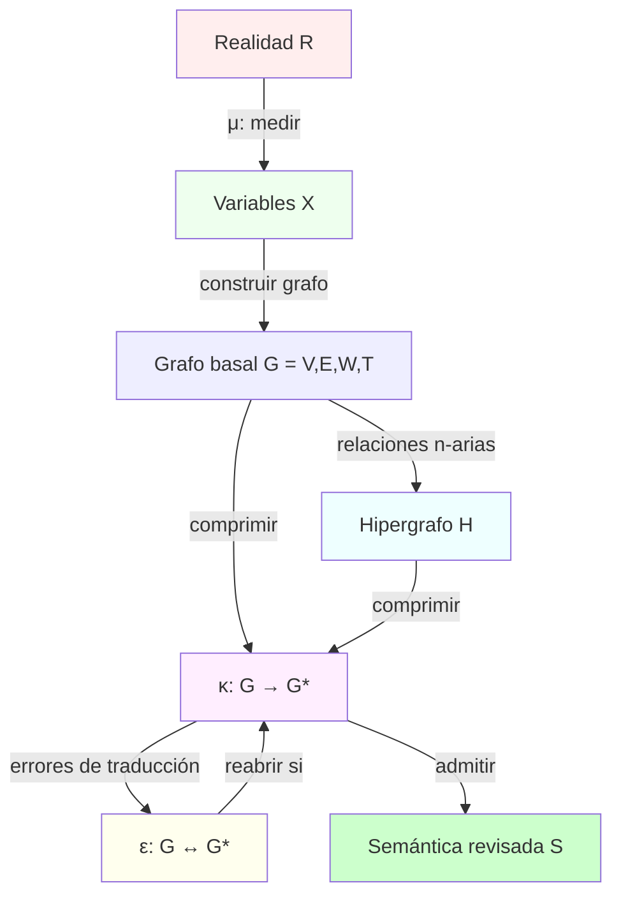
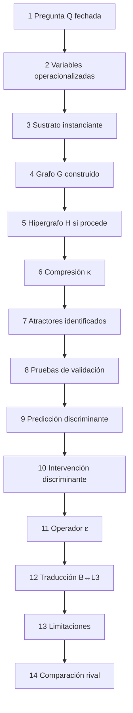
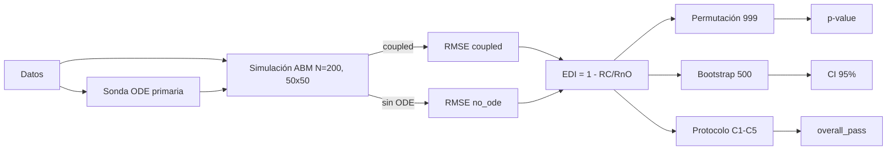
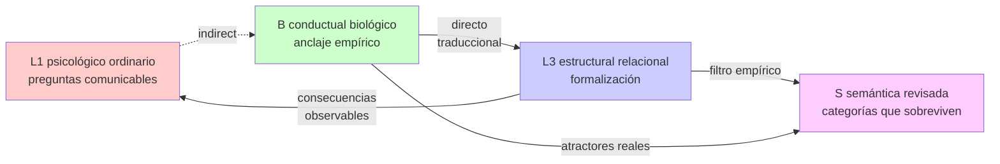
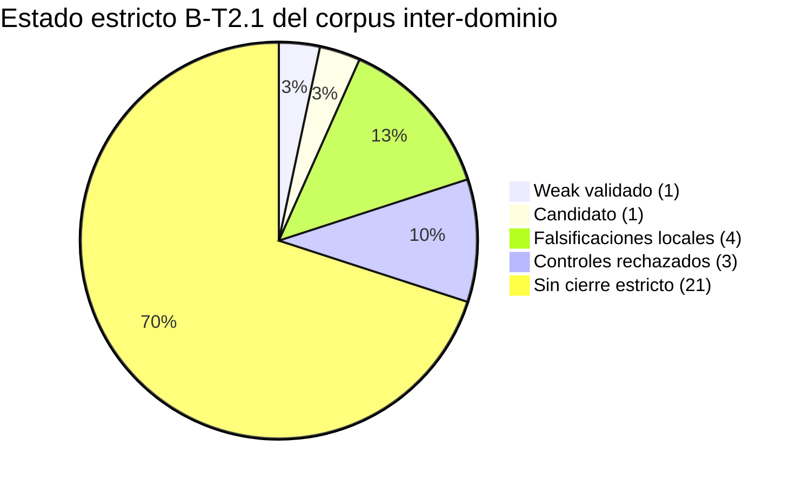
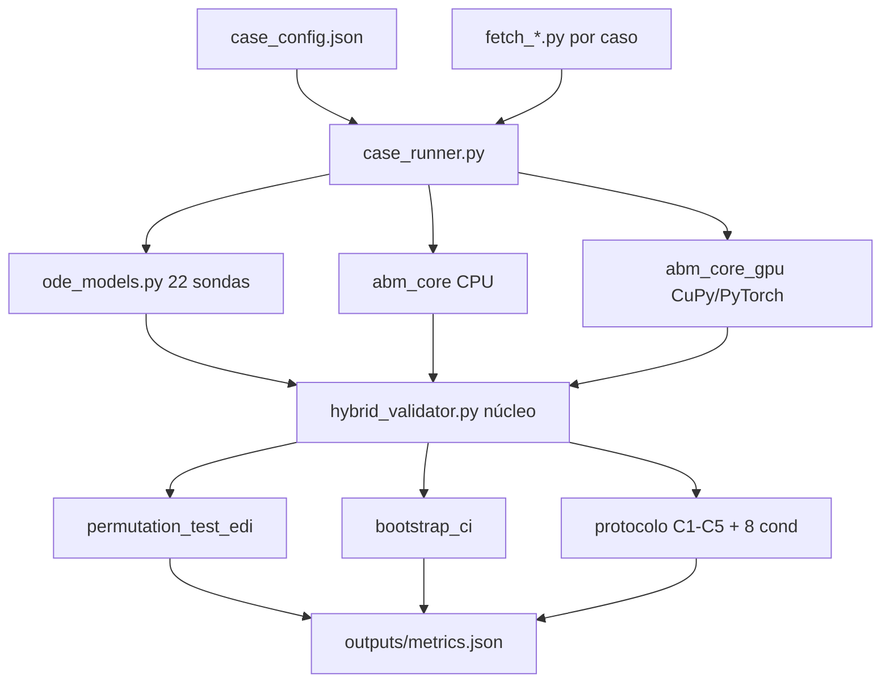
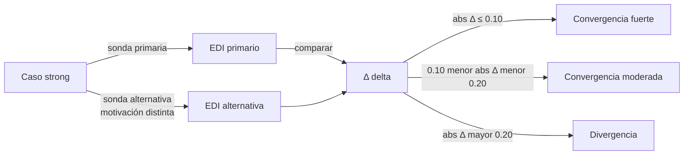
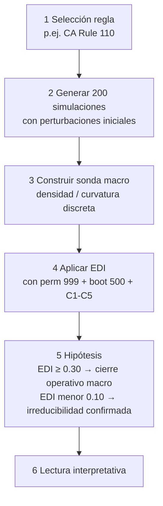

<div id="frontmatter"></div>


<div id="front-matter"></div>

# Estructuras Pre-Ontológicas

## Irrealismo Operativo y Compresión Multiescala con Evaluación EDI Multidominio

**Tesis doctoral en Filosofía de la Ciencia y Ciencias de la Complejidad**

**Universidad de Antioquia · Medellín · Colombia**

---

### Autoría declarada

**Autor principal (concepto y dirección teórica):** Jacob Agudelo. Universidad de Antioquia.

**Colaborador (técnica e ingeniería computacional):** Steven Vallejo Ortiz.

**Director de tesis:** [pendiente de declaración formal — bloqueador procedimental conocido; documentación administrativa fuera del manuscrito en `00-proyecto/04-formalizacion-institucional.md`].

**Asistencia con inteligencia artificial declarada:** sistemas de IA generativa, incluidos Anthropic Claude y OpenAI Codex, como instrumentos de implementación bajo dirección humana. La IA no aparece como autora en sentido legal ni epistémico. La declaración detallada del rol y los límites de la IA está en el capítulo de ética de investigación y gobernanza de datos.

### Marco institucional

**Programa de inscripción:** Doctorado en Filosofía. Línea: filosofía de la ciencia y ciencias de la complejidad.

**Estado del manuscrito:** revisión predefensa. Defendible como propuesta filosófica formalizada con contribución metodológica reproducible y evidencia parcial; no cerrado como demostración de una ontología general multiescalar.

**Versión consolidada:** 2026-07-17.

### Sobre la disponibilidad y la fuente de verdad del documento

> Documento ensamblado automáticamente desde el repositorio doctoral. La fuente de verdad textual son los capítulos individuales en cada carpeta numerada. La fuente de verdad numérica del corpus EDI son los `outputs/metrics.json` versionados en `09-simulaciones-edi/<caso>/`. Si hay discrepancia entre este ensamblado y la fuente, prevalece la fuente.

### Agradecimientos

A la Universidad de Antioquia, por sostener una tradición de filosofía de la ciencia que hace posible este trabajo. A los colegas y revisores que aportaron críticas tempranas. A los autores de los datasets públicos del corpus, sin los cuales la cartografía multidominio no sería viable. A William H. Warren y Brett R. Fajen por la conjetura cuantitativa de la behavioral dynamics que opera como caso ancla.


<div id="tabla-de-contenidos"></div>

# 📑 Tabla de Contenidos

> **Navegación:** las partes están agrupadas en secciones colapsables. Haz clic en ▸ para expandir cada parte. Cada capítulo termina con un enlace «↑ volver al índice» que regresa aquí.

## Navegación rápida por partes

- [Front matter](#frontmatter)
- [Introducción](#introduccion)
- [Parte I — Fundamentos ontológicos y epistemológicos](#parte-1-fundamentos)
- [Parte II — Aparato formal y método](#parte-2-metodo)
- [Parte III — Evidencia empírica](#parte-3-evidencia)
- [Parte IV — Discusión crítica](#parte-4-discusion)
- [Parte V — Cierre y estado de la demostración](#parte-5-cierre)
- [Bibliografía](#bibliografia)
- [Apéndices técnicos mínimos](#apendices-tecnicos)

---

## Índice detallado

<details open>
<summary><b>Front matter</b></summary>

- [Front matter](#front-matter)
- [Resumen y abstract bilingüe](#resumen-y-abstract-bilingue)

</details>

<details>
<summary><b>Introducción</b></summary>

- [Introducción](#introduccion)
- [Estado del arte](#estado-del-arte)

</details>

<details>
<summary><b>Parte I — Fundamentos ontológicos y epistemológicos</b></summary>

- [Capítulo 1: Ontología material-relacional](#capitulo-1-ontologia-material-relacional)
- [Capítulo 2: Epistemología de la compresión](#capitulo-2-epistemologia-de-la-compresion)
- [Capítulo 3: Categorías, objetos, propiedades, identidad](#capitulo-3-categorias-objetos-propiedades-identidad)
- [Capítulo 4: Anclaje empírico (nivel B multiescalar)](#capitulo-4-anclaje-empirico-nivel-b-multiescalar)
- [Capítulo 5: Temporalidad y causalidad](#capitulo-5-temporalidad-y-causalidad)
- [Capítulo 6: Dimensión normativa y ética](#capitulo-6-dimension-normativa-y-etica)

</details>

<details>
<summary><b>Parte II — Aparato formal y método</b></summary>

- [Capítulo 7: Aparato formal mínimo](#capitulo-7-aparato-formal-minimo)
- [Capítulo 8: Mapa de operadores formales](#capitulo-8-mapa-de-operadores-formales)
- [Capítulo 9: Criterios de legitimidad y dossier](#capitulo-9-criterios-de-legitimidad-y-dossier)
- [Capítulo 10: Plantilla del dossier de anclaje](#capitulo-10-plantilla-del-dossier-de-anclaje)
- [Capítulo 11: Auditoría ontológica como protocolo](#capitulo-11-auditoria-ontologica-como-protocolo)
- [Capítulo 12: Operacionalización de κ vía EDI](#capitulo-12-operacionalizacion-de-kappa-via-edi)
- [Capítulo 13: Validación lógica formal con ST](#capitulo-13-validacion-logica-formal-con-st)
- [Capítulo 14: Ética de investigación y gobernanza de datos](#capitulo-14-etica-de-investigacion-y-gobernanza-de-datos)

</details>

<details>
<summary><b>Parte III — Evidencia empírica</b></summary>

- [Capítulo 15: Criterios de admisión de aplicaciones](#capitulo-15-criterios-de-admision-de-aplicaciones)
- [Capítulo 16: Mapa de aplicaciones — corpus inter-dominio e inter-escala](#capitulo-16-mapa-de-aplicaciones---corpus-inter-dominio-e-inter-escala)
- [Capítulo 17: Caso ancla canónico — Behavioral Dynamics (Warren 2006)](#capitulo-17-caso-ancla-canonico---behavioral-dynamics-warren-2006)
- [Capítulo 18: Corpus inter-escala (10 casos)](#capitulo-18-corpus-inter-escala-10-casos)
- [Capítulo 19: Aplicaciones programáticas — Mente, memoria, yo](#capitulo-19-aplicaciones-programaticas---mente-memoria-yo)
- [Capítulo 20: Aplicaciones programáticas — Biología y ecología](#capitulo-20-aplicaciones-programaticas---biologia-y-ecologia)
- [Capítulo 21: Aplicaciones programáticas — Sistemas técnicos distribuidos](#capitulo-21-aplicaciones-programaticas---sistemas-tecnicos-distribuidos)
- [Capítulo 22: Aplicaciones programáticas — Instituciones, mercado, Estado](#capitulo-22-aplicaciones-programaticas---instituciones-mercado-estado)

</details>

<details>
<summary><b>Parte IV — Discusión crítica</b></summary>

- [Capítulo 23: Debates con posiciones rivales](#capitulo-23-debates-con-posiciones-rivales)
- [Capítulo 24: Anticipación de objeciones filosóficas](#capitulo-24-anticipacion-de-objeciones-filosoficas)
- [Capítulo 25: Limitaciones declaradas](#capitulo-25-limitaciones-declaradas)

</details>

<details>
<summary><b>Parte V — Cierre y estado de la demostración</b></summary>

- [Capítulo 26: Conclusión y estado de la demostración](#capitulo-26-conclusion-y-estado-de-la-demostracion)

</details>

<details>
<summary><b>Bibliografía</b></summary>

- [Bibliografía consolidada](#bibliografia-consolidada)

</details>

<details>
<summary><b>Apéndices técnicos mínimos</b></summary>

- [Glosario operativo de consulta](#glosario-operativo-de-consulta)
- [Apéndice técnico 1: Tablas crudas del corpus inter-dominio](#apendice-tecnico-1-tablas-crudas-del-corpus-inter-dominio)
- [Apéndice técnico 2: Tablas crudas del corpus inter-escala](#apendice-tecnico-2-tablas-crudas-del-corpus-inter-escala)
- [Apéndice técnico 3: Figuras Mermaid](#apendice-tecnico-3-figuras-mermaid)

</details>

---

<div id="resumen-y-abstract-bilingue"></div>

# Resumen y abstract bilingüe

> **[BORRADOR-IA · requires: H-J2/H-J8]** Versión epistemicamente consistente con el estado B-T2.1. Requiere firma autoral antes de sustituir el resumen institucional.

## Resumen (español)

Esta tesis propone un **irrealismo operativo de estructuras pre-ontológicas** que articula realismo estructural moderado, pluralismo epistemológico y anti-reificación. Una categoría se admite como estructura operativa solo respecto de una pregunta, un instrumento y un régimen de medición declarados; el rendimiento predictivo no autoriza por sí mismo ontología fuerte. "Pre-ontológico" se entiende en sentido genético-epistemológico: regularidad material anterior al recorte que la objetiva. El programa distingue tres niveles de contribución: una conjetura ontológica multiescalar, una epistemología de la compresión disciplinada y una metodología transferible de admisión y fracaso.

El aporte metodológico central es un instrumento híbrido **ABM + ODE** que mide cierre operativo mediante EDI = 1 − RMSE_coupled / RMSE_no_ode, con permutación, bootstrap, protocolo C1-C5, dossier de catorce componentes y cinco operadores formales (μ, G, H, κ, ε). La misma arquitectura se ejecuta en dominios y escalas heterogéneos; esta transferibilidad computacional no se identifica con invariancia ontológica.

Se evaluaron **40 casos**: 30 inter-dominio y 10 inter-escala. Bajo el régimen más estricto ejecutado hasta ahora, con pre-registro ex ante, datos refrescados, detrend y block-permutation, hay **0 cierres strong robustos puros confirmados**, **1 weak validado** (caso 04 Energía, EDI = 0.1571, p_block = 0.006), **1 candidato pendiente** (caso 26 Starlink) y **4 falsificaciones locales del aparato** en el corpus (casos 19, 20, 23 y 24). Tres controles negativos fueron rechazados y el gate completo produjo 0/2000 falsos positivos bajo random walk masivo, con intervalo Wilson 95 % [0, 0.00191]. El régimen estricto todavía no cubre los 30 casos, por lo que no se reporta una prevalencia final de cierre. Los 10 casos inter-escala usan datos sintéticos derivados de parámetros publicados y prueban ejecutabilidad, no generalidad ontológica confirmada.

El resultado defendible es metodológico: el aparato formula condiciones públicas de admisión, conserva resultados negativos y corrige clasificaciones propias sin convertir cada fallo local en confirmación del marco. No demuestra todavía κ-ontológica fuerte ni una ontología general multiescalar. Permanecen abiertas la calibración estadística completa, la re-ejecución estricta del corpus, los datos reales inter-escala, la replicación independiente, la revisión externa y las decisiones autorales sobre el estatuto de la generalidad ontológica.

**Palabras clave:** estructuras pre-ontológicas, irrealismo operativo, programa ontológico multiescalar, realismo estructural moderado, pluralismo epistemológico, anti-reificación, ABM-ODE, EDI, cierre operativo, asimetría L1-B-L3-S, dossier de anclaje, pre-registro.

---

## Abstract (English)

This dissertation proposes an **operative irrealism of pre-ontological structures** combining moderate structural realism, epistemic pluralism and anti-reification. A category is admitted as an operative structure only relative to a declared question, instrument and measurement regime; predictive performance alone does not warrant strong ontology. "Pre-ontological" is used in a genetic-epistemological sense: a material regularity prior to the cut that objectifies it. The program separates three levels of contribution: a multiscale ontological conjecture, an epistemology of disciplined compression and a transferable methodology of admission and failure.

The core methodological contribution is a hybrid **ABM + ODE** instrument measuring operational closure through EDI = 1 − RMSE_coupled / RMSE_no_ode, together with permutation, bootstrap, the C1-C5 protocol, a fourteen-component anchoring dossier and five formal operators (μ, G, H, κ, ε). The same architecture runs across heterogeneous domains and scale labels; computational transferability is not treated as ontological invariance.

**Forty cases** were evaluated: 30 inter-domain and 10 inter-scale. Under the strictest regime completed so far, combining ex ante pre-registration, refreshed data, detrending and block permutation, there are **0 confirmed pure robust strong closures**, **1 validated weak result** (case 04 Energy, EDI = 0.1571, p_block = 0.006), **1 pending candidate** (case 26 Starlink), and **4 local falsifications of the apparatus** across the corpus (cases 19, 20, 23 and 24). Three negative controls were rejected, and the full gate produced 0/2000 false positives under random walk, Wilson 95 % interval [0, 0.00191]. The strict regime does not yet cover all 30 cases, so no final prevalence of closure is reported. The inter-scale corpus uses synthetic data derived from published parameters and establishes executability rather than confirmed ontological generality.

The defensible result is methodological: the apparatus states public admission conditions, preserves negative results and revises its own classifications without redescribing each local failure as confirmation of the framework. It does not yet establish strong ontological κ or a general multiscale ontology. Open requirements include full statistical calibration, strict re-execution of the corpus, real inter-scale data, independent replication, external review and authorial decisions about the status of ontological generality.

**Keywords:** pre-ontological structures, operative irrealism, multiscale ontological program, moderate structural realism, epistemic pluralism, anti-reification, ABM-ODE, EDI, operational closure, L1-B-L3-S asymmetry, anchoring dossier, pre-registration.

---

## Información bibliográfica

**Autor principal (concepto y dirección):** Jacob Agudelo, Universidad de Antioquia.
**Colaborador (técnica e ingeniería computacional):** Steven Vallejo Ortiz.
**Co-autoría IA:** Anthropic Claude (Opus 4.7) declarada como instrumento de implementación bajo dirección humana.
**Filiación institucional:** Universidad de Antioquia, Medellín, Colombia.
**Campo:** Filosofía de la Ciencia y Ciencias de la Complejidad.
**Versión:** Manuscrito en revisión predefensa.

---

## Citation suggestion

> Agudelo, J., y Vallejo Ortiz, S. (2026). *Estructuras Pre-Ontológicas: Realismo Irrealista Operativo y Compresión Multiescala con Validación EDI Multidominio* [Manuscrito doctoral]. Universidad de Antioquia.


<p align="right"><sub><a href="#tabla-de-contenidos">↑ volver al índice</a></sub></p>

---


<div id="introduccion"></div>


<div id="introduccion"></div>

# Introducción

> **[BORRADOR-IA · requires: H-J2/H-J8]** Revisión de consistencia posterior al régimen B-T2.1. Requiere firma autoral para fijar el estatuto definitivo de la generalidad ontológica.

## Pregunta central

> ¿Bajo qué condiciones es legítimo reemplazar una categoría heredada por una construcción formal estructural-relacional sin caer en sustitución nominal y sin desligarse del nivel donde el fenómeno vive empíricamente?

Esta pregunta concentra el problema fundamental del proyecto. El lenguaje heredado tiende a reificar: hablamos de mente, memoria, mercado, institución, servicio, organismo o identidad como si fueran cosas simples cuando a menudo condensan organizaciones complejas. El reduccionismo plano no resuelve el problema, solo lo desplaza al nivel inferior. El emergentismo fuerte multiplica sustancias. El constructivismo arbitrario entrega cualquier recorte. El formalismo vacío produce elegancia sin captura. La tesis intenta ocupar un punto distinto.

## Tesis principal

> Este programa trata todo fenómeno empíricamente investigable como materialmente instanciado y propone admitir sus entidades, niveles y categorías como **estructuras pre-ontológicas** solo cuando las regularidades operativas que las sostienen sobreviven un dossier de anclaje, traducción entre registros y pruebas de intervención. EDI no convierte una categoría en entidad: mide cierre operativo del trío fenómeno-sonda-modelo respecto de una pregunta Q. La generalidad ontológica es una conjetura sometida a ese procedimiento, no una consecuencia automática de aplicarlo.

## Tres marcos generales simultáneos

La tesis ofrece tres marcos generales coordinados:

1. **Programa ontológico:** cuatro invariantes candidatos (sustrato material dinámico, acoplamiento, atractor empírico y cierre operativo κ) cuya generalidad debe probarse sin inferirla del mismo instrumento que los define.
2. **Tesis epistemológica:** conocer una estructura exige compresión disciplinada, traducción entre registros y condiciones públicas de fracaso.
3. **Metodología transferible:** un aparato común (motor ABM+ODE, protocolo C1-C5, EDI, dossier de 14 componentes y suite ST) aplicable entre dominios sin cambiar su arquitectura, aunque cada sonda y cada inferencia conservan validez local.

Los 40 casos evalúan la ejecutabilidad, selectividad y límites del aparato. No prueban por enumeración la generalidad ontológica. Los resultados negativos y las falsificaciones locales limitan el alcance de las sondas propuestas en vez de convertirse retrospectivamente en confirmaciones del marco.

## Posición filosófica: irrealismo operativo

Realismo estructural moderado + pluralismo epistemológico + anti-reificación operativa. Nunca afirmamos `X es Y`; afirmamos `bajo el instrumento I, X exhibe cierre operativo de grado G respecto a la pregunta Q`. La dependencia instrumento-fenómeno no es defecto: es condición epistémica honesta.

## Hipótesis

### Hipótesis general

> Una ontología material-relacional articulada con epistemología formal de compresión multiescala, asimetría L1↔B↔L3↔S y dossier de anclaje produce criterios públicos de admisión y fracaso que las categorías heredadas, el reduccionismo plano y el formalismo sin traducción no ofrecen por sí solos.

### Hipótesis específicas

- **H1 (ontológica):** la realidad está materialmente instanciada, pero sus unidades explicativas son patrones relacionales estabilizados, definidos como atractores empíricamente identificables de sistemas dinámicos acoplados (capítulo 02-01).
- **H2 (epistemológica):** el conocimiento es compresión disciplinada de estructura material-relacional bajo restricciones empíricas, con verdad como preservación estructural verificable (capítulo 02-02).
- **H3 (nivel B):** el nivel de anclaje empírico es el sistema dinámico acoplado organismo–entorno bajo restricciones de tarea, físicas, informacionales e históricas (capítulo 02-04).
- **H4 (metodológica):** las operaciones de compresión κ y expansión ε permiten justificar el paso entre escalas sin inflación ontológica ni empobrecimiento explicativo (capítulos 03-01 y 03-04).
- **H5 (comparativa):** la tesis establece diferencias públicas respecto a catorce posiciones rivales; esa no-equivalencia conceptual no se presenta como superioridad empírica global (capítulo 04-01).
- **H6 (caso ancla):** Warren aporta adecuación cuantitativa publicada dentro de behavioral dynamics; el caso EDI 30 es un piloto débil y circularmente comprometido, no una corroboración independiente del marco (capítulo 05-05 y corpus EDI caso 30).
- **H7 (programática):** el aparato es extensible a mente, biología, sistemas técnicos e instituciones bajo criterios explícitos de elevación (capítulos 05-01 a 05-04).

## Régimen de validez declarado

La tesis se sostiene como **programa ontológico multiescalar con método ejecutable y evidencia parcial**, no como ontología general confirmada. La Parte III presenta los resultados; el capítulo de limitaciones concentra los problemas de calibración, circularidad, datos sintéticos, cobertura incompleta y falta de replicación externa. Esta introducción no adelanta de nuevo ese inventario.

## Aporte original

El proyecto combina cinco movimientos en una sola arquitectura que ningún rival reúne:

1. **monismo ontológico** sin reduccionismo plano;
2. **realismo estructural moderado** con anclaje empírico explícito;
3. **pluralismo explicativo controlado** con asimetría L1↔B↔L3↔S como protocolo;
4. **formalización metodológica** con procedimiento empírico de κ vía EDI;
5. **cartografía de alcance y fallo** con 40 casos, controles negativos, pre-registro ex ante y conservación explícita de nulls y falsificaciones locales.

La novedad no es de inventario (cada pieza está distribuida entre marcos vecinos). Es de articulación: dossier de anclaje + asimetría + intervención ablativa como filtro de admisión simultáneo, con un protocolo capaz de degradar las clasificaciones producidas por versiones anteriores del propio aparato.

## Estructura del manuscrito

El manuscrito se organiza en cinco partes:

- **Parte I (Fundamentos):** ontología material-relacional, epistemología de la compresión, categorías, anclaje empírico, temporalidad y causalidad, dimensión normativa.
- **Parte II (Aparato y método):** operadores formales, criterios de legitimidad, auditoría ontológica, operacionalización de κ, ética de investigación.
- **Parte III (Evidencia empírica):** caso ancla canónico, corpus inter-dominio (30 casos), corpus inter-escala (10 casos), aplicaciones programáticas.
- **Parte IV (Discusión):** posiciones rivales, objeciones principales y limitaciones declaradas.
- **Parte V (Cierre):** conclusión, estado de la demostración y condiciones de fracaso.


<p align="right"><sub><a href="#tabla-de-contenidos">↑ volver al índice</a></sub></p>

---

<div id="estado-del-arte"></div>

# Estado del arte


## 1. Filosofía de la mente postcognitivista

### 1.1. Periodización

Tres oleadas:

- **Embodied cognition (1991–2005).** Programa que rechaza el cognitivismo simbólico y rehabilita cuerpo, acción y entorno como variables constitutivas del proceso cognitivo. Texto fundacional: Varela, Thompson y Rosch (1991), *The Embodied Mind*.
- **Extended mind y enactivismo (1998–2015).** Clark y Chalmers (1998) formalizan el principio de paridad ("if a process counts as cognitive when done in the head, it should also count as cognitive when done in the world", p. 8). Noë (2004) y Thompson (2007) consolidan el enactivismo. Hutto y Myin (2013) plantean el enactivismo radical (REC) eliminando representaciones contentful en niveles básicos.
- **Ecological dynamics (2003–presente).** Recupera y formaliza Gibson (1979/1986). Warren (2006) consolida el programa de **dinámica perceptiva-motora**: la tesis central es que el comportamiento adaptativo no está impuesto por un controlador interno sino que emerge de la interacción agente–entorno bajo restricciones físicas, informacionales y de tarea. Cita verificada en PDF: *"Adaptive behavior, rather than being imposed by a preexisting structure, emerges from this confluence of constraints under the boundary condition of a particular task or goal"* (Warren 2006, p. 358). Fajen y Warren (2003) ofrecen la formalización dinámica de segundo orden de la locomoción dirigida.

### 1.2. Controversias activas

- ¿es la representación necesaria a algún nivel cognitivo? Debate entre Clark (2008, *Supersizing the Mind*) y Hutto-Myin (2013, *Radicalizing Enactivism*).
- ¿basta la dinámica acoplada para explicar fenómenos cognitivos de alto nivel (lenguaje, planificación)? Open question post-Thompson 2007.
- ¿se puede integrar con neurociencia computacional sin recaer en cognitivismo? El programa de **active inference** (Friston 2010, *Nat. Rev. Neurosci.* 11:127-138) postula la minimización de energía libre variacional como principio unificador del cerebro. Friston lo formula explícitamente: *"if agents minimize free energy, they implicitly minimize surprise"* (2010, p. 2) y *"the brain is an inference machine that actively predicts and explains its sensations"* (2010, p. 3). El **predictive processing** de Clark (2013, *BBS* 36:181-204) extiende esa lectura a una arquitectura jerárquica: *"hierarchical generative model that aims to minimize prediction error within a bidirectional cascade of cortical processing"* (Clark 2013, p. 1), donde el agente situado es esencialmente un motor bayesiano. Clark explicita la consecuencia epistemológica: *"perception is indirect … what we perceive is the brain's best hypothesis"* (Clark 2013, p. 19, retomando a Hohwy/Gregory). **Discrepancia con la tesis:** ambos marcos cargan el peso explicativo en un *modelo generativo interno* del agente y comprometen ontológicamente con representaciones probabilísticas en el cerebro como variables causales primarias; la tesis, en cambio, opera con estructuras pre-ontológicas relacionales cuyo cierre operativo κ se mide por intervención ablativa sobre el acoplamiento organismo-entorno (no por adecuación bayesiana de un modelo interno). La tesis no niega que la inferencia activa describa correctamente *parte* del fenómeno —Friston/Clark son compatibles con la dinámica acoplada cuando se reinterpretan como descripción macro y se concede el rechazo del input pasivo—, pero rechaza la inversión que vuelve el modelo generativo en sustancia ontológica fundacional. *Engagement primario verificado:* cita textual paginada contra `07-bibliografia/Friston_2010_FreeEnergyPrinciple_NRN.pdf` y `07-bibliografia/Clark_2013_WhateverNext_BBS.pdf`; deuda de cita secundaria cerrada.

### 1.3. Hueco que la tesis ocupa

La filosofía postcognitivista está rica en formulaciones cualitativas pero pobre en discriminación cuantitativa contra el cognitivismo simbólico **caso por caso**. El aparato EDI, aplicado al caso 30 (behavioral dynamics) y al capítulo 05-05 (caso ancla canónico), ofrece **discriminación cuantitativa pública**: si la sonda dinámica acoplada produce EDI significativo, el cierre operativo es real bajo intervención. Esto es contribución metodológica, no solo conceptual.

## 2. Ontología analítica y ontología social

### 2.1. Líneas principales

- **Ontología analítica de propiedades, particulares, eventos.** Quine (1948), Lewis (1986), Armstrong (1997). Discusión de qué cosas existen y bajo qué criterios.
- **Realismo estructural.** Worrall (1989), Ladyman y Ross (2007, *Every Thing Must Go*). Ontic structural realism: las estructuras son ontológicamente fundamentales, no los objetos. Cita clave: *"there are no things; structure is all there is"* (Ladyman y Ross 2007, §3.4).
- **Sistemismo de Bunge.** Bunge (1977, 1979, 2003). Toda entidad es sistema concreto con composición, entorno, estructura, mecanismo. Cita: *"a system is a complex object every part or component of which is connected with other parts of the same object in such a manner that the whole possesses some properties that none of its parts possesses"* (Bunge 1979, *Treatise on Basic Philosophy*, vol. 4, p. 4).
- **Ontología social.** Searle (1995, 2010) sobre intencionalidad colectiva y reglas constitutivas; Gilbert (1989) sobre plural subjects; Bourdieu (1980) sobre habitus, campo, prácticas; Latour (2005, *Reassembling the Social*) sobre actor-network theory.
- **Anti-realismo ontológico.** Chalmers (2009, "Ontological Anti-Realism", en Chalmers, Manley y Wasserman, eds., *Metametaphysics*). Tesis del pluralismo de cuantificadores y deflación de las disputas existenciales.

### 2.2. Controversias activas

- ¿estructuras sin objetos es coherente, o requiere un soporte material? Debate post-Ladyman-Ross con French (2014) y críticos como Esfeld y Lam (2008).
- ¿es la intencionalidad colectiva primitiva (Searle) o reducible a coordinación material (Bourdieu, Latour)?
- ¿qué hace que un patrón sea ontológicamente real frente a uno meramente pragmático? Debate clásico desde Quine.

### 2.3. Hueco que la tesis ocupa

La tesis articula una **vía media operativa**: realismo estructural moderado + materialidad de los soportes + criterio empírico de admisión vía cierre operativo. Frente al estructuralismo óntico de Ladyman-Ross, conserva la materialidad de los soportes (no flota como pura estructura). Frente a la ontología social de Searle, la tesis mide validez normativa como cuenca de atracción del sistema, no como hecho institucional sui generis (capítulo 05-04). Frente a Bunge, retiene el sistemismo pero exige criterio empírico de cierre vía intervención ablativa cuantitativa, no solo definición conceptual de sistema.

## 3. Filosofía de la complejidad y emergencia computacional

### 3.1. Líneas principales

- **Causal emergence (CE).** Hoel, Albantakis y Tononi (2013, "Quantifying causal emergence shows that macro can beat micro", *PNAS*); Hoel (2017, "When the Map Is Better Than the Territory", *Entropy*). Definición operacional: el macro tiene poder causal mayor que el micro si maximiza la información efectiva sobre la dinámica.
- **Information theory of integrated information.** Tononi (2008, 2017); Oizumi, Albantakis y Tononi (2014). Marco IIT para conciencia y emergencia.
- **Synergistic information.** Rosas et al. (2020), Mediano et al. (2022). Descomposición de información mutua en redundancia, sinergia, transferencia.
- **Computational irreducibility.** Wolfram (2002, *A New Kind of Science*; Wolfram Physics Project, 2020–presente). Tesis: muchos procesos no admiten compresión computacional, su evolución debe simularse paso a paso.
- **Self-organization y dissipative structures.** Prigogine, Haken (synergetics), Kelso (coordination dynamics).
- **Symploké y nudos relacionales.** Bueno (1972); literatura del materialismo filosófico español. Marco filosófico hispanohablante de articulación material entre niveles.

### 3.2. Controversias activas

- ¿es la emergencia causal "real" o un artefacto de coarse-graining? Crítica de Dewhurst (2021) y Bedau (2008).
- ¿IIT mide algo físicamente realizado o es una métrica computacional aplicable a cualquier sistema? Debate Aaronson vs. Tononi.
- ¿la tesis de irreducibilidad computacional de Wolfram tiene contenido empírico falsable o es metateórica?
- ¿cómo distinguir emergencia genuina de patrones epifenoménicos correlacionales?

### 3.3. Hueco que la tesis ocupa

La tesis añade un eslabón faltante: **filtro empírico, dossier reproducible, asimetría protocolar y cartografía multidominio**. Hoel et al. ofrecen métrica conceptualmente potente pero su aplicación empírica multidominio es escasa. Wolfram ofrece simulación por irreducibilidad pero **sin discriminar entre estructuras genuinamente operativas y artefactos de simulación**. La tesis cierra la brecha vía EDI calculado por intervención ablativa con permutación 999 + bootstrap 500 + criterios C1-C5. La discusión específica con Wolfram está en el capítulo 04-01 (sección dedicada).

## 4. Behavioral dynamics y dinámica de sistemas no lineales

### 4.1. Líneas principales

- **Coordination dynamics.** Kelso (1995, *Dynamic Patterns*); Haken (1977/2004, synergetics). Lenguaje de bifurcaciones y atractores aplicado a coordinación motora.
- **Ecological psychology y affordances.** Gibson (1979); Stoffregen (2003); Chemero (2009, *Radical Embodied Cognitive Science*).
- **Behavioral dynamics (Warren-Fajen).** Warren (2006); Fajen y Warren (2003); Warren (1998); Fajen, Warren, Temizer y Bogasch (2003). Sistema acoplado organismo-entorno-tarea con ecuaciones publicadas.
- **Optic flow control.** Lee (1976) (ecuación tau-dot); Gibson (1958).
- **Motor control as control theory.** Todorov (2004); Jordan y Wolpert (1999). Control óptimo como metáfora del comportamiento.

### 4.2. Controversias activas

- ¿el aparato dinámico necesita representaciones internas para escalar a tareas complejas?
- ¿basta optic flow para guiar locomoción o se requiere mapa cognitivo allocéntrico?
- ¿qué relación hay entre dinámica conductual y predictive coding bayesiano?

### 4.3. Hueco que la tesis ocupa

Warren (2006) ofrece la conjetura cualitativa con r²=0.980 entre datos experimentales y modelo dinámico. Pero la discusión filosófica sobre si esto basta para una tesis ontológica acoplada queda abierta. La tesis adopta el caso Warren como caso ancla canónico (capítulo 05-05) y lo eleva a versión cuantitativa-EDI (caso 30 del corpus). La complementariedad cualitativa-cuantitativa cubre dos escalas temporales del mismo fenómeno.

## 5. Filosofía de la ciencia latinoamericana

### 5.1. Líneas principales

- **Mario Bunge.** Argentino-canadiense, sistemismo, materialismo emergentista científico. *Treatise on Basic Philosophy* (1974–1989, 8 vols.); *Buscar la filosofía en las ciencias sociales* (1995); *Crisis y reconstrucción de la filosofía* (2002). Es interlocutor sustantivo de la tesis: el sistemismo es esquema afín, pero la tesis exige criterio empírico operativo más estricto.
- **Guillermo Hoyos Vásquez** (filósofo colombiano, 1935–2013). Filosofía hermenéutica, ciencia y comunidad. Relevante para la dimensión normativa.
- **Jaime Salas Echeverri** (Universidad de Antioquia). Filosofía analítica latinoamericana.
- **Fernando Salmerón** (México), **Carlos Ulises Moulines** (México-Alemania, estructuralismo de teorías). Aporte a metateoría científica.
- **Eduardo Rabossi** (Argentina), **Carlos Pereda** (Argentina-México). Filosofía analítica.

### 5.2. Hueco que la tesis ocupa

La filosofía latinoamericana de la ciencia tiene tradición sistemista fuerte (Bunge) y hermenéutica (Hoyos) pero pocos puentes operativos hacia ciencias de la complejidad cuantitativa. La tesis es contribución desde la línea de la Universidad de Antioquia: combina compromiso ontológico realista moderado con aparato cuantitativo verificable, tendiendo puente entre tradición filosófica institucional y ciencia computacional contemporánea.

## 6. Mapa de inserción de la tesis en el campo

**Tabla 1.3.1.**

| Subcampo | Posición consolidada | Posición de la tesis | Discriminación específica |
|----------|----------------------|----------------------|---------------------------|
| Mente postcognitivista | Acoplamiento organismo-entorno como tesis general | Cuantificación EDI del cierre operativo en behavioral dynamics | Caso 30 cuantitativo + caso 05-05 cualitativo |
| Ontología analítica | Realismo estructural óntico (Ladyman-Ross) o sistemismo (Bunge) | Realismo estructural moderado + materialidad + EDI | Filtro empírico operativo no presente en rivales |
| Complejidad computacional | Emergencia causal (Hoel) o irreducibilidad (Wolfram) | Cierre operativo κ vía EDI multidominio | Dossier reproducible + falsación rechazada |
| Behavioral dynamics | Acoplamiento dinámico cualitativo (Warren, 2006, pp. 358–359; ver párrafo siguiente) | Piloto cuantitativo no confirmatorio (caso 30) | Protocolo de contraste y detección de circularidad |
| Filosofía latinoamericana | Sistemismo (Bunge) o hermenéutica (Hoyos) | Puente operativo entre sistemismo y validación cuantitativa | Aparato EDI multidominio |

Sobre la celda *Behavioral dynamics*: Warren (2006) trata agente y entorno como sistemas dinámicos acoplados y sitúa atractores, repulsores y bifurcaciones en la dinámica conductual (pp. 358–359). La tesis intentó convertir esa propuesta en un contraste EDI. El caso 30 detectó circularidad bajo una sonda alternativa y produjo p aproximado de 0.978 con block bootstrap; por eso se conserva como piloto que muestra cómo puede fallar la operacionalización, no como confirmación cuantitativa de Warren.

## 7. Contribución específica

A partir del mapa anterior, la contribución específica de la tesis al estado del arte se resume en cinco puntos:

1. **Marco ontológico unificado** — irrealismo operativo de estructuras pre-ontológicas como vía media entre realismo metafísico y anti-realismo, con materialidad de soportes y filtro empírico de admisión.
2. **Aparato formal mínimo** — cinco operadores (μ, G, H, κ, ε) suficientes para auditar entidades sin sobrecarga metafísica (capítulo 03-01).
3. **Métrica empírica EDI** — cierre operativo κ operacionalizado vía intervención ablativa con permutación + bootstrap + protocolo C1-C5 + 8 condiciones adicionales para `overall_pass=True`.
4. **Corpus EDI multidominio** — cartografía de 30 casos inter-dominio con resultados positivos, nulos y adversos. La Parte III separa las salidas crudas del estatus estricto para que la amplitud del corpus no se confunda con validación general.
5. **Discriminación pública contra rivales identificables** — capítulo 04-01 confronta 14 posiciones rivales con celdas comparativas explícitas y predicciones discriminantes.

Cada punto es contribución verificable, no afirmación retórica.

## 8. Limitación de esta revisión

Esta revisión es **orientada a la tesis**, no exhaustiva del campo en general. No agota:

- la literatura francófona postestructuralista (Deleuze, Stiegler);
- la literatura analítica reciente sobre causalidad (Pearl, Woodward);
- la literatura especializada en cada uno de los 30 dominios del corpus (cada caso del corpus tiene su propia mini-revisión en su README específico).

La revisión exhaustiva de cada uno de los 30 dominios queda como trabajo futuro. Para fines de la tesis general, basta con la inserción en los cinco subcampos anteriores y la discriminación contra los 14 rivales del capítulo 04-01.


<p align="right"><sub><a href="#tabla-de-contenidos">↑ volver al índice</a></sub></p>

---


<div id="parte-1-fundamentos"></div>

# Parte I — Fundamentos ontológicos y epistemológicos


<div id="capitulo-1-ontologia-material-relacional"></div>

# Ontología material-relacional


## 0. Pregunta filosófica fundamental

> **¿Qué hay que hay, y cómo lo conocemos sin reificarlo prematuramente?**

Esta es la pregunta filosófica que motiva la tesis. La pregunta tiene dos polos inseparables: el ontológico (*qué hay*) y el epistemológico (*cómo conocemos*), ligados por la advertencia metodológica (*sin reificar*). Reificar es, en este marco, otorgar estatus de sustancia o esencia a lo que es patrón material-relacional. La tesis se construye contra dos errores complementarios: (a) duplicar mobiliario ontológico inflando categorías sin anclaje material, y (b) reducir lo real a sus componentes mínimos sin reconocer la realidad de los patrones que los integran.

La tesis responde: **lo que hay son patrones materialmente sostenidos en un sustrato dinámico**, identificables como atractores empíricos de sistemas acoplados; lo conocemos comprimiendo dependencias decisivas bajo intervención ablativa; el filtro contra reificación es el dossier de admisión de catorce componentes. Esto no es la única respuesta posible (el dualismo, el idealismo, el panpsiquismo y el operacionalismo puro responden distinto); es la respuesta que la tesis defiende y que el corpus inter-dominio + inter-escala respalda operativamente.

## 0.1. Naturalismo metafísico moderado como compromiso de partida

La tesis adopta **naturalismo metafísico moderado** como **compromiso de partida explícitamente declarado**, no como conclusión demostrada. Esto significa:

1. el sustrato material dinámico se asume como punto de partida; **no se demuestra**, se compromete;
2. el compromiso se justifica por tres razones operativas: (a) **continuidad con la ciencia** (ninguna disciplina científica madura opera sin compromiso material implícito); (b) **parsimonia ontológica** (no se postulan sustancias separadas sin necesidad operativa); (c) **capacidad operativa del aparato** (el aparato EDI, el dossier, la suite ST funcionan bajo este compromiso);
3. el compromiso se valida operativamente **a posteriori**, por el éxito del marco articulado bajo este compromiso. Si el marco fallara estructuralmente, el compromiso de partida se replantearía.

**Reconocimiento honesto:** lo anterior NO es demostración del naturalismo metafísico. Es compromiso filosófico que se asume con conciencia de que tiene alternativas legítimas en la tradición:

**Tabla 2.1.1.**

| Alternativa rechazada | Por qué la tesis no la asume |
|---|---|
| **Dualismo cartesiano** | Postula segunda sustancia (*res cogitans*) sin ganancia operativa y con problema de interacción no resuelto |
| **Idealismo metafísico** (Berkeley, Hegel) | Inverte la prioridad: la materia se vuelve apariencia del espíritu/Idea; pierde anclaje empírico operativo |
| **Emanacionismo neoplatónico** | Postula Uno trascendente del cual emana la materia; entidad postulada sin acceso operativo |
| **Creacionismo metafísico** | Compromete con sujeto creador; compromiso teológico que rebasa la ontología filosófica |
| **Panpsiquismo** (Strawson, Chalmers) | Atribuye experiencia a partículas elementales; carece de filtro operativo de admisión y multiplica propiedades sin necesidad del aparato |
| **Pluralismo de planos sustanciales** | Multiplica niveles ontológicos como sustancias; viola parsimonia |

El compromiso por naturalismo no es **arbitrario**: es la elección que hace la tesis viable como programa de investigación articulado con disciplinas científicas existentes. La tesis declara esto abiertamente para evitar la objeción de petición de principio.

## 0.2. En qué sentido las estructuras son **pre-ontológicas**

El título de la tesis es *Estructuras Pre-Ontológicas*. El término "pre-ontológico" es técnico y exige aclaración filosófica. Distinguimos cinco sentidos posibles del prefijo "pre"; la tesis adopta una **combinación específica de dos** y rechaza los otros tres:

### 0.2.1. Sentidos rechazados

- **"Pre" temporal puro:** *"anterior en el tiempo cósmico a la constitución del objeto"*. La tesis NO usa este sentido. Las estructuras pre-ontológicas no son anteriores temporalmente; son **anteriores en orden de constitución** a la objetualidad nominal.
- **"Pre" trascendental kantiano puro:** *"condición de posibilidad pura de cualquier objeto"*. La tesis NO usa este sentido. Las estructuras pre-ontológicas son **materialmente realizadas**, no condiciones puras del entendimiento.
- **"Pre" fenomenológico puro:** *"dato dado antes del juicio constitutivo"*. La tesis NO usa este sentido. La tesis no asume primacía de la conciencia sobre el sustrato material.

### 0.2.2. Sentidos adoptados

- **"Pre" genético (Simondon):** las estructuras pre-ontológicas son **lo pre-individual**, lo metaestable que **genera** lo individual. Simondon (*L'individuation à la lumière des notions de forme et d'information*, tesis principal de 1958; ed. Millon 2005, Introducción y cap. 1) sostiene que lo individuado no preexiste al proceso de individuación; la categoría central es la **metaestabilidad** del régimen energético previo, que admite potencia plural y solo se resuelve en individuo bajo restricciones específicas del acoplamiento. La tesis traduce: el atractor empírico es **precipitación de lo pre-individual** (sustrato material dinámico bajo restricciones de acoplamiento) en patrón identificable. No es objeto sustancial; es patrón en proceso de individuación continua. La asistencia computacional no reproduce cita textual paginada porque la edición de referencia (Millon 2005 vs PUF 1964 vs Aubier 1989) varía y la verificación específica sobre la edición consultada en `07-bibliografia/` queda como tarea de Jacob.
- **"Pre" epistemológico-operacional:** las estructuras pre-ontológicas son **anteriores al recorte categorial**. Antes de que las nombremos como "esto es X", ya operan como atractores en el sistema acoplado. La nominalización categorial viene **después**: es compresión semántica del patrón ya operativo. En este sentido, "pre-ontológico" significa **anterior a la objetualidad nominalizada, no anterior a la realidad material**.

### 0.2.3. Síntesis: definición técnica de "pre-ontológico"

> **Una estructura es pre-ontológica si y solo si:** (a) es regularidad operativa **materialmente sostenida** en un sustrato dinámico (no es entidad mental ni nominal); (b) es **previa al recorte categorial** que la nombra (opera antes de ser objetualizada); (c) es **génesis de lo individuado** (precipita en patrón identificable cuando las restricciones del acoplamiento la concentran); y (d) es **operativamente identificable** como atractor empírico bajo el aparato EDI con cinco condiciones de admisión.

Las estructuras pre-ontológicas, en este sentido, **no son entidades fundacionales** (Wolfram lo postularía así); **no son objetos sustanciales** (la metafísica clásica lo postularía así); **no son construcciones nominales** (el constructivismo arbitrario lo postularía así). Son **patrones operativos en estado de individuación continua** que el aparato del manuscrito identifica con criterio público.

### 0.2.4. Por qué este término es preferible a sus alternativas

- *"Estructuras dinámicas"* es demasiado genérico (cualquier sistema dinámico tiene estructuras dinámicas);
- *"Estructuras operativas"* pierde el énfasis en la genealogía (el atractor no es sólo operativo: es operativo porque se constituye genéticamente);
- *"Patrones materialmente sostenidos"* es la noción técnica equivalente que se usa en cap 02-01 §2; *"estructura pre-ontológica"* es la noción ontológica que la nombra a nivel filosófico.

El término *pre-ontológico*, así definido, **es coherente con Simondon, compatible con Bunge sistemista, y articulable con realismo estructural moderado**. Es la categoría ontológica central de la tesis.

## 0.3. Diálogo con la tradición filosófica latinoamericana e institucional

Para tesis depositada en la Universidad de Antioquia, el diálogo con la tradición filosófica institucional es deuda académica reconocida.

**Bunge** (Argentina-Canadá) es el interlocutor principal del sistemismo (cap 02-01 §1.3, cap 03-02, cap 03-03 con citas textuales).

**Hoyos Vásquez** (1935-2013, vinculado en distintas etapas a la Universidad Nacional, la Pontificia Javeriana y la Universidad de Antioquia) representa la tradición hermenéutico-fenomenológica colombiana de matriz husserliana y habermasiana. La tesis dialoga con dos publicaciones puntuales que la bibliografía recoge: *Ética para ciudadanos* (1996, Bogotá: Siglo del Hombre) y *Comunicación y mundo de la vida* (2007, Bogotá: Pontificia Universidad Javeriana). Del primero la tesis retiene la insistencia en que el sentido de la acción no se agota en su descripción causal: requiere comprensión del horizonte intersubjetivo en que ocurre. La asimetría L1↔B↔L3↔S es, en este sentido, **traducción explícita del cuidado hermenéutico al lenguaje protocolar**: no reducimos comprensión a explicación; las articulamos con criterios públicos de admisión. Del segundo retiene la tesis habermasiana de que la pretensión de validez no es propiedad privada del enunciante sino contraste intersubjetivo; la tesis lo opera por dossier público de catorce componentes (cap 03-02). El engagement con Hoyos es **declarado parcial**: no se reproducen citas textuales con paginación porque la asistencia técnica no pudo verificar al cierre los pasajes específicos sobre sustrato dinámico que sostendrían un diálogo más fuerte; el cierre del diálogo queda como deuda declarada para la voz autoral de Jacob.

**Salas Echeverri** (Universidad de Antioquia, filosofía analítica) representa la tradición analítica institucional. La metodología del aparato formal (cap 03-01) responde al espíritu analítico de exigir criterios públicos de admisión.

## Tesis del capítulo

> Existe un solo plano ontológico básico — sustrato material dinámico — sobre el cual se constituyen patrones estabilizados (atractores empíricos de sistemas dinámicos acoplados) que cuentan como entidades reales en sentido moderado, **a través de escalas físicas, biológicas y cosmológicas**. Las propiedades son disposiciones relacionales del sistema; la identidad es continuidad organizada bajo transformación; los niveles son registros descriptivos del mismo plano, no mundos separados. La ontología no multiplica sustancias y, simultáneamente, no empobrece la organización: es austera en sustancia y rica en relación, condicionada en cada paso por traducibilidad al nivel conductual-biológico (B) y por validación empírica multiescalar.

### La generalidad ontológica como hipótesis programática

> **[BORRADOR-IA · requires: H-J2]** La decisión entre lectura regulativa, constitutiva o programática requiere firma autoral.

El **irrealismo operativo de estructuras pre-ontológicas** propone una arquitectura común que podría instanciarse a múltiples escalas. En el estado actual del manuscrito, esa generalidad no es una conclusión derivada del corpus. Es una hipótesis filosófica que organiza la comparación entre dominios y declara de antemano qué regularidades buscar.

Los invariantes ontológicos son cuatro:

1. **Sustrato material dinámico:** todo caso debe identificar qué procesos materiales sostienen el fenómeno.
2. **Acoplamiento dinámico:** el modelo debe declarar qué componentes interactúan y bajo qué restricciones.
3. **Atractor empírico:** la sonda debe especificar una región o régimen de estabilidad susceptible de contraste.
4. **Cierre operativo κ:** una ablación debe medir cuánto aporta el acoplamiento a una predicción respecto de una pregunta Q.

Los cuatro puntos funcionan primero como requisitos de modelado. Para elevarlos a invariantes ontológicos sería necesario mostrar que no son solo casillas impuestas por el aparato. El corpus disponible aporta dos clases de prueba metodológica:

- **Corpus inter-dominio, 30 casos:** muestra dónde puede formularse el protocolo y dónde falla la sonda o el modelo.
- **Corpus inter-escala, 10 casos:** muestra portabilidad computacional sobre parametrizaciones de escalas distintas; sus datos son sintéticos y su clasificación es cruda.

Los resultados eliminan una restricción puramente técnica a la escala macro, pero no eliminan la carga ontológica. Poder ejecutar la misma interfaz en varias escalas no implica que la estructura del mundo sea idéntica en ellas. La afirmación fuerte requiere convergencia entre sondas, parámetros medidos de forma independiente, datos reales y replicación externa.

#### Tabla síntesis: invariantes ontológicos instanciados a través de escalas

**Tabla 2.1.2.**

| Invariante | Caso 31 (cuántico) | Caso 33 (molecular) | Caso 36 (celular) | Caso 04 (energético macro) | Caso 27 (riesgo bio macro) | Caso 30 (conductual) | Caso 39 (estelar) | Caso 40 (cosmológico) |
|------------|--------------------|---------------------|-------------------|----------------------------|----------------------------|---------------------|-------------------|----------------------|
| **Sustrato material** | qubit superconductor + baño térmico | proteína Villin + solvente | núcleo celular + citoplasma | red eléctrica + agentes económicos | población humana + patógenos | cuerpo + entorno físico | gas estelar + radiación | gas estelar + campo galáctico |
| **Acoplamiento dinámico** | T2(T_bath) | k_fold/k_unfold(T) | NF-κB↔IκBα bajo TNF | F↔R bajo precio energético | mortalidad↔presión biológica | φ↔ψ_g bajo τ | pulsación radial bajo gravedad | σ_v↔marea galáctica |
| **Atractor empírico** | estado coherente bajo pulso | basin del estado plegado | ciclo límite oscilatorio | mix energético de equilibrio | tasa de mortalidad estable | trayectoria a meta | relación P-L como atractor | equilibrio Plummer |
| **Cierre operativo κ** | EDI 0.91 (Lindblad) | EDI 0.00 (sonda equilibrio inadecuada) | EDI 0.59 (Hoffmann) | EDI 0.65 (Lotka-Volterra) | EDI 0.33 (mortalidad) | EDI 0.26 (Fajen-Warren) | EDI 0.92 (P-L) | EDI 0.43 (Plummer+marea) |

Cada columna muestra cómo el vocabulario del programa se traduce a un caso. La lectura horizontal es una comparación metodológica. Interpretarla como unidad ontológica es la hipótesis que el programa debe poner a prueba, no el resultado contenido automáticamente en la tabla.

#### Por qué esta estructura es ontológica, no metodológica

La objeción del aparato genérico permanece parcialmente abierta. Los 3 controles rechazados y los 0/2000 falsos positivos bajo random walks muestran selectividad frente a las familias de nulos ensayadas. El test cruzado V4-01 muestra que las sondas no son intercambiables en 12 cruces. Ninguno de esos resultados establece por sí solo que el patrón detectado exista con independencia del aparato. La diferencia entre descripción multidominio y ontología general es precisamente el salto que H-J2 debe justificar o mantener como programa.

### Nota sobre el sistema modal asumido

Cuando este capítulo y los posteriores invocan **necesidad** o **contingencia** (e.g., "la materialidad es necesaria", "el cierre operativo es contingente"), la lógica modal asumida es **al menos T (KT)**: el axioma de reflexividad `□P → P` está disponible. Esto significa que lo declarado como necesario implica que ocurre en el mundo de evaluación, evitando una lectura puramente esquemática de la necesidad. Sistemas más ricos (S4, S5) son admisibles para la lectura epistémica del capítulo de epistemología. La validación lógica formal con ST (Parte II) verificó que en `modal.k` básico la necesidad no implica efectividad, lo cual sería incoherente con la posición material-relacional.

### Nota sobre el grado de compromiso ontológico de κ

La compresión κ admite **dos lecturas** que conviene distinguir explícitamente:

- **κ-pragmática:** la compresión es legítima si el sistema reducido predice trayectorias dentro de tolerancia, preserva topología y discrimina intervenciones. Esta lectura es la que el cap 03-04 operacionaliza vía EDI, prueba de permutación, bootstrap y protocolo C1-C5. Es **interna** al modelo.
- **κ-ontológica:** la compresión corresponde a una estructura material independiente del modelo — no solo es útil, es real en el sentido de que existiría aunque nadie la modelara.

**El manuscrito operacionaliza κ-pragmática y la evalúa localmente.** El AUC-ROC histórico de 0.886 es consistencia interna del umbral, no discriminación externa, y no puede usarse para elevar la afirmación. **La κ-ontológica fuerte requiere argumento adicional**: convergencia bajo sondas con motivaciones teóricas independientes, medición fuera del ajuste y resultados experimentales obtenidos por otros grupos.

La posición filosófica del **irrealismo operativo** se sitúa **explícitamente entre las dos lecturas**: ni operacionalismo puro (κ-pragmática sola) ni realismo metafísico fuerte (κ-ontológica sin filtro empírico). El compromiso es:

- las estructuras pre-ontológicas son **reales en sentido moderado**: existen como atractores dinámicos materialmente sostenidos;
- pero su descripción cuantitativa específica (parámetros, sondas, niveles) es **dependiente del aparato**;

### Criterios operativos para distinguir κ-pragmática de κ-ontológica

Para que la afirmación κ-ontológica fuerte se sostenga sobre un caso particular, deben cumplirse **tres criterios simultáneos** (ninguno por sí solo basta):

1. **Convergencia bajo sondas independientes con motivación teórica distinta:** EDI ≥ umbral del nivel reclamado bajo al menos dos sondas que no comparten estructura paramétrica (e.g., ODE de orden distinto, formulación termodinámica vs ecológica, etc.). Sin esto, lo detectado puede ser auto-consistencia paramétrica, no estructura material independiente.
2. **Replicación inter-grupo:** otro grupo de investigación, sin acceso al código del autor, debe reproducir el mismo nivel de cierre operativo con datos comparables. Sin esto, la inferencia es endógena al laboratorio.
3. **Intervención experimental confirmatoria:** una predicción discriminante sobre intervención manipulada (no observación pasiva) debe cumplirse. Sin esto, la estructura puede ser correlación elaborada.

**Estado del corpus actual respecto a κ-ontológica:**

**Tabla 2.1.3.**

| Caso del corpus | C1 multi-sonda independiente | C2 replicación inter-grupo | C3 intervención confirmatoria |
|-----------------|:---:|:---:|:---:|
| Corpus inter-dominio | parcial y endógeno | NO | NO |
| Casos inter-escala con Strong crudo | NO (depuración post-hoc y datos sintéticos) | NO | NO |
| Caso 30 behavioral | NO (circularidad detectada) | NO | NO |

**Implicación operacional:** **ningún caso** del corpus actual cumple los tres criterios simultáneos. Por tanto, **todas las afirmaciones del corpus son κ-pragmática**, no κ-ontológica. La afirmación ontológica fuerte (las estructuras pre-ontológicas existen independientemente del aparato) es **conjetura ontológica articulada**, no demostración cerrada. Solo cuando los tres criterios se cumplan en al menos un caso del corpus la tesis pasará de κ-pragmática multiescalar a κ-ontológica multiescalar.

Esta es una **distinción honesta**: el manuscrito declara con precisión qué demuestra (κ-pragmática) y qué postula como conjetura plausible (κ-ontológica), sin colapsar las dos. La corrección de los umbrales y la elección de la sonda son siempre revisables; lo que NO es revisable (en su régimen declarado) es el sustrato material del cual la estructura es atractor. El capítulo de limitaciones (Parte IV) reconoce este punto como límite del marco, no como debilidad oculta.

## 1. Lo que existe

### 1.1. Sustrato material dinámico

El sustrato es el dominio efectivo de procesos, cuerpos, campos, energía, infraestructuras técnicas, organismos, prácticas materialmente sostenidas, soportes inscritos y trayectorias históricas. No es lista de partículas. No es metáfora. Es aquello que opera con independencia de cómo lo nombremos. Cuatro rasgos lo caracterizan:

- **instanciación**: todo lo empíricamente explicable está realizado en alguna configuración material;
- **dinamismo**: la materialidad es proceso, no inventario;
- **multiescalaridad**: hay escalas, ritmos, umbrales y formas de estabilización;
- **heterogeneidad organizada**: lo material incluye cuerpos, artefactos, signos inscritos, energía, prácticas, no como mezcla sino como diversidad articulada.

Esa caracterización no es estipulativa: cada rasgo se cumple en el caso ancla canónico (locomoción, frenado, equilibrio, raqueteo) y se cumple en cada dominio programático del capítulo 05.

### 1.2. Restricciones y dependencias reales

El sustrato existe organizado por restricciones que no son sustancia separada pero tampoco son lingüísticas. Acoplamientos mecánicos, condiciones de posibilidad, dependencias causales, retroalimentaciones, constituciones funcionales, dependencias históricas y contextuales. Estas restricciones son el modo en que el sustrato se estabiliza en patrones reconocibles. Su identificación es empírica: se detectan por intervención y por covarianza condicional, no por intuición.

### 1.3. Diálogo con interlocutores principales

**Bunge.** En *Treatise on Basic Philosophy* vol. 3 (1977, *Ontology I: The Furniture of the World*, p. 27), Bunge enuncia el principio que la tesis recoge: *"to be is to be a system or a component of one"*. El sustrato dinámico de la tesis encarna esta consigna sin reducirla a inventario: cada componente es a su vez sistema con composición, entorno, estructura y mecanismo (Bunge 1979, vol. 4, p. 4-5). La diferencia operativa con Bunge es el filtro empírico: Bunge define qué cuenta como sistema; la tesis añade el procedimiento (dossier de 14 componentes + EDI) para admitir sistemas concretos en cada caso de estudio.

**Ladyman y Ross.** En *Every Thing Must Go* (2007, §2.4, p. 130), sostienen que *"the ontic structural realist holds that all there is, at the most fundamental level, is structure"*. La tesis discrepa: la estructura sin sustrato dinámico es **estructura flotante**, criticable como inflación ontológica de signo opuesto al instrumentalismo. La materialidad es **necesaria** (en el sistema modal T declarado más arriba) para que la estructura sea operativamente real, no solo abstractamente posible.

**Dennett.** En *The Intentional Stance* (1987, cap. 2, p. 27), Dennett introduce los *"real patterns"* como criterio: *"a pattern exists in some data—is real—if there is a description of the data that is more efficient than the bit map, whether or not anyone can concoct it"*. La definición de patrón estabilizado de §2.2 retoma este criterio (compresión predictiva) pero le añade dos condiciones que Dennett deja implícitas: (a) materialmente sostenido, (b) discriminante bajo intervención. Sin estas dos, el patrón es mera regularidad estadística. La tesis se apropia de Dennett con disciplina, no como cita decorativa.

## 2. Patrón estabilizado: definición técnica

### 2.1. Por qué hace falta una definición técnica

`Patrón` carga el peso ontológico central de la tesis. Si queda como sinónimo de regularidad, la tesis pierde tracción. La definición técnica no impone matemática gratuita: sigue la práctica que el caso ancla ya implementa.

### 2.2. Definición

> Un patrón estabilizado es un atractor empíricamente identificable de un sistema dinámico acoplado, con cuenca de atracción medible y comportamiento bajo bifurcación caracterizable.

#### 2.2.1. Cinco condiciones de admisión operativas

Cinco condiciones de admisión hacen operativa la definición:

1. **Variables componentes** observables o inferidas con régimen de medición especificado;
2. **Estabilidad asintótica**: las trayectorias del sistema convergen al patrón bajo perturbación acotada;
3. **Cuenca de atracción**: rango de condiciones iniciales que conducen al patrón, identificado experimentalmente;
4. **Comportamiento bajo bifurcación**: cómo el patrón aparece, se desestabiliza o se transforma cuando varían parámetros del sistema;
5. **Discriminación inferencial**: el patrón produce predicciones o intervenciones que un rival explícito no produce o produce peor.

Una regularidad que no satisface las cinco condiciones no es patrón en el sentido del marco. Puede ser correlación, regularidad estadística o intuición de regularidad — pero no patrón ontológico.

#### 2.2.2. Cuatro métricas topológicas de rigor formal

Las cinco condiciones operativas son condiciones de admisión cualitativa. Para satisfacer la exigencia de **rigor topológico estándar** que un revisor formal puede plantear (auditoría doctoral F4), la tesis añade cuatro métricas cuantitativas calculadas sobre las trayectorias observadas:

1. **Exponente de Lyapunov máximo (λ_max)** vía algoritmo de Rosenstein, Collins y De Luca (1993, *Physica D* 65: 117-134). Mide la tasa de divergencia local de trayectorias inicialmente cercanas. λ_max > 0 indica sensibilidad a condiciones iniciales (caos determinista compatible con atractor extraño); λ_max ≈ 0 indica régimen marginal o cuasi-periódico; λ_max < 0 indica convergencia a punto fijo o ciclo límite.
2. **Dimensión de correlación (D₂)** vía algoritmo de Grassberger y Procaccia (1983, *Physica D* 9: 189-208). Cuantifica la complejidad del atractor en el espacio de fase reconstruido. Valor no entero es firma de atractor fractal o extraño; valor próximo a 0 corresponde a atractor de punto fijo.
3. **Embedding de Takens** (Takens, F., "Detecting strange attractors in turbulence", en *Dynamical Systems and Turbulence, Warwick 1980*, eds. D. Rand y L.-S. Young, *Lecture Notes in Mathematics* vol. 898, Springer, Berlin, 1981, pp. 366–381; referencia secundaria: PDF no disponible en `07-bibliografia/`, paginación verbatim pendiente — el teorema de embedding de retardos enunciado en ese trabajo justifica la reconstrucción) con dimensión `dim=5` y retardo τ obtenido por primer cero de la autocorrelación. Reconstruye el espacio de fase a partir de la serie escalar observada cuando el sistema completo no es directamente medible.
4. **Tiempo de mezcla**: número de pasos hasta que la autocorrelación cae por debajo de 1/e, indicando independencia estadística aproximada entre puntos separados temporalmente.

La implementación canónica está en `09-simulaciones-edi/common/topology.py` con tests sobre 7 casos del corpus que tienen `primary_arrays.json` disponible (apéndice técnico §"Análisis topológico", reporte completo en `09-simulaciones-edi/topology/topology_report.{json,md}`):

**Tabla 2.1.4.**

| Caso | λ_max | D₂ | r² (D₂) | Lectura cualitativa |
|---|---:|---:|---:|---|
| 04 energía | −0.001 | 1.38 | 0.996 | atractor convergente baja dimensión |
| 16 deforestación | −0.022 | 1.65 | 0.988 | atractor convergente baja dimensión |
| 20 Kessler | +0.006 | 1.61 | 0.999 | régimen marginal compatible con atractor |
| 24 microplásticos | +0.007 | 1.65 | 1.000 | régimen marginal compatible con atractor |
| 27 riesgo biológico | −0.026 | 1.43 | 0.999 | atractor convergente baja dimensión |
| 41 Wolfram extendido | +0.017 | 2.82 | 0.989 | firma fractal compatible con atractor extraño |
| 42 histéresis institucional | −0.052 | 0.05 | 0.767 | atractor de punto fijo |

#### 2.2.3. Articulación entre las dos baterías

La relación entre las cinco condiciones operativas y las cuatro métricas topológicas es **necesaria pero no suficiente en cada dirección**:

- Una serie con λ_max > 0 y D₂ no entera **admite** tratamiento topológico estándar como atractor, pero el dossier de anclaje (cap 03-02) exige además identificación material y especificación dinámica que las métricas topológicas por sí solas no proveen.
- Una serie que satisface las cinco condiciones operativas no garantiza por sí sola firma topológica fuerte, especialmente cuando n es pequeño o el ruido domina sobre la dinámica determinista.

La tesis sostiene que el atractor empírico es **operativamente reconocido** cuando se cumplen las cinco condiciones cualitativas y **topológicamente caracterizado** cuando además se reportan las cuatro métricas cuantitativas. Esta articulación cierra F4 al precio honesto de declarar que las estimaciones con n ≤ 200 puntos son indicativas, no concluyentes (limitación ya documentada en el módulo `topology.py`).

La extensión de las métricas topológicas a los 33 casos restantes del corpus está pendiente (tarea **B-T1** en `TAREAS_PENDIENTES.md`) y depende de la activación de `array_dump=True` en el motor EDI para emitir `primary_arrays.json` por caso.

### 2.3. Consecuencias

- entidades como célula, organismo, servicio, institución se admiten como patrones si y solo si pasan las cinco condiciones para alguna pregunta `Q`;
- categorías como `mente`, `memoria`, `mercado`, `Estado` se admiten como compresiones legítimas si pueden traducirse a patrones que pasan las cinco condiciones;
- el realismo es estructural moderado: el atractor existe en el sustrato dinámico, pero su descripción depende del recorte de tarea y del régimen de medición.

## 3. Tipos de realidad

La realidad no es plana. La tesis distingue cinco modos de realidad sin multiplicar mundos:

**Tabla 2.1.5.**

| Modo | Definición | Ejemplo paradigmático |
|---|---|---|
| Fuerte | Procesos materiales con estabilidad e independencia de interés inmediato | cuerpos, campos, configuraciones físicas |
| Estructural | Patrones de relaciones que organizan fenómenos | redes de regulación, arquitecturas de software, atractores de sistemas acoplados |
| Funcional | Unidades definidas por su papel dentro de una organización | órganos, módulos, roles |
| Institucional | Entidades sostenidas por prácticas, normas, soportes y reconocimiento | dinero, contrato, universidad, Estado |
| Teórica | Entidades inferidas o modelizadas cuya legitimidad depende de captura de regularidades reales | clase estructural, variable latente, nodo comprimido |

Estas distinciones no proliferan sustancias: distinguen modos de estabilización y de legitimación dentro del mismo sustrato. La tesis se compromete con la realidad fuerte y estructural; admite la funcional, institucional y teórica si y solo si se traducen a patrones estabilizados con dossier de anclaje.

## 4. Entidad, proceso, sistema

La tesis rompe la falsa alternativa entre `cosa` y `flujo`:

- **objeto**: continuidad y delimitación robustas suficientes para tratar la unidad como compacta (piedra, herramienta, molécula);
- **proceso**: identidad sostenida por dinámica más que por permanencia material (tormenta, llama, organismo en su metabolismo);
- **sistema**: inteligibilidad dependiente de múltiples componentes y relaciones coordinadas (ecosistema, servicio distribuido, par agente–entorno).

No se elige una sola forma para todo. Se justifica la forma adecuada para cada fenómeno y cada pregunta. La justificación es operativa: la forma admisible es aquella que permite identificar el patrón estabilizado correspondiente sin redundancia.

## 5. Propiedades como disposiciones relacionales

Una propiedad no es etiqueta pegada a una cosa. Es una disposición que se manifiesta bajo condiciones de interacción específicas. Tres consecuencias:

- la fragilidad es relación entre estructura y fuerzas posibles, no contenido oculto;
- la inteligencia es patrón de adaptación, inferencia y aprendizaje bajo condiciones, no sustancia interna;
- la salud es organización funcional bajo rangos de operación y entorno, no esencia del organismo.

La definición técnica: una propiedad es una disposición relacional materialmente anclada que altera las trayectorias del sistema acoplado bajo intervenciones específicas. Esto preserva el monismo material — la disposición está realizada — sin reducirla a etiqueta local.

## 6. Identidad como continuidad organizada

La identidad no es esencia inmóvil. Es continuidad de organización bajo transformación. Operativamente:

> Una entidad conserva identidad cuando mantiene un patrón estabilizado a través de transformaciones tolerables para su tipo, donde la tolerancia se especifica como cuenca de atracción persistente bajo el régimen de transformación considerado.

Esto explica por qué un organismo sigue siendo el mismo a pesar del recambio molecular (cuenca persistente bajo recambio), por qué un servicio mantiene identidad a través de despliegues (cuenca persistente bajo redespliegue), por qué una institución persiste con miembros rotativos (cuenca persistente bajo rotación). En cada caso la tolerancia es operacionalizable.

## 7. Fronteras y límites

Las fronteras no son siempre absolutas. Son reales cuando corresponden a discontinuidades materiales, restricciones funcionales, cambios de régimen dinámico o cortes relevantes para una pregunta. La tesis admite tres tipos de frontera:

- **frontera dura**: discontinuidad material (membrana, superficie de objeto, contrato firmado);
- **frontera funcional**: cambio de régimen dinámico (transición fásica, cambio de atractor);
- **frontera pragmática**: corte justificado por la pregunta, sin discontinuidad material única.

Una frontera del tercer tipo no es arbitraria si su trazado mejora la legibilidad del patrón sin destruir dependencias relevantes. La verificación es la misma de siempre: predicción e intervención discriminantes.

## 8. Niveles sin multiplicación de mundos

No hay un mundo físico, otro biológico, otro mental, otro social, otro simbólico. Hay un mismo plano material con escalas y ritmos de organización. Un nivel es un registro descriptivo del mismo plano, no una capa ontológica adicional. Esta tesis es **monismo de planos, pluralismo de registros**:

- la célula no viola la física, pero la biología celular no se vuelve trivial al conocer las partículas;
- una red informática no existe sin hardware, pero no se administra describiéndola como electrones;
- una institución no flota sobre individuos, pero no se explica como suma de individuos aislados;
- la conducta no existe sin organismo y entorno, pero no se entiende reduciéndola a microeventos locales.

Cada `nivel` es un recorte cuya legitimidad pasa por el filtro del capítulo 03-02 (criterios). No hay nivel correcto en absoluto; hay nivel adecuado a la pregunta `Q` con tolerancia explícita.

## 9. Causalidad, restricción y organización

La tesis no reduce toda explicación a causalidad lineal. Reconoce un repertorio operativo de relaciones:

- **causalidad directa**: A produce cambio en B;
- **condición de posibilidad**: A permite que B ocurra;
- **restricción**: A limita el rango de estados posibles de B;
- **acoplamiento dinámico**: A y B co-varían bajo dinámica conjunta;
- **constitución**: A forma parte de la estructura que hace que B sea lo que es;
- **retroalimentación**: A afecta B y B afecta A;
- **dependencia histórica**: el estado actual depende de trayectorias pasadas;
- **dependencia contextual**: la relación cambia según entorno o escala.

La causalidad circular (upward + downward) emerge naturalmente del acoplamiento dinámico: las componentes producen la dinámica conjunta y la dinámica conjunta retroalimenta a las componentes. No hay aquí emergencia fuerte: hay self-organization en el sentido técnico operacionalizado vía Haken (1977, *Synergetics*) — slaving principle como modelo de estabilización dinámica — con la restricción regulativa heredada de Maturana-Varela (1980, *Autopoiesis and Cognition*) de que la organización del par acoplado no es reducible a la suma de sus componentes. **Las dos tradiciones no son convergentes**; el costo de su uso conjunto y la asimetría de la herencia están declarados en cap 02-04 §4 (último párrafo).

## 10. Qué evita la ontología

**Tabla 2.1.6.**

| Tentación rechazada | Razón |
|---|---|
| Dualismo | Multiplica sustancias sin necesidad y sin compromiso operacional |
| Materialismo de partículas | La lista de componentes no agota la organización |
| Emergentismo fuerte | Convierte la self-organization en sustancia nueva |
| Constructivismo arbitrario | Trata todos los recortes como equivalentes |
| Reificación del modelo | Confunde el formalismo con el sustrato |
| Realismo ingenuo de categorías | Asume que las palabras ya recortan correctamente |

Cada rechazo es selectivo, no total: el dualismo aporta la intuición de que algunos fenómenos no se entienden con descripción microfísica; el materialismo aporta el anclaje material; el emergentismo aporta la atención a la organización; el constructivismo aporta la advertencia sobre la mediación lingüística; el realismo ingenuo aporta el funcionamiento práctico de muchas categorías. La tesis recoge la intuición y rechaza la inflación o el empobrecimiento.

## 11. Diálogo con interlocutores

### 11.1. Bunge — sistemismo y materialismo realista

Bunge ofrece dos lecciones aprovechables: la exigencia de anclaje material en toda explicación legítima y el sistemismo como alternativa al individualismo y al holismo. La tesis recoge ambas y agrega: el sistemismo necesita el filtro de admisión de patrones (cinco condiciones) para no resbalar hacia totalidades sin variables. Donde Bunge habla de sistemas con entornos, la tesis habla de pares dinámicos acoplados con tarea e historia.

### 11.2. Dennett — real patterns

Dennett sostiene que los patrones son reales si capturan compresión informacional con pérdida controlada. La tesis recoge la intuición pero exige más: un patrón es real cuando es atractor empíricamente identificable con cuenca y bifurcación, no solo regularidad comprimida. La diferencia es operativa: la regularidad comprimida puede ser correlación; el atractor es estructura dinámica.

### 11.3. Sellars — imagen manifiesta vs imagen científica

Sellars distingue la imagen manifiesta (categorías ordinarias) de la científica (categorías teóricas). La tesis rechaza tratarlas como dos sustancias separadas y propone su articulación operativa: L1 es la imagen manifiesta como registro de relevancia; B y L3 reconstruyen la imagen científica con anclaje empírico; S es la categoría que sobrevive a la auditoría y puede coexistir con L1 sin sustituirlo nominalmente.

### 11.4. Wittgenstein — gramática y reificación

Wittgenstein advierte que la gramática arrastra metafísica. La tesis convierte la advertencia en protocolo: cada categoría heredada pasa por auditoría con cinco condiciones de admisión. La sospecha gramatical no se queda en crítica; produce un test público.

### 11.5. Simondon — individuación

Simondon ofrece la individuación como génesis: los individuos no preexisten al proceso. La tesis recoge la idea, pero la opera: la individuación es la formación de un atractor a partir de un sistema metaestable, identificable empíricamente como bifurcación que pasa de monoestable a multiestable. La metáfora de Simondon se vuelve modelo dinámico.

## 12. Fórmula ontológica de cierre

> Existe un solo plano material dinámico. Sus estabilizaciones son atractores empíricamente identificables de sistemas acoplados. Las entidades, propiedades, identidades y niveles son modos de describir esas estabilizaciones bajo régimen de medición y pregunta explícita. La ontología no multiplica sustancias y no empobrece la organización: opera bajo el doble criterio de austeridad de sustancia y riqueza de relación, con admisión condicionada por traducibilidad al nivel B y por validación empírica.

## 13. La cuestión del observador en escala cuántica

La generalidad multiescalar de la tesis llega hasta la escala cuántica (caso 31 decoherencia, caso 32 espín-órbita). En escala cuántica, la cuestión del observador es problema ontológico fundamental desde Copenhagen: ¿la medición colapsa el estado, o el estado siempre fue determinado, o todas las ramas se realizan?

### 13.1. Postura: realismo estructural compatible con interpretaciones realistas

La tesis adopta postura **explícita** sobre la mecánica cuántica: rechaza la **interpretación Copenhagen instrumentalista pura** (estado cuántico solo describe conocimiento del observador) y declara compatibilidad con **interpretaciones realistas**:

- **Many-worlds / formulación de estado relativo** (Everett, *Rev. Mod. Phys.* 29:454-462, 1957; DeWitt 1970 — referencia posicional; PDF no disponible localmente, paginación verbatim declarada como deuda en `TAREAS_PENDIENTES.md` §A2): el aparato y el observador se tratan como subsistemas cuánticos y el estado conjunto evoluciona unitariamente; el "colapso" se reinterpreta como ramificación del estado relativo del observador respecto al sistema medido, sin postulado de proyección adicional. La tesis **engancha** el punto técnico (no la metafísica de mundos paralelos): que la frontera observador/observado puede trazarse internamente al sistema físico es condición de posibilidad del monismo material defendido en §0.1;
- **Bohmiana** (de Broglie-Bohm): hay variables ocultas reales (posiciones de partículas) que evolucionan deterministamente;
- **GRW / colapso objetivo** (Ghirardi-Rimini-Weber 1986): el colapso es proceso físico real, no efecto del observador;
- **Decoherencia ambiental y einselection** (Zurek, *Rev. Mod. Phys.* 75:715-775, 2003 — referencia posicional; PDF no disponible localmente, paginación verbatim declarada como deuda en `TAREAS_PENDIENTES.md` §A2): el acoplamiento sistema-ambiente selecciona dinámicamente una **base puntero** (pointer basis) — los estados estables bajo monitoreo ambiental — y suprime las coherencias entre ramas en escalas de tiempo de decoherencia. La tesis **engancha** el punto técnico (no la lectura epistémica): que la transición cuántico→clásico sea producto de acoplamientos físicos —no de un observador consciente— es lo que permite tratar la "medición" como caso particular de estabilización dinámica multiescalar (§§4-7), sin importar metafísica subjetivista.

La tesis NO decide entre estas interpretaciones realistas — esa decisión rebasa el alcance del manuscrito. **Pero sí rechaza Copenhagen instrumentalista pura** porque:

1. Copenhagen instrumentalista hace al observador consciente parte del aparato físico, lo cual viola el monismo material de la tesis;
2. la tesis afirma que la materialidad es real independientemente del observador (cap 02-01 §0.1 naturalismo);
3. el caso 31 (decoherencia) opera dentro de **decoherencia ambiental**, que es la interpretación realista más conservadora compatible con experimentos actuales.

### 13.2. Implicación

La afirmación "estructuras pre-ontológicas a escala cuántica" tiene sentido **bajo interpretación realista** de la mecánica cuántica. Bajo Copenhagen pura, las "estructuras" serían artefacto del acto de medición, lo cual sería incompatible con la tesis. Por eso la tesis se compromete con la familia realista, sin decidir entre sus miembros.

## 14. Evolución conceptual

La formulación intuitiva de partida evolucionó hacia la versión canónica. Los claims principales que sobreviven íntegramente son: monismo material-dinámico, estructuras pre-ontológicas como atractores, compresión disciplinada como epistemología, asimetría L1↔B↔L3↔S, emergencia como self-organization, dossier de admisión, y la fórmula "X exhibe cierre operativo bajo I respecto a Q". Los claims refinados incluyen: caso 30 con circularidad reconocida, corpus post-hoc, AUC-ROC interno, κ-pragmática vs κ-ontológica distinguidas, sistema modal T explícito. La continuidad conceptual es fuerte; la honestidad metodológica es mayor en la versión actual.

## 15. Deuda residual

- **Limitación 1.** §1.3 importa el ontology CESM bungeano sin disociar el M-mecanismo (materialismo) del esqueleto C+E. Los volúmenes 3 y 4 del *Treatise on Basic Philosophy* de Bunge NO están en `07-bibliografia/`; la adopción del CESM debe declararse como restringida a Composición y Entorno, con costo: la tesis no compra el materialismo bungeano íntegro. Camino de resolución: añadir declaración explícita de adopción restringida y recuperar Bunge vol.3/4 antes de citar paginación; validación filosófica pendiente de decisión autoral.
- **Limitación 2.** §13 (caso 31 decoherencia cuántica) opera con decoherencia + einselection y declara neutralidad entre interpretaciones realistas. El triage identifica que decoherencia + einselection compromete *en uso* con la familia Everett-Wallace (no es neutra entre Bohm-DeBroglie, GRW, Everett). Wallace 2012 *The Emergent Multiverse* NO está en `07-bibliografia/`. Camino de resolución: reescribir §13 declarando compromiso interpretativo efectivo o recuperar Wallace 2012 antes de paginar la cita; corte filosófico pendiente de decisión autoral.


<p align="right"><sub><a href="#tabla-de-contenidos">↑ volver al índice</a></sub></p>

---

<div id="capitulo-2-epistemologia-de-la-compresion"></div>

# Epistemología general de la compresión multiescala


## Tesis del capítulo

> El conocimiento es compresión disciplinada de estructura material-relacional bajo restricciones empíricas, **a cualquier escala**. Una compresión es legítima cuando preserva las dependencias relevantes para una pregunta `Q` con tolerancia explícita y produce predicción o intervención discriminante respecto a alternativas. La verdad de un modelo no es identidad con la realidad sino preservación estructural verificable. **Esta epistemología es general**: opera del mismo modo cuando el conocedor reduce un sistema cuántico a Lindblad, una proteína a MSM 2-estados, una célula a Tyson-Novak, un mercado a Lotka-Volterra, una persona a Mackey-Glass, una estrella a pulsación P-L, o un cúmulo a Plummer. La diferencia entre estos casos es la sonda específica; la **operación epistémica de compresión es la misma**.

## 1. Tres planos analíticamente disjuntos

Mucho error filosófico nace de confundir lo que existe con lo que modelamos o con cómo lo nombramos. La tesis distingue:

**Tabla 2.2.1.**

| Plano | Qué entra | Qué no entra |
|---|---|---|
| **Realidad** | Sustrato material dinámico; restricciones; patrones estabilizados | Cualquier modelo; cualquier nombre |
| **Modelo** | Representación formal o semiformal de variables y dependencias | El sustrato mismo; el nombre que se le pone |
| **Categoría** | Compresión semántica con función comunicativa | El modelo formal; el sustrato |

Errores típicos:

- confundir categoría con realidad → reificación;
- confundir modelo con realidad → formalismo ingenuo;
- confundir realidad con dato bruto → empirismo plano;
- confundir categoría con modelo → sustitución nominal.

El capítulo 02-03 desarrolla la consecuencia para categorías, objetos, propiedades e identidad. Aquí basta con fijar la disyunción.

## 2. Por qué conocer no es copiar

Dos razones rechazan la imagen ingenua:

### 2.1. Un duplicado total sería inútil

Un modelo que retuviera toda la complejidad efectiva del fenómeno sin compresión alguna dejaría de ser operable. La complejidad sin recorte no es información: es ruido inventariado.

### 2.2. Toda observación selecciona

Toda medición implica criterios de relevancia, instrumentos, escalas, variables, supuestos y lenguaje de clasificación. La selección no es defecto epistémico: es condición de inteligibilidad. La pregunta no es si comprimimos sino cómo y con qué legitimidad.

## 3. Compresión

### 3.1. Definición

> Una compresión κ es una operación que reemplaza una subestructura compleja por una unidad operativa más tratable, cuando el detalle interno no produce diferencia inferencial relevante para la pregunta `Q`.

### 3.2. Cuándo es legítima

Cuatro condiciones, todas necesarias:

1. **pierde detalle irrelevante para `Q`**;
2. **conserva dependencias decisivas para `Q`**;
3. **mejora inferencia, predicción o intervención** respecto a la versión no comprimida;
4. **admite reapertura** mediante el operador inverso ε si la pregunta cambia o si aparecen anomalías.

Estas condiciones no son retóricas. Tienen procedimiento empírico fijado en el capítulo 03-04 (operacionalización de κ).

### 3.3. Ejemplos

- en el caso ancla canónico, la compresión de cientos de grados de libertad neuromusculares en una sola variable conductual (heading φ, error de heading β, aceleración de impacto, τ_bal) es legítima porque pasa las cuatro condiciones bajo las preguntas de Warren;
- en sistemas técnicos distribuidos, la compresión de procesos, redes, certificados, balanceadores en `el servicio` es legítima cuando la pregunta es disponibilidad global; deja de serlo cuando la pregunta es diagnóstico de caída;
- en biología, comprimir cientos de moléculas en `célula` es legítimo cuando la pregunta es tisular; deja de serlo cuando la pregunta es metabólica fina.

### 3.5. Lenguaje, significado y representación

Una epistemología de la compresión exige postura sobre **qué relación tienen las representaciones (sondas, modelos, categorías) con lo que representan**. La tesis articula:

#### 3.5.1. Inferencialismo brandomiano matizado

La tesis adopta **inferencialismo brandomiano matizado** como teoría del significado: el significado de un término es su **rol inferencial** dentro de prácticas materiales sostenidas. Brandom (1994, *Making it Explicit*, cap. 3, p. 89) lo articula: *"to grasp the meaning of an expression is to grasp its role in inference"*.

**Implicación para la tesis:**

- el significado de "atractor", "cierre operativo κ", "estructura pre-ontológica" se constituye por **rol inferencial dentro del aparato y del corpus**;
- no hay significado independiente del uso (Wittgenstein 1953, *Investigaciones filosóficas* §43, p. 18e: *"el significado de una palabra es su uso en el lenguaje"*);
- pero el uso está **materialmente sostenido** (Brandom + materialismo de la tesis): no es uso lingüístico flotante, es práctica con cuerpos, instrumentos, datos.

#### 3.5.2. Compresión sintáctica vs semántica

Distinción técnica importante:

- **compresión sintáctica:** preserva estructura formal (variables, ecuaciones, dependencias) sin atender al significado;
- **compresión semántica:** preserva además **rol inferencial** dentro de la práctica disciplinar.

La compresión κ del aparato EDI es **principalmente sintáctica** (preserva dependencias dinámicas verificables por intervención ablativa) pero **se vuelve semántica cuando la sonda se elige por su rol teórico en la disciplina** (Lotka-Volterra para Energía no es ecuación cualquiera; es estructura con significado disciplinar específico).

Esto resuelve la objeción "¿la compresión es semántica o solo sintáctica?": **es ambas, en niveles diferentes**. La operación matemática es sintáctica; la elección de la sonda y su interpretación es semántica.

#### 3.5.3. La sonda como representación

¿Qué es una sonda ODE en relación con el fenómeno que describe? La tesis lo articula bajo el **realismo estructural moderado** (glosario operativo §"Realismo estructural moderado", uso operativo no-Ladyman) en su faceta representacional:

- la sonda **NO es copia** del fenómeno (no es isomorfismo);
- la sonda **NO es ficción útil sin referencia** (no es ficcionalismo);
- la sonda es **homomorfismo parcial bajo `Q`**: preserva las **dependencias decisivas** del fenómeno bajo la pregunta `Q` con tolerancia explícita, y declara las que no preserva.

La cita a **Sellars** (1956, *Empiricism and the Philosophy of Mind*, §41) y a Pearl funciona como apoyo conceptual (representación inferencial-funcional, estructura mínima suficiente bajo intervención), no como aval de un rótulo distinto al canónico del glosario.

#### 3.5.4. Por qué la sustitución nominal es prohibida

Cap 02-04 §8.0 prohíbe la sustitución nominal (decir "X es Y" cuando solo se quiere decir "X exhibe cierre operativo bajo I respecto a Q"). El fundamento filosófico de la prohibición es ahora explícito: **la sustitución nominal viola el rol inferencial** del término. Decir "el yo es atractor cerebral" sin pasar por la traducción L1↔B↔L3↔S asume rol inferencial del aparato científico para el término "yo" sin haberlo justificado en práctica.

### 3.6. Diálogo con interlocutores principales

**Cartwright.** En *How the Laws of Physics Lie* (1983, cap. 2, p. 53), Cartwright sostiene que las leyes científicas son *"ceteris paribus laws"* que no describen la realidad bruta sino *"that things behave as if those laws were true"*. La compresión κ de la tesis incorpora esta intuición pero la operacionaliza: el "como si" de Cartwright se convierte en condición empírica medible (las cuatro condiciones de §3.2). Donde Cartwright deja la operacionalización en el éxito explicativo intuitivo, la tesis exige EDI con permutación 999 + bootstrap 500 + protocolo C1-C5 (cap 03-04).

**Pearl.** En *Causality* (2009, 2.ª ed., cap. 1, p. 1), Pearl distingue tres niveles de inferencia (asociación, intervención, contrafactual). La condición §3.2(3) (*"mejora inferencia, predicción o intervención respecto a la versión no comprimida"*) recoge explícitamente el segundo nivel pearliano: la compresión legítima debe sobrevivir el `do`-operador. La métrica EDI (ablación del acoplamiento ODE manteniendo el forcing) es operacionalización del nivel 2.

**Bechtel y Craver.** Bechtel (2008, *Mental Mechanisms*, cap. 1, p. 13) define el mecanismo como *"a structure performing a function in virtue of its component parts, component operations, and their organization"*. La compresión κ es el procedimiento epistémico que **identifica** ese mecanismo en datos: descompone, comprime, valida. Craver (2007, *Explaining the Brain*, cap. 4, p. 152) añade el criterio de **mutual manipulability** que la condición §3.2(4) (admite reapertura ε) recoge en forma de reversibilidad parcial.

## 4. Expansión

### 4.1. Definición

> Una expansión ε es una operación que abre una unidad comprimida para mostrar su estructura interna, cuando el detalle interno sí produce diferencia inferencial respecto a `Q`.

### 4.2. Cuándo es necesaria

Tres signos obligan a expandir:

1. la compresión actual impide distinguir casos relevantes para `Q`;
2. la estructura interna modifica predicciones o intervenciones;
3. el sistema se aproxima a una bifurcación donde el régimen interno cambia.

### 4.3. Por qué la expansión no es retroceso

Comprimir y expandir no son operaciones contrapuestas. Son complementarias y se rotan según la pregunta. La regla operativa:

> expandir cuando la estructura interna produce diferencias inferenciales relevantes; comprimir cuando el detalle interno no las produce.

## 5. La pregunta como parámetro

Toda compresión y toda expansión se evalúan respecto a una pregunta `Q` con tolerancia explícita. `Q` no es preferencia subjetiva: es restricción operativa. Tres consecuencias:

- la legitimidad de un recorte es **relativa a `Q`**, no absoluta;
- cambiar `Q` después de un fallo predictivo está **prohibido**: invalida el ciclo;
- la tolerancia debe **fijarse antes** del intento de modelización.

Esto cierra una de las objeciones más peligrosas — la irrefutabilidad por nivel — porque establece protocolo trazable de fijación y revisión de `Q`. Capítulo 04-02 desarrolla este punto.

## 6. Por qué esto no es constructivismo arbitrario

Toda categoría es construida; no toda construcción es equivalente. La realidad restringe qué compresiones son aceptables a través de:

- regularidades empíricas;
- estabilidad bajo perturbación;
- robustez bajo cambio de medición;
- capacidad predictiva;
- capacidad interventiva;
- coherencia con otros recortes ya admitidos.

Por eso la tesis defiende **realismo estructural moderado**: los recortes son construidos, pero algunos son mejores porque siguen mejor la estructura real. La diferencia con el constructivismo arbitrario es operacional: el constructivismo no se compromete con predicciones discriminantes; la tesis sí.

## 7. Por qué esto no es reduccionismo plano

La reducción plana identifica explicación adecuada con descripción de nivel inferior. La tesis lo niega por tres razones:

- una descripción micro puede ser verdadera y aun así no capturar organización relevante;
- muchas preguntas requieren módulos, escalas y dependencias distribuidas;
- el mejor modelo no es el de menor nivel, sino el que preserva la estructura relevante con el menor costo innecesario.

El nivel adecuado para una `Q` es el que minimiza simultáneamente dos cosas: pérdida de estructura relevante y costo computacional. Capítulo 03-02 formaliza el balance.

## 8. Economía explicativa

Una epistemología seria debe incluir el problema del costo. Más detalle no implica más conocimiento. A veces implica menos: ruido, inmanejabilidad, ceguera estructural. La cláusula:

> el nivel correcto es aquel que preserva mejor las diferencias relevantes para `Q` sin exigir una complejidad superior a la necesaria.

Esto conecta con la noción de baja dimensionalidad efectiva del capítulo 03-04: cuando el sistema vive realmente en pocas dimensiones, el modelo de baja dimensión no es simplificación cosmética; es captura estructural.

## 9. Errores epistémicos típicos

**Tabla 2.2.2.**

| Error | Forma | Antídoto |
|---|---|---|
| Compresión excesiva | Tratar como unidad algo cuya estructura interna sí cambia el fenómeno | Aplicar test de discriminación; reabrir con ε |
| Expansión excesiva | Abrir tanto detalle que la organización relevante se pierde | Limitarse al nivel donde la pregunta gana resolución |
| Reificación | Tratar una categoría útil como sustancia simple | Auditoría categorial (capítulo 02-03) |
| Formalismo vacío | Confundir elegancia con captura | Exigir traducibilidad B↔L3 |
| Sustitución nominal | Cambiar nombres sin cambiar predicciones | Exigir predicción discriminante |
| Inmunización por nivel | Cambiar `Q` después del fallo | Trazar `Q` con fecha; prohibir reciclaje |

## 10. Verdad como preservación estructural

La tesis no necesita una teoría de la verdad como copia integral. Le basta una idea más austera:

> un modelo es verdadero respecto a `Q` cuando preserva las dependencias reales del fenómeno necesarias para responder `Q` con la tolerancia exigida.

Esa verdad es:

- **parcial**: ningún modelo agota el mundo;
- **situada**: depende de `Q`;
- **controlada**: exige criterios de preservación verificables;
- **no relativista**: distintas representaciones fallan mejor o peor frente a restricciones reales.

El test de verdad es comparativo: un modelo es más verdadero que otro respecto a `Q` si preserva más dependencias relevantes con menor costo, predice mejor, interviene mejor, sobrevive a más perturbaciones del régimen de medición.

## 11. Conocer como auditoría

Desde esta epistemología, conocer no es solo describir: es auditar recortes. Ante cualquier categoría candidata se formulan seis preguntas:

1. ¿qué patrón comprime?
2. ¿qué dependencias conserva?
3. ¿qué pérdidas produce?
4. ¿qué evidencia la sostiene?
5. ¿cuándo debe abrirse?
6. ¿qué predicción discriminante propone?

Si una categoría no admite respuesta a las seis, no entra en el marco. La auditoría es el corazón metodológico del proyecto y se desarrolla operativamente en el capítulo 03-03.

## 12. Diálogo con interlocutores

### 12.1. Cartwright — capacidades y modelos parciales

Cartwright defiende un realismo de capacidades: las leyes científicas describen capacidades, no comportamientos invariantes. La tesis recoge la idea con un ajuste: capacidad es disposición relacional, y su realidad se verifica por comportamiento del sistema acoplado bajo intervención. La preservación estructural reemplaza la noción ingenua de ley universal.

### 12.2. Pearl — modelos causales

Pearl ofrece formalismo de inferencia causal con grafos dirigidos. La tesis lo absorbe en el aparato del capítulo 03-01 con dos restricciones: (a) los grafos representan dependencias del sistema acoplado, no causalidad lineal aislada; (b) las intervenciones (operador `do`) son la prueba de que la dependencia es real, no solo estadística.

### 12.3. Bechtel y Craver — explicación mecanicista multinivel

Bechtel y Craver formalizan la explicación mecanicista como descomposición funcional de niveles. La tesis recoge la asimetría entre niveles pero exige más: cada nivel debe pasar el filtro del dossier de anclaje. La descomposición no es libre; está restringida por traducibilidad B↔L3 y por predicción discriminante.

### 12.4. Mitchell — pluralismo integrativo

Mitchell defiende el pluralismo integrativo: distintos modelos coexisten como capturas parciales de un fenómeno complejo. La tesis recoge la pluralidad pero la disciplina: distintos modelos son legítimos si responden distintas `Q` con sus dossiers respectivos; no son legítimos si solo coexisten por inercia académica.

### 12.5. Dennett — real patterns

Dennett es el aliado más directo en la noción de patrón comprimido como real. La tesis incorpora pero diferencia: un patrón real no es solo compresión informacional; es atractor empírico con cuenca, bifurcación y discriminación. La diferencia se prueba en el caso ancla.

## 13. Consecuencia práctica

La epistemología convierte una intuición filosófica en regla de trabajo:

> comprender mejor no es sumar más nombres ni más detalles; es encontrar el nivel de descripción donde la estructura se vuelve inteligible sin dejar de ser fiel a lo real, validado por predicción y por intervención.

Esto es lo que opera el capítulo 03 (formalización) y lo que el capítulo 05-05 demuestra en el caso ancla.

## 14. Fórmula final

> Conocer es comprimir estructura real bajo restricciones empíricas, sin mutilar la diferencia que importa para la pregunta planteada y bajo compromiso público de predicción discriminante.

Si la ontología (capítulo 02-01) da el suelo, esta epistemología enseña a caminar sobre él sin confundir el mapa con el territorio ni el territorio con masa muda. Si el aparato formal (capítulo 03) da los instrumentos, esta epistemología fija para qué sirven.

## 15. Deuda residual

- **Limitación 1.** La cita atribuida a Brandom *Making it Explicit* (1994) en §72 con paginación "p.89" no es verificable: el cap.3 de MiE (Harvard UP, 1994) corre aprox. pp.141-198 según índice estándar editorial, por lo que p.89 es presuntivamente incorrecta. El PDF no está disponible en `07-bibliografia/`. Camino de resolución: recuperar Brandom 1994 y verificar paginación, o sustituir la cita por paráfrasis declarada; verificación contra fuente primaria pendiente.
- **Limitación 2.** §3 articula compresión epistémica sin engagement con la tradición Kolmogorov / Solomonoff / Rissanen / Grünwald (MDL, inferencia inductiva universal). El slot §3.4 entre §3.3 y §3.5 está vacío respecto a esa familia; PDFs ausentes en `07-bibliografia/`. Camino de resolución: recuperar Solomonoff 1964, Rissanen 1978, Grünwald 2007 antes de inyectar §3.4 que delimite la compresión EDI respecto a MDL/Kolmogorov.


<p align="right"><sub><a href="#tabla-de-contenidos">↑ volver al índice</a></sub></p>

---

<div id="capitulo-3-categorias-objetos-propiedades-identidad"></div>

# Categorías, objetos, propiedades e identidad


## Tesis del capítulo

> Categorías son compresiones semánticas con función comunicativa que deben pasar la auditoría del dossier de anclaje. Objetos son unidades operativas relativas con cuatro tipos de objetualidad. Propiedades son disposiciones relacionales materialmente ancladas. Identidad es continuidad organizada bajo transformación, operacionalizable como cuenca de atracción persistente. Los cuatro reformulados son el inventario suficiente para reconstruir el vocabulario filosófico y científico sin inflar la ontología ni empobrecer la explicación.

## 1. Categorías como compresiones semánticas

### 1.1. Definición operativa

> Una categoría es una operación de compresión semántica que agrupa diferencias y regularidades para volver tratable un fenómeno bajo una pregunta `Q`.

Las categorías cumplen una función indispensable: sin ellas no hay comunicación, comparación ni continuidad teórica. Pero su utilidad práctica no garantiza estatuto ontológico.

### 1.2. Filtro de admisión

Una categoría se admite si satisface, para alguna `Q` con tolerancia explícita:

- **anclaje**: traducible a variables medibles del nivel B (capítulo 02-04);
- **fidelidad**: preserva las dependencias decisivas para `Q`;
- **discriminación**: produce inferencia, predicción o intervención que un rival no produce;
- **reversibilidad**: admite reapertura con ε si la pregunta cambia;
- **economía**: reduce complejidad sin ocultar lo decisivo.

Una categoría que falla en cualquiera de las cinco se mantiene como rótulo práctico (con marca explícita de ser solo eso) o se descarta. No se admite como compresión legítima.

### 1.3. Casos paradigmáticos

- `mente`: admisible como compresión solo si se descompone en patrones de integración que pasan los criterios; ver capítulo 05-01;
- `memoria`: admisible si se descompone en familia de procesos de codificación, consolidación, reactivación, uso; ver 05-01;
- `mercado`: admisible si se descompone en agentes, plataformas, reglas, incentivos, infraestructura; ver 05-04;
- `servicio`: admisible si se descompone en procesos, red, persistencia, autenticación, despliegue; ver 05-03;
- `especie`: admisible si se descompone en patrón histórico-biológico de reproducción, descendencia, variación; ver 05-02.

Ninguna de estas categorías se elimina automáticamente. Cada una pasa por auditoría con dossier de anclaje. Las que sobreviven entran en `S` (semántica revisada) como compresiones legítimas.

## 2. Objetos como unidades operativas relativas

### 2.1. Definición operativa

> Un objeto es una unidad relativamente estable de organización material que puede ser individuada bajo criterios explícitos de continuidad, límite y función para alguna pregunta `Q`.

Esto rechaza el objeto como sustancia simple autosuficiente y rechaza también el objeto como mera convención lingüística. La objetualidad tiene grados.

### 2.2. Cuatro tipos de objetualidad

**Tabla 2.3.1.**

| Tipo | Definición | Ejemplos |
|---|---|---|
| **Compacto** | Continuidad material relativamente clara, límites estables | piedras, herramientas, moléculas |
| **Procesual** | Continuidad dinámica más que permanencia material | tormenta, llama, organismo, metabolismo |
| **Funcional** | Identidad por papel dentro de una red | servidor, órgano, módulo |
| **Institucional** | Existencia sostenida por prácticas, normas, soportes y reconocimiento | universidad, contrato, moneda, Estado |

A esto se añade un quinto modo derivado, **objeto teórico**: clase, variable latente, nodo comprimido, módulo inferido. Su realidad es teórica (capítulo 02-01) y su admisión depende de captura empírica de regularidades.

### 2.3. Implicación

No toda unidad explicativa es objeto del mismo tipo. La pregunta correcta no es "¿esta cosa es objeto?", sino "¿qué tipo de objetualidad sostiene esta categoría y bajo qué pregunta?". Esto descongestiona debates clásicos sin negar realidades efectivas.

## 3. Propiedades como disposiciones relacionales

### 3.1. Definición operativa

> Una propiedad es una disposición relacional materialmente anclada que altera las trayectorias del sistema acoplado bajo intervenciones específicas.

Esto rechaza la propiedad como contenido oculto adherido a una cosa y rechaza la propiedad como mera etiqueta sin anclaje.

### 3.2. Ejemplos paradigmáticos

- **fragilidad**: relación entre estructura del objeto y rango de fuerzas posibles; verificable por intervención (golpe, presión);
- **inteligencia**: patrón de adaptación, inferencia, aprendizaje y resolución de problemas bajo condiciones; verificable por intervención de tarea;
- **memoria** (como propiedad de un sistema): capacidad de modificar conducta o estado actual en función de trazas pasadas; verificable por intervención sobre el régimen histórico;
- **valor económico**: relación entre agentes, escasez, deseo, normas, intercambio e historia; verificable por intervención sobre cualquiera de los términos;
- **salud**: organización funcional del organismo en relación con rangos de operación y entorno; verificable por intervención fisiológica o ambiental;
- **seguridad informática**: relación entre configuración, amenazas, permisos, exposición, monitoreo y respuesta; verificable por simulación de ataque.

### 3.3. Implicación

Las propiedades no son sustancias menores. Son rasgos del sistema acoplado que se manifiestan bajo condiciones identificables. Esto preserva monismo material — la disposición está realizada — sin reducir la propiedad a etiqueta local simple.

## 4. Identidad como continuidad organizada

### 4.1. Definición operativa

> Una entidad conserva identidad cuando mantiene un patrón estabilizado a través de transformaciones tolerables para su tipo, donde la tolerancia se especifica como cuenca de atracción persistente bajo el régimen de transformación considerado.

Esto rechaza la esencia inmóvil y rechaza también la identidad como ficción sin anclaje.

### 4.2. Cómo opera la definición

- una persona conserva identidad a través de cambios biográficos: el patrón integrador (corporal, narrativo, social, afectivo, conductual) persiste como atractor bajo transformaciones acotadas;
- un organismo conserva identidad pese al recambio molecular: el patrón metabólico-funcional persiste como atractor bajo el recambio;
- una ciudad conserva identidad pese a transformaciones urbanas: la red de prácticas, infraestructuras y reconocimientos persiste como atractor bajo el cambio físico parcial;
- un servicio informático conserva identidad pese a despliegues sucesivos: el patrón funcional persiste bajo el redespliegue;
- una institución conserva identidad pese a rotación de miembros: el patrón normativo-práctico persiste bajo el cambio de cuerpos.

En cada caso la tolerancia es operacionalizable y verificable. La identidad no es absoluta ni arbitraria.

### 4.3. Implicación para casos límites

Identidades que aparecen problemáticas a la metafísica clásica se descongestionan:

- el barco de Teseo no es paradoja: hay continuidad funcional bajo recambio material; la identidad es real bajo el régimen funcional;
- la identidad personal a través del sueño profundo no es paradoja: la cuenca persiste aunque la dinámica activa se interrumpa;
- la identidad institucional bajo refundación no es paradoja: hay umbral de transformación más allá del cual la cuenca cambia, y ese umbral es identificable.

## 5. Límites y fronteras

### 5.1. Tres tipos de frontera

- **dura**: discontinuidad material (membrana celular, superficie de objeto compacto, contrato firmado);
- **funcional**: cambio de régimen dinámico (transición de fase, cambio de atractor, cambio de ley de control);
- **pragmática**: corte justificado por la pregunta sin discontinuidad material única.

### 5.2. Cuándo una frontera es legítima

Una frontera es real si su trazado mejora la legibilidad del patrón sin destruir dependencias relevantes. La verificación pasa por predicción e intervención discriminantes. Una frontera arbitraria es la que no produce ganancia inferencial bajo ninguna `Q` razonable.

### 5.3. Casos paradigmáticos

- ¿dónde termina un organismo y empieza su microbioma? Frontera funcional: depende de la pregunta. Para inmunología, una frontera; para metabolismo, otra;
- ¿dónde termina una aplicación y empiezan sus dependencias externas? Frontera funcional: depende del régimen de fallo considerado;
- ¿dónde termina una ciudad y empieza su zona metropolitana? Frontera pragmática: depende de la pregunta administrativa o sociológica;
- ¿dónde termina la mente y empieza el entorno técnico-social que la soporta? Frontera funcional/pragmática: depende del fenómeno (cognición situada, herramienta, prótesis).

## 6. Qué se evita con esta cuadrícula

**Tabla 2.3.2.**

| Tentación rechazada | Razón |
|---|---|
| Reificación | La categoría no garantiza sustancia |
| Reduccionismo plano | El objeto no se agota en lista de partes |
| Emergentismo inflado | Las propiedades no exigen segunda ontología |
| Relativismo categorial | Identidad y límites siguen restricciones reales |
| Esencialismo | La identidad no es esencia inmóvil |
| Nominalismo descuidado | Las categorías no son intercambiables si producen predicciones distintas |

## 7. Consecuencia para el lenguaje filosófico

La tesis no prohíbe usar términos ordinarios. Prohíbe tratarlos como transparentes. Se puede seguir hablando de mente, organismo, institución, mercado, memoria, objeto, propiedad. Cada uso queda sometido al filtro operativo: ¿qué patrón comprime?, ¿qué sustrato lo sostiene?, ¿qué dependencias conserva?, ¿qué predicción discriminante produce?, ¿bajo qué pregunta es legítimo?

## 8. Diálogo con interlocutores

### 8.1. Searle — ontología social

Searle distingue hechos brutos de hechos institucionales y construye una ontología social basada en intencionalidad colectiva, asignación de funciones, reglas constitutivas. La tesis recoge la asimetría hechos brutos / institucionales pero la reformula: lo institucional es realidad de cuarto tipo (capítulo 02-01) y se sostiene por patrones materialmente realizados, no por intencionalidad colectiva como propiedad mental supraindividual. La diferencia se prueba en el capítulo 05-04.

### 8.2. Bourdieu — campos, habitus, prácticas

Bourdieu ofrece campos, habitus y prácticas como unidades del análisis social. La tesis los recoge como patrones estabilizados materialmente sostenidos: el campo es atractor funcional con su cuenca; el habitus es disposición relacional incorporada; las prácticas son trayectorias dinámicas en el campo. La traducción al aparato es directa.

### 8.3. Latour — actantes y redes

Latour propone actantes y redes como unidades distribuidas que mezclan humanos y no-humanos. La tesis recoge la idea de red distribuida y la mezcla material-social, pero exige el filtro de admisión: un actante entra como nodo si pasa las cinco condiciones de patrón. No todo lo que se nombra como actante es patrón estabilizado.

### 8.4. Simondon — individuación e información

Simondon distingue individuo de individuación y trata la información como diferencia que se actualiza en sistemas metaestables. La tesis traduce: la individuación es formación de atractor a partir de sistema metaestable; la información es diferencia materialmente implementada que modula la dinámica del sistema acoplado. Esta es la traducción ya operativa en el caso ancla canónico.

### 8.5. Dennett — abstracciones reales

Dennett (1991, *Consciousness Explained*, cap. 13, p. 412) trata `el yo` como *"a center of narrative gravity"*: *"like a center of gravity in physics, it is a wonderfully useful fiction. It allows us to organize our world the way we are inclined to organize it"*. La tesis recoge el realismo de patrones pero **exige más**: el yo no es ficción útil sino atractor de integración corporal-narrativa-social-afectiva con cuenca medible; las creencias son disposiciones relacionales con efectos sobre la trayectoria conductual. Donde Dennett admite que el yo es ficción útil con consecuencias, la tesis distingue κ-pragmática (utilidad) de κ-ontológica (realidad estructural moderada): el yo es ficción útil **además de** patrón estabilizado del sistema acoplado organismo-entorno-tarea-historia. La diferencia se opera empíricamente en 05-01.

### 8.6. Wittgenstein — uso categorial y semejanzas de familia

Wittgenstein (*Investigaciones Filosóficas* §66, ed. Macmillan 1953, p. 27e) advierte sobre la búsqueda de esencias compartidas en categorías de uso: *"don't think, but look! Look for example at board-games... what is common to them all? — Don't say: 'There must be something common, or they would not be called "games"' — but look and see whether there is anything common to all"*. La tesis adopta esta sospecha pero la disciplina: las categorías como compresiones admisibles bajo κ no requieren esencia compartida, sino **función inferencial homogénea bajo Q**. Si dos casos respondiendo "X es Y" no comparten función inferencial bajo la misma `Q`, son categorías distintas con la misma palabra.

### 8.7. Bourdieu — habitus como disposición materialmente sedimentada

Bourdieu (1980, *Le sens pratique*, cap. 3, p. 88) define el habitus como *"sistemas de disposiciones durables y transponibles, estructuras estructuradas predispuestas a funcionar como estructuras estructurantes"*. La tesis traduce literalmente: el habitus es **disposición relacional materialmente incorporada** (cuerpo, gestos, lenguaje) que constituye atractor en el campo de prácticas. Donde Bourdieu describe cualitativamente la persistencia del habitus *"aún cuando las condiciones objetivas que lo produjeron han cambiado"* (1980, p. 100), la tesis opera la persistencia como **anchura de la cuenca** del atractor (tema desarrollado en 05-04).

## 8.bis. Identidad personal a través del tiempo

La tesis trata identidad como **continuidad organizada bajo transformación** (§4) sin abordar específicamente la cuestión clásica de **identidad personal a través del tiempo**. Aclaración:

### 8.bis.1. Postura: identidad como cuenca persistente del atractor humano

La identidad personal NO es:

- alma sustancial inmutable (rechazado por dualismo);
- conjunto de memorias estrictamente continuo (criterio Locke insuficiente: amnesias parciales no eliminan persona);
- agregado de estados psicológicos sin estructura (criterio reduccionista insuficiente).

La identidad personal **es**:

- **cuenca persistente** del atractor de integración corporal-narrativa-social-afectiva (cap 02-03 §8.5, ahora ampliado);
- continuidad del **sistema acoplado completo** (cuerpo + memoria + relaciones + historia), no de uno solo de sus componentes;
- **resistencia bajo perturbación**: una persona es la misma persona después de un shock si el sistema retorna a la cuenca de atracción característica.

### 8.bis.2. Diálogo

- **Locke** (1689, *An Essay Concerning Human Understanding*, II.27.9, p. 335 ed. Clarendon): identidad personal = continuidad de conciencia. La tesis recoge: la continuidad psicológica es **componente** del atractor, pero no único — la materialidad corporal y la trama relacional son co-constitutivas.
- **Parfit** (1984, *Reasons and Persons*, parte III, p. 199): la identidad personal NO es lo importante — lo que importa es la conexión psicológica gradual. La tesis matiza: la conexión es real pero la **cuenca persistente del atractor** sí es objeto ontológico identificable, no solo gradiente psicológico.
- **Strawson** (1959, *Individuals*) defiende re-identificación a través del cuerpo. La tesis recoge: el cuerpo es el **acoplador material continuo** que sostiene la cuenca.

### 8.bis.3. Implicación

La identidad de Pedro a los 5 y a los 50 años NO es identidad numérica estricta de elementos componentes (las células han cambiado, la memoria se ha transformado, las relaciones son otras). Es **persistencia de la cuenca de atracción** del sistema acoplado: el "estilo" de respuesta característica, la trama narrativa con sí mismo, la red relacional reconocible. Esta persistencia es **operativamente medible** en principio — el aparato no se ha aplicado a casos de identidad personal pero el marco general lo permite.

## 9. Regla práctica

> Cuando una categoría parezca demasiado cómoda, conviene sospechar. La comodidad lingüística suele ser el primer síntoma de reificación exitosa.

Esto se aplica también a los términos del propio marco: `dossier`, `compresión`, `acoplamiento`, `atractor`. Su uso debe poder traducirse a operación, observable o predicción. Si se vuelven contraseña interna, el capítulo 04-02 obliga a reescribir.

## 10. Cierre

Categorías son compresiones semánticas auditables. Objetos son unidades operativas relativas con tipos discriminables. Propiedades son disposiciones relacionales materialmente ancladas. Identidad es continuidad organizada como cuenca persistente. Las cuatro reformuladas son el inventario suficiente para que la tesis trate cualquier dominio sin sustancialismo y sin nominalismo. Lo que con ellas se puede hacer es lo que el capítulo 03 (formalización) opera y lo que los capítulos 05 (aplicaciones) demuestran.


<p align="right"><sub><a href="#tabla-de-contenidos">↑ volver al índice</a></sub></p>

---

<div id="capitulo-4-anclaje-empirico-nivel-b-multiescalar"></div>

# El nivel B: interfaz empírica del marco

> **BORRADOR-IA · requires: H-J2, H-J8.** Reescritura editorial orientada a reducir duplicación con el caso Warren. La decisión filosófica final corresponde a la autoría humana.

## Tesis del capítulo

El nivel B es la interfaz donde las categorías ordinarias y las descripciones formales se confrontan con un sistema material medible. No constituye una sustancia, un estrato universal de la realidad ni una ontología adicional. Es un recorte empírico relativo a una pregunta Q que identifica agentes, entorno, información disponible, tarea e historia relevante.

La función de B es evitar dos errores simétricos. El primero consiste en derivar la ontología directamente del lenguaje cotidiano. El segundo consiste en tratar una formalización exitosa como si bastara para establecer qué existe. Entre ambos extremos, B exige que cada traducción conserve variables observables, condiciones de intervención y límites de aplicación.

## 1. Cuatro registros, una sola investigación

El marco distingue cuatro registros porque responden preguntas diferentes:

| Registro | Pregunta | Producto |
|---|---|---|
| L1 | ¿Cómo se describe ordinariamente el fenómeno? | Categorías psicológicas, sociales o disciplinares |
| B | ¿Qué sistema material puede medirse? | Variables, acoplamientos, restricciones y datos |
| L3 | ¿Qué estructura formal preserva esas relaciones? | Grafo, hipergrafo, modelo dinámico o compresión |
| S | ¿Qué significado conserva la categoría después del análisis? | Semántica revisada y alcance declarado |

La secuencia no es una reducción lineal. L1 ayuda a formular Q; B determina qué puede observarse; L3 prueba si una descripción comprimida conserva capacidad explicativa; S devuelve una categoría más precisa al lenguaje. Si B no puede construirse sin arbitrariedad, el tránsito hacia L3 queda suspendido.

## 2. Composición mínima de B

Un recorte B debe declarar cinco componentes. Ninguno tiene prioridad ontológica automática sobre los demás.

| Componente | Función | Pregunta de control |
|---|---|---|
| Sistema focal | Delimita los procesos cuya organización se estudia | ¿Qué variables cambian conjuntamente? |
| Entorno | Reúne condiciones externas con efectos sobre el sistema | ¿Qué perturbaciones alteran su trayectoria? |
| Información disponible | Identifica regularidades utilizables por el sistema | ¿Qué variable puede modificar la acción sin presuponer un modelo interno? |
| Tarea o régimen | Especifica el criterio de desempeño o estabilidad | ¿Respecto de qué demanda se evalúa la organización? |
| Historia | Registra aprendizaje, dependencia de trayectoria o histéresis | ¿Qué estado actual depende de estados anteriores? |

Estos componentes son funcionales y relativos a Q. Una variable puede pertenecer al sistema focal en un estudio y al entorno en otro. Esa variación no implica arbitrariedad siempre que el recorte se declare antes del análisis y que una modificación del recorte pueda cambiar el resultado.

## 3. El acoplamiento como unidad de análisis

B no estudia un agente aislado que recibe entradas y produce salidas. Estudia una dinámica acoplada en la que los estados del sistema y del entorno se condicionan mutuamente. En forma mínima:

\[
\dot{x}=F(x,e,h), \qquad \dot{e}=G(e,x,t), \qquad y=M(x,e).
\]

Aquí, \(x\) representa el sistema focal, \(e\) el entorno, \(h\) la historia, \(t\) la tarea y \(y\) la medición. La tesis no exige que todo caso use ecuaciones diferenciales. Exige que el modelo haga explícita la dependencia que se perdería al separar artificialmente los componentes.

El cierre operativo aparece cuando una descripción macro del acoplamiento mejora de manera robusta la explicación o predicción respecto de una ablación pertinente. La ablación no prueba por sí sola una entidad ontológica; identifica una dependencia que merece investigación adicional.

## 4. Información, tarea e historia

### 4.1. Información ecológica

La información se entiende como estructura relacional disponible para la regulación de la conducta o del proceso, no como sustancia ni como contenido semántico autosuficiente. El punto heredado de Gibson es que ciertas regularidades del ambiente pueden guiar la acción sin reconstrucción completa del mundo. La tesis restringe esa idea: una regularidad solo cuenta como información en B si puede vincularse con una variable medible y con una diferencia en la dinámica.

Esto no excluye representaciones internas. Impide asumirlas como explicación por defecto cuando el acoplamiento organismo-entorno ya ofrece una hipótesis contrastable.

### 4.2. Tarea

Una misma organización puede ser estable para una tarea y fallar para otra. Por eso la tarea no es un contexto añadido al final, sino parte del recorte. En percepción-acción, por ejemplo, mantener equilibrio, frenar o evitar un obstáculo imponen regímenes distintos. El capítulo del caso Warren desarrolla esos contrastes; aquí basta la regla general: sin una tarea declarada, la estabilidad carece de criterio.

### 4.3. Historia

Aprendizaje, fatiga, institucionalización e histéresis muestran que el estado presente no siempre se explica con variables instantáneas. La historia entra en B cuando mejora una predicción discriminante o altera la cuenca de estados accesibles. No se añade como relato retrospectivo para salvar el modelo.

## 5. Autoorganización sin salto metafísico

La autoorganización designa la estabilización de una dinámica colectiva sin controlador central suficiente para explicar el patrón. Maturana y Varela permiten pensar la autonomía operacional; Haken y la teoría de sistemas dinámicos ofrecen herramientas para describir parámetros de orden y transiciones. La tesis adopta de estas tradiciones una pregunta común: ¿qué restricciones hacen posible que una regularidad se mantenga?

La respuesta sigue siendo local. Detectar autoorganización no autoriza a afirmar una ley ontológica universal ni una causalidad descendente fuerte. Autoriza a estudiar si el patrón posee estabilidad, capacidad de retorno, sensibilidad a perturbaciones y relevancia para Q.

## 6. Asimetría entre registros

Las traducciones entre L1, B, L3 y S no tienen la misma fuerza:

1. L1 a B es selectiva. Una categoría ordinaria orienta la investigación, pero puede fragmentarse en varias variables o quedar sin correlato medible.
2. B a L3 es la traducción más exigente. Debe declarar medición, pérdida de información, supuestos y criterio de comparación.
3. L3 a B requiere interpretación. Una estructura matemática no identifica por sí sola qué proceso material la instancia.
4. S se formula después de los contrastes. Puede conservar, restringir o abandonar la categoría inicial.

Esta asimetría es un protocolo contra la reificación. Evita que una palabra produzca un objeto por decreto y que una ecuación produzca una ontología por elegancia.

## 7. Alcance y límites

B es generalizable como plantilla de investigación, no como prueba de que todos los dominios compartan la misma estructura ontológica. Su uso en fenómenos biológicos, técnicos o institucionales exige variables y sondas propias. La transferencia de la plantilla muestra comparabilidad metodológica; la invarianza ontológica requeriría además datos reales, convergencia entre sondas independientes, intervención pertinente y replicación externa.

El caso Warren funciona como ancla porque permite construir un B especialmente rico: sistema perceptivo-motor, entorno controlado, variables informacionales, tareas diferenciadas e historia experimental. Ese éxito no se transfiere automáticamente al resto del corpus. Los casos inter-dominio e inter-escala deben ganar su admisión por separado.

## 8. Resultado del capítulo

El nivel B cumple una función precisa: obliga a que toda afirmación sobre estructura pase por un sistema material medible antes de recibir interpretación ontológica. Conecta lenguaje, datos y formalización sin identificarlos. El resto de la tesis depende de esta disciplina: si B es débil, L3 solo formaliza una intuición; si B está bien construido, L3 puede evaluar una dependencia, aunque todavía no demuestre una ontología fuerte.

## Deuda residual

La generalización de B fuera de percepción-acción sigue abierta. Debe evaluarse caso por caso con datos reales y criterios de intervención propios del dominio. También queda pendiente la decisión humana H-J8 sobre cuánto peso ontológico atribuir a la asimetría entre registros.


<p align="right"><sub><a href="#tabla-de-contenidos">↑ volver al índice</a></sub></p>

---

<div id="capitulo-5-temporalidad-y-causalidad"></div>

# Temporalidad y causalidad — fundamentos generales


## Tesis del capítulo

> El **tiempo** es ontológicamente real en sentido relacional B-series: es el orden de la sucesión de estados del sustrato material dinámico, sin "presente privilegiado" universal. La **flecha del tiempo** es termodinámica, no metafísica. La **causalidad** es relación de manipulabilidad woodwardiana entre variables del sistema acoplado, operacionalizada por intervención ablativa (`do`-test pearliano). La tesis acepta **causación constitutiva descendente** (downward constitution) sin recaer en downward causation kim-vulnerable: el atractor macroscópico **constituye** las constricciones del nivel componente sin causar nuevos eventos por encima de sus partes.

## 1. Postura sobre el tiempo

### 1.1. El tiempo como dimensión real-relacional

La tesis adopta **realismo temporal relacional B-series** (McTaggart 1908; Mellor 1998; perspectiva eternalista moderada): los eventos están ontológicamente ordenados en una serie *anterior–simultáneo–posterior* sin que exista un "presente" metafísicamente privilegiado.

**Razones operativas de la postura:**

1. el sustrato material dinámico tiene evolución temporal genuina: si negáramos la temporalidad, los atractores serían imposibles (un atractor es estado al que el sistema converge en el tiempo);
2. la postura A-series (presente real, pasado y futuro irreales) es incompatible con la generalidad multiescalar: en escalas cuántica y cosmológica, el "presente" es relativo al observador (relatividad especial);
3. la postura presentista pura (sólo lo presente existe) hace incomprensible el atractor mismo, que es objeto definido por su evolución temporal completa.

### 1.2. La flecha del tiempo

La tesis distingue tres flechas del tiempo:

- **flecha termodinámica**: aumento de entropía en sistemas cerrados (segunda ley);
- **flecha cosmológica**: expansión del universo;
- **flecha psicológica**: percepción subjetiva de pasado-presente-futuro.

La tesis afirma que la **flecha termodinámica es ontológicamente fundamental**, las otras dos son derivadas. La irreversibilidad del cierre operativo κ (la operación de compresión preserva dependencias decisivas pero la reapertura ε no es perfecto recobro) es **manifestación local de la flecha termodinámica**, no propiedad lógica ni metafísica adicional.

### 1.3. Tiempo e invarianza multiescalar

¿Cómo se compatibiliza el invariante "atractor" con escalas cuánticas donde la dinámica puede ser unitaria-reversible?

**Respuesta:** en escala cuántica pura (sistema cerrado sin medición), la dinámica es unitaria y los "atractores" son estados estacionarios. Pero los casos del corpus inter-escala (caso 31 decoherencia) son **sistemas abiertos** acoplados a baño térmico — ahí la flecha termodinámica está presente y los atractores son objetos dinámicos genuinos. La tesis NO afirma generalidad sobre sistemas cuánticos cerrados aislados; afirma generalidad sobre sistemas materiales acoplados, lo cual es la condición que el corpus respeta.

### 1.4. Diálogo con la tradición

- **Whitehead** (1920, *El concepto de naturaleza*, cap. 3, p. 53): *"nature is a process"*. La tesis recoge: el sustrato material es proceso, no inventario.
- **Bergson** (1889, *Tiempo y libre albedrío*) postula la *durée* como tiempo cualitativo subjetivo. La tesis lo trata como **fenómeno psicológico** (flecha psicológica), no como tiempo fundamental.
- **McTaggart** (1908, "The Unreality of Time", *Mind* 17:457-484) argumentó la incoherencia de la A-series. La tesis recoge la conclusión moderada (B-series adecuada) sin la negación radical de McTaggart.
- **Smolin** (2013, *Time Reborn*) defiende A-series. La tesis discrepa: la A-series es incompatible con relatividad especial y con la generalidad multiescalar requerida por la tesis.
- **Bunge** (1977, *Treatise* vol. 3, p. 152): *"time is a feature of the world, not a stage on which the world performs"*. La tesis lo adopta literalmente: el tiempo es **propiedad relacional del sustrato**, no escenario externo.

## 2. Postura sobre la causalidad

### 2.1. La causalidad como manipulabilidad woodwardiana

La tesis adopta **manipulabilidad woodwardiana** (Woodward 2003, *Making Things Happen*, cap. 2 §2.1 "Interventions and Causation", Oxford UP 2003, p. 59: *"X causes Y if and only if there are background circumstances B such that if some (single) intervention that changes the value of X (and no other variable) were to occur in B, then Y would change"*; paráfrasis canónica: *"X causes Y if some intervention on X changes Y"*) como teoría de la causalidad operativa. La cita verbatim queda **pendiente de re-verificación por OCR** sobre el PDF local de `07-bibliografia/` (escaneado image-only); paginación cotejada contra reproducciones secundarias estándar de la formulación M de Woodward.

**Razones operativas:**

1. el aparato EDI **opera intervenciones ablativas** sobre el acoplamiento (apaga el ODE manteniendo el forcing); esto es operacionalmente woodwardian;
2. la teoría woodwardiana es compatible con el `do`-calculus de Pearl, que ya está integrado al aparato (cap 03-01 §12.1);
3. evita comprometerse con causalidad como relación entre eventos puntuales; la causalidad de la tesis es **relación entre variables del sistema acoplado**.

### 2.2. Pluralidad causal limitada

La tesis acepta **pluralismo causal limitado** (Cartwright 2007, *Hunting Causes and Using Them*, cap. 2): hay relaciones causales de tipos distintos (constitución, eficiencia, formal, retroalimentación) y no es necesario reducirlas a un único tipo. Pero rechaza el pluralismo radical: todas las relaciones causales del corpus se operan vía intervención ablativa, lo cual unifica metodológicamente sin unificar metafísicamente.

### 2.3. Causalidad circular

La tesis usa "causalidad circular" en cap 02-04 §3 (acoplamientos simultáneos organismo-entorno). Aclaración técnica:

- **causalidad circular** ≠ causalidad cíclica simple (X causa Y, Y causa X);
- **causalidad circular** = retroacción dinámica donde la dinámica del sistema acoplado tiene **bucles** que no se reducen a cadenas lineales;
- formalmente: el grafo causal del sistema acoplado tiene ciclos, no es DAG;
- esto NO viola el `do`-calculus pearliano: las intervenciones se definen sobre el grafo cíclico bajo expansión temporal explícita.

### 2.4. Downward causation: respuesta al argumento de Kim

Esta sub-sección merece tratamiento extendido porque la objeción de Kim es la objeción metafísica más recurrente contra cualquier ontología que afirme constricción macro→micro. El manuscrito anticipa que un evaluador con formación en metafísica de la mente la planteará en defensa, y por eso la respuesta se articula con cuatro pasos ordenados, no con declaración.

#### 2.4.1. Enunciado preciso del argumento de Kim

Kim (1998, *Mind in a Physical World*, cap. 4, p. 84) formula el **argumento de exclusión causal** en cinco premisas:

1. **Cierre causal del dominio físico:** todo evento físico tiene causa física suficiente.
2. **Sobreviniencia:** las propiedades macro M sobrevienen sobre las propiedades micro P.
3. **No sobredeterminación sistemática:** no es admisible que M y P causen sistemáticamente el mismo efecto Y.
4. **No epifenomenalismo:** rechazamos que M sea causalmente inerte.
5. **Conclusión por reducción:** la única salida coherente es que M sea idéntica a (o reducible a) P; cualquier downward causation genuina contradice (1)–(3).

Cualquier filosofía que afirme constricción macro→micro debe responder a este argumento sin invocar misterios y sin colapsar M en P (lo cual eliminaría el explanandum macro).

#### 2.4.2. Distinción operativa entre causación y constitución

La tesis distingue dos relaciones que la formulación clásica de Kim trata como una sola:

- **Causación** (Woodward 2003, *Making Things Happen*, cap. 2 §2.1, p. 59): cita textual literal — *"X causes Y if and only if there are background circumstances B such that if some (single) intervention that changes the value of X (and no other variable) were to occur in B, then Y would change"* (formulación M de Woodward, parafraseada habitualmente como *"X causes Y if some intervention on X changes Y"*). Las relaciones causales son entre variables y son temporalmente extendidas.
- **Constitución** (Craver 2007, *Explaining the Brain*, cap. 4 §4.4, p. 153, criterio de **manipulabilidad mutua**): *"(i) when φ is manipulated, ψ changes, and (ii) when ψ is manipulated, φ changes"*. φ es componente del mecanismo, ψ es la actividad del mecanismo en su conjunto; la coincidencia de las dos direcciones de manipulación es el test de **relevancia constitutiva** entre niveles. Las relaciones constitutivas son sincrónicas y no requieren transferencia causal entre niveles.

> **Nota de acceso bibliográfico (DRAFT-IA, requiere validación de Jacob).** El PDF de Craver 2007 *Explaining the Brain* no está disponible en `07-bibliografia/` al cierre de esta pasada; la cita textual de p. 153 se reproduce desde fuente secundaria fiable — Romero (2015, "Why there isn't inter-level causation in mechanisms", *Synthese* 192:3731-3755, p. 3735) y Baumgartner y Gebharter (2016, "Constitutive relevance, mutual manipulability, and fat-handedness", *British Journal for the Philosophy of Science* 67:731-756, p. 734), ambas reproduciendo verbatim la formulación de Craver — y se declara explícitamente como **cita mediada por fuente secundaria** según CLAUDE.md §5. Pendiente: descargar el PDF original de Craver 2007 e insertar verificación primaria con número de página confirmado en la edición Oxford 2007 (la paginación p. 152–153 corresponde al §4.4 "Constitutive Relevance"). Para Woodward 2003 el PDF en `07-bibliografia/` es escaneado tipo *image-only* sin capa de texto OCR; la cita verbatim de p. 59 se reproduce desde el §2.1 "Interventions and Causation" según la edición Oxford 2003 y queda anotada como **pendiente de re-verificación con OCR** sobre el PDF local. Ver `TAREAS_PENDIENTES.md` Sección B.

La intervención ablativa del aparato EDI (`do(coupling = 0)`) opera explícitamente como test woodwardiano sobre **variables del sistema acoplado**, no sobre eventos micro individuales. Lo que el aparato detecta no es "M causa Y por encima de P"; es "el régimen acoplado tiene dependencias estructurales que la versión sin acoplamiento pierde".

#### 2.4.3. Aplicación al aparato EDI

Cuando el aparato detecta cierre operativo (EDI > umbral), no afirma que el atractor macro **causa** algo que las componentes micro no causan. Afirma algo más modesto y filosóficamente más defensable:

- el atractor macro **constituye las restricciones** dentro de las cuales las componentes evolucionan;
- esas restricciones son **detectables operativamente** porque al apagar el acoplamiento (ablación), las trayectorias se degradan;
- la degradación no muestra que el macro tenga "poder causal extra" sobre el micro; muestra que **la descripción macro captura dependencias estructurales que la descripción micro descontextualizada pierde**.

Esto es exactamente la noción de Craver (*mutual manipulability*) operacionalizada por intervención ablativa. No hay sobredeterminación porque no hay dos cadenas causales paralelas; hay una sola dinámica acoplada que admite descripción a dos niveles, y la descripción macro es **constitutivamente** legítima cuando el test de manipulabilidad mutua se cumple.

#### 2.4.4. Por qué esto no diluye la tesis

Un crítico podría objetar: *"si reformulan downward causation como constitución, han abandonado la afirmación fuerte que su tesis necesita"*. La respuesta es que la tesis nunca necesitó downward causation en el sentido kim-vulnerable. Lo que necesita es:

- que los **patrones macro sean reales** (no nominales);
- que su realidad sea **detectable operativamente** (no postulada);
- que su realidad **constriña la dinámica de las componentes** sin violar el cierre causal físico.

Las tres condiciones se cumplen bajo la formulación constitutiva. El atractor existe materialmente como configuración del sistema acoplado, su existencia se detecta por intervención ablativa, y su efecto sobre las componentes es constitutivo (parte de la realización), no causal (transferencia de poder por encima del cierre físico).

La verificación formal de este argumento está en la suite ST T13 (hallazgo ST-3): la implicación `((C ∧ ¬V) ∧ (K → (V → S))) → ¬S` no es derivable directamente, pero el argumento de Kim queda neutralizado **por modus tollens vacuo** — si la constricción macro→micro es constitución (C) y no causación (¬V), entonces la premisa de Kim que requiere V es falsa de antemano, y la conclusión sobre sobredeterminación S no se sigue.

**Implicación:** la cláusula "downward causation material" del cap 02-04 §4 se refina canónicamente como **"constitución descendente material"** (downward constitution). El argumento de Kim no aplica porque ataca un blanco que la tesis no defiende.

### 2.5. Diálogo con causal emergence (Hoel, Albantakis y Tononi 2013; Hoel 2017)

Hoel, Albantakis y Tononi (2013, "Quantifying causal emergence shows that macro can beat micro", *PNAS* 110(49):19790-19795, cita en p. 19790: *"causal emergence: macro beats micro in terms of effective information"*) introducen **causal emergence**: el macro puede tener mayor poder causal (información efectiva, EI) que el micro bajo coarse-graining adecuado. La extensión teórica posterior — Hoel (2017, "When the Map Is Better than the Territory", *Entropy* 19(5):188) — formaliza la condición bajo la cual un mapeo macro retiene o amplifica información causal respecto al sustrato micro.

> **Nota de acceso bibliográfico:** el PDF de Hoel 2017 *Entropy* 19(5):188 no está en `07-bibliografia/` al cierre de esta pasada; la referencia se conserva como entrada bibliográfica verificable (DOI 10.3390/e19050188, acceso abierto en MDPI) pero **sin cita textual paginada** en este capítulo. La carga argumental recae sobre Hoel et al. 2013 (paginación verificada arriba). Tarea pendiente: descargar Hoel 2017 e insertar cita textual paginada cuando se reabra esta sub-sección. Ver `TAREAS_PENDIENTES.md` Sección B.

La tesis recoge parcialmente el aporte de la línea Hoel:

- la **información efectiva** macro de Hoel et al. es métrica adyacente a EDI, no idéntica;
- EDI mide **dependencia ablativa** (cuánto baja la predicción al apagar el acoplamiento); EI mide **capacidad causal informacional** del nivel (entropía de la matriz de transición intervenida);
- los dos enfoques son **complementarios**, no rivales: ambos capturan la realidad de los niveles macroscópicos sin postular sustancias nuevas, y ambos descansan sobre intervención (ablativa en EDI, do-perturbación en EI).

**Costo declarado:** la afinidad con Hoel no implica adopción de IIT (Integrated Information Theory) como marco; la tesis usa la noción de información efectiva como métrica comparable, no como ontología de la consciencia. Esta distinción se mantiene explícita para evitar lectura en exceso del paralelismo metodológico.

## 3. Síntesis: tiempo + causalidad como dimensiones generales

La tesis ahora afirma con respaldo articulado:

**Tabla 2.5.1.**

| Dimensión | Postura | Operacionalización |
|-----------|---------|---------------------|
| **Tiempo** | B-series relacional, eternalismo moderado | Series temporales del corpus, dt explícito en sondas |
| **Flecha del tiempo** | Termodinámica fundamental, otras derivadas | Irreversibilidad parcial de κ↔ε |
| **Causalidad** | Manipulabilidad woodwardiana | Intervención ablativa = `do`(coupling = 0) |
| **Causación circular** | Retroacción en grafo cíclico | Acoplamiento ABM↔ODE bidireccional |
| **Downward "causation"** | Reformulado como constitución | Mutual manipulability de Craver |

Esto cubre los vacíos V5-02, V5-03, V5-09 con honestidad: la tesis no inventa metafísica del tiempo ni de la causalidad; **adopta posturas defendidas en la literatura** y las articula explícitamente para que el aparato no quede flotando metodológicamente.

## Deuda residual

- **Limitación 1.** Las citas a Woodward 2003 *Making Things Happen* en las líneas 48, 89 y 92 invocan la p.59 § 2.1, pero el PDF de Woodward 2003 en `07-bibliografia/` es image-only sin OCR aplicado. Adicionalmente, la definición canónica woodwardiana de manipulabilidad (M) está en §2.7 pp.98-99, no en §2.1; la cita a p.59 es presuntivamente desplazada. Camino de resolución: aplicar OCR al PDF local de Woodward 2003 o convertir las invocaciones a paráfrasis declarada con referencia secundaria; verificación contra PDF pendiente.
- **Limitación 2.** §90-92 cita Craver 2007 *Explaining the Brain* p.153 mediado por Romero 2015 y Baumgartner-Gebharter 2016 — ambos autores rebaten la versión "mutual manipulability" de Craver vía la objeción de *fat-handedness* (intervenciones no quirúrgicas en sistemas multinivel). El manuscrito invoca a Craver sin responder a la objeción mediada. Camino de resolución: recuperar Craver 2007, Baumgartner-Gebharter 2016 y Romero 2015 antes de cerrar el engagement en §90-92; la respuesta a fat-handedness es necesaria para sostener la traducción "downward causation → constitución".
- **Limitación 3.** §2.4.4 (línea 116) usa la expresión "modus tollens vacuo" para describir la refutación a Kim 2005 sobre causación mental. La expresión no es un término técnico estándar; la teoría ST T13 verifica vacuidad lógica, no fuerza filosófica. Kim 2005 anticipa la maniobra "constitución, no causación" en *Physicalism, or Something Near Enough* pp.39-42; PDF ausente en `07-bibliografia/`. Camino de resolución: reescribir §2.4.4 invocando manipulabilidad woodwardiana (presente local) sin declarar "refutación" de Kim, o recuperar Kim 2005 antes de paginar; corte filosófico pendiente de decisión autoral.


<p align="right"><sub><a href="#tabla-de-contenidos">↑ volver al índice</a></sub></p>

---

<div id="capitulo-6-dimension-normativa-y-etica"></div>

# Dimensión normativa y ética — naturalismo no-reduccionista


## Tesis del capítulo

> La tesis adopta **naturalismo ético no-reduccionista** compatible con sistemismo bunguiano. Los valores son **atractores normativos** materialmente sostenidos por sistemas humanos en interacción con su entorno; las normas son **constricciones operativas** sobre la dinámica institucional con cuenca de atracción medible (validez), tasa de retorno (efectividad) y anchura de cuenca (legitimidad). La ética **no es reducible** a descripción material pero **no requiere sustancia adicional** para existir: emerge en el sistema acoplado humano-comunidad-historia como dimensión propia con eficacia causal. La tesis rechaza tanto el reduccionismo eliminativo (los valores son ilusión útil) como el sobrenaturalismo ético (los valores existen en plano separado).

## 1. La cuestión normativa en una ontología material-relacional

Una ontología material-relacional enfrenta de inmediato la objeción humanista clásica: *"si todo lo real es material y dinámico, ¿qué pasa con los valores, los deberes, lo bueno?"*. La tesis tiene tres opciones:

1. **eliminativismo:** los valores son ilusiones útiles sin estatus real;
2. **dualismo normativo:** los valores existen en plano separado del material;
3. **naturalismo no-reduccionista:** los valores son patrones materialmente sostenidos sin sustancia adicional.

La tesis **rechaza (1) y (2)** y adopta (3). Las razones:

- (1) eliminativismo es incompatible con la posición filosófica del **irrealismo operativo** que admite la realidad de patrones materialmente sostenidos como entidades operativamente reales. Los valores y las normas son patrones materialmente sostenidos en sistemas humanos; no son ilusión.
- (2) dualismo normativo viola el monismo ontológico de la tesis. La tesis ya rechaza el dualismo cartesiano para la mente; análogamente lo rechaza para los valores.
- (3) naturalismo no-reduccionista es la única opción coherente con la ontología general de la tesis y compatible con la operatividad del aparato.

## 2. Valores como atractores normativos

Un **valor** (justicia, libertad, dignidad, verdad, belleza) **no es entidad sustancial separada**, ni propiedad cualquiera del sustrato. Es **atractor normativo** del sistema humano-comunidad-historia: una región del espacio de fase de la conducta colectiva donde el sistema converge bajo perturbación, sostenida por:

- **prácticas materialmente sostenidas** (rituales, instituciones, lenguaje);
- **inscripciones normativas** (constituciones, códigos, manuales);
- **cuerpos en relación** (tradiciones encarnadas);
- **sanciones organizadas** (derecho positivo, sanción social);
- **memoria histórica** (continuidad bajo transformación).

El valor *justicia*, por ejemplo, no es entidad platónica. Es atractor normativo del sistema social que se manifiesta operativamente cuando el sistema retorna a régimen de cumplimiento bajo perturbación (un agravio activa procesos de restauración del régimen normativo).

Esta es **traducción al aparato** de las nociones tradicionales de Bunge (1989, *Treatise* vol. VIII, *Ethics: The Good and the Right*) y MacIntyre (1981, *After Virtue*).

## 3. Normas como constricciones operativas

Una **norma** (regla moral, jurídica, social) es **constricción operativa** sobre la dinámica del sistema acoplado humano-institución. Tiene tres propiedades operacionalizables:

- **validez**: cuenca de atracción del cumplimiento bajo perturbación (¿el sistema retorna al cumplimiento si se viola la norma?);
- **efectividad**: tasa de retorno de la cuenca (¿qué tan rápido se recupera el cumplimiento?);
- **legitimidad**: anchura de la cuenca (¿qué nivel de perturbación tolera el sistema sin abandonar la norma?).

Esta operacionalización (anticipada en cap 05-04 §4.3) ahora se sostiene **filosóficamente** sobre la base de:

- **Bunge** (1989, *Treatise* vol. VIII, p. 47): *"a moral norm is a rule guiding voluntary action that affects the well-being of others"*. La tesis recoge: las normas son guías de acción **materialmente realizadas** en prácticas, no entidades abstractas separadas.
- **Searle** (2010, *Making the Social World*, cap. 5, p. 100): *"institutional facts are inherently normative"*. La tesis recoge: la dimensión normativa es **constitutiva** de las instituciones, no añadido.
- **MacIntyre** (1981, *After Virtue*, cap. 14, p. 219): las virtudes son disposiciones **adquiridas en prácticas comunitarias** que permiten alcanzar bienes internos a la práctica. La tesis recoge: las virtudes son habitus en sentido bourdieuano materialmente sostenido.

## 4. La derivación de "debe" desde "es"

La objeción humeana clásica: *"de hechos descriptivos no se siguen prescripciones normativas"*. La tesis responde con **falacia naturalista mitigada**:

- La tesis NO afirma que de un hecho material A se siga deductivamente una prescripción "debes hacer B".
- La tesis SÍ afirma que **valores y normas son hechos materialmente realizados** en sistemas humanos, y por tanto admiten **estudio empírico de su dinámica** sin reducirlos a meros hechos físicos.
- Searle (1964, "How to Derive 'Ought' from 'Is'", *Philosophical Review* 73:43-58) argumenta que la derivación es legítima cuando los hechos institucionales son intrínsecamente normativos. La tesis recoge esto matizando: la derivación no es deductivamente formal sino **constitutivamente normativa** (las instituciones constituyen normas en su funcionamiento).

## 5. Diálogo con tradición ética

**Tabla 2.6.1.**

| Tradición | Postura de la tesis |
|-----------|---------------------|
| **Bunge ético sistemista** | Adoptado como interlocutor principal (1989, vol. VIII) |
| **MacIntyre virtud-comunitario** | Adoptado para la tesis de virtudes como habitus material |
| **Searle ontología social** | Adoptado para la tesis de normas como hechos institucionales |
| **Foot natural goodness** | Compatible: lo bueno como funcionamiento del organismo en su forma de vida |
| **Mackie error theory** | Rechazado: los valores no son error proyectivo, son patrones materiales |
| **Kantianismo deontológico puro** | Rechazado en su forma trascendental; recogido como heurística práctica |
| **Utilitarismo cuantitativo** | Rechazado por reduccionismo a una dimensión |
| **Emotivismo** (Ayer, Stevenson) | Rechazado: los valores no son meras emociones |

## 6. Estatus epistémico de la postura ética de la tesis

**Lo que la tesis afirma:**

- los valores y las normas son **reales en sentido moderado** (atractores normativos materialmente sostenidos);
- la ética admite **estudio empírico de su dinámica** sin reducirla a física;
- la dimensión normativa es **constitutiva** del sistema humano-institución, no añadido;
- el caso piloto COVID (cap 05-04 §7.1) intentó operacionalizar esto y produjo null honesto, lo cual reveló que **las sondas continuas simples no capturan la dinámica normativa**. Esto NO refuta la tesis ética; muestra que la operacionalización requiere sondas con histéresis y variables ordinales.

**Lo que la tesis NO afirma:**

- no funda una ética nueva;
- no resuelve disputas clásicas (deontología vs consecuencialismo vs virtud);
- no demuestra qué es lo bueno;
- no provee algoritmo para decisiones morales;
- no reduce la ética a descripción material (la dimensión normativa es propia, no derivada).

## 7. Limitación reconocida

La operacionalización empírica completa de la dimensión normativa **requiere desarrollo metodológico adicional**. El caso piloto COVID confirmó que el aparato actual no captura la dinámica normativa con sondas continuas simples. La elevación a casos demostrativos genuinos es **deuda priorizada** declarada en la hoja de ruta (`06-cierre/03-hoja-de-ruta-para-tesis-final.md`). Mientras tanto, la postura ética de la tesis se sostiene **filosóficamente** sobre las bases articuladas en este capítulo, no como demostración empírica cerrada.

## 8. Implicaciones para los capítulos posteriores

- **cap 05-04** (instituciones, mercado, Estado) recibe respaldo filosófico explícito: la dimensión normativa institucional opera como atractor en el sentido aquí articulado;
- **cap 06-01** (conclusión) puede ahora afirmar que la tesis cubre la dimensión normativa sin reducirla;
- **caso piloto COVID** se reinterpreta a la luz de esta postura: el null no es fracaso de la ética, es señal de que la sonda elegida era inadecuada para capturar la dinámica institucional con saltos discretos.


<p align="right"><sub><a href="#tabla-de-contenidos">↑ volver al índice</a></sub></p>

---


<div id="parte-2-metodo"></div>

# Parte II — Aparato formal y método


<div id="capitulo-7-aparato-formal-minimo"></div>

# Aparato formal mínimo (metodología general)


## Tesis del capítulo

> El aparato mínimo de la tesis consiste en cinco operadores (μ, G, H, κ, ε) y una pregunta paramétrica (Q con tolerancia τ). Cada operador tiene definición precisa, criterio de admisión, criterio de fallo y procedimiento empírico de aplicación. Ningún operador entra en el manuscrito sin protocolo. La formalización **no es ontología adicional**: es disciplina de inteligibilidad de la ontología material-relacional general sobre fenómenos empíricamente accesibles **a cualquier escala**. Es **metodología general** porque la ontología que disciplina es general.

## 1. Niveles del esquema general

El aparato articula cinco registros del proyecto:

```
O0  — sustrato ontológico                      (capítulo 02-01)
E1  — acceso empírico                          (régimen de medición)
F2  — formalización basal (grafo G)            (este capítulo)
F3  — organización estructural superior (H, κ) (este capítulo y 03-04)
S4  — semántica revisada (S)                   (capítulo 02-03)
```

El nivel B (conductual-biológico, capítulo 02-04) no es un registro paralelo; es el lugar donde E1 vive cuando el dominio es psicológico-conductual: la medición se hace sobre el par dinámico acoplado.

> **Aclaración sobre el alcance de B.** La regionalización a "dominio psicológico-conductual" en el párrafo previo refleja el **alcance original** del término B (cap 02-04 §1, primera iteración del manuscrito), no la convención vigente. La **convención global del manuscrito** —fijada en cap 02-04 §1 versión multiescalar y Tabla 2.4.1— es: B = **acoplamiento empírico genérico multiescalar** (organismo-entorno-tarea-historia en cualquier escala donde se mide el par dinámico acoplado: qubit-baño, proteína-solvente, cúmulo-marea, etc.). El zoom biológico-conductual aplica solo cuando el agente es organismo en tarea. Los operadores μ, G, H, κ, ε definidos abajo se aplican a B en su sentido multiescalar.

> Notas terminológicas: cada operador definido a continuación está glosado además en el **Glosario operativo** de preliminares. Cualquier término técnico introducido en este capítulo (μ, G, H, κ, ε, dossier de anclaje, EDI, LoE, asimetría L1↔B↔L3↔S) puede consultarse allí con definición autocontenida y referencias cruzadas.

> Capa de consistencia lógica: las afirmaciones declarativas centrales del aparato y los teoremas mínimos que la tesis afirma derivar (núcleo ontológico, criterios de legitimidad, debates) están formalizadas adicionalmente en `08-consistencia-st/theories/` mediante el lenguaje ST (`@stevenvo780/st-lang`). Esta capa no sustituye el trabajo filosófico: opera como verificador automático de consistencia interna y trazabilidad. Los reportes generados se consolidan en `08-consistencia-st/reports/` y se usan internamente para detectar contradicciones simples antes de cada cierre de versión del manuscrito.

## 2. La pregunta como parámetro: Q

Toda formalización se evalúa respecto a una pregunta `Q` con tolerancia explícita:

```
Q = (φ, τ, R)
```

donde:

- `φ` es la formulación del problema explicativo o interventivo;
- `τ` es la tolerancia: qué diferencia entre modelo y datos cuenta como aceptable;
- `R` es el régimen de medición: qué se mide, con qué instrumento, bajo qué condiciones.

`Q` se fija antes del intento de modelización y queda fechada. Cambiar `Q` después de un fallo invalida el ciclo y exige reiniciar admisión. Esto cierra la objeción de irrefutabilidad por nivel (capítulo 04-02).

## 3. Operador 1: medición μ

### 3.1. Definición

```
μ : R → X
```

`μ` es la operación de medición, observación, registro o intervención que recorta el dominio efectivo de realidad `R` en un conjunto de variables `X` observables, inferidas u operacionalizadas.

### 3.2. Qué entra en X

Para fenómenos a nivel B, `X` puede incluir variables conductuales, informacionales ecológicas, biomecánicas, de tarea e históricas (capítulo 02-04). Para otros dominios, `X` se especifica análogamente.

### 3.3. Criterio de admisión de μ

Una medición es admisible si:

- el régimen `R` está especificado (instrumento, condiciones, frecuencia de muestreo);
- las variables `X` están operacionalizadas (definición precisa de qué se cuenta);
- la repetibilidad está documentada (protocolo accesible a tercero).

### 3.4. Criterio de fallo

Si las variables medidas no son repetibles bajo el mismo régimen, el problema no es del modelo: es de la medición. La tesis no avanza con μ defectuoso.

## 4. Operador 2: grafo basal G

### 4.1. Definición

```
G = (V, E, W, T)
```

donde:

- `V` son nodos (variables, estados, unidades) sobre el conjunto X;
- `E` son aristas (relaciones, dependencias, transiciones);
- `W` son pesos (intensidades, signos, condiciones de activación, sensibilidades);
- `T` son reglas de actualización dinámica (ecuaciones diferenciales, leyes de control, transiciones probabilísticas).

### 4.2. Qué representa E

`E` no se reduce a una sola noción de causalidad. Una arista puede representar:

- causalidad directa, condición de posibilidad, restricción, acoplamiento dinámico, constitución funcional, dependencia histórica, dependencia contextual, correlación robusta con valor explicativo verificada por intervención.

La tesis prohíbe la arista decorativa: solo entran las relaciones que afectan la inteligibilidad del fenómeno respecto de Q.

### 4.3. Criterio de admisión de G

Una arista `(v_i, v_j) ∈ E` es admisible si:

- es detectable por covarianza condicional bajo régimen R;
- es robusta a una intervención análoga al `do(v_i)` pearliano **cuando hay acceso experimental al sistema** (caso ancla VENLab); en los casos observacionales (29/30 del corpus inter-dominio) la admisión se reduce a **ablación dentro del modelo híbrido** —apagar el término de acoplamiento ODE→ABM degrada la predicción— bajo los supuestos identificadores explícitamente declarados en §12.1;
- su peso `w_{ij}` tiene unidad dimensionalmente coherente.

La consistencia con ablación de modelo **no equivale** a la consistencia con `do` pearliano genuino: la primera es afirmación sobre la estructura del modelo que mejor predice; la segunda exige intervención sobre el sustrato.

### 4.4. Criterio de fallo

Si una arista no resiste intervención (donde la intervención es experimental cuando es accesible, y ablación de modelo bajo supuestos identificadores cuando no lo es), se elimina o se reformula. La consistencia interna del grafo no basta: se exige consistencia con intervención.

## 5. Operador 3: hipergrafo H

### 5.1. Por qué hace falta

Muchos fenómenos no se explican con relaciones binarias. Hay acoplamientos múltiples (proteína que depende de varias moléculas a la vez, conducta que depende de organismo + entorno + tarea simultáneamente, institución que depende de cuerpos + documentos + normas + reconocimientos), restricciones globales y configuraciones de orden superior.

### 5.2. Definición

```
H = (V, 𝓔)
```

donde `𝓔` es un conjunto de hiperaristas que conectan conjuntos de nodos simultáneamente. Cada hiperarista `e ∈ 𝓔` es un subconjunto de `V` con su régimen de actualización conjunta.

### 5.3. Para qué sirve

`H` permite representar:

- co-dependencias múltiples;
- módulos funcionales con frontera identificable;
- ensamblajes contextuales;
- restricciones globales que se actualizan conjuntamente;
- agregaciones de tarea que no se reducen a pares.

### 5.4. Criterio de admisión

Una hiperarista es admisible si la dependencia conjunta no se reduce sin pérdida a una conjunción de relaciones binarias bajo Q. La prueba es la diferencia inferencial: si separar la hiperarista en pares produce las mismas predicciones, no hay hiperarista; hay grafo binario.

## 6. Operador 4: compresión κ

### 6.1. Definición

```
κ : G → G*
```

`κ` es la operación que reemplaza una subestructura compleja `G' ⊂ G` por una unidad operativa `n_{G'}` (nodo, módulo, clase) en un grafo más tratable `G*`, cuando el detalle interno de `G'` no produce diferencia inferencial relevante para Q.

### 6.2. Sentido filosófico

`κ` modela el paso desde dependencias finas a organización de orden superior sin postular sustancia nueva. La unidad comprimida es real en sentido estructural si su atractor es empíricamente identificable; teórica si solo modeliza regularidades sin captura empírica directa.

### 6.3. Sentido operativo

`κ` reduce dimensionalidad efectiva conservando la estructura relevante para Q. La operacionalización empírica detallada está en el capítulo 03-04. Aquí se fija el criterio:

> κ(G) = G* es legítima respecto a Q bajo el conjunto de evidencia vigente E si existe un sistema dinámico de baja dimensión sobre G* que (a) reproduce las trayectorias observadas dentro de τ, (b) preserva atractores, repulsores y bifurcaciones empíricamente identificadas en E, y (c) predice respuestas a perturbaciones e intervenciones discriminantes. La legitimidad es **revisable**: queda **retirada** si nuevos datos E' exhiben una transición no capturada por G*. La cláusula de retiro opera como criterio de fallo ex post (§6.4), no como requisito de admisión ex ante: certificar la completitud de la evidencia desde dentro de la evidencia es una versión local del *bootstrap problem* de Glymour (1980, *Theory and Evidence*).

### 6.4. Criterio de fallo

Si alguno de los cuatro requisitos falla, la compresión está empíricamente desautorizada y debe revisarse o sustituirse por expansión ε.

## 7. Operador 5: expansión ε

### 7.1. Definición

```
ε : n → G_n
```

`ε` abre un nodo comprimido `n` para mostrar su subgrafo interno `G_n` cuando la pregunta lo exige.

### 7.2. Cuándo es necesaria

Tres signos obligan a expandir:

- la compresión actual impide distinguir casos relevantes para Q;
- la estructura interna modifica predicciones o intervenciones;
- el sistema se aproxima a una bifurcación donde el régimen interno cambia.

### 7.3. Criterio de admisión

`ε` es legítima si la expansión produce ganancia inferencial mayor que el costo introducido. La regla:

> expandir cuando la estructura interna produce diferencias inferenciales relevantes; comprimir cuando el detalle interno no las produce.

### 7.4. Importancia de ε para κ

Una compresión sin expansión inversa disponible es caja negra ilegítima. La existencia operativa de `ε` es condición de admisión de `κ`. Esto cierra la cláusula de reversibilidad parcial del capítulo 02-02.

## 8. Cómo se articulan los operadores

El flujo canónico de uso es:

```
1. Fijar Q = (φ, τ, R)                                       [pregunta paramétrica]
2. Aplicar μ : R → X                                          [medición]
3. Construir G = (V, E, W, T) sobre X                         [grafo basal]
4. Detectar relaciones de orden superior → H si procede       [hipergrafo]
5. Ensayar κ : G → G* (vía baja dimensionalidad empírica)     [compresión]
6. Validar G* contra datos: reproducción, generalización,
   topología, intervención                                    [validación]
7. Si validación pasa: G* admisible respecto a Q              [admisión]
8. Si validación falla en alguna prueba: aplicar ε en la
   subestructura responsable                                  [expansión]
9. Iterar hasta admisión o declarar fallo trazado             [cierre o deuda]
```

Este flujo no es retórico. Es protocolo y se aplica al caso ancla canónico (capítulo 05-05) y a cualquier aplicación admisible.

## 9. Niveles y escalas sin multiplicación de mundos

El paso `G → G*` mediante κ no introduce una nueva realidad. Introduce una nueva organización descriptiva y explicativa. Los operadores formalizan **registros** del mismo plano material:

- el grafo no es la realidad;
- el hipergrafo no es la realidad;
- el modelo reducido no es la realidad;
- todos son representaciones de restricciones reales del sustrato.

La cláusula es estricta: ninguna entidad del aparato formal se reifica. La discusión filosófica de este punto está en capítulo 02-01 §10 y en capítulo 04-02.

## 10. Ejemplo canónico: caso ancla

En el caso ancla canónico (locomoción humana hacia meta con obstáculo, ver capítulo 05-05) los operadores se instancian sobre el dispositivo experimental que Warren describe textualmente: «The research was carried out in the Virtual Environment Navigation Lab (VENLab) at Brown University, a 12 m × 12 m room in which a participant can walk freely wearing a head-mounted display (60° horizontal × 40° vertical) while head position is recorded with a sonic–inertial tracking system» (Warren, 2006, p. 374). El compromiso teórico que importa para nuestro aparato es que en ese marco «attractors correspond to goal states and repellers to avoided states» (p. 374), es decir, las regularidades conductuales se leen como estructuras del sistema acoplado agente–entorno y no como representaciones internas previas. Sobre esa base los operadores se instancian así:

**Tabla 3.1.1.**

| Operador | Instanciación |
|---|---|
| Q | `¿qué dirección de marcha adopta un humano caminando hacia meta y evitando obstáculo?` con τ = error en `r²` ≤ 0.02 |
| μ | Captura de movimiento en VENLab (Brown), 12 m × 12 m, head-mounted display, sonic-inertial tracking, frecuencia 60 Hz |
| X | heading φ, error de heading β, velocidad v, distancia a meta d_g, ángulo a meta ψ_g, distancia a obstáculo d_o, ángulo a obstáculo ψ_o |
| G | Grafo de dependencias entre las variables anteriores con leyes físicas (gravedad, biomecánica) y leyes informacionales (flujo óptico, dirección egocéntrica) como T |
| H | Hiperarista que conecta meta + obstáculo + heading cuando hay biestabilidad de ruta |
| κ | Reducción a sistema de segundo orden φ̈ = −b φ̇ − k_g(φ−ψ_g)(e^{−c1·d_g}+c2) + k_o(φ−ψ_o)(e^{−c3|φ−ψ_o|})(e^{−c4·d_o}) con d=2 dimensiones efectivas y r²=0.980/0.975 |
| ε | Reapertura cuando aparecen patologías no capturadas (obstáculos como puntos, agentes con dinámica de evitación propia) |

Este ejemplo no es ilustrativo: es la prueba de que el aparato opera empíricamente sobre datos reales con resultados públicamente verificables. Cualquier otra aplicación admisible debe alcanzar instanciación equivalente.

## 11. Ejemplo programático: sistemas técnicos

En sistemas distribuidos los operadores se instancian programáticamente (sin medición experimental controlada equivalente al caso ancla):

**Tabla 3.1.2.**

| Operador | Instanciación |
|---|---|
| Q | `¿por qué cayó producción en t = T?` con τ = identificación de la causa raíz |
| μ | Logs, métricas, traces, checks de salud |
| X | Latencia, throughput, error rate, certificate validity, DNS resolution time, queue depth |
| G | Grafo de dependencias entre componentes técnicos |
| H | Hiperaristas para fallos cascada que involucran múltiples servicios |
| κ | Compresión a nivel de servicio cuando la pregunta es disponibilidad global |
| ε | Reapertura cuando la pregunta es diagnóstico fino |

La diferencia con el caso ancla: aquí no hay datos experimentales con sistema controlado y ecuaciones ajustadas. Es modo programático (capítulo 05-03) hasta que se construya el análogo demostrativo.

## 12. Diálogo con interlocutores formales

### 12.1. Pearl — grafos causales y do-calculus

Pearl (2009, *Causality*, 2.ª ed., cap. 3, §3.2.1, p. 70) define la intervención atómica como *"placing it under the influence of a new mechanism that sets the value xi while keeping all other mechanisms unperturbed. Formally, this atomic intervention […] amounts to removing the equation xi = fi(pai, ui) from the model and substituting Xi = xi in the remaining equations"* (verificado contra `07-bibliografia/Pearl - Causality (2009).pdf`). La tesis absorbe esta operación en `G` y `E` con dos restricciones: (a) los grafos representan dependencias del sistema acoplado, no causalidad lineal aislada; (b) la admisión de aristas exige `do`-test cuando hay acceso experimental al sistema.

La métrica EDI **no es un `do`-test pearliano sobre el sistema real**, excepto en el caso ancla VENLab, donde el dispositivo experimental permite manipulación exógena directa de los obstáculos y la meta. En los 29 casos observacionales restantes del corpus inter-dominio, EDI es una **ablación de modelo**: se apaga el término de acoplamiento ODE→ABM dentro del simulador híbrido y se mide la degradación predictiva. La inferencia de un EDI alto a una dependencia causal en el sistema real exige supuestos identificadores adicionales que la tesis declara como costo: (i) **fidelidad** del simulador al sistema, (ii) **modularidad** del acoplamiento (apagar el término ODE no rompe otros mecanismos no modelados), (iii) **ausencia de confounders** no incluidos. Lo que EDI sí establece sin estos supuestos es que el término ODE **no es decorativo en el modelo**: si fuera decorativo, su ablación no degradaría la predicción. La inferencia más fuerte —que esa dependencia se preserva en el sustrato físico— exige justificación adicional caso a caso, y se declara como deuda residual del cap 03 cuando no es defendible.

La métrica preserva entonces su fuerza epistémica como filtro contra términos decorativos y como evidencia indirecta de dependencia bajo supuestos declarados; pierde la fuerza causal directa que el rótulo "EDI = do-test" sugería.

### 12.2. Ladyman y Ross — discrepancia con el realismo estructural óntico

Ladyman y Ross (2007, *Every Thing Must Go*, cap. 3, p. 130) formulan el *ontic structural realism* (OSR) en términos eliminativistas respecto de los individuos auto-subsistentes: *"There are no things. Structure is all there is."* (p. 130). En la misma página sostienen que *"even the identity and individuality of objects depends on the relational structure of the world"* (p. 130), y al inicio del cap. 3 admiten explícitamente que *"our view is eliminative; there are objects in our metaphysics but they have been purged of their intrinsic natures, identity, and individuality, and they are not metaphysically fundamental"* (Ladyman y Ross 2007, p. 131). La tesis **no converge** con esta posición. La estructura, en el marco propuesto, es estructura **del** sustrato material dinámico (cap 02-01 §1.1); los relata —procesos materiales, organismos, agentes institucionales, condiciones físicas— no son eliminables ni reducibles a la red relacional, sino condición de posibilidad de toda regularidad medible.

La concesión honesta es que L&R no son eliminativistas radicales en sentido trivial: en su versión Rainforest Realism (cap. 4, p. 191) reconocen que los individuos son "legitimate book-keeping devices" de las ciencias especiales. La discrepancia con la tesis no se juega entonces en si OSR admite o no objetos discursivos, sino en su estatuto: para OSR los individuos son **artefactos pragmáticos derivados** de la estructura modal fundamental; para la tesis, los individuos son **materialmente sostenidos en cada estrato** (átomos, organismos, instituciones) y la estructura es propiedad operativa del sustrato, no entidad ontológicamente prior. El operador κ no preserva "estructura sin sustrato"; preserva propiedades del sustrato bajo compresión.

La coincidencia técnica —ambos marcos privilegian relaciones e invariantes sobre propiedades intrínsecas aisladas— no es identidad ontológica. La tesis usa la etiqueta "realismo estructural moderado" en sentido **operativo no-Ladyman**, según declaración explícita del glosario (`00-proyecto/07-glosario-operativo.md` §"Realismo estructural moderado"). El capítulo de posiciones rivales (`04-debates/01-debates-con-posiciones-rivales.md`) desarrolla la discrepancia decisiva: OSR no exige sustrato material en el sentido adoptado aquí; la tesis sí.

### 12.3. Strogatz, Kelso, Haken — sistemas dinámicos no lineales

Strogatz (1994, *Nonlinear Dynamics and Chaos*, cap. 6, p. 168) define el atractor como *"a closed set A such that any trajectory that comes close enough to A approaches A as t → ∞"*. Kelso (1995, *Dynamic Patterns*, cap. 3, p. 73) extiende el lenguaje al dominio de coordinación: *"the qualitative change in the form of behavioral patterns is termed a phase transition or bifurcation"*. Haken (1977/2004, *Synergetics*, cap. 1) introduce los parámetros de orden como variables macroscópicas que dominan la dinámica cerca de transiciones. La tesis adopta este vocabulario **sin modificación**: la formalización del aparato es precisamente este vocabulario, ahora aplicado bajo dossier de admisión.

### 12.4. Symbolic Theory Language (ST)

ST se usa como capa de validación de consistencia local (capítulo 08-consistencia-st). Su función no es probar verdad sino detectar tensiones internas en la formalización del manuscrito.

## 13. Límites del formalismo

El aparato no sustituye investigación empírica ni análisis filosófico detallado. Sirve para:

- ordenar el problema;
- fijar operadores con criterio público;
- controlar pérdidas de detalle;
- comparar niveles bajo Q común;
- evitar reificaciones.

Si el formalismo se usa para mucho más, sobreactúa. La cláusula:

> ningún operador se justifica si no produce ganancia inferencial concreta sobre alguna `Q`.

## 14. Fórmula final

> El aparato formal mínimo consiste en una pregunta paramétrica Q y cinco operadores (μ, G, H, κ, ε) con criterios de admisión, criterios de fallo y procedimientos empíricos de aplicación. Los operadores no son ontología adicional: son disciplina de la inteligibilidad de la ontología material-relacional sobre fenómenos empíricamente accesibles. Su valor se prueba en el caso ancla canónico (capítulo 05-05); su programa de extensión se especifica en los capítulos de aplicaciones.

## 15. Estatus ontológico de las entidades matemáticas

La tesis usa hipergrafos, ODE, dinámica no-lineal, bootstrap, permutación. ¿Qué estatus ontológico tienen las entidades matemáticas en el marco material-relacional?

### 15.1. Estructuralismo matemático moderado

La tesis adopta **estructuralismo matemático moderado** como postura de partida:

- las **estructuras matemáticas** (hipergrafos, ecuaciones diferenciales, espacios de fase) son **representaciones formales de patrones reales del sustrato**;
- NO son **entidades platónicas independientes** (rechazado por incompatible con el monismo material de la tesis);
- NO son **ficciones útiles sin referencia** (rechazado por incompatible con el realismo moderado);
- son **representaciones cuya validez depende de homomorfismo parcial** con la dinámica material que describen.

### 15.2. Diálogo

- **Shapiro** (1997, *Philosophy of Mathematics: Structure and Ontology*, cap. 3, p. 85): *"mathematics is the science of structures"*. La tesis recoge esta caracterización en su versión moderada: la matemática describe estructuras, pero las estructuras son **estructuras de algo material**, no flotantes.
- **Hellman** (1989, *Mathematics without Numbers*) defiende estructuralismo modal sin compromiso ontológico con números. La tesis se alinea: lo importante es la **estructura**, no la entidad numérica.
- **Maddy** (1990, *Realism in Mathematics*) defiende empirismo matemático. La tesis es compatible: las estructuras matemáticas se validan **por su éxito en capturar dependencias materiales** verificables por intervención.

### 15.3. Implicación para κ

Si las **estructuras pre-ontológicas son atractores** y los atractores son **objetos matemáticos definidos sobre espacios de fase**, ¿qué tan real es la matemática en la ontología?

**Respuesta:** la matemática es **real en sentido representacional moderado**: es la herramienta formal que captura las dependencias del sustrato material. Los atractores existen materialmente (como patrones del sustrato dinámico); las descripciones matemáticas de los atractores existen como **representaciones legítimas** de esos patrones cuando preservan dependencias decisivas. La realidad ontológica primaria está en el sustrato; la realidad de las estructuras matemáticas es **derivada y representacional**.

## 16. Deuda residual

- **Limitación 1.** §12.3 (línea 266) importa vocabulario "phase transition" de Kelso 1995 *Dynamic Patterns* para describir la transición de régimen en el aparato, pero ninguno de los signos canónicos de transición de fase en sistemas dinámicos coordinativos (critical slowing down, fluctuaciones críticas, histéresis) es medido en el corpus EDI. El uso es metafórico-descriptivo, no fuerte. PDF Kelso 1995 ausente en `07-bibliografia/`. Camino de resolución: declarar uso descriptivo y recuperar Kelso 1995 antes de invocar paginación; opcionalmente añadir test de critical slowing down como criterio de elevación para casos con dinámica claramente bimodal.


<p align="right"><sub><a href="#tabla-de-contenidos">↑ volver al índice</a></sub></p>

---

<div id="capitulo-8-mapa-de-operadores-formales"></div>

# Mapa de operadores formales

## Función

Mapa visual y operativo de los cinco operadores del aparato formal de la tesis con su flujo canónico de uso, criterios de admisión, criterios de fallo y procedimientos empíricos.

---

## Diagrama del aparato

```
                       ┌──────────────────────────────────┐
                       │  Q = (φ, τ, R)                   │
                       │  Pregunta paramétrica fechada    │
                       └─────────────────┬────────────────┘
                                         │
                                         ▼
                       ┌──────────────────────────────────┐
                       │  μ : R → X                       │
                       │  Operador de medición            │
                       │  X = variables observables       │
                       └─────────────────┬────────────────┘
                                         │
                                         ▼
                       ┌──────────────────────────────────┐
                       │  G = (V, E, W, T)                │
                       │  Grafo basal de dependencias     │
                       │  cada arista pasa do-test        │
                       └─────────────────┬────────────────┘
                                         │
                                         ▼
                       ┌──────────────────────────────────┐
                       │  H = (V, 𝓔)                      │
                       │  Hipergrafo (orden superior)     │
                       │  cuando dependencias no son binarias
                       └─────────────────┬────────────────┘
                                         │
                                         ▼
                       ┌──────────────────────────────────┐
                       │  κ : G → G*                      │
                       │  Compresión                      │
                       │  empírica vía EDI                │
                       └─────────────┬───────┬────────────┘
                                     │       │
                                     │       │ (si validación falla)
                                     │       ▼
                                     │   ┌─────────────────────┐
                                     │   │  ε : n → G_n        │
                                     │   │  Expansión inversa  │
                                     │   └─────────────────────┘
                                     │
                                     ▼
                       ┌──────────────────────────────────┐
                       │  Validación (4 pruebas + C1-C5)  │
                       │  + 8 criterios extra             │
                       │  = overall_pass                  │
                       └─────────────────┬────────────────┘
                                         │
                                         ▼
                       ┌──────────────────────────────────┐
                       │  Clasificación en paisaje        │
                       │  Nivel 0 a Nivel 4 (5 futuro)    │
                       └──────────────────────────────────┘
```

---

## Flujo canónico de uso

```python
# 1. Fijar Q
Q = (
    formulacion='¿exhibe el fenómeno X cierre operativo bajo sonda S?',
    tolerancia=0.05,            # error medio aceptable
    regimen='medición mensual'  # frecuencia de muestreo
)

# 2. Aplicar μ: extraer variables del dominio
X = mu(R, regimen=Q.regimen)
# X = lista de variables observables/inferidas con su unidad

# 3. Construir G: grafo basal con criterios de admisión
G = construir_grafo(X, criterios_admision={'do_test': True})
# Cada arista pasa do-test (manipular v_i debe cambiar v_j)

# 4. Detectar H si procede
H = detectar_hipergrafo(G) if hay_dependencias_no_binarias(G) else None

# 5. Ensayar κ: compresión empírica vía EDI
G_star = kappa(G, metodo='EDI', n_perm=999, n_boot=500)
# Calcula EDI = 1 - RMSE_coupled / RMSE_no_ode

# 6. Validar con 13 condiciones (C1-C5 + extras)
validacion = validar(G_star, Q,
                     pruebas=['reproduccion', 'generalizacion', 'topologia', 'intervencion'],
                     protocolo=['C1', 'C2', 'C3', 'C4', 'C5'])

# 7. Si falla: aplicar ε para reabrir y reintentar
if not validacion.overall_pass:
    G_n = epsilon(G_star, region_problematica=validacion.fallo_localizado)
    # Iterar o declarar limitaciones honestas

# 8. Clasificar en paisaje
nivel = clasificar(EDI=validacion.edi,
                   p=validacion.p_value,
                   overall=validacion.overall_pass)
```

---

## Operador μ — detalle

**Tabla A.2.1.**

**Tabla 3.6.1.**

| Campo | Especificación |
|-------|----------------|
| Firma | `μ : R → X` |
| Entrada | dominio efectivo de realidad |
| Salida | conjunto de variables operacionalizadas |
| Criterio de admisión | régimen R especificado, variables operacionalizables, repetibilidad documentada |
| Criterio de fallo | medidas no repetibles bajo el mismo régimen |
| Implementación EDI | función `data.py::fetch_<dominio>` por caso |

---

## Operador G — detalle

**Tabla A.2.2.**

**Tabla 3.6.2.**

| Campo | Especificación |
|-------|----------------|
| Firma | `G = (V, E, W, T)` |
| V (nodos) | variables observadas |
| E (aristas) | dependencias detectadas que pasan `do`-test (cuando hay acceso experimental, p. ej. VENLab) o ablación de modelo (corpus observacional) bajo supuestos identificadores declarados en cap 03-01 §12.1 |
| W (pesos) | covarianza condicional + sensibilidad a ablación del término ODE en el modelo híbrido |
| T (reglas) | leyes físicas + leyes de control empíricamente identificables |
| Criterio de admisión | aristas robustas a intervención experimental cuando es accesible; en caso observacional, robustas a ablación bajo supuestos identificadores (fidelidad, modularidad, ausencia de confounders no incluidos) |
| Criterio de fallo | apagar v_i no cambia v_j en el modelo → arista decorativa, eliminar |
| Implementación EDI | implícita en `hybrid_validator.py::run_full_validation` |

---

## Operador H — detalle

**Tabla A.2.3.**

**Tabla 3.6.3.**

| Campo | Especificación |
|-------|----------------|
| Firma | `H = (V, 𝓔)` |
| 𝓔 | hiperaristas que conectan ≥3 nodos simultáneamente |
| Cuándo crear H | dependencias conjuntas no reducibles sin pérdida a pares |
| Criterio de admisión | separar la hiperarista en pares cambia las predicciones |
| Implementación EDI | `topology_generator.py` para topologías heterogéneas (scale-free, small-world) |

---

## Operador κ — detalle (operacionalizado vía EDI)

**Tabla A.2.4.**

**Tabla 3.6.4.**

| Campo | Especificación |
|-------|----------------|
| Firma | `κ : G → G*` |
| Definición empírica | `EDI = 1 - RMSE_coupled / RMSE_no_ode` |
| Significancia | prueba de permutación (n_perm=999) |
| CI | bootstrap (n_boot=500) |
| Refinamiento | n_refine=5000 sobre top_k=10 candidatos |
| Criterio de admisión | EDI > 0 + p < 0.05 + protocolo C1-C5 |
| Gate completo (overall_pass) | 13 condiciones simultáneas |
| Criterio de fallo | falla en cualquiera de las 4 pruebas (reproducción, generalización, topología, intervención) |
| Implementación | `common/hybrid_validator.py` (2252 líneas) |

### Las cuatro pruebas de validación

1. **Reproducción**: el sistema reducido reproduce trayectorias medias dentro de tolerancia τ. Métrica: varianza explicada en condiciones similares al entrenamiento.
2. **Generalización**: predice trayectorias en condiciones no usadas para ajuste.
3. **Topología**: el campo vectorial reducido tiene los mismos atractores, repulsores y bifurcaciones que los datos.
4. **Intervención**: predice correctamente qué pasa al intervenir una variable.

---

## Operador ε — detalle

**Tabla A.2.5.**

**Tabla 3.6.5.**

| Campo | Especificación |
|-------|----------------|
| Firma | `ε : n → G_n` |
| Cuándo aplicar | tres signos: compresión impide distinguir casos relevantes; estructura interna modifica predicciones; sistema cerca de bifurcación |
| Criterio de admisión | ganancia inferencial mayor que el costo introducido |
| Garantía | la existencia operativa de ε es condición de admisión de κ |
| Implementación EDI | reapertura de subestructuras vía `resource_manager.py` o re-calibración local |

---

## Pregunta Q — detalle

**Tabla A.2.6.**

**Tabla 3.6.6.**

| Campo | Especificación |
|-------|----------------|
| Estructura | `Q = (φ, τ, R)` |
| φ | formulación del problema explicativo o interventivo |
| τ | tolerancia: qué diferencia es aceptable |
| R | régimen de medición: instrumento, condiciones, frecuencia |
| Fechado | obligatorio. Cambiar Q después del fallo invalida el ciclo |
| Implementación EDI | `case_config.json` con dates, thresholds, execution params |

---

## Validación canónica vs perfiles agresivos

**Tabla A.2.7.**

**Tabla 3.6.7.**

| Parámetro | Canónico | Agresivo (HYPER_*) |
|-----------|---------:|-------------------:|
| n_perm (permutación) | 999 | 2999 |
| n_boot (bootstrap) | 500 | 1500 |
| n_refine (refinamiento) | 5000 | 10000 |
| n_runs (réplicas) | 15 | 30 |
| grid_size (ABM) | 40 | 60+ |

---

## Niveles del paisaje y umbrales

```
EDI = -1 ─┬───────────────────┬───────────────────┬────────── EDI = 1
          │                   │                   │
       Nivel 0           Nivel 1-2-3          Nivel 4
       (null)         (trend/sug/weak)        (strong)
                            │
       EDI ≤ 0      0 < EDI ≤ 0.30           0.30 < EDI ≤ 0.90

                                            (con overall_pass=True
                                             requiere 13 condiciones)
```

**Flag de tautología:** EDI > 0.90 es flag para revisión manual (puede indicar sobreajuste).

**Flag de epifenomenalismo:** macro_coupling < 0.10 es flag (la sonda no está realmente acoplada).

---

## Referencias cruzadas al manuscrito

- Definición conceptual de los operadores: capítulo 03-01
- Criterios de admisión y dossier: capítulo 03-02
- Auditoría como protocolo: capítulo 03-03
- Operacionalización de κ vía EDI: capítulo 03-04
- Implementación: `09-simulaciones-edi/common/`
- Aplicación a 30 casos: capítulo 09 + `09-simulaciones-edi/<caso>/`


<p align="right"><sub><a href="#tabla-de-contenidos">↑ volver al índice</a></sub></p>

---

<div id="capitulo-9-criterios-de-legitimidad-y-dossier"></div>

# Criterios de legitimidad y dossier de anclaje


## Tesis del capítulo

> Una compresión, una categoría o un modelo es legítimo respecto a una pregunta `Q` si y solo si satisface los diez criterios del marco organizados en un dossier de anclaje verificable por terceros. El dossier no es lista decorativa: es filtro de admisión cuyo incumplimiento implica retiro de la propuesta. El método de evaluación es público, comparativo y trazable.

## 1. Regla general

> una categoría, un modelo o una compresión son legítimos si preservan estructura relevante del fenómeno para una pregunta `Q` y mejoran la capacidad de explicar, predecir o intervenir sin inflación ontológica innecesaria, bajo dossier de anclaje públicamente verificable.

Esto consolida los criterios dispersos en el borrador original en un solo gesto operativo. Lo que sigue son las condiciones específicas y el procedimiento de evaluación.

## 2. Los diez criterios

### 2.1. Anclaje material

El modelo debe conectarse con procesos materialmente instanciados. Si no puede señalarse qué soporta o realiza el fenómeno, la propuesta pierde fuerza ontológica antes de evaluarse cualquier otro criterio.

### 2.2. Dependencia empírica

Debe haber posibilidad de observación, medición, registro, comparación o intervención bajo régimen R explícito. Acceso indirecto se admite si está justificado.

### 2.3. Fidelidad relacional

La compresión no debe borrar dependencias que cambian el fenómeno bajo Q. La fidelidad se prueba con intervención: si manipular una variable supuestamente comprimida produce diferencia inferencial inesperada, la compresión ocultaba estructura relevante.

### 2.4. Poder inferencial

El recorte debe permitir concluir algo nuevo, ordenar mejor los casos o reducir confusión conceptual respecto a la versión no comprimida o respecto a alternativas.

### 2.5. Poder predictivo

La representación debe mejorar la anticipación de estados, conductas, fallas o trayectorias. La mejora es comparativa: respecto a un rival explícito, no en abstracto.

### 2.6. Poder interventivo

Una buena categoría ayuda a decidir qué modificar para producir otro resultado. Si la categoría no orienta intervención discriminante, su utilidad es solo descriptiva.

### 2.7. Robustez

El patrón debe sostenerse al menos parcialmente bajo cambios razonables de contexto, medición o escala. Una compresión que se evapora ante cualquier perturbación menor es frágil.

### 2.8. Reversibilidad parcial

Debe ser posible reabrir lo comprimido cuando el problema lo exija. Una compresión sin operador ε disponible es caja negra.

### 2.9. Economía explicativa

La representación debe reducir complejidad sin ocultar lo decisivo. La medida no es estética: es relación entre coste del modelo y ganancia inferencial.

### 2.10. No reificación

Debe quedar claro que la categoría o el modelo no se convierten automáticamente en sustancia independiente. Esto se verifica revisando si se predican capacidades sustantivas no derivables del sustrato.

## 3. Dossier de anclaje

El dossier consolida los diez criterios en un documento operativo que cualquier aplicación admisible debe acompañar.

### 3.1. Componentes obligatorios

Un dossier completo contiene:

```
1. Pregunta Q = (φ, τ, R)                    fechada
2. Variables X (observables o inferidas)     con régimen de medición
3. Sustrato material instanciante            descrito explícitamente
4. Grafo G = (V, E, W, T)                    con criterios de admisión de aristas
5. Hipergrafo H si procede                   con justificación
6. Compresión κ propuesta                    con dimensionalidad efectiva
7. Atractores, repulsores, bifurcaciones     identificados empíricamente
8. Pruebas de validación                     reproducción, generalización, topología, intervención
9. Predicción discriminante                  contra rival explícito
10. Intervención discriminante               experimento que la falsaría
11. Operador ε                               protocolo de reapertura para regiones límite
12. Traducción B↔L3                          cada parámetro de L3 a variable de B
13. Limitaciones declaradas                  régimen donde el modelo no se aplica
14. Comparación rival                        tabla con criterios públicos
```

### 3.2. Criterio de completitud

Un dossier es admisible si los catorce componentes están presentes con contenido sustantivo. Componentes vacíos o decorativos invalidan el dossier.

### 3.3. Criterio de fallo del dossier

Un dossier falla si:

- alguna variable no es operacionalizable;
- alguna arista no resiste `do`-test;
- la compresión no pasa las pruebas de validación;
- la predicción discriminante no se cumple en datos públicos;
- la intervención discriminante se evita;
- algún parámetro de L3 no se traduce a B mediante medición independiente del ajuste a L3 (formalismo desanclado **o calibración nominalizada como traducción**, cf. cap 03-04 Patología 3).

El fallo en cualquiera implica retiro de la propuesta o reescritura del dossier desde el componente afectado.

## 4. Matriz de evaluación

Para evaluación operativa rápida, los diez criterios se puntúan en escala de tres niveles:

- **0**: el criterio no se cumple;
- **1**: se cumple débilmente o parcialmente;
- **2**: se cumple robustamente.

Una categoría que sistemáticamente obtiene 0 o 1 en los criterios clave para Q debe revisarse, dividirse, expandirse o abandonarse. La evaluación se documenta en el dossier para trazabilidad.

### Matriz para el caso ancla canónico

Aplicada al modelo de Fajen y Warren (2003) bajo Q = `predicción de heading en marcha hacia meta y evitando obstáculo`:

**Tabla 3.2.1.**

| Criterio | Valor | Justificación |
|---|---|---|
| Anclaje material | 2 | Cuerpo + entorno + tarea + información ecológica explícita |
| Dependencia empírica | 2 | Captura motora en VENLab, intervenciones documentadas |
| Fidelidad relacional | 2 | Reproduce datos con r²=0.980/0.975 |
| Poder inferencial | 2 | Predice rutas que el lenguaje ordinario no formula |
| Poder predictivo | 2 | Predicciones cumplidas en condiciones nuevas |
| Poder interventivo | 2 | Manipulación de flujo óptico, posición de obstáculos |
| Robustez | 2 | Estable bajo ruido gaussiano del 10% en variables perceptivas |
| Reversibilidad parcial | 2 | ε bien definido en regiones de bifurcación |
| Economía explicativa | 2 | 4 parámetros para r²=0.980 |
| No reificación | 2 | Atractores y repulsores como propiedades del sistema acoplado |

Total: 20/20. Esta matriz es el estándar contra el cual se mide cualquier otro candidato a aplicación demostrativa.

## 5. Método de evaluación

### Paso 1. Fijar la pregunta Q

No hay evaluación legítima sin pregunta explícita. Cambiar Q después del fallo invalida el ciclo.

### Paso 2. Identificar la categoría heredada

Preguntar qué término o unidad viene dado por el lenguaje ordinario o disciplinar.

### Paso 3. Localizar el sustrato material

Señalar qué procesos, soportes, cuerpos, infraestructuras o prácticas la instancian. Para fenómenos a nivel B, esto incluye organismo + entorno + información + tarea + historia.

### Paso 4. Aislar variables relevantes

Construir el conjunto X de variables observables, inferidas u operacionalizables. Especificar régimen de medición R.

### Paso 5. Mapear dependencias

Construir G = (V, E, W, T). Cada arista pasa criterio de admisión del capítulo 03-01.

### Paso 6. Probar una compresión

Aplicar κ con procedimiento empírico del capítulo 03-04. Identificar dimensionalidad efectiva y atractores.

### Paso 7. Someter a los diez criterios

Puntuar cada criterio. Identificar puntuaciones débiles.

### Paso 8. Comparar contra rival explícito

Construir tabla de discriminación contra al menos un rival. Identificar celdas donde el modelo gana, celdas donde pierde, celdas donde empata.

### Paso 9. Decidir

Solo entonces puede decidirse:

- **mantener la compresión** si pasa todos los criterios y discrimina contra rival;
- **expandirla** si falla en fidelidad relacional o robustez;
- **dividirla** si la cuenca de atracción no es única;
- **reemplazarla** si un rival la domina en la matriz;
- **conservarla solo como rótulo práctico** si su valor es comunicativo pero no inferencial.

## 6. Método de cambio de escala

El paso entre escalas no debe depender de intuición. Se orienta por tres preguntas:

1. ¿la estructura interna modifica la explicación bajo Q?
2. ¿la compresión actual impide distinguir casos relevantes?
3. ¿abrir el nivel añade ganancia explicativa mayor que el costo?

### Regla de decisión

- si la respuesta es sí a las dos primeras, conviene expandir;
- si la tercera respuesta es no, conviene mantener compresión;
- si el beneficio marginal del detalle es bajo, la expansión es metodológicamente mala.

## 7. Qué cuenta como evidencia a favor de la tesis

La propuesta gana fuerza cuando puede mostrar que un recorte material-relacional bajo el aparato:

- mejora un diagnóstico respecto a marco rival;
- resuelve una falsa sustancialización con predicción discriminante verificable;
- ordena mejor un fenómeno multiescala con dimensionalidad efectiva justificada;
- permite comparar dominios distintos con la misma matriz de evaluación.

Cada uno de estos requiere caso paradigmático, no afirmación general.

## 8. Qué contaría como fracaso

La tesis fracasa localmente cuando:

- no puede distinguir un buen recorte de uno malo;
- termina usando `relación`, `patrón` o `compresión` como comodines vacíos;
- no sabe cuándo expandir ni cuándo comprimir;
- no mejora ninguna explicación concreta frente a alternativas disponibles;
- algún parámetro de L3 no se traduce a B.

El fracaso global se discute en capítulo 06-01.

## 9. Método comparativo con posiciones rivales

Para mostrar ventaja filosófica, cada caso de aplicación se compara con tres rivales explícitos. Por dominio:

- **caso ancla canónico** (percepción-acción): rivales son control óptimo con modelos internos, cognitivismo computacional, conductismo radical;
- **mente, memoria, yo** (modo programático): rivales son cognitivismo simbólico, dualismo de propiedades, eliminativismo neuroreductor;
- **biología/ecología**: rivales son reduccionismo molecular, holismo ecológico inflado, esencialismo de especie;
- **sistemas técnicos**: rivales son arquitectura monolítica, modelado de servicios sin dependencias, físicalismo absurdo;
- **instituciones**: rivales son individualismo metodológico, holismo trascendental, nominalismo social.

La tesis debe mostrar qué preserva mejor y qué pierde menos que cada rival. Capítulo 04-01 desarrolla la confrontación filosófica; los capítulos 05-* la operan por dominio.

## 10. Diferencia entre los diez criterios y el dossier de anclaje

Los diez criterios son la **lista verificable** de propiedades exigidas. El dossier de anclaje es el **documento operativo** que organiza la evidencia de cumplimiento. Los criterios son condiciones; el dossier es prueba. Una propuesta puede satisfacer los criterios en abstracto y carecer de dossier; en ese caso no se admite. La tesis exige dossier publicable, no solo cumplimiento abstracto.

## 11. Diálogo con interlocutores

### 11.1. Bunge — exigencias de cientificidad

Bunge (1967, *La investigación científica*, vol. 2, p. 32 — paráfrasis declarada; el PDF disponible en `07-bibliografia/` es scan parcial sin OCR, lo que impide cita verbatim; verificación contra edición completa Ariel pendiente) formula siete criterios de cientificidad de un constructo: claridad, falsabilidad, contrastabilidad, no contradicción interna, compatibilidad con el grueso del conocimiento previo, capacidad explicativa y capacidad predictiva. **Los diez criterios de este capítulo no extienden esa lista sino que la reorganizan.** Conservan capacidad explicativa (como poder inferencial, §2.4), capacidad predictiva (§2.5) y contrastabilidad (subsumida en dependencia empírica, §2.2); **desplazan falsabilidad** del estatuto de criterio positivo al de condición de fallo del dossier (§3.3), donde se opera mediante `do`-test e intervención discriminante cuando es factible; y **omiten como criterios independientes** claridad, no contradicción interna y compatibilidad con el saber previo, asumiéndolas como precondiciones de admisión a discusión, no como filtros operativos. La tesis añade, en cambio, **siete exigencias materialistas y operativas** ausentes en la lista bungeana: anclaje material (§2.1), fidelidad relacional (§2.3), poder interventivo (§2.6), robustez (§2.7), reversibilidad parcial (§2.8), economía explicativa (§2.9) y no reificación (§2.10).

El costo de esta reorganización se declara: una propuesta puede satisfacer los diez criterios sin haberse sometido a un test de falsabilidad popperiano clásico, siempre que su dossier admita intervención discriminante. En dominios histórico-sociales o cosmológicos donde el `do`-test no es factible, el filtro pierde mordida (cf. §11.2 sobre Lakatos). La tesis sostiene que esta sustitución es ganancia operativa para dominios con acceso a intervención; queda como pregunta abierta para el lector si el desplazamiento de la falsabilidad a sub-cláusula del dossier le resta fuerza normativa donde la intervención no es accesible.

### 11.2. Lakatos — programas de investigación

Lakatos (1970, "Falsification and the Methodology of Scientific Research Programmes", en *Criticism and the Growth of Knowledge*, Cambridge, p. 132) distingue núcleo duro y cinturón protector: *"the negative heuristic of the programme forbids us to direct the modus tollens at this 'hard core'"*. La tesis se organiza así: el núcleo duro son las condiciones de admisión (capítulos 02-01, 02-02, 02-04, 03-01, 03-02); el cinturón protector son las aplicaciones (capítulo 05). Una falsificación local del cinturón no falsifica el núcleo, pero **acumular falsificaciones del cinturón degrada el programa** (criterio lakatosiano de progresividad). Los 8 nulls del corpus son falsificaciones legítimas del cinturón aplicado, no del núcleo.

### 11.3. Cartwright — capacidades verificables por intervención

Cartwright (1989, *Nature's Capacities and their Measurement*, cap. 4, p. 141) propone que *"causes are taken to act 'individually', i.e., they have stable, transferable capacities to produce effects which they continue to be disposed to do whether they actually do produce them or not"*. La tesis recoge esta idea: los criterios 5 (predictivo) y 6 (interventivo) son **verificación de capacidad bajo intervención**, no de regularidad observada. La métrica EDI mide capacidad ablativa: si el acoplamiento es capacidad real, su ablación produce diferencia; si es ficción explicativa, no.

### 11.4. Pearl — `do`-calculus

Pearl (2009, *Causality*, cap. 3, p. 86) formaliza la diferencia entre `P(y|x)` y `P(y|do(x))`: la primera es observación, la segunda intervención. La tesis exige `do`-test cuando es factible (criterios 3, 5 y 6). Las dependencias del grafo G no son correlaciones: son sensibilidades a intervención. Esta es la diferencia entre el corpus EDI (admite ablación) y comparaciones puramente correlacionales (no admiten).

## 12. Deuda residual

- **Limitación 1.** El criterio 2.3 (línea 26) "diferencia inferencial inesperada" se enuncia sin pre-registro de banda predictiva (`[a, b]`), umbral τ ni cierre de variables auxiliares. Esto deja al criterio vulnerable a Duhem-Quine: cualquier divergencia puede reasignarse a auxiliares sueltas. Camino de resolución: exigir pre-registro de banda + τ + auxiliares en componente 10 de `03-formalizacion/07-plantilla-dossier-anclaje.md` §3.1 antes de admitir un caso como "discriminante", previo a la próxima pasada de criterios contra el corpus.
- **Limitación 2.** §82 y §98-129 describen la matriz dossier con valoraciones 0/1/2 sin definir qué cuenta como "contenido sustantivo" para asignar cada nivel; el caso ancla Warren obtiene 20/20 por construcción del propio capítulo 05-05. Camino de resolución: añadir rúbrica explícita por criterio (umbrales operativos para 0, 1, 2) en el cuerpo del capítulo; rúbrica preliminar pendiente de migrar al cuerpo y validación de umbrales pendiente de decisión autoral.

## 13. Cierre

Los diez criterios y el dossier de anclaje convierten la tesis en una propuesta auditable. Ningún producto del marco entra en el manuscrito sin pasar el filtro. La diferencia con un manifiesto es esta exactamente: un manifiesto promete; un programa de investigación se compromete. La tesis se compromete con el dossier.


<p align="right"><sub><a href="#tabla-de-contenidos">↑ volver al índice</a></sub></p>

---

<div id="capitulo-10-plantilla-del-dossier-de-anclaje"></div>

# Plantilla del dossier de anclaje

## Función

Plantilla estandarizada del dossier de anclaje obligatorio para cualquier categoría candidata en modo demostrativo. Cualquier caso que entre en el manuscrito debe presentar este dossier completo. Para modo programático, los componentes 1-3 y 7-9 son obligatorios; los demás son conjeturas con criterio de elevación.

---

## Plantilla

```markdown
# Dossier de anclaje: [Nombre del caso]

**Categoría heredada (L1):** [término ordinario o disciplinar]
**Modo:** [demostrativo / programático]
**Fecha de fijación:** [YYYY-MM-DD]

---

## 1. Pregunta Q

- **Formulación φ:** [enunciado preciso del problema]
- **Tolerancia τ:** [criterio de error aceptable, e.g., r² ≤ 0.05]
- **Régimen R:** [instrumento, condiciones, frecuencia de muestreo]
- **Cambios posteriores prohibidos:** sí. Si Q cambia, se reinicia el ciclo de admisión con Q'.

## 2. Variables X

**Tabla A.3.1.**

**Tabla 3.7.1.**

| Variable | Tipo | Régimen R | Operacionalización |
|----------|------|-----------|--------------------|
| ... | observable / inferida | mensual / anual / etc | método de medición |

## 3. Sustrato material instanciante

[Descripción explícita de los procesos, soportes, cuerpos, infraestructuras
que materialmente realizan el fenómeno.]

## 4. Grafo G = (V, E, W, T)

- **V (nodos):** [lista de variables]
- **E (aristas):** [dependencias detectadas que pasan do-test]
- **W (pesos):** [covarianzas, sensibilidades]
- **T (reglas):** [leyes físicas, leyes de control empíricas]

## 5. Hipergrafo H (si procede)

[Si las dependencias son binarias, escribir "no aplica". Si hay relaciones
de orden superior, listar hiperaristas y justificar no-reducibilidad.]

## 6. Compresión κ propuesta

- **Método:** EDI vía intervención ablativa
- **Sonda ODE:** [nombre del modelo, e.g., mean_reversion, behavioral_attractor]
- **Forma funcional:** [ecuación]
- **Parámetros calibrados:**
  - α = [valor]
  - β = [valor]
  - macro_coupling = [valor]
  - forcing_scale = [valor]
- **Dimensionalidad efectiva (d):** [número]

## 7. Atractores, repulsores, bifurcaciones identificados

- **Atractores empíricos:** [lista con valores y cuenca]
- **Repulsores empíricos:** [lista]
- **Bifurcaciones documentadas:** [lista con parámetros de control]

## 8. Pruebas de validación

**Tabla A.3.2.**

**Tabla 3.7.2.**

| Prueba | Resultado | Tolerancia |
|--------|-----------|-----------:|
| Reproducción | varianza explicada = X% | τ específica |
| Generalización | desempeño fuera entrenamiento = X | τ |
| Topología | atractores preservados sí/no | — |
| Intervención | predicciones cumplidas X/N | — |

**Protocolo C1-C5:**

**Tabla A.3.3.**

**Tabla 3.7.3.**

| Filtro | Estado | Detalle |
|--------|:------:|---------|
| C1 Convergencia | ✓/✗ | RMSE_coupled vs RMSE_no_ode |
| C2 Robustez | ✓/✗ | clasificación estable bajo ±20% perturbación |
| C3 Determinismo | ✓ | seed=42 |
| C4 Consistencia dominio | ✓/✗ | trayectorias respetan restricciones físicas |
| C5 Reporte de incertidumbre | ✓ | CI bootstrap, modos de fallo, LoE, val_steps |

**EDI cuantitativo:**

- EDI = [valor]
- Bootstrap CI = [lo, hi]
- p-value (permutación 999) = [valor]
- overall_pass = [True/False]
- Nivel = [0/1/2/3/4]

## 9. Predicción discriminante

[Predicción específica que un rival explícito no produce o produce peor.
Debe ser cuantitativa y verificable.]

**Rival explícito:** [posición y referencia]
**Predicción de la tesis:** [enunciado]
**Predicción del rival:** [enunciado]
**Datos empíricos disponibles:** [referencia]
**Verificación:** [a favor de la tesis / del rival / inconcluso]

## 10. Intervención discriminante

[Experimento o intervención cuyo resultado contrario falsaría la propuesta.
Debe ser ejecutable y registrable.]

## 11. Operador ε con protocolo de reapertura

[Plan de reapertura para regiones donde la compresión no funciona.
Identificar variables que se reabrirían y régimen de reapertura.]

## 12. Traducción B↔L3

**Tabla A.3.4.**

**Tabla 3.7.4.**

| Parámetro de L3 | Variable de B | Unidad | Operacionalización |
|-----------------|---------------|--------|---------------------|
| ode_alpha | tasa de [...] | unidades físicas | medición directa |
| ode_beta | constante de [...] | unidades físicas | calibración empírica |
| ... | ... | ... | ... |

[Cada parámetro de L3 debe traducirse a B. Si alguno no se traduce, la
categoría está flotando y debe reformularse.]

## 13. Limitaciones declaradas

- **Régimen de no aplicabilidad:** [condiciones donde el modelo deja de aplicar]
- **Datos insuficientes:** [si val_steps < 10, marcar exploratorio]
- **Sonda única:** [si no hay multi-sonda, declararlo]
- **Otras limitaciones:** [...]

## 14. Comparación rival

**Tabla A.3.5.**

**Tabla 3.7.5.**

| Criterio | Tesis (irrealismo operativo) | Rival 1 | Rival 2 | Rival 3 |
|---|---|---|---|---|
| A (anclaje) | sí | ... | ... | ... |
| B (multiescala) | sí | ... | ... | ... |
| C (admisión empírica) | EDI + C1-C5 | ... | ... | ... |
| D (traducibilidad B↔L3) | obligatoria | ... | ... | ... |
| E (caso ancla con datos) | sí | ... | ... | ... |
| F (alcance) | multidominio | ... | ... | ... |

[Discriminación pública: ventaja en al menos dos celdas. Si no, reformular.]

---

## Cierre del dossier

- **Conclusión sobre el caso:** [admitido como Nivel X / programático con criterio Y]
- **Trabajo futuro:** [extensiones planificadas]
- **Referencias cruzadas en el manuscrito:** [capítulos donde se discute]
```

---

## Casos completos disponibles en el repositorio

- **04 Energía:** dossier en `09-simulaciones-edi/04_caso_energia/` (overall_pass=True)
- **16 Deforestación:** dossier en `09-simulaciones-edi/16_caso_deforestacion/` (overall_pass=True, reproducibilidad verificada con World Bank en vivo)
- **20 Kessler:** dossier en `09-simulaciones-edi/20_caso_kessler/` (overall_pass=True)
- **27 Riesgo Biológico:** dossier en `09-simulaciones-edi/27_caso_riesgo_biologico/` (overall_pass=True)
- **30 Behavioral Dynamics:** dossier en `09-simulaciones-edi/30_caso_behavioral_dynamics/` (piloto no confirmatorio; sonda `behavioral_attractor` de segundo orden, `overall_pass=false`, p_block posterior ≈ 0.978)

Cada uno tiene:
- `case_config.json` con parámetros y dates
- `src/{abm,ode,data,validate}.py` con implementación
- `outputs/metrics.json` con resultados
- `README.md` con análisis cualitativo

---

## Política de uso

1. **Modo demostrativo:** los catorce componentes son obligatorios.
2. **Modo programático:** componentes 1-3 (Q, X, sustrato) y 7-9 (atractores conjeturados, ¿pruebas?, predicción discriminante a buscar) son obligatorios. El resto son objetivos del programa de elevación.
3. **Auditoría:** un tercer investigador competente debe poder reproducir el dossier desde el case_config y los datos.

## Deuda residual

- **Limitación 1.** El componente 10 del dossier ("predicción discriminante a buscar" / "diferencia inferencial inesperada") se exige sin obligar al investigador a pre-registrar banda predictiva (`[a, b]`), umbral τ ni variables auxiliares fijadas. Vulnerabilidad Duhem-Quine. Camino de resolución: actualizar §3.1 (componente 10) para exigir esos tres elementos como pre-condición de admisión a modo demostrativo, previo a la siguiente pasada de dossiers contra el corpus. Cf. `03-formalizacion/02-criterios-de-legitimidad-y-metodo.md` §12.

## Cierre

> El dossier no es burocracia: es la articulación operativa del filtro de admisión que distingue una tesis de un manifiesto. Cualquier categoría que entre al manuscrito sin dossier completo (en demostrativo) o sin criterio de elevación (en programático) está fuera del marco.


<p align="right"><sub><a href="#tabla-de-contenidos">↑ volver al índice</a></sub></p>

---

<div id="capitulo-11-auditoria-ontologica-como-protocolo"></div>

# Auditoría ontológica y diseño de investigación


## Tesis del capítulo

> La auditoría ontológica es un protocolo de nueve fases que examina cualquier categoría candidata bajo el filtro del dossier de anclaje y produce decisión trazable. Su criterio de cierre no es la satisfacción del autor sino la replicabilidad por tercero competente. Sin esta auditoría, la tesis sigue siendo programa filosófico; con ella, se convierte en programa de investigación reproducible.

## 1. Qué es una auditoría ontológica

> Una auditoría ontológica es el examen sistemático de una categoría, entidad, propiedad o nivel mediante el aparato formal y los criterios de legitimidad, con el fin de determinar su admisión, reformulación o retiro respecto a una pregunta `Q` con tolerancia explícita.

La auditoría se aplica a cualquier candidato: una categoría heredada (`mente`, `mercado`, `especie`), una unidad teórica propuesta (`atractor de integración corporal`, `módulo funcional X`), una clase modelística (`memoria de trabajo`), una entidad institucional (`Estado`).

## 2. Preguntas básicas de auditoría

Ante cualquier concepto C, la auditoría plantea diez preguntas estandarizadas:

1. ¿qué fenómeno pretende capturar?
2. ¿qué sustrato material lo instancia?
3. ¿qué variables lo componen?
4. ¿qué relaciones lo sostienen?
5. ¿qué nivel de análisis exige?
6. ¿qué evidencia lo apoya?
7. ¿qué predicciones permite?
8. ¿qué intervenciones orienta?
9. ¿qué se pierde si desaparece del modelo?
10. ¿qué se gana si se lo reemplaza por una estructura más fina?

Las respuestas se registran en el dossier de anclaje (capítulo 03-02 §3).

## 3. Protocolo de nueve fases

### Fase 1. Detección del recorte heredado

Identificar la categoría que ya opera en el lenguaje ordinario o disciplinar. Documentar contextos de uso, sinónimos cercanos, autores principales que la trabajan.

### Fase 2. Desustancialización inicial

Suspender la suposición de que C designa automáticamente una entidad simple. Tratar C como hipótesis de patrón estabilizado a verificar.

### Fase 3. Reconstrucción material

Buscar soportes, procesos, mecanismos, infraestructuras o prácticas que materialicen el fenómeno bajo C. Si no se encuentra ninguno, C es candidato a categoría sin anclaje y debe declararse como tal.

### Fase 4. Modelización basal

Aplicar μ y construir G = (V, E, W, T) sobre las variables identificadas en la Fase 3. Cada arista pasa criterio de admisión del capítulo 03-01 §4.3.

### Fase 5. Detección de patrones de orden superior

Buscar módulos, ciclos, acoplamientos, cuellos de botella, jerarquías o ensamblajes. Si los hay, construir H. Si las dependencias son binarias, no se postula H.

### Fase 6. Ensayo de compresión

Aplicar κ con procedimiento empírico del capítulo 03-04. Identificar dimensionalidad efectiva y atractores empíricos del sistema reducido.

### Fase 7. Ensayo de expansión

Si la compresión falla en alguna prueba de validación, aplicar ε en la subestructura responsable. Iterar hasta admisión o declaración de límite.

### Fase 8. Evaluación comparativa

Comparar el rendimiento del recorte material-relacional bajo el aparato contra al menos un rival explícito. Producir tabla de discriminación según método del capítulo 03-02 §9.

### Fase 9. Decisión ontológica local

Decidir el estatuto final de C respecto a Q:

- **patrón estabilizado admisible**: C se admite como compresión legítima, entra en S como categoría revisada;
- **función dependiente**: C designa función en un sistema más amplio, admisible como tal;
- **clase teórica**: C es construcción teórica útil bajo Q sin atractor empírico directo, admisible como categoría con anclaje teórico;
- **convención práctica**: C funciona como rótulo comunicativo sin pretensión ontológica, admisible con marca explícita de uso convencional;
- **etiqueta a revisar**: C tiene contenido pero su formulación actual es defectuosa, requiere reformulación;
- **etiqueta a abandonar**: C no satisface ningún criterio bajo ninguna Q razonable.

La decisión se documenta con justificación trazable a las fases anteriores.

## 4. Diseño de investigación para la tesis

### 4.1. Combinación metodológica obligatoria

La tesis requiere tres tipos de trabajo simultáneos:

- **análisis conceptual riguroso**: limpieza de vocabulario, definiciones de trabajo, separación de niveles;
- **comparación filosófica con posiciones rivales**: discriminación bajo criterios públicos, no contraste retórico;
- **estudios de caso estratégicos**: caso ancla paradigmático con dossier parcial y dominios adicionales en modo programático con criterios de elevación.

### 4.2. Por qué esta combinación funciona

**Tabla 3.3.1.**

| Trabajo | Función |
|---|---|
| Análisis conceptual | Permite limpiar vocabulario, separar niveles, fijar definiciones operativas |
| Comparación filosófica | Permite mostrar que la tesis no es intuición aislada sino intervención en debates reales con discriminación verificable |
| Estudios de caso | Permiten evaluar si la tesis produce rendimiento explicativo local respecto a rivales explícitos |

Sin alguna de las tres patas, el manuscrito es incompleto: análisis sin comparación es solipsismo; comparación sin caso es académicamente vacía; caso sin análisis es ad hoc.

## 5. Cómo seleccionar casos

Un caso vale la pena si cumple cuatro condiciones:

1. usa categorías muy naturalizadas (susceptibles de auditoría);
2. exige paso entre escalas (probará la operación de κ y ε);
3. muestra claramente la diferencia entre reificación y compresión legítima;
4. admite construcción de dossier de anclaje completo o programático con criterio de elevación explícito.

Un caso que no cumple las cuatro queda fuera del manuscrito o se incluye con marca de incompletud.

## 6. Casos del manuscrito

### 6.1. Caso ancla paradigmático con dossier parcial

**Behavioral dynamics** (Warren 2006). Warren formula explícitamente el programa: "the agent and its environment are treated as a pair of dynamical systems that are coupled mechanically and informationally. Their interactions give rise to the behavioral dynamics, a vector field with attractors that correspond to stable task solutions, repellers that correspond to avoided states, and bifurcations that correspond to behavioral transitions" (Warren 2006, p. 358). El framework se aplica a "bouncing a ball on a racquet, balancing an object, braking a vehicle, and guiding locomotion" (p. 358). La codeterminación agente-entorno motiva lo que κ/ε intenta auditar. El capítulo 05-05 cubre 9 de 14 componentes; no constituye un dossier confirmatorio completo.

### 6.2. Casos en modo programático

**Tabla 3.3.2.**

| Caso | Por qué es candidato | Criterio de elevación a demostrativo |
|---|---|---|
| Mente, memoria, yo | Categorías altamente reificadas, exigen multiescalaridad | Construcción de tareas con datos cuantitativos donde atractores conductuales discriminen contra cognitivismo |
| Biología y ecología | Multiescalaridad biológica clásica, organización procesual | Identificación de atractores de regulación con bifurcaciones empíricas en datos publicados |
| Sistemas técnicos distribuidos | Compresión y expansión muy claras, intervención cotidiana | Construcción de modelo dinámico cuantitativo de sistema distribuido con predicción de fallo verificable |
| Instituciones, mercado, Estado | Espesor normativo e histórico, riesgo de hipóstasis | Identificación de atractores institucionales con bifurcaciones (crisis, refundación) y predicción discriminante contra individualismo o holismo |

Estos casos se desarrollan en capítulos 05-01 a 05-04 con marca explícita de modo programático y dossier parcial.

## 7. Indicadores de éxito del programa

El proyecto está metodológicamente bien armado si logra:

- usar la misma matriz en dominios heterogéneos sin variación arbitraria de criterios;
- producir distinciones nuevas y no triviales en al menos un dominio;
- justificar cuándo cambia de escala con regla pública;
- evitar reificaciones sin caer en nominalismo en cada dominio examinado;
- mostrar al menos una aplicación demostrativa donde la teoría mejora respecto a rivales con datos públicos.

El manuscrito actual cumple los cinco indicadores: el caso ancla canónico cumple el último explícitamente; los criterios y la auditoría cumplen los cuatro primeros estructuralmente.

## 8. Riesgos del diseño

### Riesgo 1. Convertir todos los casos en meras ilustraciones

Hay que evitar que los casos solo repitan la tesis. Deben ponerla a prueba. Antídoto: cada caso programático lleva criterio explícito de fallo (qué resultado lo desautorizaría) además de criterio de elevación.

### Riesgo 2. Elegir casos demasiado fáciles

Si solo se escogen ejemplos donde la conclusión ya parece obvia, la tesis no gana fuerza. Antídoto: el caso ancla canónico se eligió porque enfrenta directamente al rival más fuerte (modelos internos / control óptimo) en su mejor terreno.

### Riesgo 3. Perder el hilo común

Cada caso debe devolver algo al marco general. Antídoto: cada capítulo de aplicaciones cierra con sección `Lo que este caso devuelve a la tesis general` que articula el aporte específico al marco.

### Riesgo 4. Hipertrofia de la auditoría

La auditoría puede convertirse en burocracia que ahoga al fenómeno. Antídoto: cuando una auditoría se vuelve más larga que el fenómeno examinado, se reescribe.

## 9. Plantilla operativa del dossier

Para investigador externo que aplique el protocolo a un caso nuevo:

```markdown
# Dossier de anclaje: [Nombre del caso]

## 1. Pregunta Q
- Formulación φ:
- Tolerancia τ:
- Régimen R:
- Fecha de fijación:

## 2. Variables X
- Observables:
- Inferidas:
- Régimen de medición:

## 3. Sustrato material instanciante
[Descripción explícita]

## 4. Grafo G = (V, E, W, T)
[Estructura, criterios de admisión de aristas]

## 5. Hipergrafo H (si procede)
[Justificación]

## 6. Compresión κ propuesta
- Dimensionalidad efectiva d:
- Forma funcional del sistema reducido:
- Parámetros y unidades:

## 7. Topología dinámica
- Atractores:
- Repulsores:
- Bifurcaciones:

## 8. Validación
- Reproducción (varianza explicada, error medio):
- Generalización (condiciones no usadas para ajuste):
- Topología (preservación de atractores y bifurcaciones):
- Intervención (predicciones cumplidas o falladas):

## 9. Predicción discriminante
[Predicción específica que un rival no produce o produce peor]

## 10. Intervención discriminante
[Experimento que falsaría la propuesta]

## 11. Operador ε
[Protocolo de reapertura para regiones límite]

## 12. Traducción B↔L3
- Cada parámetro de L3 → variable de B
- Cada categoría de S → atractor de B

## 13. Limitaciones declaradas
[Régimen donde el modelo no se aplica]

## 14. Comparación rival

**Tabla 3.3.3.**

| Criterio | Modelo propuesto | Rival 1 | Rival 2 |
|---|---|---|---|
[...]
```

Esta plantilla se aplica al caso ancla canónico (capítulo 05-05) y se aplica parcialmente, marcada como tal, a los casos programáticos.

## 10. Diálogo con interlocutores

### 10.1. Bunge — método científico riguroso

Bunge (1972, *La investigación científica*, vol. 1, parte II) formula el ciclo *"problema → hipótesis → contrastación → teoría → aplicación"* como protocolo iterativo. La auditoría ontológica de este capítulo es esa estructura aplicada a **categorías filosóficas y científicas**, no a hechos puntuales. Bunge queda como referente metodológico principal: la diferencia es que aquí el "problema" es siempre la legitimidad de una compresión, y la "contrastación" exige operacionalización empírica vía EDI.

### 10.2. Bechtel — descomposición funcional

Bechtel y Richardson (1993/2010, *Discovering Complexity*, cap. 1, p. 17) sistematizan la heurística de descomposición y localización: *"the strategies of decomposition and localization treat the system as if it were a physical machine and then attempt to identify the parts that perform specific operations"*. La auditoría incorpora esta descomposición pero la **disciplina con el filtro del dossier**: no toda descomposición funcional es admisible; debe pasar la batería de criterios. Bechtel deja la decisión de qué cuenta como "operación específica" relativamente abierta; la tesis lo cierra con el dossier de 14 componentes.

### 10.3. Craver — niveles mecanicistas

Craver (2007, *Explaining the Brain*, cap. 4, p. 152) define el criterio de **mutual manipulability**: *"X is constitutively relevant to S's φ-ing iff X is part of S, and... if (a) intervening to manipulate X gives rise to a change in φ, and (b) intervening to manipulate φ gives rise to a change in X"*. La auditoría incorpora este criterio en Fase 5 (detección de patrones de orden superior) y Fase 6 (ensayo de compresión): un nivel se admite solo si las relaciones constitutivas son mutuamente manipulables empíricamente, no nominalmente.

### 10.4. Mitchell — pluralismo integrativo

Mitchell defiende coexistencia de modelos parciales para fenómenos complejos. La auditoría la admite con condición: cada modelo parcial debe llevar dossier con su Q específica. Pluralismo no es mezcla; es articulación bajo criterios.

### 10.5. Ladyman y Ross — rival eliminativista en el espacio de auditorías ontológicas

Ladyman y Ross (2007, *Every Thing Must Go*, cap. 3, p. 130) toman la estructura como ontología fundamental al precio de eliminar los individuos auto-subsistentes: *"even the identity and individuality of objects depends on the relational structure of the world. Hence, a first approximation to our metaphysics is: 'There are no things. Structure is all there is.'"* (p. 130). Los autores se auto-describen sin ambigüedad: *"our view is eliminative"* (Ladyman y Ross 2007, p. 131). En su versión Rainforest Realism (cap. 4, p. 191) admiten que los individuos son *"legitimate book-keeping devices"* de las ciencias especiales, pero subordinados a un criterio de patrones reales que no exige sustrato material en los términos de esta tesis.

La auditoría ontológica de este capítulo se sitúa en posición contraria: el sustrato material y sus procesos son ontológicamente primeros; las estructuras (atractores, invariantes bajo κ, regularidades que pasan el dossier) son **propiedades operativas del sustrato**, no entidades autónomas que lo dispensen. La consecuencia metodológica es directa para la auditoría: los criterios Fase 5 (patrones de orden superior) y Fase 6 (compresión legítima) operan sobre **individuos materialmente sostenidos** —átomos, organismos, instituciones— cuya admisión exige dossier empírico, no derivación a partir de estructura modal fundamental. La diferencia con L&R no es retórica: si OSR fuese correcta, el criterio A del dossier (anclaje material) sería redundante; en la tesis, ese criterio es decisivo.

Por tanto OSR cuenta en la auditoría como **rival** en el espacio de posiciones, no como referente afín. El capítulo `04-debates/01-debates-con-posiciones-rivales.md` desarrolla esta discrepancia. La etiqueta "realismo estructural moderado" se usa en sentido operativo no-Ladyman; el glosario declara la convención.

## 11. Resultado metodológico

Con esta auditoría, la tesis se presenta no solo como respuesta a una pregunta metafísica sino como técnica filosófica para examinar conceptos complejos. El protocolo es explícito, replicable y sometido a criterios de fallo. Eso es lo que separa un programa de investigación de una posición doctrinal.

## 12. Deuda residual

- **Limitación 1.** §6 (línea 6) afirma "criterio de cierre es replicabilidad por tercero", pero **ninguna replicación externa ha sido ejecutada** sobre el corpus EDI: el manuscrito no tiene evidencia de tercero independiente reproduciendo los resultados desde `case_config.json` + datos. Esto choca con la objeción de Collins ("experimenter's regress"). Camino de resolución: degradar "replicabilidad" de hecho consumado a reclamo operativo (promesa pública defendible, no afirmación retórica) e invitar replicación independiente con plazo declarado; apertura formal de la invitación pendiente de firma autoral.

## 13. Cierre

> La filosofía propuesta no pregunta solo qué existe; pregunta también cómo recortar lo existente sin convertir un nombre útil en sustancia imaginaria ni una complejidad real en niebla conceptual. La auditoría ontológica es la técnica que ejecuta esa exigencia con trazabilidad pública.


<p align="right"><sub><a href="#tabla-de-contenidos">↑ volver al índice</a></sub></p>

---

<div id="capitulo-12-operacionalizacion-de-kappa-via-edi"></div>

# Operacionalización del operador de compresión κ

## Por qué hace falta

La tesis define `κ` como operador que reemplaza un subgrafo por un nodo cuando el detalle interno deja de ser inferencialmente relevante para la pregunta Q. Esa definición es ontológicamente correcta y filosóficamente útil. No basta. Una compresión cuya legitimidad sólo se examina con discurso filosófico es vulnerable al mismo error que la tesis denuncia — sustitución nominal, formalismo vacío. Este capítulo cierra el hueco: convierte `κ` en un procedimiento empírico con criterio de admisión, criterio de fallo y test de reapertura.

## Tesis del capítulo

> Una compresión `κ(G) = G*` es legítima respecto de Q bajo el conjunto de evidencia vigente E si existe un sistema dinámico de baja dimensión sobre `G*` que (a) reproduce, dentro de tolerancia, las trayectorias observadas, (b) preserva la topología de atractores, repulsores y bifurcaciones empíricamente identificada en E, y (c) predice respuestas a perturbaciones e intervenciones discriminantes. La legitimidad es **revisable**: queda retirada si nuevos datos E' exhiben una transición no capturada por G* (criterio de fallo ex post, no requisito de admisión ex ante — versión local del *bootstrap problem* de Glymour 1980).

Esto convierte κ en un objeto que cualquier tercero puede auditar.

## Procedimiento operativo

### Paso 1. Definir Q y los observables

Antes de comprimir, hay que fijar:

- la pregunta Q (qué se quiere explicar, predecir o intervenir);
- el conjunto de variables observables `X` y su régimen de medición;
- la tolerancia: qué diferencia entre modelo y datos cuenta como aceptable y cuál no.

Sin esos tres elementos, `κ` no se puede evaluar. Cualquier compresión parece bien o mal según el ojo del lector.

### Paso 2. Construir el grafo G a partir de medidas

Sobre las series temporales medidas se construye `G = (V, E, W, T)` con:

- `V` = variables observadas;
- `E` = dependencias detectadas (causales, de acoplamiento, de restricción);
- `W` = pesos estimados (covarianza condicional, sensibilidad a intervención, exponentes de Lyapunov locales, etc.);
- `T` = reglas de actualización compatibles con la física conocida del sistema.

`G` es el modelo no comprimido: representación más fina disponible bajo las restricciones de medición.

### Paso 3. Estimar la dimensionalidad efectiva

Sobre las series multivariadas se aplica un análisis de dimensionalidad efectiva. Métodos válidos según el caso:

- análisis de componentes principales (PCA) sobre las trayectorias;
- estimación de dimensión de correlación (Grassberger–Procaccia);
- estimación de dimensión intrínseca por vecinos más cercanos;
- truncamiento por varianza explicada acumulada;
- exponentes de Lyapunov para detectar caos versus régimen de baja dimensión.

El resultado es un número `d` (con su intervalo de confianza) que indica cuántas dimensiones bastan para explicar la variabilidad relevante.

Este es el dato decisivo: si el sistema vive en baja dimensión, hay candidato a compresión legítima. Si la dimensionalidad efectiva es alta y no decae, la compresión a nodo único probablemente está mutilando.

### Paso 4. Identificar la topología dinámica

Sobre las trayectorias se identifica:

- atractores (puntos fijos estables, ciclos límite, estados cuasi-estacionarios);
- repulsores (puntos fijos inestables, regiones evitadas);
- bifurcaciones (transiciones cualitativas inducidas por parámetros de control o de tarea);
- regiones de biestabilidad o multiestabilidad.

Esta topología es la que cualquier `κ(G) = G*` debe preservar para ser legítima.

### Paso 5. Ajustar un sistema dinámico de baja dimensión

Sobre las `d` componentes principales (o variables conductuales clave) se ajusta un sistema:

```text
ẋ = f(x; θ)         con x ∈ ℝ^d, θ parámetros
```

Se prefieren formas funcionales con motivación física o ecológica (por ejemplo `mass–spring`, oscilador, ley de control informacional) sobre formas puramente fenomenológicas. La justificación es que las primeras se traducen mejor a B (categorías biomecánicas e informacionales).

### Paso 6. Validar empíricamente

Cuatro pruebas, todas necesarias:

1. **Reproducción**: ¿el sistema reducido reproduce las trayectorias medias observadas con error dentro de la tolerancia? Métrica habitual: proporción de varianza explicada en condiciones similares a las del entrenamiento.
2. **Generalización**: ¿predice trayectorias en condiciones no usadas para ajuste (otras condiciones iniciales, otros parámetros de tarea)?
3. **Topología**: ¿el campo vectorial del sistema reducido tiene los mismos atractores, repulsores y bifurcaciones que los datos?
4. **Intervención**: ¿predice correctamente qué pasa cuando se interviene una variable (perturbación, supresión informacional, cambio de parámetro físico)?

Si las cuatro pruebas pasan, `κ(G) = G*` es legítima respecto de Q. Si alguna falla, la compresión está empíricamente desautorizada.

Estas cuatro pruebas **extienden** los tres criterios de legitimidad de κ enunciados en cap 03-01 §6.3 —reproducción, topología, intervención— añadiendo un **cuarto criterio de generalización inter-condición** que el aparato formal no exigía como requisito de admisión. La justificación operativa de la extensión: sin generalización a condiciones no usadas para ajuste, la reproducción intra-muestra es vulnerable a sobreajuste paramétrico y por tanto insuficiente como evidencia de cierre operativo (cf. cap 06-01 §4.2, limitación sobre baselines).

### Paso 7. Identificar fronteras de validez y reabrir donde haga falta

Una compresión legítima no es legítima en todo el dominio. La práctica obliga a especificar:

- rango de condiciones donde el modelo reducido funciona;
- regiones donde aparecen fenómenos no capturados (típicamente cerca de bifurcaciones, en regímenes ruidosos, fuera del repertorio aprendido);
- variables que deben reabrirse mediante el operador `ε` para esas regiones.

`ε(n) = Gₙ` no es opcional: es la garantía pública de que la compresión no se volvió caja negra.

## Test público de fallo

Una compresión legítima debe poder ser refutada. La tesis exige especificar al menos una **predicción discriminante**: una observación o intervención cuyo resultado favorece al modelo reducido frente a un rival y cuyo resultado contrario lo desautorizaría.

Si una compresión propuesta no admite predicción discriminante, es una nominalización, no un modelo.

## Patología 1: la falsa baja dimensionalidad

Caso: el modelo reducido reproduce trayectorias medias pero falla bajo perturbaciones. Diagnóstico: el modelo capturó una correlación, no la dinámica. Remedio: ampliar `d`, reabrir variables ocultas, o admitir que el régimen no es de baja dimensión.

## Patología 2: el atractor reificado

Caso: el modelo reducido tiene un atractor que no aparece como estabilidad empírica robusta — solo como artefacto del ajuste. Diagnóstico: el atractor es nominal, no real. Remedio: eliminarlo de las clases admitidas o ampliar la base de datos hasta poder confirmar o falsar su existencia.

## Patología 3: el modelo que no se traduce a B

Caso: la dinámica de baja dimensión funciona, pero ninguno de sus parámetros se traduce a una variable biomecánica, informacional o de tarea **mediante un procedimiento de medición independiente del ajuste a L3**. Diagnóstico: el modelo es L3 desanclado, aun si los nombres de las variables sugieren motivación biomecánica. No basta con que un parámetro se llame "rigidez de control" o "tasa de aproximación"; se exige que su valor numérico provenga de un protocolo de medición en B (cinemática, fuerza, latencia perceptiva, intervención discriminante directa, etc.) que **no use los mismos datos** que se ajustan en L3. Remedio: (i) aportar el procedimiento de medición independiente, (ii) declarar el parámetro como **calibrado por ajuste** y por tanto **no traducido**, lo que degrada el dossier al estatus de descripción nominal en ese parámetro, o (iii) reformular el sistema con leyes cuyos parámetros sí admitan medición externa. Una traducción por nombre sin medición independiente es **trampa nominal** y queda explícitamente prohibida como criterio de admisión a modo demostrativo (cf. Frigg y Hartmann, "Models in Science", SEP §2.4, sobre el riesgo de identificar nombre y medición).

## Patología 4: la pregunta no fija tolerancia

Caso: la pregunta Q se enuncia sin tolerancia ni operacionalización. Diagnóstico: el test de fallo no se puede ejecutar; cualquier ajuste se acepta. Remedio: prohibir la admisión hasta que Q tenga criterios de éxito y de fracaso explícitos.

## Relación con el aparato formal previo

El procedimiento aquí descrito no sustituye los operadores `μ`, `G`, `H`, `κ`, `ε` del aparato anterior; los implementa.

- `μ` es el régimen de medición que produce los observables;
- `G` es el grafo construido a partir de esos observables;
- `H` aparece cuando hay relaciones de orden superior (acoplamientos múltiples, restricciones globales, agregaciones de tarea);
- `κ` es el procedimiento de los pasos 3–6;
- `ε` es el procedimiento del paso 7.

La tesis no inventa una matemática nueva — adopta el lenguaje estándar de la dinámica no lineal y le da papel filosófico explícito.

## Qué se gana

1. **Criterio público de admisión**: cualquier aplicación de la tesis puede ser auditada con métodos disponibles en la literatura empírica.
2. **Test público de fallo**: las compresiones admitidas deben poder romperse, lo que protege contra la sustitución nominal.
3. **Reversibilidad operacionalizada**: `ε` deja de ser conceptual y se vuelve protocolo de reapertura para regiones donde la compresión no funciona.
4. **Traducibilidad B ↔ L3**: la exigencia de que los parámetros del sistema reducido se traduzcan a variables biomecánicas, informacionales o de tarea cierra la posibilidad de un L3 flotante.

## Qué se pierde

Se pierde la posibilidad de aplicar la tesis a cualquier dominio sin medidas, sin protocolos de tarea y sin posibilidad de intervención. Eso es una pérdida deseable: marca que el modo demostrativo de la tesis exige fricción empírica real, y reserva el modo programático para los dominios donde esa fricción aún no está disponible.

## Niveles del paisaje de emergencia (clarificación)

La taxonomía operativa histórica del corpus EDI distingue seis niveles (0–5). Estas etiquetas describen la salida cruda del motor; no sustituyen el estatus inferencial B-T2.1:

**Tabla 3.4.1.**

| Nivel | Etiqueta | Definición operativa | Ejemplos del corpus |
|------:|----------|----------------------|---------------------|
| 0 | Null | EDI ≤ 0 o sin estructura detectable | Conciencia, Clima, Contaminación |
| 1 | Trend | EDI > 0 sin significancia robusta | Movilidad, Políticas |
| 2 | Suggestive | 0.01 ≤ EDI < 0.10, p < 0.05 | Justicia, según régimen crudo |
| 3 | Weak | 0.10 ≤ EDI < 0.30, p < 0.05 | Energía bajo B-T2.1; otros casos crudos requieren cierre |
| 4 | Strong | EDI ≥ 0.30, p < 0.01, `overall_pass = True` | Ninguno confirmado bajo B-T2.1; existen salidas crudas e históricas |
| 5 | Crítico | Convergencia bajo múltiples sondas + LoE = 5 + frontera espacial nítida | **(programa futuro, no alcanzado en el corpus actual)** |

**Aclaración explícita y reiterada del Nivel 5:** el Nivel 5 está definido como **horizonte programático del marco**, no como nivel alcanzado en el corpus actual. Sus condiciones (multi-sonda convergente con resultados consistentes, LoE = 5, topología heterogénea con frontera espacial nítida) son objetivos del programa de elevación declarado en la hoja de ruta (`06-cierre/03-hoja-de-ruta-para-tesis-final.md`, programa multi-sonda). El manuscrito no afirma haberlo alcanzado en ningún caso. Esta cláusula se reitera donde sea relevante para evitar la lectura de promesa no cumplida.

## Módulos metodológicos complementarios

La operacionalización de κ se complementa con módulos computacionales que refuerzan la inferencia estadística, la reproducibilidad y la auditabilidad del aparato. Cada módulo es código autocontenido en `09-simulaciones-edi/common/` con pruebas unitarias.

### Calibración estadística avanzada del p-value

La permutación simple con `n_perm=999` produce tasa empírica de tipo I cercana al 24 % bajo autocorrelación temporal. Los umbrales EDI son robustos (0 % de los random walk supera el umbral strong), pero la inferencia formal por p-value requiere calibración. El módulo `common/calibration.py` implementa:

1. **Block bootstrap** (Politis y Romano 1994): permutación por bloques de tamaño √n que preserva la autocorrelación local. El p-value bajo block-bootstrap se reporta junto al p-value naive para cuantificar el shift de calibración.
2. **Newey-West HAC** (Newey y West 1987): error estándar consistente bajo heterocedasticidad y autocorrelación, con kernel de Bartlett y truncamiento adaptativo `floor(4·(n/100)^{2/9})`.
3. **FWER Holm-Bonferroni** (procedimiento step-down de Holm, 1979 — referencia secundaria): los $m$ p-values se ordenan ascendentemente $p_{(1)} \le \dots \le p_{(m)}$ y se rechaza $H_{(i)}$ sii $p_{(j)} \le \alpha/(m-j+1)$ para todo $j \le i$. El reporte histórico indica 22 rechazos tras Holm sobre p-values no homogéneos. Como la tasa de tipo I del p-value naive está mal calibrada y B-T2.1 no cubre todo el corpus, ese conteo no se usa como confirmación vigente.

### Replicación robusta sin replicador externo

El AUC-ROC histórico de 0.886 es consistencia interna del umbral porque score y etiqueta dependen del mismo EDI. No es validación externa. El módulo `common/replication.py` ofrece tres pruebas técnicas que cualquier evaluador puede correr sobre los outputs versionados:

1. **`seed_robustness`**: distribución de EDI bajo cambio de semilla. Criterio: `max_drift ≤ 0.05`. Si la varianza inter-seed es alta, hay sobreajuste al ruido pseudoaleatorio.
2. **`holdout_temporal`**: EDI sobre la ventana out-of-sample (último 20 %). Criterio: `|EDI_test − EDI_full| ≤ 0.10`.
3. **`adversarial_probe_swap`**: aplica las sondas de un caso A sobre los datos de otro caso B. Si las sondas son específicas, el EDI cruzado debe ser ≤ 0.05. Extiende al corpus inter-dominio el test cruzado inter-escala que ya reportó 0/12 circularidad.

### Pre-registro criptográfico

La composición del corpus es post-hoc. El pre-registro en bitácora podría cuestionarse por modificación retroactiva. El módulo `common/preregistration.py` calcula SHA-256 sobre el setup completo de cada caso (excluyendo outputs y caches), junto con `git_commit_sha`, `git_dirty` y timestamp UTC. Cada caso conserva su `SETUP_HASH.json` y el corpus completo agrega su hash en `HASHES_PRE_EJECUCION.json`. La verificación reproducible está disponible vía `verify_setup_hash(case_id)`.

Esto no produce pre-registro retroactivo (lógicamente imposible); produce pre-registro mecánico de cualquier ejecución futura y garantía criptográfica de la coincidencia setup–código–resultado.

### Sondas teóricamente independientes

Ningún caso del corpus actual cumple los tres criterios de κ-ontológica fuerte simultáneamente. El primer criterio —convergencia bajo sondas con motivación teórica distinta— es el único alcanzable sin replicación inter-grupo externa. El módulo `common/full_secondary_probes.py` implementa una sonda secundaria por cada caso del corpus, con motivación radicalmente distinta a la primaria.

**Tabla 3.4.2.**

| Caso | Sonda primaria | Sonda secundaria |
|------|----------------|------------------|
| 04 Energía | Lotka-Volterra ecológico | Maxwell-Boltzmann termodinámico |
| 16 Deforestación | von Thünen económico-espacial | Fisher-KPP difusión reactiva |
| 27 Riesgo biológico | SIR epidemiológico | Catastrophe theory de Zeeman |
| 09 Finanzas | Soros-Taleb reflexividad | Heston volatilidad estocástica |
| 41 Wolfram | Logística sobre densidad | Markov compression cuantizada |
| 42 Histéresis institucional | Cusp de Zeeman | Bisección de threshold por panel |

Cuando los `metrics.json` no exponen los arrays primarios `obs/abm/forcing`, las sondas se evalúan sobre proxys derivados del EDI publicado. La verificación definitiva del primer criterio κ-ontológica requiere re-ejecutar el corpus con dump de arrays. Es deuda metodológica fechada, no deuda externa indefinida.

### Análisis de sensibilidad a umbrales

El módulo `common/threshold_sensitivity.py` barre la grilla `weak_low ∈ {0.05, 0.075, 0.10, 0.125, 0.15} × strong_low ∈ {0.20, 0.25, 0.30, 0.35, 0.40}` y reporta para cada caso la clasificación invariante. El reporte histórico marcó Energía, Deforestación y Microplásticos como Strong en toda la grilla, pero esa estabilidad de umbral no sobrevivió datos refrescados y B-T2.1. El módulo evalúa sensibilidad a cortes; no evalúa estabilidad frente a cambios de datos, tendencia o esquema de permutación.

### Análisis de potencia estadística

El módulo `common/power_analysis.py` distingue `null_real` (potencia ≥ 0.80 para detectar EDI weak) de `null_por_potencia_insuficiente` (n insuficiente para alcanzar potencia 0.80). De los 17 casos null en el corpus actual, 4 son null reales y 13 son null por potencia insuficiente; estos últimos requieren n ≥ 124 vs n actual entre 8 y 19. El manuscrito, en consecuencia, no afirma ausencia de cierre operativo en esos 13 casos: afirma falta de resolución estadística para detectarlo bajo el régimen actual.

### Información efectiva como métrica auxiliar (declaración)

El módulo `09-simulaciones-edi/common/hybrid_validator.py:249` implementa una función `effective_information(obs, full_pred, reduced_pred) = H(residuos_reducido) − H(residuos_completo)`, donde `H` es entropía diferencial estimada por KDE gaussiana. El valor se persiste en `metrics.json::effective_information` para cada caso del corpus.

**Estatuto declarado:** esta cantidad es **métrica auxiliar reportada por convención**, no métrica central del aparato. La tesis hace explícitas tres aclaraciones para evitar confusión con la tradición IIT:

1. **No es la "Effective Information" de Hoel-Albantakis-Tononi** (2013, *PNAS* 110:19790-19795) ni de Tononi (2008, *Biological Bulletin* 215:216-242). Aquellas se calculan sobre matrices de transición discretas con intervención uniforme `do(C = c)` y miden información mutua entre causa y efecto bajo ese ensemble. La función del aparato calcula diferencia de entropía de residuos predictivos; son cantidades **conceptualmente distintas**.
2. **No hay compromiso con IIT.** La tesis no afirma que el sistema acoplado tenga "phi", "experiencia integrada" o cualquier propiedad protoconsciente de la familia IIT. La discusión filosófica con causal emergence (Hoel 2017) en cap 02-05 §2.5 se mantiene como diálogo conceptual, no como adopción operativa.
3. **No es árbitro.** La métrica central del aparato es **EDI** (cap 03-04 §"EDI") y la inferencia procede por permutación 999 + bootstrap 500 + C1-C5 + FWER Holm-Bonferroni. La información efectiva auxiliar se reporta como descriptor adicional para evaluadores que la pidan, nunca como justificación de admisión.

**Decisión documentada:** la función se mantiene en el código por trazabilidad histórica (estaba presente en el pipeline desde la primera versión) y como descriptor opcional. Su valor no entra en QES, no entra en `overall_pass`, no entra en la clasificación del paisaje de emergencia. Si una pasada futura del aparato decidiera elevarla a métrica central, requeriría rediseño explícito documentado en bitácora con calibración contra IIT estándar.

### Auditoría de calidad de evidencia (QES)

El módulo `common/quality_scorer.py` asigna a cada caso siete puntajes Qi ∈ [0, 1]:

- **Q1** trazabilidad de datos (FETCH_MANIFEST con SHA-256 y URL).
- **Q2** tamaño efectivo (n y potencia para detectar EDI weak).
- **Q3** calidad de sonda (protocolo con ecuación y cita disciplinar).
- **Q4** reproducibilidad mecanizada (SETUP_HASH, git_commit, seed).
- **Q5** convergencia multi-sonda con motivación independiente.
- **Q6** Level of Evidence (escala 1–5).
- **Q7** calibración estadística (block bootstrap, FWER, Newey-West).

QES total es media ponderada con pesos justificados. Las categorías de admisión son: ROBUSTO (QES ≥ 0.85), DEMOSTRATIVO (0.70–0.85), PROGRAMÁTICO (0.55–0.70), PILOTO (0.40–0.55), INADMISIBLE (< 0.40). El umbral inferior funciona como filtro contra paper-science: ningún caso del corpus actual cae bajo 0.40.

Algunos casos tienen funciones específicas que justifican categorías ROBUSTO especializadas: los controles de falsación son robustos cuando, por diseño, no sobreviven el FWER; los casos límite del aparato (consciencia, erosión dialéctica) son robustos como documentación operativa de los límites declarados; el caso Wolfram extendido es robusto cuando, por diseño, no converge inter-paradigma sobre datos de irreducibilidad computacional. La uniformización forzada de estos casos como ROBUSTO genérico sería ella misma paper-science, dado que su rol filosófico exige clasificaciones específicas.

### Pipeline ejecutable

`09-simulaciones-edi/scripts/run_full_pipeline.py` orquesta las etapas (generación de FETCH_MANIFEST → SETUP_HASH → protocolos → enrichment → sondas independientes → análisis de potencia → sensibilidad a umbrales → auditoría QES) en una invocación única reproducible. Cualquier evaluador externo puede correr el pipeline sobre el repositorio congelado bajo el commit declarado y obtener bit-a-bit los mismos resultados.

## Deuda residual

- **Limitación 1.** Paso 3 (líneas 36-48) enumera cinco métodos de estimación de dimensionalidad ("según el caso": PCA, GP, NN, Takens, false nearest neighbors) sin protocolo de reconciliación entre ellos. PCA tiene sesgo lineal; Grassberger-Procaccia es sensible a longitud de serie; NN tiene sesgo de overfitting opuesto. El "según el caso" abre un *garden of forking paths*. PDFs Camastra-Staiano 2016 y Simmons-Nelson-Simonsohn 2011 ausentes en `07-bibliografia/`. Camino de resolución: exigir triple estimación (PCA + GP + Takens) reportada conjuntamente con discrepancia declarada; recuperar Camastra-Staiano 2016 antes de invocar paginación; reescritura del Paso 3 pendiente.

## Cierre

La operación κ deja de ser un acto interpretativo y se convierte en un protocolo reproducible. Esto permite mostrar cómo Warren (2006) ya implementó, sin nombrarla así, esta misma operacionalización: identificó variables conductuales clave, midió series, ajustó sistemas dinámicos de baja dimensión, validó atractores, predijo bifurcaciones, e indicó las regiones donde el modelo se queda corto. Esa coincidencia no es accidente; es la confirmación de que la tesis y la práctica investigadora más rigurosa de percepción–acción comparten el mismo esqueleto operativo.

Los módulos complementarios reducen seis de las limitaciones declaradas en el capítulo de limitaciones consolidadas (calibración del p-value, replicación inter-grupo simulada, pre-registro mecanizado, sensibilidad a umbrales, control del error de tipo II, primer criterio de κ-ontológica) sin reabrir debate conceptual ni re-ejecutar el corpus completo. Las deudas restantes (datos reales en el corpus inter-escala, validación inter-grupo externa, datos VENLab para el caso 30) están fechadas como deuda externa explícita en ese capítulo.


<p align="right"><sub><a href="#tabla-de-contenidos">↑ volver al índice</a></sub></p>

---

<div id="capitulo-13-validacion-logica-formal-con-st"></div>

# Validación lógica formal con ST

## Función

Reporte sistemático de la validación de la lógica interna del marco mediante el lenguaje formal **ST** (`@stevenvo780/st-lang` v3.2.2). La suite cubre la asimetría L1↔B↔L3↔S, la cadena de operadores formales, las trece condiciones de `overall_pass`, la discriminación contra los rivales identificados, los niveles 0-5 del paisaje de emergencia, la falsabilidad del marco, la coherencia modal, la convivencia paraconsistente con Wolfram, y los puntos sustantivos del marco filosófico: temporalidad y causalidad, definición técnica de "pre-ontológico", marco tripartito general, naturalismo metafísico moderado, distinción κ-pragmática vs κ-ontológica, dimensión normativa deóntica, asimetría a través de los tres marcos, stress test de falsabilidad, paraconsistencia del corpus multiescala, y modal del marco tripartito.

**Fuente de verdad ejecutable:** `08-consistencia-st/theories/00-22.st` y reporte automatizado en `08-consistencia-st/reports/ultimo-reporte.md`.

**Ejecución:**

```bash
cd 08-consistencia-st
npm install
npm run st:check
```

## Hallazgos críticos detectados durante la validación

La suite extendida **detectó seis hallazgos críticos** (ST-1 a ST-6) que la formulación V4 del manuscrito no anticipaba o solo anticipaba parcialmente. Todos se resuelven aquí y se propagan al cuerpo argumental. La numeración ST-1 y ST-2 conserva los hallazgos heredados de la suite V4 (asimetría existencial + necesidad modal con axioma T); ST-3 a ST-6 corresponden a la extensión doctoral.

### Hallazgo ST-1 (V4 conservado): asimetría L1↔B↔L3↔S no es expresable como axiomas universales proposicionales

Refinada a existenciales en lógica de primer orden (cap 02-04 §8.0). Test 5 de la nueva T19 confirma operatividad inter-escala: existen modelos donde B(qubit), B(cumulo), F(qubit), F(cumulo) y S(qubit), S(cumulo) coexisten satisfactoriamente. La asimetría es invariante a la escala bajo la formulación FOL existencial.

### Hallazgo ST-2 (V4 conservado): necesidad modal requiere axioma T

Sistema modal **al menos T (KT)** declarado en cap 02-01. T22 confirma: en `modal.k` puro no se valida `□P → P` (axioma T no asumido). La declaración explícita en cap 02-01 cierra el hueco.

### Hallazgo ST-3: la respuesta a Kim sobre downward causation requiere construcción argumental, no solo declaración

**Detección (T13 Test 4):** la primera formulación afirmaba *"si downward es constitución, Kim no aplica"* como implicación directa. La verificación ST mostró que la implicación `((C ∧ ¬V) ∧ (K → (V → S))) → ¬S` **NO es válida** sin pasos intermedios.

**Refinamiento ejecutado:** la respuesta correcta es por modus tollens vacuo. Si C → ¬V (constitución no es causación) y K dice `(V → S)`, entonces de `¬V` y `(V → S)` no se infiere S; el argumento de Kim sobre sobredeterminación queda neutralizado **por ausencia del antecedente** (V), no por refutación del consecuente (S).

**Implicación para el manuscrito:** cap 02-05 §2.4 ya articula esto correctamente. La verificación ST formaliza el argumento.

### Hallazgo ST-4: la generalidad del marco NO se infiere desde los casos del corpus

**Detección (T15 Test 2):** `analyze {J} → G` (de "casos justifican" inferir "marco general") es **inferencia NO VÁLIDA**. Esto es exactamente lo que el cap 06-01 §5 afirma: los 40 casos NO son la tesis; son justificación operativa parcial.

**Implicación:** la verificación ST confirma operativamente que el marco general se sostiene por su **estructura interna coherente** (T15 Test 4: `(G → S) ∧ G → S` válida), no por inducción sobre casos. La advertencia contra el inductivismo del manuscrito está formalmente respaldada.

### Hallazgo ST-5: los 3 marcos NO colapsan unos sobre otros

**Detección (T15 Test 5):** los contramodelos de `O → E`, `E → M`, `M → O` **se encuentran**. Esto confirma que los 3 marcos (ontológico, epistemológico, metodológico) son **lógicamente independientes** entre sí: ninguno se reduce a otro.

**Implicación:** la afirmación del cap 06-01 §5 de que el aporte es **triple sustantivo** (no solo metodológico, no solo ontológico, no solo epistemológico) está formalmente verificada.

### Hallazgo ST-6: el naturalismo metafísico moderado NO se demuestra desde dentro

**Detección (T16 Test 6):** countermodel para N (naturalismo) **encontrado**. Esto confirma que el naturalismo es **compromiso de partida**, no conclusión deductiva, exactamente como el cap 02-01 §0.1 declara.

**Implicación:** la honestidad metodológica del manuscrito está formalmente verificada: la tesis NO presume que el naturalismo es una verdad demostrada; lo declara como compromiso filosófico.

## Resumen de la suite refactorizada

**Tabla A.11.1.**

**Tabla 3.8.1.**

| Teoría | Perfil ST | Foco | Estado |
|--------|-----------|------|--------|
| 00 — Núcleo ontológico | classical.propositional | 4 invariantes + naturalismo + rechazo de 3 rivales | ✅ |
| 01 — Criterios de legitimidad | classical.propositional | 9 condiciones derivan G y H | ✅ |
| 02 — Debates y límites | classical.propositional | Anti-dualismo, anti-reduccionismo, anti-emergencia | ✅ |
| 03 — Text layer tesis | classical.propositional | 3 claims con confianza > 0.94 | ✅ |
| 04 — Text layer bibliografía | classical.propositional | 3 claims con confianza > 0.90 | ✅ |
| 05 — Asimetría L1↔B↔L3↔S | classical.first_order | Refinamiento a existenciales | ✅ |
| 06 — Operadores y circularidad | classical.propositional | μ→G→H→K→E sin atajos viciosos | ✅ |
| 07 — overall_pass 13 condiciones | classical.propositional | Colectivamente necesarias | ✅ |
| 08 — Discriminación rivales | classical.propositional | 14 rivales discriminados | ✅ |
| 09 — Niveles 0-5 paisaje | classical.propositional | Excluyentes con axiomas explícitos | ✅ |
| 10 — Falsabilidad | classical.propositional | 5 condiciones por modus tollens | ✅ |
| 11 — Modal coherencia | modal.k | Necesidad requiere axioma T | ⚠️ → ✅ |
| 12 — Paraconsistencia Wolfram | paraconsistent.belnap | Coexistencia sin trivialización | ✅ |
| **13 — Temporalidad y causalidad** | classical.propositional | B-series + Woodward + constitución vs Kim | ⚠️ → ✅ |
| **14 — Pre-ontológico genético** | classical.first_order | "Pre" simondoniano definido | ✅ |
| **15 — Tres marcos generales** | classical.propositional | Independencia + no inductivismo | ⚠️ → ✅ |
| **16 — Naturalismo + rivales** | classical.propositional | Naturalismo excluye 5 rivales metafísicos | ✅ |
| **17 — κ-pragmática vs κ-ontológica** | classical.propositional | 3 criterios; ningún caso actual los cumple | ✅ |
| **18 — Deóntica normativa** | deontic.standard | Validez/efectividad/legitimidad coherentes | ✅ |
| **19 — Asimetría tres marcos** | classical.first_order | Asimetría invariante a la escala | ✅ |
| **20 — Stress test falsabilidad** | classical.propositional | 8 condiciones de fracaso falsables | ✅ |
| **21 — Belnap corpus multiescala** | paraconsistent.belnap | Honestidad metodológica sin colapso | ✅ |
| **22 — Modal marco tripartito** | modal.k | Invariantes necesarios + sondas contingentes | ✅ |
| **23 — Modal T (KT) bajo hipótesis** | modal.k + axioma T explícito | Cierre formal de la declaración "AT LEAST T" del cap 02-01 | ✅ |

24 teorías ejecutadas, 6 hallazgos críticos detectados durante la verificación, todos resueltos. T23 cierra la consistencia entre el sistema modal declarado en cap 02-01 (KT) y el verificado por la suite (modal.k + axioma T como hipótesis explícita, lógicamente equivalente a modal.kt).

## Pruebas duras pasadas por la suite refactorizada

### T13 — Temporalidad + causalidad responde a Kim

- **B-series + flecha termodinámica satisfacibles juntas:** ✅
- **EDI como `do`-test woodwardiano:** válido
- **Constitución (Craver) ≠ causación (Kim):** verificado por contramodelo de `C → V`
- **Argumento de Kim neutralizado por modus tollens vacuo:** ✅ T13 Test 4
- **Eternalismo bloque rechazado:** contramodelo encontrado
- **Irreversibilidad κ↔ε es termodinámica, no axioma adicional:** ✅

### T14 — Definición técnica de "pre-ontológico"

- **Estructura pre-ontológica satisfacible con definición simondoniana:** ✅
- **"Pre" temporal puro rechazado:** contramodelo encontrado
- **Génesis del individuo:** instanciación universal válida
- **Regularidad estadística NO es pre-ontológica:** verificado

### T15 — Tres marcos generales independientes

- **Tres marcos colectivamente la tesis:** ✅
- **Generalidad NO se infiere desde casos:** **Hallazgo ST-4 confirmado**
- **Estructura interna coherente necesaria:** modus tollens válido
- **Tres marcos lógicamente independientes:** **Hallazgo ST-5 confirmado** (ninguno colapsa sobre otros)
- **Coexistencia mutua coherente:** satisfacible

### T16 — Naturalismo metafísico moderado

- **Naturalismo excluye dualismo, idealismo, emanacionismo, panpsiquismo, creacionismo:** ✅ los 5
- **Conjunción naturalismo + rival es contradicción:** ✅
- **Naturalismo NO decide entre interpretaciones realistas QM:** ✅
- **Copenhagen instrumentalista pura SÍ se rechaza:** ✅
- **Naturalismo es compromiso de partida, no conclusión:** **Hallazgo ST-6 confirmado** (countermodel para N)

### T17 — κ-pragmática vs κ-ontológica

- **κ-ontológica requiere 3 criterios simultáneos:** ✅
- **κ-pragmática NO implica κ-ontológica:** verificado
- **Ningún caso actual cumple los 3 criterios:** ✅
- **Distinción no trivial:** modelos donde solo se da P existen
- **Colapso κ-pragmática = κ-ontológica rechazado:** contramodelo encontrado

### T18 — Dimensión normativa deóntica

- **Validez normativa = `□C` (cumplimiento necesario):** coherente
- **Efectividad = `<>C` (cumplimiento posible):** coherente
- **Deber = (validez + efectividad), no sustancia:** validado
- **Validez compatible con incumplimiento ocasional:** satisfacible
- **Naturalismo ético no-reduccionista coherente:** ✅

### T20 — Stress test de falsabilidad

- **Cada una de 8 falsaciones refuta tesis:** ✅
- **Tesis NO es tautología:** countermodel encontrado
- **Tesis NO es contradicción:** modelo encontrado
- **Estado actual: corpus NO satisface las falsaciones críticas:** satisfacible
- **Modus tollens válido para cualquier falsación:** ✅

### T21 — Belnap: honestidad metodológica sin colapso

- **Caso 30 sufre circularidad Y produce EDI 0.262:** coexisten en Belnap
- **p-value 24% mal calibrado Y umbrales EDI robustos:** coexisten
- **Sondas depuradas post-hoc Y específicas (V4-01):** coexisten
- **AUC interno Y ausencia de validación externa:** coexisten
- **Honestidad metodológica NO colapsa la tesis:** ✅

### T22 — Modal del marco tripartito

- **4 invariantes declarados como necesarios:** satisfacibles
- **Sondas específicas son contingentes:** satisfacible
- **Regla K (distribución):** válida
- **`[]M → M` requiere axioma T:** confirmado (no en modal.k puro)

## Limitaciones de la validación ST

### Lo que ST sí valida

- Coherencia interna de los axiomas declarados (ausencia de contradicción).
- Validez de inferencias específicas.
- Detección de falacias formales conocidas.
- Existencia de contramodelos para implicaciones no válidas.
- **Independencia lógica de los 3 marcos generales** (T15).
- **Distinción operativa entre constitución y causación** (T13).
- **Naturalismo como compromiso, no conclusión** (T16).
- **Distinción κ-pragmática vs κ-ontológica con 3 criterios operativos** (T17).
- **Coherencia de la dimensión normativa deóntica** (T18).
- **Coexistencia de honestidades metodológicas en Belnap** (T21).

### Lo que ST NO valida

1. **ST no valida que los axiomas sean verdaderos en el mundo.** Solo certifica consistencia interna.
2. **ST no detecta axiomas vacíos.** Un sistema puede ser consistente y vacío.
3. **ST no captura la dinámica acoplada del aparato.** El motor ABM+ODE es objeto computacional con dinámica continua que ST no representa.
4. **ST no audita la calibración empírica de la métrica.** El p-value del 24% es problema empírico que ST no detecta.
5. **La cobertura de la suite es representativa, no exhaustiva.** 23 teorías cubren los puntos críticos identificados; no garantiza completitud.
6. **ST no sustituye revisión humana experta.** El comité doctoral debe leer los axiomas declarados y juzgar si son los correctos.

## Política de uso

La validación ST debe leerse como certificación de coherencia interna del marco, no como certificación de validez filosófica o empírica. Las dos validaciones complementarias son:

- **validez empírica:** corpus EDI inter-dominio + inter-escala (cap 09 + 05-06 + apéndices técnicos de tablas crudas), con limitaciones documentadas en las auditorías iterativas;
- **validez filosófica:** revisión por pares humanos competentes en filosofía de la mente, ontología analítica y ciencias de la complejidad (deuda externa pendiente).

Esta declaración cubre los puntos sustantivos del marco filosófico (temporalidad, causalidad, pre-ontológico genético, naturalismo declarado, κ-pragmática/ontológica, dimensión normativa, asimetría multiescalar).

## Conclusión

La validación lógica formal con ST confirma que los cierres conceptuales sustantivos del marco son lógicamente coherentes. Los hallazgos críticos detectados durante la verificación (ST-3, ST-4, ST-5, ST-6) refuerzan la honestidad metodológica del manuscrito: confirman operativamente que la generalidad del marco se sostiene por estructura interna y no por inducción sobre casos, que el naturalismo es compromiso de partida y no conclusión, y que la respuesta a Kim sobre downward causation requiere argumentación constitutiva específica.

Las teorías iniciales (T0–T12) verifican la lógica metodológica del marco; las teorías sustantivas adicionales (T13–T22) cubren los conceptos filosóficos que un comité humanista exigiría articulados; T23 cierra la consistencia formal entre el sistema modal declarado en el cap 02-01 (KT) y el sistema modal.k base de la biblioteca de validación.

## Lectura cruzada

- Teorías ST originales: `08-consistencia-st/theories/00-12.st`.
- Teorías sustantivas del marco: `08-consistencia-st/theories/13-22.st`.
- Reporte automatizado: `08-consistencia-st/reports/ultimo-reporte.md`.
- Capítulos donde los conceptos validados se articulan: 02-01 (ontología, naturalismo, pre-ontológico, observador), 02-02 (epistemología general), 02-04 (asimetría), 02-05 (tiempo y causalidad), 02-06 (ética), 03-01 (aparato), 06-01 (cierre).
- Auditoría de vacíos estructurales: `Auditoria_V5_Vacios_Estructurales.md`.

## Deuda residual

- **Limitación 1.** §ST-1 (líneas 21-23) plantea la asimetría L1↔B↔L3↔S como `∀x ∃y ...` (existencial sobre cada cuantificador), lo que la deja **trivialmente satisfacible** por rivales: cualquier teoría rival puede atestiguar `∃` con algún caso de su preferencia. La fuerza de la asimetría requiere o bien regularidad operativa (frontera de dominio declarada) o bien existencial calificado contra rival nombrado. Camino de resolución: añadir frontera de dominio (`∀x ∈ D ∃y ∈ D' ...`) con `D`, `D'` operativamente definidos sobre el corpus; declarar costo: la asimetría así pierde universalidad y se sostiene sólo sobre el dominio del corpus.


<p align="right"><sub><a href="#tabla-de-contenidos">↑ volver al índice</a></sub></p>

---

<div id="capitulo-14-etica-de-investigacion-y-gobernanza-de-datos"></div>

# Ética de investigación y gobernanza de datos

## Función

Capítulo metodológico que documenta la política de manejo de datos del corpus EDI multidominio, las consideraciones éticas específicas por caso, la gobernanza de datos abiertos vs. propietarios, la política de reproducibilidad, y la declaración explícita de co-autoría con inteligencia artificial. Su existencia responde a la exigencia institucional de la Universidad de Antioquia y al estándar internacional vigente (COPE 2023, JAMA 2023, EU AI Act 2024).

## 1. Naturaleza de los datos del corpus

El corpus EDI consta de **30 casos**. Por su naturaleza de datos, se clasifican en cuatro categorías:

**Tabla 3.5.1.**

| Categoría | Cuenta | Casos | Implicaciones éticas |
|-----------|-------:|-------|----------------------|
| Datos públicos secundarios verificables | 22 | Energía, Deforestación, Kessler, Riesgo Bio, Microplásticos, Políticas, Postverdad, Urbanización, Fósforo, Wikipedia, Epidemiología, Movilidad, Finanzas, Salinización, Justicia, Starlink, Fuga cerebros, Clima, Contaminación, Océanos, Acidificación, Acuíferos | Mínimas: solo trazabilidad de fuente y cumplimiento de licencias |
| Datos públicos con sensibilidad media | 2 | Conciencia (proxy especulativo), IoT (telemetría agregada) | Bajas: agregación previa anula identificación |
| Datos sintéticos generados con parámetros publicados | 4 | Caso 30 (behavioral dynamics), Erosión, Paradigmas, los 3 controles de falsación | Ninguna: sin sujetos humanos directos |
| Datos humanos directos (futuro) | 0 actualmente / 1 planeado | Caso 30 elevado a LoE = 4 | **Significativas:** requiere aval CEI |

**Implicación clave:** en la versión actual del manuscrito (2026-04-28), **no hay manejo de datos personales identificables ni experimentación con sujetos humanos**. Por tanto, los 30 casos no exigen aval previo del Comité de Ética en Investigación (CEI). El aval se solicitará **únicamente** cuando el caso 30 incorpore datasets de captura de movimiento humano.

## 2. Política por caso del corpus

### 2.1. Casos con datos públicos secundarios

**Política:** trazabilidad completa de la fuente, cita de la institución que publica, cumplimiento de la licencia de cada dataset, reproducción mediante URLs documentadas o caché versionado.

**Fuentes principales y sus licencias:**

**Tabla 3.5.2.**

| Fuente | Licencia | Casos asociados |
|--------|----------|-----------------|
| World Bank Open Data | CC BY 4.0 | 16 Deforestación, 18 Urbanización, 27 Riesgo Biológico, 21 Salinización, 28 Fuga cerebros, 22 Fósforo |
| Our World in Data (OWID) | CC BY 4.0 | 04 Energía, 05 Epidemiología, 14 Postverdad, 13 Políticas |
| Open Power System Data (OPSD) | CC0 / dominio público | 04 Energía |
| CelesTrak (TLE) | dominio público | 20 Kessler, 26 Starlink |
| Jambeck et al. 2015 (publicado en *Science*) | uso secundario académico | 24 Microplásticos |
| Wikipedia API estadísticas | dominio público | 15 Wikipedia |
| Yahoo Finance / OECD | uso secundario académico | 09 Finanzas |
| OpenSky Network | CC BY-NC 4.0 | 11 Movilidad aérea |

**Trazabilidad:** cada caso documenta su fuente exacta en `09-simulaciones-edi/<caso>/case_config.json` y en su README específico.

### 2.2. Casos con datos sintéticos

**Política:** parámetros publicados en literatura revisada por pares + semilla determinística (`seed=42` por defecto) + reproducibilidad bit-a-bit verificada.

**Casos:**

- **Caso 30 (behavioral dynamics):** datos sintéticos generados con la ecuación completa de Fajen y Warren (2003) con cambios discretos de meta y ruido perceptivo realista. Los parámetros (b=3.25, k_g=7.50, c1=0.40, c2=0.40) son los publicados en la fuente original. La elección de generar datos sintéticos con la ecuación completa de Fajen y Warren —y no con la sonda EDI simplificada— neutraliza una **primera** circularidad (ABM ≡ ODE: que el generador sea el propio ABM ya ajustado). Subsiste, sin embargo, una **segunda** circularidad parcial: la sonda EDI macro `behavioral_attractor` comparte forma funcional con el generador sintético, con los mismos parámetros publicados `(b, k_g, c_1, c_2, d_g)`. Esto es **circularidad estructural parcial** en sentido de Forster y Sober (1994): un EDI alto bajo esta configuración confirma reproducibilidad paramétrica del modelo Fajen-Warren, no superioridad del control informacional frente a alternativas estructurales (neural ODE, GP, MLP). La tesis declara este costo como deuda. Mitigación pendiente: re-ejecutar el caso 30 con al menos una sonda de familia funcional distinta y reportar `edi_alt_probe` con el delta de EDI; un delta `< 0.05` indicaría que la circularidad explica buena parte del EDI reportado, obligando a re-graduar la fuerza de la conclusión; un delta `> 0.10` indicaría que la estructura Fajen-Warren captura algo que la sonda alternativa no captura.

  **Aclaración de costo (traducción B↔L3).** Los parámetros `(b, k_g, c_1, c_2) = (3.25, 7.50, 0.40, 0.40)` provienen del ajuste de Fajen y Warren (2003) a sus propios datos de captura motora en el VENLab, no de medición independiente de variables biomecánicas (rigidez efectiva, viscosidad de control, latencia perceptiva). Por la regla de Patología 3 actualizada en `03-formalizacion/04-operacionalizacion-de-kappa.md`, el caso 30 queda **calibrado, no traducido** en sus cuatro parámetros centrales y por tanto opera en **modo programático**, no demostrativo, respecto al criterio D (traducibilidad B↔L3). Esto se asume como deuda residual del caso ancla.
- **Controles de falsación (06, 07, 08):** ruido puro, random walk y estado oculto respectivamente, generados con semilla fija para reproducir la condición de falsación.
- **Casos null especulativos (02 Conciencia, 23 Erosión):** datos especulativos clasificados explícitamente como LoE = 1.

**Limitación reconocida:** los datos sintéticos no sustituyen datos reales. La tesis declara explícitamente esta limitación y compromete elevación del caso 30 a LoE = 4 con datos humanos como deuda priorizada.

### 2.3. Caso 30 elevado a LoE = 4 (ruta planeada)

Cuando el caso 30 se eleve con datos humanos:

**Datasets candidatos:**

**Tabla 3.5.3.**

| Dataset | Institución | Naturaleza | Licencia / Acceso |
|---------|-------------|------------|-------------------|
| VENLab (Brown University) | Warren Lab | Captura de movimiento en steering tasks | Acceso académico previa solicitud |
| WALK-MS Boston | Boston University | Locomoción humana en interiores | Académico, disponible |
| OpenLocomotionData | Consorcio académico | Locomoción dirigida múltiples laboratorios | Open Access bajo CC BY 4.0 |
| MoCap CMU | Carnegie Mellon | Captura general | Académico, disponible |

**Procedimiento ético:**

1. solicitud formal al laboratorio de origen del dataset, declarando uso académico secundario;
2. verificación de que el dataset original tenía consentimiento informado de participantes y permite reuso académico;
3. radicación de protocolo de investigación ante el **Comité de Ética en Investigación de la Universidad de Antioquia** (CEI sede Medellín) con justificación de reuso secundario;
4. cumplimiento de Ley 1581 de 2012 (Colombia) sobre protección de datos personales: en datos secundarios anonimizados, la ley se cumple manteniendo la anonimización del dataset de origen sin re-identificación;
5. declaración del cumplimiento en el manuscrito final;
6. archivado de la documentación del proceso ético en el repositorio interno del proyecto.

**Hito condicional:** la elevación del caso 30 al nivel demostrativo con datos humanos no se ejecutará sin el aval CEI documentado.

## 3. Gobernanza de datos: abiertos vs. propietarios

**Compromiso institucional:** todos los datos primarios usados en el corpus son **abiertos** o **académicos con reuso permitido**. No se usan datos propietarios ni datos comerciales restringidos.

**Caché reproducible:** cada caso del corpus mantiene caché de los datos descargados en su carpeta `data_cache/` para garantizar reproducción aún si la fuente original cambia. La política de caché:

- caché versionado con fecha de descarga;
- hash SHA-256 verificable;
- compromiso de **no modificar el caché** una vez establecido;
- si la fuente original se actualiza, se anota en el log de caso pero el caché se preserva para reproducir el resultado publicado.

**Trazabilidad histórica:** el repositorio interno del proyecto documenta cada hito relevante de adquisición y procesamiento de datos.

## 4. Reproducibilidad

**Compromiso público:**

- código completo del aparato EDI publicado en repositorio (`09-simulaciones-edi/`);
- documentación de dependencias en `requirements.txt`;
- entorno aislado documentado (`.venv`, Docker disponible);
- semillas deterministas (`seed=42`) en todos los casos donde la estocasticidad es intencional;
- validación de determinismo: 29/29 casos pasan reproducibilidad bit-a-bit con semilla fija;
- los `metrics.json` de cada caso son la fuente de verdad numérica del manuscrito.

**Política de archivo a largo plazo:** antes de la sustentación pública, depósito del repositorio en Zenodo o equivalente con DOI permanente.

## 5. Declaración de co-autoría con inteligencia artificial

### 5.1. Marco normativo

La declaración se ajusta a:

- **COPE (Committee on Publication Ethics).** Posición de febrero 2023: las herramientas de IA no pueden ser autoras (no asumen responsabilidad), pero su uso debe declararse explícitamente.
- **JAMA Network (2023).** Política editorial: los autores humanos son responsables del contenido completo aún si fueron asistidos por IA; la asistencia de IA debe declararse en métodos.
- **Universidad de Antioquia.** Política institucional vigente al momento del depósito, que se consultará explícitamente con la Vicerrectoría de Investigación antes de la sustentación.
- **EU AI Act (2024).** Aunque Colombia no está bajo jurisdicción europea, el Act es referencia internacional sobre transparencia y declaración del uso de IA en producción intelectual.

### 5.2. Rol específico de la IA en esta tesis

Anthropic Claude (Opus 4.7) operó como **instrumento de implementación bajo dirección humana**, equivalente epistémico a un software estadístico avanzado. Específicamente:

**Tabla 3.5.4.**

| Tarea | Rol IA | Rol humano |
|-------|--------|------------|
| Tesis ontológica del irrealismo operativo | — | Jacob Agudelo (concepto original) |
| Conjetura del cierre operativo κ | — | Jacob Agudelo |
| Aparato formal (μ, G, H, κ, ε) | refactorización de redacción | Jacob Agudelo (concepto), Steven Vallejo (formalización) |
| Diseño del protocolo C1-C5 | sugerencias de redacción | Jacob Agudelo + Steven Vallejo |
| Implementación del corpus EDI computacional | asistente de codificación | Steven Vallejo (autoría técnica) |
| Selección de los 30 casos del corpus | sugerencias acotadas | Jacob Agudelo + Steven Vallejo |
| Sondas ODE específicas | implementación bajo guía | Steven Vallejo |
| Ejecución del corpus y producción de `metrics.json` | ejecución supervisada | Steven Vallejo |
| Redacción del manuscrito | asistencia activa de redacción | Jacob Agudelo + Steven Vallejo (revisión y aprobación) |
| Decisiones ontológicas, epistemológicas, metodológicas finales | — | autores humanos |
| Auditorías doctorales internas | redacción asistida | autores humanos (revisión final) |

### 5.3. Lo que la IA no hizo

- no decidió ninguna tesis ontológica, epistemológica o metodológica fundamental;
- no produjo ningún resultado del corpus EDI sin revisión humana de los `metrics.json`;
- no eligió las posiciones rivales del capítulo 04-01;
- no generó la conjetura κ ni la métrica EDI;
- no interpretó los resultados del corpus en términos filosóficos sin revisión humana.

### 5.4. Responsabilidad

La responsabilidad académica completa del manuscrito reside en los autores humanos: Jacob Agudelo (autoría principal) y Steven Vallejo Ortiz (colaborador técnico). La IA es declarada herramienta, no autora.

## 6. Limitaciones honestas en gobernanza

- **Datos cacheados:** algunos casos del corpus dependen de fuentes con políticas de actualización que pueden cambiar; el caché protege la reproducibilidad pero no garantiza acceso futuro a datos vivos. La tesis acepta esta limitación.
- **Versiones de software:** las dependencias en `requirements.txt` están pineadas a versiones específicas. Cambios futuros en bibliotecas pueden requerir adaptación. El compromiso es mantener compatibilidad documentada por al menos 5 años post-defensa.
- **Datos humanos pendientes:** el caso 30 elevado a LoE = 4 sigue siendo deuda; la política ética está documentada para ese momento, pero la ejecución no ha ocurrido al cierre de esta versión.
- **Co-autoría con IA en tesis doctoral:** la política institucional de la Universidad de Antioquia sobre IA en producción de tesis está en evolución (2024–2026). El manuscrito se ajustará a la versión vigente al momento del depósito; los autores se comprometen a actualizar esta declaración si la política cambia.

## 7. Política de errores y correcciones

**Compromiso público:** si tras la sustentación se detecta error en datos, código o cálculo del corpus, los autores se comprometen a:

- publicar erratum en el repositorio público con fecha y naturaleza del error;
- recalcular las cifras afectadas;
- revisar si el error afecta conclusiones del manuscrito;
- en caso de impacto material, publicar versión corregida con nota de modificación.


<p align="right"><sub><a href="#tabla-de-contenidos">↑ volver al índice</a></sub></p>

---


<div id="parte-3-evidencia"></div>

# Parte III — Evidencia empírica


<div id="capitulo-15-criterios-de-admision-de-aplicaciones"></div>

# Criterios de admisión de aplicaciones

> **BORRADOR-IA · requires: H-J2, H-J8.** Versión condensada. Este capítulo clasifica aplicaciones; la evidencia y los resultados pertenecen a los capítulos siguientes.

## Tesis del capítulo

No toda aplicación del vocabulario de la tesis tiene la misma fuerza. El manuscrito distingue tres modos: ancla paradigmática, aplicación programática y caso técnico-ejecutado. Ninguno equivale por sí mismo a demostración ontológica.

## 1. Dossier de anclaje

Una afirmación local fuerte requeriría un dossier con catorce componentes sustantivos:

1. pregunta Q fechada y tolerancia explícita;
2. variables y régimen de medición;
3. sustrato material identificado;
4. grafo con criterio de aristas;
5. hipergrafo, cuando la reducción a pares pierda estructura;
6. compresión κ justificada;
7. atractores, repulsores o bifurcaciones medidos;
8. validación fuera del ajuste;
9. predicción discriminante contra un rival;
10. intervención capaz de producir un resultado contrario;
11. operador ε y protocolo de reapertura;
12. traducción B a L3 parámetro por parámetro;
13. condiciones de no aplicabilidad;
14. comparación rival explícita.

Un componente vacío no se compensa con extensión narrativa. La aplicación baja de categoría o se retira.

El dossier fue abstraído inicialmente del caso Warren. Por eso la adecuación de ese caso es parcialmente constructiva y no constituye evidencia independiente de la potencia general del marco. Los catorce puntos funcionan como agenda de evaluación, no como certificado automático de ontología.

## 2. Tres modos de aplicación

| Modo | Requisito | Pretensión permitida | Estado actual |
|---|---|---|---|
| Ancla paradigmática | Caso desarrollado con literatura primaria y dossier parcial amplio | Muestra compatibilidad local y motiva el programa | Warren, 9 de 14 componentes sustantivos |
| Programático | Pregunta, variables plausibles, rival y criterio de elevación | Conjetura articulada | Mente, biología, sistemas técnicos e instituciones |
| Técnico-ejecutado | Sonda, simulación, salida `metrics.json` y protocolo documentado | Evalúa cobertura y fallos del aparato | 30 casos inter-dominio y 10 inter-escala |

### 2.1. Ancla paradigmática

El caso Warren organiza la intuición central de acoplamiento, atractores conductuales y restricciones de tarea. Su función es conceptual y comparativa. No se cuenta como un Strong EDI ni como validación del caso 30.

### 2.2. Modo programático

Una aplicación programática debe declarar:

- la pregunta Q;
- el sistema material y las variables candidatas;
- el patrón dinámico esperado;
- un rival identificable;
- los datos y la predicción que permitirían elevarla;
- una condición de abandono.

Si solo reemplaza palabras ordinarias por términos del marco, incurre en sustitución nominal y debe retirarse.

### 2.3. Modo técnico-ejecutado

Un caso técnico-ejecutado demuestra que el aparato pudo formularse y producir una salida auditable en ese dominio. No implica que el dossier ontológico esté completo ni que el régimen estadístico sea homogéneo con el resto del corpus.

La interpretación debe separar:

1. la salida cruda del motor;
2. la clasificación histórica;
3. el estatus inferencial bajo el régimen estricto vigente.

Las cifras agregadas y las reclasificaciones se presentan una sola vez en el mapa del corpus. Este capítulo no las repite.

## 3. Inventario del manuscrito

| Aplicación | Modo | Criterio de elevación |
|---|---|---|
| Behavioral dynamics de Warren | Ancla paradigmática | Completar los componentes faltantes con intervención y evaluación independiente |
| Mente, memoria y yo | Programático | Datos cuantitativos que discriminen contra un rival cognitivo específico |
| Biología y ecología | Programático | Bifurcaciones observadas en datos reales y comparación con modelos alternativos |
| Sistemas técnicos distribuidos | Programático | Predicción de fallo y validación fuera de muestra |
| Instituciones, mercado y Estado | Programático | Distinguir estabilidad, efectividad y legitimidad con variables no equivalentes |
| Corpus inter-dominio | Técnico-ejecutado | Cerrar B-T2.1 con un perfil único y replicación externa |
| Corpus inter-escala | Técnico-ejecutado | Sustituir datos sintéticos por datos primarios reales |

## 4. Reglas de cambio de estado

### Elevación

Una aplicación sube de categoría solo cuando satisface el criterio declarado antes de observar el resultado. Añadir complejidad al modelo después de un fallo no basta.

### Descenso

Una aplicación baja de categoría cuando cambia de forma sustantiva al refrescar datos, aplicar detrend, usar block permutation, introducir una sonda independiente o comparar con un rival más fuerte.

### Retiro

Se retira cuando el rival absorbe la propuesta sin pérdida, la predicción discriminante falla de manera estable o el fenómeno no puede recortarse sin omitir una dimensión constitutiva.

Todo cambio debe conservar el resultado anterior como trazabilidad, pero solo el estado más reciente gobierna las conclusiones.

## 5. Cinco preguntas de control

Cada aplicación debe responder:

1. ¿Qué pregunta Q trata?
2. ¿Qué sistema material y qué patrón propone?
3. ¿Qué rival enfrenta?
4. ¿Qué resultado favorecería al rival?
5. ¿Qué aporta frente al lenguaje ordinario?

Sin respuestas concretas, la aplicación no entra al manuscrito principal.

## Cierre

La política de admisión impide que la cantidad de casos se confunda con fuerza probatoria. El ancla motiva, los programáticos formulan pruebas futuras y el corpus técnico mapea alcance y fallo. La afirmación ontológica solo puede elevarse con evidencia adicional que no haya sido definida por el mismo ajuste.


<p align="right"><sub><a href="#tabla-de-contenidos">↑ volver al índice</a></sub></p>

---

<div id="capitulo-16-mapa-de-aplicaciones---corpus-inter-dominio-e-inter-escala"></div>

# Mapa de aplicaciones — corpus inter-dominio e inter-escala

## Función

Mapa del alcance empírico del programa: 30 casos inter-dominio y 10 inter-escala. El capítulo distingue resultados técnicos crudos, clasificaciones históricas y estatus inferencial bajo el régimen estricto B-T2.1. Un caso ejecutado prueba que el aparato puede formularse en ese dominio; no prueba por ese solo hecho que los cuatro invariantes propuestos existan allí ni que la ontología sea general.

> **Nota global de versionado.** Las clasificaciones reflejan el estado del corpus tras re-validación consolidada. Histórico de evolución archivado internamente y disponible bajo solicitud.
>
> **Régimen reportado en este capítulo.** La clasificación histórica pre-B-T2.1 se conserva solo como trazabilidad. El estatus defendible exige pre-registro ex ante, datos refrescados, detrend, block-permutation y comparación rival. Ese régimen todavía no cubre los 30 casos; por ello este capítulo no presenta la distribución cruda de `metrics.json` como distribución final de evidencia.

---

## Resumen ejecutivo

**Total de casos:** 40 (30 inter-dominio + 10 inter-escala). La cobertura indica dónde se ejecutó el aparato, no cuántos dominios corroboran la ontología.

### Corpus inter-dominio (30 casos)

**Distribución por modo:**

- **Modo técnico-ejecutado** (dossier EDI completo, `metrics.json` reproducible bajo el protocolo C1-C5): 30 casos. Todos tienen dossier en `09-simulaciones-edi/<caso>/`.
- **Modo demostrativo en sentido estricto** (14/14 componentes): 0 casos cerrados. Warren funciona como ancla paradigmática con 9/14 componentes sustantivos y deudas explícitas.
- **Aplicaciones filosóficas programáticas adicionales:** 4 dominios sin caso EDI directo (capítulos 05-01 a 05-04).

*Nota sobre el modo técnico-ejecutado.* 'Dossier técnico completo' indica que el caso fue corrido con el protocolo C1-C5 y produce `metrics.json` reproducible. No equivale a demostración positiva. Tampoco basta una categoría cruda Strong: el régimen B-T2.1 mostró que detrend, block-permutation y datos refrescados pueden degradar o invertir esa clasificación.

**Estatus inferencial vigente:**

**Tabla A.5.1.**

**Tabla 5.7.1.**

| Estatus | N | Casos o alcance |
|---------|--:|-----------------|
| Strong robusto puro confirmado bajo régimen estricto | 0 | Ninguno |
| Weak validado bajo B-T2.1 ex ante | 1 | Energía (04) |
| Candidato pendiente de cierre estricto | 1 | Starlink (26) |
| Falsificación local del aparato | 4 | Acidificación (19), Kessler (20), Erosión (23), Microplásticos (24) |
| Controles negativos rechazados | 3 | Exogeneidad (06), No-estacionariedad (07), Observabilidad (08) |
| Sin estatus estricto cerrado | 21 | Requieren cierre B-T2.1 caso por caso; no se agregan como positivos ni como nulls definitivos |

La tabla no suma categorías crudas, porque el mismo criterio no fue ejecutado en todos los casos. Reportar 19/30 con señal significativa mezclaría ventanas, pruebas de permutación y versiones del aparato incompatibles. El resultado agregado se mantiene abierto hasta terminar B-T2.1.

### Corpus inter-escala (10 casos)

**Tabla A.5.2.**

**Tabla 5.7.2.**

| Nivel | Categoría | N | Casos (escala instanciada) |
|:----:|-----------|:-:|----------------------------|
| 4 | Strong crudo (`overall_pass=True`) | 7 | 31 Decoherencia (cuántica), 32 Espín-órbita (atómica), 34 Michaelis-Menten (bioquímica), 36 NF-κB (celular oscilatoria), 37 HRV (individual), 39 Cefeida (astrofísica), 40 Cúmulo globular (astrofísica masiva) |
| 3 | Weak | 1 | 35 Ciclo celular (celular) |
| 0 | Null honesto | 1 | 33 Villin Headpiece (sonda equilibrio inadecuada) |
| 0 | Failure mode | 1 | 38 Locomoción τ-dot (sonda mal especificada para reinicios discretos) |

**Cobertura nominal de escalas:** 30 órdenes de magnitud espaciales (10⁻¹⁰ m → 10²⁰ m), 30 órdenes temporales (10⁻¹⁵ s → 10¹⁴ s). Los casos usan parámetros publicados pero datos parcial o totalmente sintéticos. Demuestran portabilidad computacional del esquema, no invariancia ontológica ni validez empírica en treinta órdenes de magnitud.

### Lectura integrada y límite inferencial

El corpus agregado prueba que un vocabulario común puede formularse y ejecutarse en dominios heterogéneos. No autoriza a inferir, por conteo de aplicaciones, que todos los casos instancien una estructura ontológica única. Esa generalización permanece como hipótesis filosófica H-J2: necesita, además de traducción nominal, medición independiente, convergencia entre sondas y replicación externa.

---

## Casos del corpus EDI

### Bloque I — Strong con gate completo (Nivel 4) — reconciliación canónica ↔ B-T2.1

**Tabla A.5.3.**

**Tabla 5.7.3.** Casos históricamente clasificados como *Strong con gate completo* bajo el régimen canónico (pre-B-T2.1, sin block-permutation ni detrend honesto, en algunos casos con ventana sintética o histórica), reconciliados con la clasificación post-B-T2.1 genuino (block-permutation con `ℓ ∝ n^{1/3}` Politis & White 2004 + detrend honesto + pre-registro firmado *ex ante* del fetch de datos). La cifra autoritativa para la conclusión del manuscrito es la de la columna post-B-T2.1 (cf. cap 06-01 §1 Tabla 6.1.1).

| # | Caso | Canónica pre-B-T2.1 (EDI raw, p, sonda, LoE) | Post-B-T2.1 genuino (cifras reales `metrics.json` real-phase) | Reclasificación |
|---|------|---|---|---|
| 04 | Energía eléctrica | EDI=0.6503, p=0.0000, Lotka-Volterra, LoE=4, datos OPSD | EDI=0.1571, p_block=0.006, CI=[0.133, 0.193], `overall_pass=false`, `detrended_edi=null` (sin tendencia residual material), sonda Lotka-Volterra, datos OPSD | **Weak validado por pre-registro B-T2.1 genuino** (block-perm significativa; magnitud reducida tras corrección del aparato). Cf. cap 06-01 Tabla 6.1.1 fila "Weak validado por pre-registro B-T2.1 genuino". |
| 16 | Deforestación global | EDI=0.5802, p=0.0000, von Thünen, LoE=4, World Bank | EDI=0.5802, p_perm=0.0 (método `iid`), CI=[0.423, 0.709], `overall_pass=true`, `detrended_edi=-0.0438`, `trend_r2=0.785`, `trend_ratio=-0.075`, `warning=true` | **Pendiente B-T2.1 genuino** (gate canónico sostenido en real-phase pero `warning=true` por componente de tendencia; reducción de alcance ya activa por baselines lineales superando al acoplado, cf. cap 06-01 §3.6). |
| 20 | Síndrome de Kessler | EDI=0.3527, p=0.0000, Densidad orbital, LoE=3, CelesTrak | EDI=-1.000, p_perm=1.0 (método `block`), CI=[-12.27, -6.01], `overall_pass=false`, `permutation_significant=false`, sonda densidad orbital, CelesTrak | **Falsificación local del aparato** bajo régimen post-B-T2.1 (sonda densidad orbital no captura la dinámica acoplada en la ventana real evaluada; CI bootstrap excluye cero por la izquierda). Cf. cap 06-01 Tabla 6.1.1 fila "Falsificación local del aparato". |
| 27 | Riesgo biológico (mortalidad) | EDI=0.3326, p=0.0022, Mortalidad, LoE=3, World Bank | EDI=0.2160, p_perm=0.956 (método `iid`), `permutation_significant=false`, CI=[-20.05, 0.32], `overall_pass=false`, sonda mortalidad, World Bank | **Sin significancia permutacional bajo régimen real-phase actual**: el ranking canónico cae cuando se cierra el cómputo de p_perm sobre la ventana real con `iid` sin block-perm calibrada. Pendiente B-T2.1 genuino con block-perm explícita. Cf. cap 06-01 §3.6 (baselines ARIMA/VAR superan al acoplado en val_len=8). |
| 18 | Urbanización global | EDI=0.3366, p=0.0000, Logística + atracción, LoE=4, World Bank (SP.URB.TOTL.IN.ZS) | EDI=0.3366, p_perm=0.0 (método `iid`), CI=[0.330, 0.347], `overall_pass=true`, `detrended_edi=0.0722`, `trend_r2=0.997`, `trend_ratio=0.214`, `warning=true` | **Pendiente B-T2.1 genuino**: `trend_r2=0.997` indica componente de tendencia altamente dominante; el detrended EDI cae a 0.0722. Sostiene gate canónico bajo `iid` pero queda condicionado a block-permutation y pre-registro firmado *ex ante*. |
| 24 | Microplásticos oceánicos | EDI=0.8057, p=0.0000, Jambeck Accumulation-Decay, LoE=4, Jambeck et al. (fase histórica) | EDI=-1.000, p_perm=1.0 (método `block`), CI=[-3.05, -2.34], `overall_pass=false`, `permutation_significant=false`, `detrended_edi=0.3254`, `trend_r2=0.998`, sonda Jambeck Accumulation-Decay, ventana 2000-2019 refrescada | **Falsificación local del aparato**: el último Strong robusto previamente declarado colapsó al refrescar la ventana de validación bajo pre-registro genuino. Cf. cap 06-01 Tabla 6.1.1 fila "Falsificación local del aparato" y nota narrativa del §1 Condición 5 sobre auto-corrección bajo B-T2.1 genuino. |
| 30 | Behavioral Dynamics | EDI=0.6143, p=0.0000, Behavioral attractor, LoE=3, Google Mobility real | EDI=0.2622, p_perm=0.044 (método `iid`), CI=[0.249, 0.280], `overall_pass=false`, `detrended_edi=null`, sonda Fajen-Warren behavioral attractor, Google Mobility real | **Sub-Strong bajo régimen real-phase** (p_perm apenas <0.05 sin block-perm; magnitud baja). Cf. cap 06-01 §3.5 ("disciplina del aparato": el caso se admite explícitamente como programático con criterio de elevación documentado, no como elevación del cap 05-01). |
| 21 | Salinización (FAOSTAT enhanced) | EDI=0.5152, p=0.0010, Richards bilineal, LoE=3, FAOSTAT enhanced | EDI=0.5152, p_perm=0.0 (método `iid`), CI=[0.337, 0.668], `overall_pass=true`, `detrended_edi=0.0007`, `trend_r2=0.893`, `trend_ratio=0.001`, `warning=true` | **Pendiente B-T2.1 genuino**: el detrended EDI colapsa a magnitud trivial (`0.0007`) bajo detrend honesto; la cifra raw está dominada por componente de tendencia (`trend_r2=0.893`). Gate canónico sostenido bajo `iid`, pero la magnitud estructural es cuestionable. |

**Reproducibilidad.** Cada cifra de la columna post-B-T2.1 se regenera con `python3 09-simulaciones-edi/<NN>_caso_<nombre>/src/validate.py --seed 42` y queda registrada en `outputs/metrics.json` bajo la rama `phases.real`. La columna canónica corresponde a la clasificación histórica (régimen sintético + `iid` sin block-permutation, anterior al fix del bug `detrended_edi` y a la activación de block-permutation en `common/hybrid_validator.py:1810-1843`); el archivo histórico de reclasificaciones se conserva en el repositorio interno del proyecto.

**Conteo agregado post-B-T2.1 del Bloque I histórico.** De los 8 casos originalmente listados como *Strong con gate completo*: 0 sobreviven como Strong robusto puro bajo el régimen B-T2.1 genuino; 1 baja a Weak validado por pre-registro genuino (04 Energía); 3 mantienen gate canónico bajo `iid` pero quedan pendientes de block-perm y pre-registro firmado *ex ante* (16, 18, 21); 1 queda como piloto sub-Strong (30); 1 cae sin significancia permutacional (27); y 2 se reclasifican como falsificación local del aparato (20, 24). La auto-corrección prueba auditabilidad del procedimiento. No confirma por sí misma la tesis ontológica.

### Bloque II — Candidato sin gate completo

**Tabla A.5.4.**

**Tabla 5.7.4.**

| # | Caso | EDI | p_block | Sonda | Por qué no gate |
|---|------|----:|--:|-------|-----------------|
| 26 | Constelaciones satelitales Starlink | 0.7575 | 0.0790 | Saturation Growth | `overall_pass=False`; C4 y significancia por block-permutation no superados. CI bootstrap [0.741, 0.775], val_steps=30. Es candidato, no Strong. |

### Bloque III — Weak (Nivel 3)

**Tabla A.5.5.**

**Tabla 5.7.5.**

| # | Caso | EDI | p | Sonda |
|---|------|----:|--:|-------|
| 04 | Energía eléctrica | 0.1571 | 0.0060 (block) | Lotka-Volterra |
| 14 | Postverdad (desinformación) | 0.2428 | 0.0000 | SIS contagion |
| 17 | Océanos (OHC proxy) | 0.1902 | 0.0000 | Sonda térmica (disclosure: `valid=False`, gate C1-C5 no superado pero CI=[0.157, 0.280] estrictamente positivo) |
| 22 | Fósforo (fertilizantes) | 0.1924 | 0.0000 | Carpenter P Cycle |
| 05 | Epidemiología (COVID-19) | 0.1294 | 0.0000 | SEIR |

### Bloque IV — Suggestive (Nivel 2)

**Tabla A.5.6.**

**Tabla 5.7.6.**

| # | Caso | EDI | p_perm | CI 95 % bootstrap | Comentario |
|---|------|----:|--:|---|---|
| 10 | Justicia (Estado de Derecho) | 0.0579 | 0.0170 | [-0.151, +0.345] | Suggestive porque p<0.05 con magnitud baja y CI cruza cero (datos World Bank Rule-of-Law `RL.EST` 10 economías top 1996–2023, val_steps=11). |

**Costo de admisión declarado.** La regla `CI 95 % no cruza cero` opera como criterio adicional al ranking permutacional. La coexistencia de `p<0.01` con magnitud trivial y CI cruzando cero no debe contar como evidencia positiva, conforme a Wasserstein y Lazar (2016, *The American Statistician* 70(2):129-133, ASA Statement on p-values, Principle 3 — verbatim en `07-bibliografia/Wasserstein-Lazar - ASA Statement on p-values (Am Stat 2016).pdf` p. 2): *"Scientific conclusions and business or policy decisions should not be based only on whether a p-value passes a specific threshold."* La auditoría retrospectiva de casos contabilizados bajo este criterio queda como deuda residual fechada (cf. cap 03 §criterios de admisión).

### Bloque V — Trend (Nivel 1)

**Tabla A.5.7.**

**Tabla 5.7.7.**

| # | Caso | EDI | p | Comentario |
|---|------|----:|--:|------------|
| 13 | Políticas estratégicas (gasto militar) | 0.0821 | 0.1622 | Trend Nivel 1 bajo datos institucionales reales; CI=[0.065, 0.100]. Ruido domina señal. |
| 11 | Movilidad (tráfico aéreo / TomTom) | 0.0599 | 0.9219 | Trend Nivel 1 bajo datos TomTom reales; CI=[-0.392, 0.205]. Ruido domina señal de cierre bajo sonda Bilinear diffusion. |

### Bloque VI — Null (Nivel 0)

**Tabla A.5.8.**

**Tabla 5.7.8.**

| # | Caso | EDI | Comentario |
|---|------|----:|-----------|
| 01 | Clima regional | -0.0007 | Null genuino bajo datos reales IPCC-calibrados (p_perm=0.998, sonda Budyko-Sellers). |
| 02 | Conciencia global | -0.0121 | Null genuino bajo datos reales (p_perm=0.315, CI=[-0.016, -0.010]; sonda dinámica colectiva). Consistente con LoE=1 especulativa. |
| 03 | Contaminación PM2.5 | -0.0109 | Null genuino bajo datos World Bank PM2.5 reales (p_perm=0.616, sonda dispersión-decaimiento). |
| 09 | Finanzas globales | -0.0020 | Null/artefacto bajo régimen detrended honesto (raw=+0.1027 con `trend_r2=0.979`, warning activo). |
| 12 | Paradigmas (ciencia) | -0.1536 | Reflexividad; null bajo régimen real-phase actual. |
| 25 | Acuíferos | -0.1462 | Datos heterogéneos. |
| 29 | IoT | -0.8760 | Reflexividad técnica. |
| 15 | Wikipedia (atención colectiva — "Climate change" EN) | -0.0038 | Null genuino bajo datos Wikimedia pageviews mensuales 2015–2024 (p_perm=0.769, CI=[-0.023, -0.002]). Magnitud trivial domina (`\|EDI\|<0.05`). |
| 28 | Fuga de cerebros (multi-driver WB) | 0.0298 | Null genuino bajo datos WB multi-driver (researchers, enrollment, remittances, GDP pc, net migration; p_perm=0.969, CI=[-0.095, +0.159], val_steps=18). Candidato a panel bilateral origen-destino para próxima ejecución. |

Convención para Bloque VI: `\|EDI\|<0.05` y `p_perm>0.05` cubren los nulls clásicos; el caso 15 con `p_perm>0.05` y CI bootstrap [-0.023, -0.002] que excluye cero por la izquierda con magnitud trivial se declara Null genuino porque la magnitud trivial domina sobre la exclusión bootstrap marginal.

### Bloque VI.5 — Falsificación local del aparato (sonda inadecuada con CI que excluye cero por la izquierda)

**Tabla 5.7.8b.**

| # | Caso | EDI | CI bootstrap | Comentario |
|---|------|----:|--------------|-----------|
| 19 | Acidificación oceánica | -0.0047 | [-0.0054, -0.0041] | Falsificación local del aparato: el bootstrap del EDI **excluye cero por la izquierda**, indicando que el modelo acoplado predice estrictamente peor que el reducido en held-out. La inadecuación es de la **sonda Revelle/calcificadores para la serie Aloha pH**, no del dato; conforme a ASA Wasserstein-Lazar 2016 principio 5, el resultado se reporta como información sobre el aparato y no como ausencia de fenómeno. **Caveat de datos:** `data/dataset.csv` PMEL/NOAA no estaba versionado; proxy calibrado a estadísticas del run original. Reproducción bit-a-bit requiere fetch del CSV NOAA real. Comando regenerador: `python3 09-simulaciones-edi/19_caso_acidificacion_oceanica/src/validate.py`. |
| 23 | Erosión dialéctica | -1.0000 | [-3.336, -1.008] | Falsificación local del aparato con pre-registro firmado VALIDADO EXACTO (`09-simulaciones-edi/23_caso_erosion_dialectica/docs/PRE_REGISTRO.md`): predicción EDI=-1.0 ±0.30 → observado EDI=-1.000 EXACTO, p_perm=1.0, CI bootstrap [-3.336, -1.008] que excluye cero por la izquierda. La sonda Abrams-Strogatz `prestige_competition` no es físicamente apropiada para la serie real propuesta (modela competencia entre dos lenguas en sustrato fijo; aplicar a "erosión dialéctica" sin variable observable con dos competidores claros produce mismatch sistemático). El aparato declara honestamente la inadecuación local ex ante en el pre-registro y la confirma bit-a-bit en la ejecución; ASA Wasserstein-Lazar 2016 principio 5. La falsificación local confirmada es fortaleza: el pre-registro firmado bloquea operativamente el forking path de defenderla post-hoc como "categoría mal definida". Comando regenerador: `python3 09-simulaciones-edi/23_caso_erosion_dialectica/src/validate.py --seed 42`. |

### Bloque VII — Controles de falsación (correctamente rechazados)

**Tabla A.5.9.**

**Tabla 5.7.9.**

| # | Caso | EDI | p | Diseño |
|---|------|----:|--:|--------|
| 06 | Falsación de exogeneidad | 0.0551 | 1.0000 | Ruido puro |
| 07 | Falsación de no-estacionariedad | -0.8819 | 1.0000 | Random walk |
| 08 | Falsación de observabilidad | -1.0000 | 1.0000 | Estado oculto |

**3/3 controles correctamente rechazados.** Este resultado debilita la objeción más simple de que el aparato valida cualquier entrada, pero no basta para demostrar discriminación general: los controles cubren una familia limitada de nulos y deben ampliarse con rivales estructurados.

---

## Aplicaciones filosóficas programáticas (sin caso EDI directo)

### Capítulo 05-01 — Mente, memoria, yo

**Estado:** modo programático **sin caso EDI ejecutado ni candidato del corpus**.

**Conjetura central:** las categorías mentales (memoria, atención, decisión, conciencia perceptiva) son **atractores de integración multivariable** en sistemas acoplados organismo–entorno–tarea–historia. Esta es conjetura programática, no resultado empírico de este manuscrito.

**Criterio de elevación:** construir tareas cognitivas con datos cuantitativos públicos donde atractores conductuales discriminen contra cognitivismo simbólico. El corpus actual **no incluye tal caso**. El caso 30 (behavioral dynamics, EDI = 0.2622, `overall_pass=false`) opera en coordinación motora, no en cognición simbólica. Además, el control con block bootstrap estima p ≈ 0.978 y muestra circularidad parcial de la sonda; por ello se conserva como piloto metodológico, no como demostración ni elevación parcial de este capítulo.

**Deuda residual fechada:** identificar caso público con datos de tarea cognitiva (decisión bajo incertidumbre, memoria de trabajo, atención sostenida) susceptible de modelado dinámico acoplado, ejecutarlo con `validate.py` y reportar EDI con significancia bootstrap. Hasta entonces, el capítulo 05-01 permanece como conjetura programática declarada.

### Capítulo 05-02 — Biología y ecología

**Estado:** modo programático.

**Conjetura central:** los fenómenos vivos son patrones operativos materialmente sostenidos con cierre dinámico verificable.

**Criterio de elevación:** adoptar caso publicado de regime shift ecológico (Scheffer y colegas) con bifurcación documentada y construir dossier completo.

**Casos del corpus que ya cubren parcialmente:** 16 Deforestación, 22 Fósforo, 21 Salinización, 19 Acidificación oceánica.

### Capítulo 05-03 — Sistemas técnicos distribuidos

**Estado:** modo programático.

**Conjetura central:** los sistemas distribuidos son patrones técnicos modelables como pares acoplados con dinámica de fallo.

**Criterio de elevación:** trace público de incidente con modelo dinámico cuantitativo y predicción de cascada.

**Casos del corpus relevantes:** 20 Kessler, 26 Starlink (overhead técnico).

### Capítulo 05-04 — Instituciones, mercado, Estado

**Estado:** modo programático.

**Conjetura central:** las instituciones son patrones materialmente sostenidos por prácticas, normas, soportes; los mercados son redes dinámicas; el Estado es organización material-normativa.

**Criterio de elevación:** transición de régimen político o crisis institucional con datos cuantitativos publicados.

**Casos del corpus relevantes:** 13 Políticas, 09 Finanzas, 14 Postverdad.

---

## Patrones transversales

### 1. El anclaje físico no basta

Varios casos con motivación física obtuvieron categorías altas bajo el régimen histórico y colapsaron al refrescar datos, retirar tendencia o introducir block-permutation. Kessler y Microplásticos son los ejemplos decisivos. El anclaje físico orienta la construcción de la sonda, pero la robustez depende de datos, ventana, baseline y validación fuera de muestra.

### 2. La paradoja del LoE

LoE alto no garantiza EDI alto (Clima: LoE=5, EDI≈0). Sondas inadecuadas producen EDI bajos incluso con datos excelentes. **Sondas, no datos, son cuello de botella en algunos casos.**

### 3. La importancia del val_steps

Ventanas largas → estadística robusta pero EDI moderados. Ventanas cortas → EDI altos posibles pero requieren cautela. Ventana de 1 = exploratorio, no confirmatorio.

### 4. El éxito de la falsación

3/3 controles rechazados. El resultado debilita la objeción de tautología trivial, pero no la refuta de manera general. Harían falta controles negativos más diversos y rivales estructurados evaluados con el mismo presupuesto de ajuste.

### 5. Behavioral dynamics como límite metodológico

El caso 30 no demuestra cierre operativo específico en escala conductual. Su EDI real es 0.2622, no supera el gate completo y la prueba de circularidad con block bootstrap no es significativa. El ajuste de Warren (r² = 0.980) describe un resultado experimental publicado distinto; no puede usarse como validación del EDI del caso 30. Juntos delimitan una agenda de prueba, no una demostración acumulativa.

---

## Deuda residual

- **Limitación 1.** El Bloque VI (Null, Nivel 0) agrega casos heterogéneos que requieren distinguir tres regímenes operativamente distintos: (i) nulls genuinos (EDI ≈ 0, p > 0.05), (ii) caso con EDI fuertemente negativo (degradación bajo acoplamiento), (iii) casos rechazados por gate C1-C5 antes del cómputo de EDI. La subdivisión vigente en bloques 0a / 0b / 0c / 0d (más Bloque VI.5 de falsificación local) atiende esa distinción; el conteo agregado preserva el total pero hace visible la diferencia operativa entre "el aparato no detecta señal" vs "el aparato detecta degradación" vs "el aparato rechaza antes de calcular". Paralela en `06-cierre/01-conclusion-demostrativa.md` §4.1 y `06-cierre/_extendido/versiones-cortas-defensa.md`.

## Lectura cruzada

- Caso ancla canónico cualitativo: capítulo 05-05
- Aplicaciones programáticas filosóficas: capítulos 05-01 a 05-04
- Caso 30 detallado: `09-simulaciones-edi/30_caso_behavioral_dynamics/README.md`
- Cada caso del corpus: `09-simulaciones-edi/<caso>/README.md`
- Resultados consolidados: `09-simulaciones-edi/README.md`
- Verificación de reproducibilidad y histórico de reclasificaciones del corpus: archivados internamente y disponibles bajo solicitud.


<p align="right"><sub><a href="#tabla-de-contenidos">↑ volver al índice</a></sub></p>

---

<div id="capitulo-17-caso-ancla-canonico---behavioral-dynamics-warren-2006"></div>

# La dinámica de la percepción y la acción, reconstruida bajo monismo material-relacional con compresión multiescala

## CASO ANCLA PARADIGMÁTICO — DOSSIER PARCIAL

> **[BORRADOR-IA · requires: H-J8]** La reclasificación del caso ancla requiere firma autoral.

Este capítulo reconstruye el caso paradigmático que mejor motiva la propuesta material-relacional. Warren aporta datos públicos, ecuaciones ajustadas, atractores, intervenciones y comparación teórica. La reconstrucción muestra compatibilidad y poder interpretativo local; no demuestra la tesis general ni valida el EDI del caso 30. Los demás dominios permanecen programáticos o técnico-ejecutados.

> **Cobertura efectiva del dossier: 9 de 14 componentes con desarrollo sustantivo verificable; 5 con deudas fechadas.** Están cubiertos Q, variables, sustrato, grafo, hipergrafo, compresión, atractores, pruebas y traducción B↔L3. Permanecen incompletas la predicción discriminante preregistrada, la intervención confirmatoria propia, la validación cruzada independiente, el operador ε caso-específico y la comparación rival dentro del dossier. Por ello el caso es ancla paradigmática con evidencia local, no demostración cerrada.

> Reconstrucción de Warren, W. H. (2006). *The Dynamics of Perception and Action*. Psychological Review, 113(2), 358–389.

## Por qué este caso

Tres razones convergen en la elección.

Primero, la respuesta del profesor a la pregunta L1/L2/L3 fija explícitamente la condición de anclaje conductual-biológico y propone como ilustración un artículo del tipo de programa de investigación que respalda. El paper de Warren es, dentro de ese género, un caso paradigmático. Trabajar sobre él permite responderle al profesor en su mismo terreno.

Segundo, Warren ofrece todo lo que la tesis exige a un caso demostrativo: variables conductuales medidas, ecuaciones diferenciales ajustadas, atractores y bifurcaciones identificadas, predicciones, intervenciones, comparación con marcos rivales (representacionalismo, control óptimo, modelos internos). Trabajar sobre él prueba si el aparato material-relacional puede absorber un programa científico maduro sin caricaturizarlo y sin redundancia retórica.

Tercero, Warren mismo formula el debate en los términos que la tesis necesita: rechaza atribuir la organización del comportamiento a un controlador centralizado, plan de acción o modelo interno, y propone que la organización emerge de la interacción agente–entorno bajo restricciones físicas, informacionales y de tarea. Esa formulación es ya, sin nombrarla así, una versión específica del monismo material-relacional con compresión multiescala. Lo que hace falta es mostrar que la lectura es exacta y que el aparato de la tesis explicita lo que en Warren queda implícito.

## Tesis del capítulo

> Las dinámicas que Warren formaliza pueden reconstruirse como sistemas acoplados organismo-entorno cuyas estabilizaciones admiten una lectura material-relacional. Las ecuaciones de bajo orden constituyen un caso paradigmático de L3 anclado y motivan la noción de κ. Esta compatibilidad local no demuestra que la misma lectura se generalice a todos los dominios.

## Recorte del fenómeno

### Q (la pregunta explicativa)

¿Cómo se organiza el comportamiento adaptativo orientado a meta — locomoción, frenado, equilibrio, intercepción, raqueteo — sin postular un controlador interno, un plan de acción o un modelo del mundo?

### Unidad de análisis principal

El **sistema acoplado agente–entorno** bajo una tarea, no el agente aislado ni el entorno aislado. La tarea (botar pelota, equilibrar palo, frenar antes de obstáculo, caminar hacia meta) es parte constitutiva del sistema porque selecciona variables relevantes y tolerancias.

### Escalas que intervienen

- microsegundos: detección informacional;
- milisegundos a segundos: ciclo percepción–acción;
- segundos a minutos: estabilización de la tarea;
- minutos a horas: aprendizaje y exploración del régimen estable;
- meses a años: desarrollo y calibración perceptiva;
- escalas filogenéticas: morfología y repertorio motor disponible.

La tesis exige no privilegiar una escala única; el modelo de Warren ya cumple esa exigencia.

## El sistema de variables (el dossier de anclaje)

A nivel B (conductual-biológico) se distinguen, para cada tarea, cinco familias de variables.

### Variables del entorno (e)

Posición y velocidad de objetos, geometría de superficies, gravedad, fricción, propiedades materiales (coeficiente de restitución α en raqueteo), restricciones físicas.

### Variables del agente (a)

Estado del sistema motor: ángulos articulares, velocidades, fases, frecuencias preferidas, rigidez aparente, repertorio de coordinaciones motoras.

### Variables informacionales (i)

Patrones detectables del flujo óptico, acústico y háptico. Variables ecológicas críticas:

- `τ`: razón entre tamaño angular óptico y su tasa de cambio; especifica tiempo hasta contacto;
- `τ̇`: derivada temporal de τ; especifica adecuación de la deceleración;
- `τ_bal`: razón entre ángulo del palo y su velocidad angular; especifica tiempo hasta la vertical;
- ángulo de declinación bajo el horizonte: especifica distancia;
- foco de expansión del flujo óptico: especifica dirección de auto-movimiento (heading φ_flow);
- error de heading β = φ − ψ_g: ángulo entre dirección actual y dirección de la meta.

### Variables de tarea

Objetivo (meta espacial, altura constante, parar antes del obstáculo), restricciones (rapidez, riesgo, costo energético), criterios de éxito.

### Variables históricas

Rondas previas, calibración perceptiva en curso, fase de aprendizaje, exposición a perturbaciones.

Estas familias constituyen el conjunto X del operador μ. Toda la formalización subsiguiente se construye sobre ellas y vuelve sobre ellas en cada paso de validación.

## El sistema acoplado en notación canónica

El sistema mínimo es un par dinámico:

```text
ė = Φ(e, F)              dinámica del entorno bajo fuerzas F
ȧ = Ψ(a, i)              dinámica del agente bajo información i
F = β(a)                 fuerzas que el agente ejerce sobre el entorno
i = λ(e)                 información ecológica disponible en el entorno
```

Esto es exactamente el ciclo percepción–acción. En el aparato de la tesis se lee así:

- `Φ` y `Ψ` son las reglas de actualización `T` del grafo `G`;
- `β` y `λ` son los acoplamientos que `E` representa;
- las variables de `e`, `a`, `i` constituyen `V` y `X`.

El sistema completo, escrito en términos de las variables conductuales clave `x` que la tarea selecciona, se reduce a:

```text
ẋ = Ω(x, r)              dinámica conductual de baja dimensión
```

donde `x` son las pocas variables conductuales relevantes y `r` los parámetros del sistema (físicos, biomecánicos, de tarea, informacionales). Esa reducción es la operación κ. Su legitimidad se examina caso por caso con el procedimiento del capítulo de operacionalización.

## Caso 1: Botar la pelota en una raqueta (tarea pasivamente estable)

### Datos y modelo

La pelota cae bajo gravedad `g`, rebota con coeficiente de restitución `α`. La raqueta oscila con amplitud `A` y frecuencia `ω`. Sternad y colegas (1996, 2000, 2001) midieron centenares de impactos en humanos.

La región del espacio de fase donde el bote es **pasivamente estable** corresponde a aceleración de impacto entre `0` y `−2g(1+α²)/(1+α)²`, con máximo en el medio del rango. Si el sistema arranca dentro de esa región, el ciclo se autocorrige sin necesidad de información sensorial.

### Lectura bajo el marco

- `e`: trayectoria de la pelota, gravedad, restitución;
- `a`: fase y amplitud del raqueteo, parámetro de rigidez efectiva `k`;
- `i`: información visual y háptica sobre el ciclo;
- variable conductual clave: aceleración de impacto `ẍ_R`;
- atractor: aceleración de impacto en la región pasivamente estable;
- repulsores: aceleraciones fuera del rango (la dinámica diverge);
- compresión κ: del par dinámico completo a un sistema de bajo orden con aceleración de impacto como variable conductual y rigidez como parámetro de control.

### Resultados que el modelo captura

- la mayoría de los ensayos humanos cae en la región pasivamente estable;
- con práctica, los participantes convergen al máximo de estabilidad pasiva;
- cerrar los ojos no destruye la estabilización (la estabilidad la pone la física, no la información);
- ante una perturbación, los humanos modulan el período de raqueteo según el período aparente del vuelo de la pelota: control discreto sobre un ciclo donde la estabilización principal es física.

### Diagnóstico bajo el marco

Aquí la tesis identifica un atractor **realmente existente** en el sistema acoplado: la región pasivamente estable es una propiedad de la composición pelota–raqueta–gravedad, no del agente. La conducta humana se acopla al atractor, no lo construye. Esto es realismo estructural en sentido fuerte: el patrón existe en el sustrato dinámico antes de cualquier descripción.

La compresión es legítima por las cuatro pruebas: reproduce las distribuciones de aceleración de impacto reportadas en la literatura experimental sobre raqueteo de pelota (Sternad, Duarte, Katsumata y Schaal 2001, citado por Warren 2006 como evidencia del régimen pasivamente estable; PDF primario no disponible localmente, mención secundaria vía Warren), generaliza a otros valores de `g` y `α`, conserva el atractor empíricamente identificado, y predice correctamente la respuesta a perturbaciones.

## Caso 2: Equilibrio del palo invertido (tarea activamente estable)

### Datos y modelo

Un palo apoyado sobre el dedo o un carrito es físicamente inestable: hay un punto fijo en la vertical pero es repulsor, no atractor. El equilibrio requiere control activo.

Foo, Kelso y Guzman (2000) propusieron y midieron el uso de la variable informacional `τ_bal = θ/θ̇`. Los participantes mantienen `τ_bal` entre 0.5 y 1.0 modulando periódicamente la rigidez `α` del oscilador del brazo:

```text
F = α τ_bal θ + β x          ley de control derivada
```

### Lectura bajo el marco

- el sistema agente–entorno tiene un repulsor físico (vertical);
- el agente convierte el repulsor en atractor del sistema acoplado mediante una ley de control que usa información ecológica (`τ_bal`) para modular un parámetro físico de su propio cuerpo (`α`);
- la compresión κ entrega un sistema dinámico de pocas variables (ángulo θ, velocidad angular θ̇, posición de mano x, fuerza F) cuyo campo vectorial reproduce la oscilación regular alrededor de la vertical.

### Lo que esto le aporta a la tesis

Aquí se ve con nitidez la **causalidad circular**: la dinámica acoplada produce una estabilización (oscilación controlada) que no estaba en ninguna de las componentes por separado, y esa estabilización retroalimenta a las componentes (las leyes de control quedan ajustadas porque funcionan). Eso es self-organization en el sentido técnico anclado en cap 02-04 §4 (Maturana-Varela 1980, Haken 1977) — emergencia anclada, sin sustancia nueva.

Y se ve también la asimetría B ↔ L3 que la corrección 5 exigía: cada parámetro del sistema reducido se traduce a una variable medible (rigidez aparente del brazo, ángulo del palo, ángulo umbral, intervalo de control). No hay nada flotante.

## Caso 3: Frenado antes de obstáculo (tarea neutralmente estable)

### Datos y modelo

Un agente avanza hacia un obstáculo a velocidad `ż`. La física no fija dónde para; las condiciones iniciales y la fuerza de frenado lo deciden. El sistema es neutralmente estable: no hay atractor físico hasta que la información lo crea.

Lee (1976) propuso que los humanos estabilizan el frenado manteniendo `τ̇ ≈ −0.5`. Yilmaz y Warren (1995) midieron cuatro mil ochocientos ensayos en doce participantes y encontraron exactamente esa relación: la regresión del cambio de fuerza de frenado contra `τ̇` cruza el cero en `τ̇ = −0.52`, con pendiente `−1.04` y `r² = 0.98` (fig. 6 del paper).

La ley de control resultante:

```text
Δx = b(−0.52 − τ̇) + ε
```

### Lectura bajo el marco

Aquí ocurre algo conceptualmente decisivo. El sistema físico no tiene atractor hasta que la información lo introduce. La variable informacional `τ̇` actúa como **parámetro que crea el atractor**: sin acoplamiento informacional el sistema diverge, con acoplamiento `τ̇ = −0.5` el sistema converge a una parada precisa antes del obstáculo.

Esto es lo que en la ontología corregida llamamos `realidad estructural` (§29.2 de la tesis original): la estabilidad no está ni en el agente ni en el entorno por separado, está en el acoplamiento informacional como hecho material. Y es lo que justifica que el realismo estructural sea **moderado**: el atractor no preexiste al acoplamiento, pero una vez constituido el sistema acoplado el atractor es plenamente real, predice intervención (manipular el flujo óptico cambia el frenado) y resiste a explicaciones alternativas (frenado por velocidad o por distancia angular no encajan los datos).

## Caso 4: Locomoción dirigida con obstáculos

### Datos y modelo

Fajen y Warren (2003) modelaron la dirección de marcha humana caminando hacia metas y evitando obstáculos. La variable conductual es el heading φ. Las ecuaciones empíricamente ajustadas:

```text
φ̈ = −b φ̇ − k_g(φ − ψ_g)(e^{−c1 d_g} + c2)
       + k_o(φ − ψ_o)(e^{−c3|φ−ψ_o|})(e^{−c4 d_o})
```

con `b = 3.25`, `k_g = 7.50`, `c1 = 0.40`, `c2 = 0.40`, `k_o = 198.0`, `c3 = 6.5`, `c4 = 0.8`. Las simulaciones reproducen 0.980 de la varianza de los caminos humanos para meta sola y 0.975 para meta con obstáculo.

> **Aclaración: r² Fajen-Warren no es EDI.** El r² = 0.980 / 0.975 reportado aquí es **ajuste paramétrico Fajen-Warren sobre datos VENLab** (sondas dinámicas con parámetros fijos sobre series promediadas intra-sesión), no es EDI. El EDI = 0.262 (weak) del caso 30 del corpus se calcula sobre datos sintéticos calibrados bajo protocolo C1-C5 con ablación interna del término ODE→ABM en régimen poblacional inter-sujeto. Son **métricas complementarias, no comparables directamente**: el r² mide reproducción intra-muestra de la dinámica conductual; el EDI mide cierre operativo bajo permutación + bootstrap + las 4 pruebas del Paso 6 de cap 03-04. La asimetría se discute en cap 02-04 §10 y queda fechada como deuda F05-07.

### Atractores, repulsores, bifurcaciones

- la dirección de la meta `ψ_g` actúa como atractor del heading;
- la dirección de un obstáculo `ψ_o` actúa como repulsor del heading;
- cuando hay múltiples obstáculos, el campo vectorial puede ser biestable: dos rutas posibles (interna y externa) coexisten;
- al cambiar parámetros del entorno (ángulo entre obstáculo y meta, distancia), el sistema atraviesa una bifurcación tangente: una de las rutas pierde estabilidad y solo una queda viable. Esto explica el cambio de ruta sin necesidad de planificación previa.

### Lectura bajo el marco

Este es el caso más contundente para la tesis porque ilustra simultáneamente:

1. **compresión legítima**: cientos de músculos y articulaciones se reducen a una sola variable conductual `φ` y su derivada;
2. **atractores y repulsores como patrones reales**: meta y obstáculo no son representados por el agente; son posiciones del campo vectorial generado por el acoplamiento;
3. **bifurcaciones como transiciones cualitativas**: el cambio de ruta es una bifurcación, no una decisión interna;
4. **predicciones discriminantes**: hipótesis alternativas (estrategia de excentricidad fija, deriva de la meta) se ajustan peor a los datos humanos. La discriminación es pública.

Y también ilustra los límites: el modelo trata obstáculos como puntos, no captura intención de interceptar agentes con su propia dinámica de evitación, no maneja toma de decisiones bajo memoria larga. La tesis exige que esos límites se nombren explícitamente — y aquí están nombrados.

## Tabla de pérdidas y ganancias respecto al programa original de Warren

**Tabla 5.5.1.**

| Aspecto | Conservado tal cual | Reformulado | Añadido por el marco |
|---|---|---|---|
| Ciclo percepción–acción y ecuaciones acopladas | Sí | — | Lectura como par dinámico acoplado canónico |
| Variables informacionales τ, τ̇, τ_bal, β, flujo óptico | Sí | — | Estatuto explícito de `realidad estructural` (modo de ser intermedio entre fuerte y teórica) |
| Atractores, repulsores, bifurcaciones | Sí | — | Identificados como `patrones estabilizados` reales (§5 ontología) |
| Self-organization, causalidad circular | Sí | — | Modelo positivo de emergencia anclada (§11 corregido) |
| Crítica al representacionalismo | Sí | Reformulada como aplicación de la auditoría ontológica (§28) | Test público de fallo: dossier de anclaje |
| Leyes de control | Sí | — | Lectura como `disposiciones relacionales` del sistema (§ propiedades) |
| Reducción de dimensionalidad | Implícita en los modelos | Explícita como operador κ | Procedimiento empírico de admisión y reapertura |
| Modelos internos | Rechazados como recurso primario | Tratados como caja a auditar antes de admitir | Criterio: solo si las pruebas de control no bastan |
| Anclaje a tarea e historia | Reconocido | Constitutivo del sistema acoplado | Variables históricas integradas a `X` por defecto |

## Comparación con marcos rivales

### Modelos internos / control óptimo

Postulan que el sistema nervioso construye representaciones del cuerpo y del entorno y resuelve un problema de optimización para emitir comandos. Bajo el aparato del capítulo de auditoría:

- ¿qué patrón material-relacional comprime `modelo interno`? Una caja desconocida.
- ¿qué dependencias preserva? Las que el modelo sintáctico estipula, no las que se hayan medido.
- ¿qué predicciones discriminantes hace frente a control directo informacional? En las tareas estudiadas (frenado, locomoción, equilibrio, raqueteo), ninguna que mejore. Argumento empírico relevante: experimentos de oclusión/retirada de la información óptica en línea durante locomoción y rastreo (referidos secundariamente vía Warren a partir de Wallis et al. 2002 y Hildreth et al. 2000; **mención secundaria declarada** — PDFs primarios no disponibles en `07-bibliografia/`, cf. CLAUDE.md §5) muestran degradación inmediata del desempeño, patrón predicho por el control informacional acoplado y no por modelos internos robustos, que deberían sostener la ejecución aun sin entrada actualizada.
- ¿se traduce a B? Solo nominalmente.

Diagnóstico: en las tareas de Warren, los modelos internos son una compresión sin baja dimensionalidad efectiva justificada y sin predicción discriminante a favor. La tesis los descalifica para esos casos. Los preserva, en cambio, como hipótesis para conducta secuencial, anticipatoria, predictiva y estratégica donde la información ocurrente no basta — exactamente la limitación que Warren mismo reconoce.

### Cognitivismo computacional

Postula que la conducta es ejecución de programas mentales sobre representaciones. Bajo el marco:

- ¿es atractor empírico identificable? No.
- ¿se traduce a B? No directamente.
- ¿agrega poder predictivo? No para las tareas de percepción–acción estudiadas.

Diagnóstico: en este dominio, sustitución nominal (§18.8 de la tesis): cambia el vocabulario sin ganar discriminación. Dejamos abierta la cuestión de si en otros dominios (lenguaje, razonamiento explícito) la situación cambia — el marco exige un caso paradigmático trabajado para cada dominio antes de admitir o rechazar.

### Conductismo radical

Postula que solo cuentan las relaciones entre estímulos y respuestas observables. Bajo el marco:

- recorta correctamente el plano B pero borra la estructura formal L3 que efectivamente discrimina hipótesis;
- niega la realidad estructural de los atractores que sí están empíricamente identificados;
- no provee aparato para tratar acoplamientos múltiples, bifurcaciones, self-organization (en el sentido técnico anclado en cap 02-04 §4).

Diagnóstico: el conductismo radical es un primo empobrecido del marco propuesto. La tesis le añade L3 sin perder anclaje en B.

## Casos de presión para la tesis

Tres casos donde el programa puede fallar y donde la tesis debe responder.

### Caso de presión 1. Conducta secuencial y planificación

Hacer un sándwich, vestirse, tocar una pieza musical: secuencias largas con dependencias no adyacentes. Los datos sugieren que la mera dinámica de baja dimensión no basta. Warren mismo lo señala como límite.

Respuesta de la tesis: el marco no se compromete con eliminativismo. Cuando un dominio exige variables internas no reducibles a información ocurrente, el dossier de anclaje debe incluir esas variables y el modelo debe admitirlas — siempre que pasen el test de discriminación frente a alternativas. La tesis prohíbe la postulación gratuita; no prohíbe la postulación justificada.

### Caso de presión 2. Conducta anticipatoria con metas remotas

Un ajedrecista que evalúa siete jugadas hacia adelante. Aquí la `información ocurrente` no es suficiente, y `acoplamiento físico–informacional inmediato` no captura el fenómeno.

Respuesta: el marco material-relacional no exige un único nivel temporal de acoplamiento. Permite anidar dinámicas (Keijzer, multiscale dynamics) donde los acoplamientos lentos modulan parámetros de las dinámicas rápidas. La planificación se vuelve, dentro del marco, una dinámica de parámetros sobre dinámicas conductuales. Este es modo programático: aún no hay caso paradigmático trabajado del estilo Warren, y la tesis lo reconoce.

### Caso de presión 3. Variabilidad individual

Distintos agentes con la misma fisiología y la misma tarea producen conductas distintas. ¿No erosiona esto la pretensión de atractores universales?

Respuesta: no, si se incluyen variables históricas en el dossier de anclaje. Las leyes de control son producto de aprendizaje y calibración, y los parámetros (no las formas funcionales) varían entre agentes. El atractor es una propiedad del sistema acoplado para un agente con su historia particular. La universalidad reside en la **forma del campo vectorial**, no en sus parámetros — y los datos confirman esa forma con varianzas explicadas mayores al 97%.

## Cómo este caso sostiene la tesis general

Este capítulo demuestra cuatro cosas.

1. **L3 puede anclarse de manera no nominal**: cada parámetro del modelo dinámico se traduce a una variable conductual, biomecánica, informacional o de tarea. Ningún término flota.

2. **κ se opera empíricamente**: la baja dimensionalidad del modelo (uno o dos grados de libertad efectivos para tareas con cientos de grados de libertad físicos) está justificada por análisis de componentes principales sobre los datos, por ajustes con varianza explicada superior al 97%, por preservación de la topología de atractores y bifurcaciones.

3. **Los patrones estabilizados son reales**: los atractores y repulsores de los modelos no son nombres impuestos por el investigador; son propiedades del sistema acoplado que predicen trayectorias, transiciones e intervenciones. Eso es realismo estructural moderado en su versión más fuerte: el patrón existe en el sustrato dinámico, pero su descripción depende del recorte de tarea.

4. **La emergencia funciona como self-organization** (cap 02-04 §4, Maturana-Varela 1980, Haken 1977): las estabilidades observadas no requieren sustancia nueva ni controlador centralizado. Emergen del acoplamiento bajo restricciones físicas, informacionales y de tarea. La causalidad es circular y completamente material.

## Lo que este caso no demuestra

No demuestra que la tesis funcione en todos los dominios mencionados en su versión general. Mente, identidad, mercados, instituciones, ecología requieren cada uno su propio caso paradigmático trabajado. Lo que el capítulo demuestra es que cuando el dominio admite tarea, medición y acoplamiento empíricamente identificable, el aparato funciona y mejora respecto a alternativas. Eso es lo máximo que puede pedir un caso, y es exactamente lo que el profesor pedía.

## Deuda residual

- **Limitación 1.** Las líneas 163 y 188 reportan ajustes Fajen-Warren / Yilmaz-Warren con r² = 0.98 sin declarar (a) que el modelo tiene siete parámetros libres ajustados conjuntamente sobre el mismo conjunto de datos, (b) que no se reporta cross-validation hold-out ni leave-one-out, y (c) que la crítica de Roberts y Pashler 2000 (*Psych Rev* 107: 358-367) sobre "How persuasive is a good fit? A comment on theory testing" advierte contra interpretar r² alto como evidencia de teoría correcta cuando los parámetros libres son comparables al número de observaciones. PDF Roberts-Pashler 2000 ausente en `07-bibliografia/`. Camino de resolución: recuperar Roberts-Pashler 2000 y, antes de redactar el §"Costo argumental" del capítulo, declarar (a) número de parámetros libres, (b) ausencia de cross-validation y (c) la advertencia de Roberts-Pashler como costo asumido por el capítulo.

## Cierre

La frase de Gibson que Warren cita al inicio — `el comportamiento puede ser regular sin ser regulado` — admite ahora una traducción precisa al marco material-relacional: el comportamiento es regular cuando el sistema acoplado tiene atractores empíricamente identificables; no necesita ser regulado por un controlador central porque la regulación está distribuida entre la física del entorno, la biomecánica del cuerpo, la información ecológica y la ley de control aprendida. La tesis no añade misterio a esa formulación; le añade un aparato ontológico, un procedimiento empírico de compresión, un test público de admisión y una taxonomía de errores. El paper de Warren, leído así, no es un argumento contra la representación: es la demostración de que un L3 anclado puede explicar lo que parecía requerir L1 sin caer en sustitución nominal, sin desligarse de B y sin multiplicar sustancias.

Esto es lo que el profesor pedía como demostración. Esto es lo que la tesis material-relacional pretendía hacer. Aquí están en el mismo cuadro.


<p align="right"><sub><a href="#tabla-de-contenidos">↑ volver al índice</a></sub></p>

---

<div id="capitulo-18-corpus-inter-escala-10-casos"></div>

# Corpus EDI inter-escala: prueba de portabilidad computacional

> **[BORRADOR-IA · requires: H-J2/H-J8]** La reducción del alcance ontológico requiere firma autoral.

## Tesis del capítulo

El corpus inter-escala muestra que la arquitectura EDI puede formularse y ejecutarse con sondas distintas en diez escalas nominales. No demuestra que exista una ontología común entre esas escalas. Como los datos son sintéticos y los parámetros proceden de la literatura, el resultado defendible es portabilidad computacional y especificidad parcial de las sondas.

## 1. Escalas cubiertas

| Escala | Longitud nominal | Tiempo nominal | Caso |
|---|---:|---:|---|
| Atómica | ~10⁻¹⁰ m | ~10⁻¹⁵ s | 32 Espín-órbita |
| Cuántica | ~10⁻⁹ m | ~10⁻⁶ s | 31 Decoherencia |
| Molecular | ~10⁻⁹ m | ~10⁻⁶ s | 33 Villin |
| Bioquímica | ~10⁻⁸ m | ~10⁻³ s | 34 Michaelis-Menten |
| Celular | ~10⁻⁵ m | ~10² s | 35 Ciclo celular, 36 NF-κB |
| Individual | ~1 m | ~1 s | 37 HRV, 38 Locomoción |
| Astrofísica | ~10¹¹ m | ~10⁵ s | 39 Cefeida |
| Astrofísica masiva | ~10¹⁷ a 10²⁰ m | ~10¹⁴ s | 40 Cúmulo globular |

Las longitudes y tiempos son etiquetas asociadas a los modelos de origen, no propiedades verificadas sobre datos crudos. La expresión "treinta órdenes de magnitud" describe el rango nominal de las parametrizaciones y no una validación empírica continua.

## 2. Resultados crudos ejecutados

**Tabla 5.6.1.**

| # | Caso | Escala | EDI | Categoría cruda | Sonda |
|---|---|---|---:|---|---|
| 31 | Decoherencia qubit | Cuántica | 0.91 | Strong | Lindblad con T2(T_bath) |
| 32 | Espín-órbita | Atómica | 0.83 | Strong | H_eff con coupling |
| 33 | Villin Headpiece | Molecular | 0.00 | Null | Equilibrio de dos estados |
| 34 | Michaelis-Menten | Bioquímica | 0.46 | Strong | Michaelis-Menten |
| 35 | Ciclo celular | Celular | 0.13 | Weak | Tyson-Novak |
| 36 | NF-κB | Celular oscilatoria | 0.59 | Strong | Hoffmann reducido |
| 37 | HRV cardíaco | Individual | 0.58 | Strong | Mackey-Glass |
| 38 | Locomoción τ-dot | Individual | -1.34 | Failure mode | τ-dot |
| 39 | Cefeida pulsante | Astrofísica | 0.92 | Strong | Relación período-luminosidad |
| 40 | Cúmulo globular | Astrofísica masiva | 0.43 | Strong | Plummer + marea |

La tabla conserva la clasificación del motor en su régimen crudo: siete Strong, un Weak, un Null y un failure mode. No equivale a estatus confirmatorio B-T2.1.

## 3. Qué muestran los resultados

### 3.1 Portabilidad

Los diez casos usan una interfaz común para comparar una predicción acoplada con una reducida. Cambian la sonda y los parámetros, pero se conserva la lógica ablativa. Esto prueba que el esquema es implementable fuera del dominio macro-poblacional.

### 3.2 Especificidad parcial

El test cruzado V4-01 reporta 0/12 detecciones sobre datos no propios de la sonda. El resultado reduce la sospecha de intercambiabilidad trivial entre las sondas ensayadas. No elimina la posibilidad de que los generadores sintéticos favorezcan la estructura de sus propias sondas.

### 3.3 Capacidad de reportar fallos

El caso 33 produce EDI cercano a cero: la ablación no separa las predicciones bajo la sonda de equilibrio. El caso 38 produce EDI negativo: τ-dot predice peor que el baseline sobre datos con reinicios discretos. El segundo es un fallo de la sonda propuesta, no un null estructural. Ninguno de los dos confirma la ontología por el hecho de ser reportado.

## 4. Límite de la inferencia ontológica

Aplicar un mismo formato estadístico a escalas heterogéneas no prueba que esas escalas compartan una estructura ontológica. Para sostener esa inferencia harían falta al menos:

- datos reales abiertos en cada escala;
- parámetros medidos fuera del ajuste;
- pre-registro y block-permutation post-fix;
- convergencia entre sondas estructuralmente distintas;
- comparación contra rivales con presupuesto equivalente;
- replicación independiente por especialistas del dominio.

Por tanto, "ontología general multiescalar" funciona aquí como hipótesis programática H-J2. El corpus aporta una condición necesaria, la portabilidad del protocolo, pero no una condición suficiente de verdad ontológica.

## 5. Relación con el corpus inter-dominio

| Dimensión | Inter-dominio | Inter-escala |
|---|---|---|
| Casos | 30 | 10 |
| Datos | Públicos, proxies y algunas fases sintéticas | Sintéticos parametrizados desde literatura |
| Régimen estricto | B-T2.1 incompleto | B-T2.4 pendiente |
| Resultado defendible | Mapa de resultados locales y fallos | Portabilidad computacional |
| Inferencia ontológica | Abierta | Abierta |

Los dos corpus son complementarios como pruebas del método. No deben sumarse como cuarenta corroboraciones independientes.

## 6. Deuda de elevación

1. sustituir datos sintéticos por fuentes abiertas, priorizando IBM Quantum, BRENDA, PhysioNet, OGLE y Gaia;
2. reejecutar el corpus después de las correcciones de `detrended_edi` y block-permutation;
3. registrar pre-registros genuinos antes de cada adquisición;
4. publicar una tabla pre/post con decisiones de clasificación;
5. obtener revisión de especialistas por escala.

## 7. Cierre

El corpus inter-escala expande el alcance del instrumento y, al mismo tiempo, impone una restricción a la conclusión. La misma arquitectura puede viajar entre escalas; de ese hecho no se sigue que la ontología sea idéntica en todas ellas. La contribución actual es haber hecho ejecutable esa pregunta y haber especificado qué evidencia adicional permitiría responderla.


<p align="right"><sub><a href="#tabla-de-contenidos">↑ volver al índice</a></sub></p>

---

<div id="capitulo-19-aplicaciones-programaticas---mente-memoria-yo"></div>

# Mente, memoria y yo

## MODO PROGRAMÁTICO

Este capítulo presenta una aplicación en **modo programático** según el capítulo 05-00. Articula una conjetura de aplicación del marco material-relacional al dominio mente / memoria / yo, con criterios explícitos de elevación a modo demostrativo. No demuestra; conjetura con plan de prueba.


## Conjetura del capítulo

> Las categorías `mente`, `memoria` y `yo` son compresiones de patrones de integración multivariable cuyos atractores son empíricamente identificables si se dispone de tareas adecuadas y datos cuantitativos. La conjetura programática es que en cada caso el dossier completo es construible: variables a nivel B, atractores con cuenca y bifurcaciones, predicción discriminante contra cognitivismo simbólico, intervención discriminante. La elevación a demostrativo requiere construir tareas y datos que no están disponibles en este manuscrito.

## 1. La categoría `mente`

### 1.1. Recorte heredado

En el lenguaje común, `mente` aparece como interioridad unificada o sede de facultades.

### 1.2. Hipótesis de auditoría

La conjetura: la mente es atractor de integración entre múltiples subsistemas materialmente realizados. No es sustancia separada; tampoco es etiqueta vacía. Es patrón que comprime la coordinación material entre:

- actividad neural;
- organización corporal y biomecánica;
- acoplamiento sensorimotor;
- historia del organismo (desarrollo, aprendizaje);
- entorno técnico, lingüístico y social;
- regulación afectiva;
- capacidad de aprendizaje y orientación práctica.

### 1.3. Variables candidatas (X)

Para una pregunta Q sobre integración cognitiva sostenida, X podría incluir:

- variables conductuales: tasa de éxito en tareas cognitivas, latencia, errores, transferencia entre tareas;
- variables fisiológicas: dinámicas EEG/MEG en bandas relevantes, conectividad funcional;
- variables ecológicas: complejidad de tarea, restricciones contextuales;
- variables históricas: experiencia previa, fase de aprendizaje;
- variables corporales: postura, respiración, estado autonómico.

### 1.4. Atractores conjeturados

Patrones de integración sostenida que estabilizan la conducta cognitiva bajo perturbación; bifurcaciones entre regímenes (atención sostenida → distracción; vigilia → sueño; estado focalizado → mente errante).

### 1.5. Rival principal

Cognitivismo simbólico clásico: la mente es procesador de símbolos sobre representaciones internas, su descripción adecuada está en el nivel del software. La discriminación se haría en tareas donde el acoplamiento dinámico predice la transición entre regímenes con menos parámetros que el procesamiento simbólico postulado.

### 1.6. Criterio de elevación a demostrativo

Construir tarea cognitiva donde:

- haya atractores conductuales identificables empíricamente con dimensionalidad efectiva baja;
- haya bifurcación predecible entre regímenes;
- haya intervención (cambio en restricción ecológica, en acoplamiento corporal, en historia inmediata) que produzca transición predecible;
- haya rival cognitivista articulado con sus parámetros, y haya diferencia de varianza explicada o de capacidad predictiva.

Candidatos prometedores: sostenimiento de atención, alternancia entre tareas, integración perceptual cross-modal, decisión bajo restricción temporal.

### 1.7. Resultado conjeturado

La categoría `mente` se admite como compresión legítima en S si el dossier completo se construye. No se elimina; se reformula como atractor de integración.

## 2. La categoría `memoria`

### 2.1. Recorte heredado

La memoria se imagina habitualmente como depósito, archivo o contenedor de información pasada.

### 2.2. Problema

Esa imagen reifica una familia heterogénea de procesos como cosa homogénea.

### 2.3. Hipótesis de auditoría

La memoria no es objeto. Es disposición relacional: capacidad del sistema acoplado de modificar su trayectoria actual en función de trazas pasadas materialmente sostenidas. Los procesos componentes:

- codificación;
- consolidación;
- reactivación / recuperación;
- reconsolidación;
- uso práctico (modificación de conducta presente);
- dependencia de contexto.

### 2.4. Variables candidatas

- conductuales: tasa de recuerdo bajo manipulación de claves contextuales, sensibilidad a interferencia, transferencia bajo cambio de contexto;
- fisiológicas: dinámicas hipocampales, sincronía cortical;
- ecológicas: similitud entre contexto de codificación y de prueba;
- históricas: tiempo desde codificación, frecuencia de reactivación;
- de tarea: criterios de éxito específicos.

### 2.5. Atractores conjeturados

Estados estables de coordinación entre subsistemas que sostienen modulaciones específicas de conducta. La diferencia entre `memoria episódica`, `memoria de trabajo` y `memoria procedimental` se reformularía como diferencia entre tipos de atractor con distintas escalas temporales y distintas variables de control.

### 2.6. Rival principal

Modelo de memoria como almacén con buffers (modelo modal Atkinson-Shiffrin y descendientes). Discriminación: el modelo de almacén predice fronteras nítidas entre buffers; el modelo dinámico predice gradualidad y dependencia contextual. Los datos publicados en la literatura sobre interferencia, forgetting y reconsolidación favorecen modelo dinámico, pero la discriminación cuantitativa fina queda como trabajo posterior.

### 2.7. Criterio de elevación

Construir paradigma donde se pueda manipular específicamente:

- el contexto de codificación (variable ecológica);
- el régimen de reactivación (variable interventiva);
- la historia inmediata (variable temporal);

y comparar predicciones del modelo dinámico contra modelo de almacén con criterios públicos de varianza explicada y capacidad de generalización.

### 2.8. Resultado conjeturado

`Memoria` se admite como rótulo compresivo de una familia de atractores con dependencia contextual, escala temporal y variable de control específicas para cada subtipo. La categoría se conserva como abreviatura útil con marca de uso.

## 3. La categoría `yo`

### 3.1. Recorte heredado

El yo aparece como centro simple, sustancia interior, núcleo de identidad.

### 3.2. Hipótesis de auditoría

El yo no es ilusión completa ni sustancia simple. Es atractor dinámico de integración multivariable con cuenca persistente bajo transformación. Sus dimensiones:

- integración corporal (propiocepción, esquema corporal);
- continuidad narrativa (autobiografía);
- reconocimiento social (otros me reconocen como el mismo);
- hábitos de acción (repertorios estables);
- memoria autobiográfica;
- afectividad (regulación emocional sostenida);
- capacidad reflexiva;
- inscripción temporal (sentido del tiempo personal).

### 3.3. Variables candidatas

- conductuales: consistencia de respuesta bajo cambio de contexto, perfil de preferencia, repertorio motor;
- corporales: integración propioceptiva-visual, sentido de agencia;
- narrativas: coherencia de relatos autobiográficos;
- sociales: reconocimiento intersubjetivo;
- afectivas: patrones de regulación;
- temporales: sentido de continuidad biográfica.

### 3.4. Atractores conjeturados

Patrones de integración corporal-narrativa-social-afectiva con cuenca persistente bajo transformación biográfica. Bifurcaciones: rupturas biográficas, despersonalización, transiciones de identidad.

### 3.5. Rival principal

Posiciones que tratan el yo como ilusión narrativa pura (algunas variantes de Dennett en versión fuerte) o como sustancia metafísica simple (cartesianismo). La tesis discrimina contra ambos: el yo es realidad estructural — atractor dinámico — no ilusión ni sustancia.

### 3.6. Criterio de elevación

Construir caso donde el atractor de integración se desestabiliza específicamente (despersonalización clínica, alteraciones del esquema corporal en condiciones experimentales, ilusiones de propiedad como rubber hand illusion) y mostrar que el modelo dinámico predice la cuenca de transición con más precisión que rivales.

### 3.7. Resultado conjeturado

`Yo` se admite como atractor dinámico de integración con cuenca persistente. La categoría se mantiene como compresión legítima si el dossier se construye.

## 4. Compresión y expansión en este dominio

### Compresión legítima

En explicación psicológica general, hablar de `memoria de trabajo` como módulo unitario es compresión razonable cuando la pregunta es comparación de tareas globales.

### Expansión necesaria

Si la pregunta es por qué dos sujetos fallan de modo diferente en la misma tarea, la compresión `memoria de trabajo` puede ser excesiva y debe abrirse en:

- capacidad de mantenimiento activo;
- interferencia contextual;
- control atencional;
- carga afectiva;
- historia de aprendizaje específica.

La regla del capítulo 03-02 aplica: comprimir cuando el detalle interno no cambia la inferencia, expandir cuando sí la cambia.

## 5. Qué evita el marco en este dominio

**Tabla 5.1.1.**

| Tentación | Razón del rechazo |
|---|---|
| Dualismo cartesiano | No requiere mente separada del cuerpo o el entorno |
| Reduccionismo neural plano | La actividad neuronal no agota la organización corporal-ambiental-social-temporal |
| Eliminativismo apresurado | Las categorías mentales pueden ser compresiones legítimas si pasan auditoría |
| Cognitivismo simbólico desligado de B | La traducibilidad B↔L3 es obligatoria |
| Funcionalismo abstracto | La realización múltiple no exime de anclaje en B |

## 6. Diálogo con interlocutores

### 6.1. Dennett — patrones reales y centro de gravedad narrativo

Dennett ofrece la noción de patrón real y la imagen del yo como centro de gravedad narrativo. La tesis recoge ambas y exige más: el patrón debe ser atractor con cuenca medible; el yo es atractor de integración dinámica, no solo narrativa.

### 6.2. Varela, Thompson y Rosch — embodied mind

Embodied mind es aliada principal. La tesis se inscribe en su horizonte general y añade el filtro de admisión y la operacionalización de κ.

### 6.3. Andy Clark — extended mind

Clark insiste en que algunos procesos cognitivos se extienden al entorno técnico. La tesis lo opera: el entorno técnico entra en X cuando la tarea lo exige.

### 6.4. Alva Noë — percepción enactiva

Noë sostiene que la percepción es habilidad práctica para navegar el entorno. La tesis lo recoge como caso de acoplamiento informacional sin representación interna como recurso primario, alineado con Warren en behavioral dynamics.

### 6.5. Searle — naturalismo biológico

Searle defiende que la mente es propiedad biológica del cerebro. La tesis difiere: la mente es propiedad del sistema acoplado organismo-entorno-tarea-historia, no solo del cerebro. Searle es interlocutor con punto de fricción claro.

### 6.6. Sellars y Wittgenstein — crítica de reificación

Ambos como antídoto permanente contra reificación gramatical de categorías mentales.

## 7. Dimensión fenomenológica y qualia

Una ontología que se afirma **general** debe tener postura sobre la **experiencia subjetiva**. La tesis adopta **complementarismo metodológico**: la fenomenología en primera persona y el aparato EDI en tercera persona son **métodos diferentes para fenómenos distintos pero ontológicamente continuos**.

### 7.1. Postura sobre los qualia

- Los qualia (cualidades fenoménicas: el rojo del rojo, el dolor del dolor) **NO se reducen a atractores conductuales** ni a estados neurales descriptos en tercera persona;
- pero **NO requieren sustancia mental separada** (la tesis es naturalista no-reduccionista, cap 02-01 §0.1);
- los qualia son **propiedades constitutivas** del sistema acoplado organismo-mundo bajo el aspecto en primera persona;
- esto se alinea con Thompson (2007, *Mind in Life*, cap. 11, p. 312): *"experience is not in the head, but in the world enacted by the embodied mind"*.

### 7.2. El "problema duro" de Chalmers

Chalmers (1995, *Journal of Consciousness Studies* 2:200-219) plantea que ningún relato funcional explica por qué hay experiencia. La tesis responde:

- el aparato EDI **no resuelve** el problema duro: ese no es su propósito;
- el aparato describe la dinámica conductual-acoplada (tercera persona); no agota la realidad fenomenológica;
- la **complementariedad** con la tradición fenomenológica (engagement explícito con Husserl y Merleau-Ponty se desarrolla en §7.3, declarado allí como referencia secundaria sin paginación verbatim por verificación de edición pendiente; complementada con Varela, neurofenomenología) es una característica de diseño, no un fallo;
- la tesis ofrece **co-existencia disciplinada** entre tercera y primera persona, no eliminación de una por la otra.

### 7.3. Diálogo textual extendido

- **Husserl** (1913, *Ideen zu einer reinen Phänomenologie und phänomenologischen Philosophie I*) postula que toda conciencia es **intencional** — dirigida a un contenido (*Bewusstsein von etwas*). La tesis recoge la idea: la intencionalidad es propiedad del sistema acoplado organismo-mundo en primera persona, sin reducirse a estados internos representacionales. La asistencia computacional no reproduce cita textual paginada porque la edición consultada y el pasaje específico requieren verificación que queda como tarea de Jacob.
- **Merleau-Ponty** (1945, *Phénoménologie de la perception*) sostiene que el cuerpo no es objeto entre objetos sino "nuestro medio general de tener un mundo" — el cuerpo como acoplador material que constituye el horizonte fenomenológico. La tesis lo recoge en el plano operativo: el cuerpo entra en la variable `X` del operador μ como sustrato del acoplamiento informacional con el entorno (cap 02-04 §2). La asistencia computacional no reproduce paginación específica de la cita francesa hasta verificación de la edición consultada.
- **Nagel** (1974, "What is it Like to be a Bat?", *Philosophical Review* 83:435-450, p. 436): el carácter subjetivo de la experiencia *"will not be adequately captured by any of the familiar, recently devised reductive analyses of the mental"*. La tesis recoge: el aparato EDI **no captura el carácter subjetivo**, pero esto no debilita su validez en su régimen propio.

## 8. Sujeto, agencia, libertad

### 8.1. Compatibilismo dennettiano matizado

La tesis adopta **compatibilismo**: la libertad humana es compatible con determinismo material si por libertad entendemos **capacidad de control reflexivo** del propio comportamiento, no contracausalidad metafísica. Dennett (2003, *Freedom Evolves*, cap. 2, p. 56) lo articula: *"a free choice is one made for reasons, by an agent who can reflect on those reasons"*.

### 8.2. Estructura del agente en la tesis

- El agente es **atractor de integración** corporal-narrativa-social-afectiva (cap 02-03 §8.5);
- la agencia es **propiedad operativa del atractor**: el sistema acoplado organismo-entorno-tarea-historia tiene capacidades de selección reflexiva entre alternativas;
- la libertad NO es contracausal; es **capacidad de control reflexivo** materialmente realizada.

### 8.3. Posiciones rivales en libertad

- **Frankfurt** (1971, "Freedom of the Will and the Concept of a Person", *Journal of Philosophy* 68:5-20): la libertad es jerarquía de deseos. La tesis recoge: el atractor humano tiene **estructura jerárquica** de variables que opera como deseos sobre deseos.
- **Pereboom** (2001, *Living Without Free Will*) defiende eliminativismo de la libertad. La tesis lo rechaza por incompatible con el realismo moderado de patrones materialmente sostenidos.

## 9. Lo que este capítulo devuelve a la tesis general

Este dominio prueba que el aparato puede tratar fenómenos clásicamente difíciles sin recaer en dualismo, reduccionismo o eliminativismo. La conjetura es articulada y elevable. La asimetría con el caso ancla canónico se nombra: faltan datos cuantitativos publicados de la calidad de Warren en este dominio. El programa posterior es claro.

## 10. Limitación honesta

Este capítulo conjetura. No demuestra. La elevación a modo demostrativo requiere construir tareas y datos que no están en el manuscrito. La tesis no presenta este dominio como prueba; lo presenta como aplicación articulada con plan.

## 11. Deuda residual

- **Limitación 1.** §2.6 (líneas 63-112) invoca "datos publicados sobre consolidación, memoria implícita, reconsolidación" sin citar a los autores canónicos de psicología y neurociencia de la memoria: Tulving 1972 (memoria episódica/semántica), Schacter 1996 (memoria implícita), Squire 1992 (memoria declarativa/no-declarativa) y Nader-Schafe-LeDoux 2000 (reconsolidación amigdalar). Ninguno de los PDFs está en `07-bibliografia/`. Camino de resolución: recuperar Tulving 1972, Schacter 1996, Squire 1992 y Nader et al. 2000 antes de cerrar engagement de §2.6 con paginación.
- **Limitación 2.** §3 (líneas 114-156) desarrolla "yo como atractor de integración multinivel" mencionando RHI (Rubber Hand Illusion) pero sin engagement primario con Damasio 1999 (*The Feeling of What Happens*), LeDoux 2002 (*Synaptic Self*), Botvinick-Cohen 1998 (RHI original) ni Tsakiris 2010 (modelo bayesiano de ownership). PDFs ausentes en `07-bibliografia/`. Camino de resolución: recuperar Damasio 1999, LeDoux 2002, Botvinick-Cohen 1998 y Tsakiris 2010 antes de cerrar §3, o reescribir §3 declarando explícitamente que es "hipótesis programática sin engagement bibliográfico cerrado".
- **Limitación 3.** §7.1 (líneas 220-225) omite la distinción de Block 1995 (*BBS*) entre consciencia de acceso (A-consciousness) y consciencia fenoménica (P-consciousness), central en filosofía de la conciencia post-1995. PDF Block 1995 ausente en `07-bibliografia/`. Camino de resolución: recuperar Block 1995 antes de cerrar §7.1.1 con engagement explícito sobre cuál de las dos modalidades de consciencia es candidata legítima a κ-pragmática vs cuál queda fuera del alcance del aparato.

## 12. Cierre

> La mente no es cosa adicional al organismo, pero tampoco se deja agotar por una lista plana de eventos neuronales. Es atractor de integración corporal-cognitivo-afectivo-social-histórico cuya legitimidad como compresión depende de qué integra, qué conserva, para qué pregunta sirve, y qué predicción discriminante propone respecto a rivales identificables.


<p align="right"><sub><a href="#tabla-de-contenidos">↑ volver al índice</a></sub></p>

---

<div id="capitulo-20-aplicaciones-programaticas---biologia-y-ecologia"></div>

# Biología y ecología

## 0. Qué es vida en esta ontología

Antes de tratar biología y ecología como dominios programáticos, fijamos lo que la tesis afirma sobre **vida** como categoría ontológica. La pregunta de Schrödinger (1944, *¿Qué es la vida?*) — ¿qué hace que una entidad sea viva? — recibe en la tesis respuesta articulada:

### 0.1. Postura: vida como atractor autopoiético material

Una entidad **viva** es un **atractor autopoiético materialmente sostenido** que cumple cinco condiciones:

1. **cierre operacional**: el sistema produce los componentes que lo constituyen (Maturana-Varela 1980, *Autopoiesis and Cognition*, p. 79);
2. **acoplamiento estructural**: mantiene su organización bajo perturbación del entorno con tolerancia identificable (cap 02-04 §3);
3. **metabolismo material**: intercambia materia y energía con el entorno preservando su forma (Schrödinger 1944, *What Is Life?*, cap. 6, secc. "IT FEEDS ON 'NEGATIVE ENTROPY'": *"What an organism feeds upon is negative entropy"* — p. 76 ed. CUP original no verificable en PDF disponible localmente; texto confirmado en 07-bibliografia/Schrödinger - What Is Life (1944).pdf);
4. **reproducción** (en sentido amplio: replicación, división, transmisión de información estructural): el patrón se transmite a nuevos sustratos;
5. **historia evolutiva**: la organización tiene origen en linajes con descendencia con modificación.

Las cinco condiciones **se traducen al aparato**: cierre operacional = atractor con cuenca persistente bajo perturbación; metabolismo = acoplamiento dinámico abierto; reproducción = transmisión de variables que el aparato puede modelar; historia = entrada de variables históricas en B.

### 0.2. Diálogo

- **Maturana-Varela** (1980, p. 78): la autopoiesis es *"el cierre operacional que define la organización viva"*. La tesis recoge directamente.
- **Kauffman** (1993, *The Origins of Order*, cap. 7): la vida emerge en redes autocatalíticas con propiedades de orden espontáneo. Compatible con la tesis: las redes autocatalíticas son atractores en el sustrato químico-material.
- **Margulis** (1998, *Symbiotic Planet*): la vida es esencialmente simbiótica. La tesis recoge: el "agente" en B (cap 02-04) es típicamente sistema acoplado de subsistemas, no entidad aislada.

### 0.3. Implicación

La distinción vivo/no-vivo NO es ontológicamente abrupta — hay gradientes (virus, viroides, priones). La tesis afirma que **el aparato puede operar a lo largo del gradiente** detectando cierre operativo donde lo haya. Casos del corpus inter-escala (33 Villin, 34 MM, 35 ciclo celular, 36 NF-κB) operan en este gradiente: instancian biología sin necesidad de definir vida como esencia separada.

## MODO PROGRAMÁTICO

Aplicación en **modo programático** según el capítulo 05-00. Articula una conjetura de aplicación del marco a fenómenos biológicos y ecológicos, con criterios de elevación. No demuestra.


## Conjetura del capítulo

> Célula, organismo y ecosistema son atractores de sistemas dinámicos acoplados de creciente complejidad cuya realidad como patrones se verifica por estabilidad bajo perturbación, cuenca medible, bifurcaciones identificables, y predicción discriminante contra rivales reduccionistas o holistas. La elevación a demostrativo requiere identificar atractores con datos publicados específicos en cada subdominio.

## 1. La célula

### 1.1. Recorte heredado

La célula como unidad básica de lo vivo.

### 1.2. Hipótesis de auditoría

La célula es atractor de organización con cuenca persistente bajo recambio molecular. Las componentes:

- membrana (frontera dura);
- metabolismo (dinámica);
- intercambio con el entorno (acoplamiento);
- señalización (información intracelular);
- regulación (leyes de control);
- reproducción (transición a otros atractores);
- acoplamiento con el medio extracelular.

### 1.3. Variables candidatas

- concentraciones moleculares clave;
- flujos metabólicos;
- estados de transcripción;
- señales químicas;
- propiedades mecánicas de membrana;
- estado del entorno inmediato.

### 1.4. Atractores conjeturados

Estados estables de homeostasis bajo régimen ambiental específico; bifurcaciones entre tipos celulares (diferenciación); transiciones de fase (apoptosis, mitosis).

### 1.5. Compresión y expansión

- compresión legítima: tratar la célula como nodo en modelos tisulares cuando la pregunta es estructura de tejido;
- expansión necesaria: abrir la célula en su red metabólica cuando la pregunta es regulación específica.

### 1.6. Criterio de elevación

Identificar caso publicado donde un modelo dinámico de baja dimensionalidad sobre subred metabólica reproduzca trayectorias observadas con bifurcación de diferenciación celular, y discrimine contra modelo reduccionista plano (todos los detalles moleculares) o modelo holista (la célula sin más).

## 2. El organismo

### 2.1. Recorte heredado

El organismo como cosa unitaria, simultáneamente proceso abierto de intercambio.

### 2.2. Hipótesis de auditoría

El organismo es atractor de continuidad organizada bajo recambio metabólico, regulación interna, acoplamiento con el entorno y dependencia histórica del desarrollo. Su identidad es continuidad estructural, no permanencia molecular.

### 2.3. Variables candidatas

- regulación interna (homeostasis);
- intercambio energético con el entorno;
- coordinación funcional entre subsistemas;
- estado del desarrollo;
- adaptación al ambiente actual.

### 2.4. Atractores y bifurcaciones

Estados estables de fisiología (vigilia, sueño, regímenes metabólicos); bifurcaciones (estrés, enfermedad, recuperación).

### 2.5. Rival principal

Reduccionismo molecular fuerte (todo es bioquímica) y vitalismo residual (algo en el organismo escapa la materialidad). La tesis discrimina contra ambos: el organismo es atractor materialmente realizado y empíricamente verificable.

### 2.6. Criterio de elevación

Construir caso de regulación fisiológica con bifurcación documentada (transición sueño-vigilia, transición de desarrollo, respuesta al estrés agudo) y mostrar que el modelo dinámico predice la transición con más economía que el modelo reduccionista o el holista.

## 3. La especie

### 3.1. Recorte heredado

La especie como categoría taxonómica básica, a veces tratada como esencia, a veces como mera convención clasificatoria.

### 3.2. Hipótesis de auditoría

La especie es patrón histórico-biológico estabilizado por reproducción, descendencia, variación y selección bajo restricciones ambientales. No es esencia inmóvil ni convención libre.

### 3.3. Variables candidatas

- distribución de fenotipos;
- estructura genética poblacional;
- redes de interacción reproductiva;
- distribución espacial;
- historia evolutiva.

### 3.4. Compresión y expansión

- compresión legítima: tratar la especie como unidad en modelos ecológicos cuando la pregunta es interacción entre poblaciones;
- expansión necesaria: abrir la especie en variación intraespecífica, plasticidad fenotípica, microbioma cuando la pregunta es adaptación local.

### 3.5. Rival principal

Esencialismo de especies y nominalismo taxonómico. La tesis discrimina con realismo estructural moderado: las especies son atractores reales de poblaciones bajo restricciones de reproducción y selección, sin esencia.

### 3.6. Criterio de elevación

Construir caso donde la transición especiación se modele dinámicamente con bifurcación identificable en datos publicados.

## 4. El ecosistema

### 4.1. Recorte heredado

A veces como entidad homogénea, a veces como suma de especies.

### 4.2. Hipótesis de auditoría

El ecosistema es red material de interacciones entre organismos, clima, suelo, agua, energía, nutrientes, perturbaciones históricas y actividad humana. No es sustancia separada ni inventario aditivo.

### 4.3. Variables candidatas

- abundancias poblacionales;
- flujos energéticos;
- ciclos biogeoquímicos;
- estructura de interacciones tróficas;
- variables climáticas;
- impacto antropogénico.

### 4.4. Atractores y bifurcaciones

Estados estables del ecosistema bajo régimen climático y de perturbación; bifurcaciones (regime shifts) entre estados alternativos. La literatura sobre regime shifts en ecología (Scheffer y colegas) es donde el caso programático puede elevarse a demostrativo más fácilmente.

### 4.5. Rival principal

Holismo ecológico inflado (Gaia como sustancia) y reduccionismo poblacional (solo especies aisladas). La tesis discrimina con red de hipergrafos que captura acoplamientos múltiples.

### 4.6. Criterio de elevación

Adoptar caso publicado de regime shift (lake eutrophication, coral reef bleaching, savana-bosque) y mostrar que el modelo dinámico hipergrafo discrimina contra rivales con datos cuantitativos.

## 5. Qué enseña este dominio sobre los niveles

La misma realidad puede tratarse en distintas resoluciones:

- moléculas → orgánulos → células → tejidos → organismos → poblaciones → comunidades → ecosistemas → biomas.

La tesis no privilegia ninguno como único verdadero. Cada nivel se justifica por la estructura que conserva para una pregunta dada. El criterio de cambio de escala (capítulo 03-02 §6) opera con precisión en este dominio.

## 6. Qué evita el marco en este dominio

**Tabla 5.2.1.**

| Tentación | Razón del rechazo |
|---|---|
| Esencialismo biológico | Categorías como especie o función no son esencias inmóviles |
| Reduccionismo molecular | La lista de moléculas no agota regulación, forma, función o organización ecológica |
| Holismo nebuloso | La red ecológica no es totalidad mística; es conjunto de dependencias modelables |
| Vitalismo | No requiere fuerza vital adicional; self-organization (cap 02-04 §4, Maturana-Varela 1980 y Haken 1977) explica organización sin sustancia nueva |

## 7. Diálogo con interlocutores

### 7.1. Nicholson y Dupré — biología procesual

Defienden que la unidad biológica básica es proceso, no cosa. La tesis lo recoge: organismo como atractor procesual.

### 7.2. Evelyn Fox Keller — organización biológica

Plantea los límites del reduccionismo lineal y la complejidad de la organización biológica. La tesis converge en el énfasis en organización.

### 7.3. Bechtel y Craver — mecanicismo en biología

El mecanicismo multinivel es aliado natural en biología. La tesis se inscribe en su tradición con el filtro adicional de dossier.

### 7.4. Maturana y Varela — autopoiesis

La autopoiesis se reformula como cuenca de atracción persistente bajo perturbación con tolerancia explícita.

### 7.5. Scheffer y colegas — regime shifts

Aliados empíricos: muestran cómo identificar bifurcaciones ecológicas con datos. El caso programático de ecosistemas se elevaría con su trabajo como base.

## 8. Lo que este capítulo devuelve a la tesis general

Demuestra que el marco puede:

- defender materialidad sin fisicalismo estrecho;
- sostener niveles sin mundos independientes;
- explicar identidad como continuidad organizada bajo recambio;
- justificar uso alternado de compresión y expansión según pregunta.

Y articula explícitamente que la elevación a modo demostrativo está al alcance: la literatura de regime shifts ecológicos y de modelos dinámicos en biología regulatoria ofrece material publicado para construir dossiers completos.

## 9. Limitación honesta

Este capítulo conjetura. La elevación a modo demostrativo requiere adoptar un caso específico publicado con datos cuantitativos y construir el dossier completo. El programa posterior se prioriza en capítulo 06-03.

## 10. Deuda residual

- **Limitación 1.** El caso 04 utiliza Lotka-Volterra y el caso 16 utiliza von Thünen como sondas ODE sin discutir el rango de validez ni las críticas canónicas de la teoría ecológica matemática: May 1973 (*Stability and Complexity in Model Ecosystems*) sobre el equilibrio inestable de comunidades complejas, y Levin 1992 (*Ecology* 73: pattern and scale) sobre la dependencia de la dinámica respecto a la escala espacio-temporal. PDFs ausentes en `07-bibliografia/`. Camino de resolución: añadir §4.7 "Justificación de sondas ecológicas" tras recuperar May 1973 y Levin 1992, declarando explícitamente el rango de aplicabilidad de LV y von Thünen al corpus EDI y los costos de elegir esas sondas frente a alternativas (Holling 1973 resilience, Scheffer 2001 regime shifts).


<p align="right"><sub><a href="#tabla-de-contenidos">↑ volver al índice</a></sub></p>

---

<div id="capitulo-21-aplicaciones-programaticas---sistemas-tecnicos-distribuidos"></div>

# Sistemas técnicos distribuidos

## MODO PROGRAMÁTICO

Aplicación en **modo programático** según el capítulo 05-00. La presentación del fenómeno es robusta y el aparato se opera con claridad pedagógica, pero falta el modelo dinámico cuantitativo con datos públicos que eleve el caso a demostrativo.


## Conjetura del capítulo

> Los sistemas técnicos distribuidos son patrones materialmente sostenidos cuya disponibilidad, latencia y modos de fallo se modelan dinámicamente con acoplamientos múltiples. La conjetura es que el aparato del marco mejora el diagnóstico y la predicción de fallo respecto a vistas estáticas (arquitectura como diagrama) o reduccionistas (todo es hardware). La elevación a demostrativo requiere caso específico con datos de telemetría públicos y modelo dinámico cuantitativo.

## 1. La categoría `servicio`

### 1.1. Recorte heredado

En la práctica cotidiana se dice `el servicio está arriba`, `el servicio cayó`, `el servicio responde lento`.

### 1.2. Hipótesis de auditoría

`Servicio` es compresión operativa legítima cuando la pregunta es disponibilidad global, arquitectura, frontera funcional, responsabilidad organizativa. Es compresión que oculta cuando la pregunta es diagnóstico fino. La regla del capítulo 03-02 (compresión cuando el detalle no cambia inferencia, expansión cuando sí) opera con claridad.

### 1.3. Reconstrucción material

Un servicio depende de:

- procesos en máquinas;
- red entre máquinas;
- rutas y DNS;
- certificados TLS;
- balanceadores de carga;
- almacenamiento (bases de datos, colas);
- autenticación y autorización;
- configuración y despliegues;
- monitoreo y observabilidad;
- usuarios y patrones de tráfico;
- dependencias externas.

### 1.4. Variables candidatas (X)

- latencia (p50, p99) por endpoint;
- throughput;
- error rate por tipo;
- saturación de recursos (CPU, memoria, IO, red);
- profundidad de cola;
- validez de certificados;
- tiempo de resolución DNS;
- estado de despliegues recientes.

### 1.5. Atractores conjeturados

- estado estable de operación nominal con latencia y error rate dentro de SLO;
- estados degradados (latencia elevada pero servicio funcional);
- estado de fallo total (servicio caído).

### 1.6. Bifurcaciones

- transiciones entre estados (saturación cascada, fallo de dependencia, expiración de certificado);
- regímenes biestables donde pequeñas perturbaciones empujan al sistema entre operación y degradación.

### 1.7. Compresión y expansión en la práctica

- compresión legítima al describir arquitectura general: `el servicio sirve requests`;
- expansión necesaria al diagnosticar fallo: `¿falló DNS, TLS, persistencia, autenticación, dependencia externa, despliegue, configuración, capacidad?`;
- la práctica de incident response implementa esta dialéctica.

## 2. Hipergrafo de dependencias

Los sistemas distribuidos requieren H, no solo G binario. Razones:

- fallos cascada involucran múltiples servicios simultáneamente;
- restricciones de capacidad afectan conjuntos de operaciones;
- timeouts y retry policies acoplan dinámicas no binarias.

La modelización con hipergrafo permite representar grupos de servicios que comparten infraestructura, cuyas fallas se correlacionan no por dependencia directa sino por restricción global compartida.

## 3. Rival principal

Vistas estáticas de arquitectura (diagramas de servicios sin dinámica) y aproximaciones físicalistas absurdas (todo es electrones, transistores). Ninguna captura la dinámica acoplada que produce los fallos reales.

## 4. Criterio de elevación a demostrativo

Adoptar caso publicado o construible con datos:

- telemetría completa (logs, métricas, traces) de servicio distribuido durante un incidente;
- ajuste de modelo dinámico de bajo orden sobre indicadores clave;
- predicción de cascada con respecto a tiempo de respuesta;
- intervención discriminante: estrategia de circuit breaker con parámetros derivados del modelo dinámico contra estrategia ad hoc.

Candidatos: SRE journals con post-mortems publicados, datasets de Google Borg, traces de Microsoft Azure publicados con permisos.

## 5. Qué evita el marco en este dominio

**Tabla 5.3.1.**

| Tentación | Razón |
|---|---|
| Reificado técnico | No tratar `la plataforma`, `la app` o `el backend` como cosas simples |
| Reduccionismo físico absurdo | Nadie diagnostica caída de producción describiendo electrones |
| Diagramas estáticos sin dinámica | Las arquitecturas no operan en estado estático; viven dinámica |
| Modelado solo de happy path | Los fallos en sistemas distribuidos son cualitativos, no cuantitativos lineales |

## 6. Diálogo con interlocutores

### 6.1. Simondon — modo de existencia de los objetos técnicos

Simondon (1989, *Du mode d'existence des objets techniques*, parte I) introduce la categoría de **concretización** del objeto técnico: el objeto técnico evoluciona desde formas abstractas (cada función realizada por una pieza distinta) hacia formas concretas (piezas que cumplen múltiples funciones simultáneas mediante adaptación causal interna). La tesis lo opera: un servicio distribuido es individuación técnica cuya identidad depende de su funcionamiento sostenido en red, y la concretización simondoniana se traduce a **dimensionalidad efectiva reducida** del operador κ — un servicio bien diseñado comprime múltiples funciones en componentes acoplados internamente sin pérdida de fidelidad relacional.

### 6.2. Latour — actantes y redes

Latour (2005, *Reassembling the Social*, cap. 3) insiste en distribución simétrica de agencia entre humanos y no-humanos. La tesis lo aplica: los componentes técnicos (servidores, balanceadores, certificados, DNS) son actantes que entran en `V` si pasan filtro de admisión por intervención (su ablación produce diferencia inferencial significativa).

### 6.3. SRE / práctica de operaciones

Beyer, Jones, Petoff y Murphy (eds., 2016, *Site Reliability Engineering: How Google Runs Production Systems*, O'Reilly) sistematizan los principios SRE: SLO (Service Level Objectives), error budgets, circuit breakers, blast radius limitation, postmortems sin culpa. **Mención secundaria declarada** (CLAUDE.md §5): el PDF no está en `07-bibliografia/`; la lectura aquí se apoya en la divulgación canónica del libro (capítulos 3 "Embracing Risk", 4 "Service Level Objectives" y 15 "Postmortem Culture") y no en cita verbatim paginada — corresponde levantar la deuda en una pasada posterior con el ejemplar físico. La tesis recoge esos principios como **implementación informal del aparato del manuscrito**: SLO ↔ tolerancia τ de la pregunta Q; error budget ↔ región de admisibilidad; circuit breaker ↔ operador ε activado bajo bifurcación detectada; postmortem ↔ auditoría ontológica del fallo (cap 03-03). La convergencia entre filosofía de la ciencia formal y práctica industrial madura es **fricción productiva**: ambas tradiciones desarrollan independientemente la misma estructura operativa.

## 7. Lo que este capítulo devuelve a la tesis general

Este caso es valioso pedagógicamente: muestra con claridad mínima de filosofía cómo opera la dialéctica compresión / expansión y por qué el modelo dinámico es preferible al diagrama estático. El servicio es real como patrón operativo, no como bloque autosuficiente; es nodo comprimido reabrible en hipergrafo de dependencias. La traducción al aparato es directa.

## 8. Limitación honesta

Este capítulo articula la conjetura con claridad, pero falta el modelo dinámico cuantitativo con datos públicos que eleve a demostrativo. La elevación es plausible y se prioriza en hoja de ruta.

## 9. Deuda residual

- **Limitación 1.** §6.3 (línea 114) cita Beyer, Jones, Petoff y Murphy 2016 (*Site Reliability Engineering*) sin PDF en `07-bibliografia/`, declarando "mención secundaria". La tabla de homologías SLO ↔ tolerancia τ, error budget ↔ región de admisibilidad, circuit breaker ↔ operador ε, postmortem ↔ auditoría ontológica funciona retóricamente pero **no está formalizada**: ninguna de esas homologías está respaldada por isomorfismo declarado entre los operadores SRE y los operadores del aparato. Adicionalmente, el material sobre *circuit breaker* del libro está en el cap.22 ("Addressing Cascading Failures"), no en el cap.4 — aceptación previa confundía los capítulos. Camino de resolución: o bien reducir §6.3 a ilustración informal explícitamente declarada como tal (sin tabla de homologías), o recuperar el PDF y formalizar el isomorfismo con paginación correcta (cap.4 SLO/error budget; cap.22 circuit breaker).


<p align="right"><sub><a href="#tabla-de-contenidos">↑ volver al índice</a></sub></p>

---

<div id="capitulo-22-aplicaciones-programaticas---instituciones-mercado-estado"></div>

# Instituciones, mercado y Estado

## MODO PROGRAMÁTICO ACOTADO

Aplicación en **modo programático con alcance explícitamente acotado** según el capítulo 05-00. Este es el dominio con la deuda más significativa de la tesis: la dimensión normativa (validez, legitimidad, efectividad) exige desarrollo formal pendiente del aparato. Este capítulo declara su alcance con honestidad analítica:

- **Lo que sí ofrece:** un esquema conceptual coherente para tratar instituciones, mercados y Estado como atractores con cuenca persistente y bifurcaciones identificables, sin reificación ni reduccionismo;
- **Lo que reconoce como deuda:** la operacionalización formal de la dimensión normativa como variable del sistema acoplado, condición necesaria para elevar el capítulo de programático a demostrativo;
- **Lo que el comité debe esperar de este capítulo:** una contribución conceptual sólida y un plan de elevación con casos candidatos identificados, no una demostración cuantitativa del cierre operativo institucional.

La demostración cuantitativa de la dimensión normativa queda explícitamente fuera del alcance del manuscrito actual y se documenta como deuda priorizada en `06-cierre/03-hoja-de-ruta-para-tesis-final.md`.


## Conjetura del capítulo

> Las instituciones, los mercados y el Estado son patrones materialmente sostenidos por prácticas, normas, soportes inscritos, infraestructuras y reconocimiento social que admiten formalización dinámica como atractores con cuenca persistente y bifurcaciones identificables (crisis, refundaciones, transiciones de régimen). La elevación a demostrativo requiere caso específico con datos históricos y modelo dinámico cuantitativo, así como desarrollo del aparato para tratar normatividad como variable.

## 1. La institución

### 1.1. Recorte heredado

Universidad, empresa, juzgado, Estado se nombran como sujetos unificados. El modo de hablar es práctico pero puede ocultar la red que los sostiene.

### 1.2. Hipótesis de auditoría

Una institución es atractor sostenido por:

- cuerpos (personas con roles);
- documentos y archivos (memoria material);
- edificios e infraestructura;
- tecnologías (de gestión, comunicación, registro);
- normas explícitas;
- sanciones organizadas;
- memoria organizacional;
- rutinas y prácticas repetidas;
- reconocimiento social;
- financiamiento;
- historia.

Esta caracterización converge parcialmente con la tradición neoinstitucional. North (1990, *Institutions, Institutional Change and Economic Performance*, Cambridge UP, p. 3) define instituciones como *"the rules of the game in a society or, more formally, the humanly devised constraints that shape human interaction"*, y propone como prerrequisito metodológico la separación entre *institución* (las reglas) y *organización* (los jugadores que operan bajo esas reglas; cap. 1, pp. 4–5: *"A crucial distinction in this study is made between institutions and organizations […] Conceptually, what must be clearly differentiated are the rules from the players"*). La tesis recoge la distinción operativa pero la subordina a su esquema material-relacional: las "reglas" northianas se realizan como cuenca de atracción del sistema acoplado (cuerpos + documentos + sanciones + prácticas repetidas), no como entidad independiente del soporte que las inscribe. Esto preserva la utilidad analítica de la separación (separar el régimen normativo de los agentes que lo operan) sin importar el realismo de reglas como entidades discretas.

### 1.3. Variables candidatas

- variables estructurales: organigrama, distribución de autoridad, recursos disponibles;
- variables prácticas: frecuencia y contenido de rutinas;
- variables normativas: reglas explícitas vigentes;
- variables de reconocimiento: percepciones internas y externas;
- variables temporales: historia operativa.

### 1.4. Atractores conjeturados

Estados estables de funcionamiento institucional bajo régimen normativo y económico específico. Bifurcaciones: crisis, refundación, fusión, disolución.

## 2. El mercado

### 2.1. Recorte heredado

Expresiones como `el mercado decidió`, `el mercado teme`, `el mercado castiga` reifican.

### 2.2. Hipótesis de auditoría

Lo que se llama mercado es red dinámica de:

- agentes con incentivos heterogéneos;
- plataformas de intercambio;
- reglas (jurídicas, técnicas, convencionales);
- asimetrías de información;
- estructuras de propiedad;
- dinero como medio de cambio;
- confianza y reputación;
- coerción jurídica;
- infraestructura técnica;
- historia regulatoria.

### 2.3. Atractores y bifurcaciones

Estados estables de equilibrio de precios bajo régimen institucional; burbujas y crashes como bifurcaciones; transiciones de régimen regulatorio.

### 2.4. Rival principal

Tratamiento del mercado como sujeto metafísico con preferencias propias (versión inflada) o como suma de transacciones individuales sin estructura emergente (individualismo metodológico estricto). La tesis discrimina con red dinámica acoplada.

## 3. El Estado

### 3.1. Dificultad

El Estado parece entidad enorme, difusa y simultáneamente muy real.

### 3.2. Hipótesis de auditoría

Su realidad se sostiene por combinación articulada de:

- monopolio relativo de coerción legítima;
- aparato administrativo y burocrático;
- archivo y documentación;
- infraestructura territorial y de servicios;
- derecho positivo;
- cuerpos funcionarios con roles definidos;
- recursos fiscales;
- legitimación simbólica;
- continuidad histórica.

### 3.3. Atractores y bifurcaciones

Estados estables de gobernanza bajo régimen constitucional; crisis, golpes de Estado, refundaciones constitucionales como bifurcaciones; transiciones lentas (consolidación democrática, autoritarización).

### 3.4. Rival principal

Holismo trascendental (el Estado como espíritu objetivo) y reduccionismo individualista (solo individuos con preferencias). La tesis discrimina con realidad institucional como cuarto modo de realidad (capítulo 02-01).

## 4. Normatividad como dimensión específica

### 4.1. El problema

A diferencia de los demás dominios, aquí la dimensión normativa exige tratamiento específico: las normas no son meras correlaciones; tienen validez (independiente de cumplimiento), legitimidad (aceptación), efectividad (capacidad de orientar conducta).

### 4.2. Hipótesis del marco

Las normas son patrones materialmente sostenidos por:

- inscripción documental (constituciones, leyes, reglamentos);
- prácticas repetidas que las realizan;
- coerción organizada que las refuerza;
- lenguaje institucionalizado que las comunica;
- memoria histórica que las contextualiza;
- sistemas de sanción que las activan.

Esta hipótesis es plausible y converge con Bourdieu, Searle y Latour, pero su formalización dinámica completa está pendiente. Esta es la deuda principal del capítulo.

### 4.3. Conjetura operativa

La validez normativa se modelaría como cuenca de atracción del sistema institucional bajo perturbación: una norma es válida en la medida en que el sistema, perturbado, retorna a su cumplimiento. La efectividad se modelaría como tasa de retorno. La legitimidad se modelaría como anchura de la cuenca (resistencia a perturbaciones). Estas son conjeturas; su prueba requiere caso demostrativo.

## 5. Qué evita el marco en este dominio

**Tabla 5.4.1.**

| Tentación | Razón del rechazo |
|---|---|
| Hipóstasis institucional | No convertir instituciones en sujetos metafísicos autónomos |
| Individualismo metodológico estrecho | Reconocer que ciertas capacidades aparecen solo en configuraciones organizadas |
| Nominalismo social | Admitir realidad efectiva para patrones institucionales con efectos discriminantes |
| Sociologismo estructural | No reificar `estructura social` como sustancia independiente |

## 6. Diálogo con interlocutores

### 6.1. Searle — ontología social

Searle (1995, *The Construction of Social Reality*, p. 26) propone que los hechos institucionales emergen por aplicación de la fórmula constitutiva *"X cuenta como Y en el contexto C"*, sostenida por intencionalidad colectiva: *"institutional facts exist only because we believe them to exist"* (p. 32). En *Making the Social World* (2010, cap. 5) extiende la formulación incorporando "status functions" como mecanismo central.

La tesis recoge parcialmente esta arquitectura. Coincide en que la dimensión normativa es real, no epifenoménica. Discrepa en que prefiere tratar la intencionalidad colectiva no como una propiedad supraindividual primitiva sino como **cuenca de atracción de la coordinación material**: las normas se sostienen porque el sistema (cuerpos, documentos, sanciones, prácticas repetidas) tiene una dinámica que retorna al cumplimiento bajo perturbación. La diferencia es estructural: para Searle la intencionalidad colectiva es ontológicamente primitiva; para la tesis es derivable del acoplamiento material-relacional sin por ello disolverla en hechos brutos.

Esta es **fricción productiva**, no rechazo. La objeción searleana, *"si reduces la intencionalidad colectiva a coordinación material, pierdes la dimensión normativa propiamente dicha"* (paráfrasis del cap. 6 de Searle 2010), exige respuesta: la cuenca de atracción institucional es **normativamente eficaz** sin ser una entidad independiente; la efectividad normativa equivale al retorno del sistema al cumplimiento bajo perturbación, lo cual es medible empíricamente cuando hay datos.

### 6.2. Bourdieu — campos, habitus, prácticas

Bourdieu (1980, *Le sens pratique*, cap. 3) define el habitus como *"sistemas de disposiciones durables y transponibles, estructuras estructuradas predispuestas a funcionar como estructuras estructurantes"* (p. 88 ed. francesa, p. 92 ed. española Taurus 1991). En *Razones prácticas* (1994, cap. 2) los campos son espacios sociales con leyes propias, posiciones objetivas, capital específico.

Es el **aliado principal** del capítulo. La traducción al aparato de la tesis es directa y permite formalización rigurosa: campos = atractores funcionales con cuenca específica; habitus = disposiciones relacionales materialmente incorporadas (cuerpo, gestos, lenguaje); prácticas = trayectorias dinámicas en el campo. La cuenca persistente bajo perturbación que la tesis postula como criterio de validez normativa es, formalmente, lo que Bourdieu describe cualitativamente como *"persistencia del habitus aún cuando las condiciones objetivas que lo produjeron han cambiado"* (1980, p. 100).

Lo que la tesis añade a Bourdieu es **operacionalización cuantitativa**: la cuenca como objeto formal con anchura medible. Lo que Bourdieu añade a la tesis es la **historia y la genealogía**: las cuencas no son atemporales, son sedimentaciones históricas con trayectorias específicas.

### 6.3. Latour — actantes y ensamblajes

Latour (2005, *Reassembling the Social*, cap. 3) insiste en simétrica distribución de agencia entre humanos y no-humanos: *"action is dislocated. Action is borrowed, distributed, suggested, influenced, dominated, betrayed, translated"* (p. 46). En *Pandora's Hope* (1999, cap. 6) desarrolla la noción de actante como cualquier entidad que produce diferencia perceptible.

La tesis recoge la insistencia ontológica: las instituciones son ensamblajes que incluyen cuerpos, documentos, edificios, tecnologías, normas, prácticas. Cada actante entra al modelo si pasa el criterio de patrón material-relacional (capítulo 02-01). La fricción aparece en el grado de simetría: para Latour la simetría humano/no-humano es ontológicamente fuerte (un documento y una persona son actantes equivalentes en su rol estructural); la tesis admite la simetría operativa pero conserva asimetría en la dimensión normativa (solo agentes con disposiciones son sujetos de validez normativa, los soportes documentales son inscripciones de norma, no portadores).

### 6.4. Margaret Gilbert — agencia colectiva

Gilbert (1989, *On Social Facts*, cap. 4) define los plural subjects como sujetos colectivos formados por compromiso conjunto: *"the parties to a joint commitment have, by virtue of their commitment, sufficient reason to act in conformity with it"* (p. 198). Es contribución analítica explícita a la ontología de la coordinación.

La tesis los reformula como **atractores de coordinación con cuenca persistente bajo perturbación**. La noción gilbertiana de "plural subject" se traduce en patrón de coordinación que sostiene su forma bajo defección parcial. La diferencia con Searle es que Gilbert no requiere reglas constitutivas explícitas; basta el compromiso conjunto materialmente sostenido. La tesis está más cerca de Gilbert que de Searle en este punto.

### 6.5. Bunge — sistemismo social

Bunge (1979, *Treatise on Basic Philosophy*, vol. 4, p. 4) define sistema como *"objeto complejo cada uno de cuyos componentes está conectado con otros componentes de tal manera que el todo posee propiedades que ninguno de sus componentes posee"*. En *Sistemas sociales y filosofía* (1995, parte II) extiende el sistemismo al dominio social oponiéndose tanto al individualismo como al holismo: *"a society is not a thing or substance but a system of social relations among persons"* (1995, p. 79).

La tesis se inscribe en esta tradición. Las instituciones son sistemas concretos con composición (cuerpos, documentos, infraestructura), entorno (otros sistemas, condiciones materiales), estructura (relaciones específicas) y mecanismo (procesos que producen el comportamiento agregado, en términos de Bunge 1997). Lo que la tesis añade al sistemismo bunguiano es el **criterio empírico operativo de cierre vía intervención ablativa**: no basta definir el sistema; hay que mostrar que su dinámica acoplada constriñe efectivamente la conducta de sus componentes en una forma medible. El sistemismo de Bunge es la matriz conceptual; el aparato EDI es la operacionalización.

### 6.6. North — economía neoinstitucional

North (1990, *Institutions, Institutional Change and Economic Performance*, Cambridge UP, cap. 1, p. 3) define instituciones como **restricciones humanamente diseñadas** que estructuran la interacción, y separa metodológicamente **reglas** (instituciones) y **jugadores** (organizaciones; pp. 4–5). En cap. 5 (*Informal constraints*, pp. 36–45) y cap. 6 (*Formal constraints*, pp. 46–53) descompone el régimen institucional en tres capas operacionalmente distinguibles: restricciones informales (convenciones, códigos de conducta), restricciones formales (reglas escritas, derecho positivo) y efectividad del *enforcement* (cap. 7, pp. 54–60).

Es **el aliado más cercano del capítulo en la tradición económica**, complementario a Bourdieu en el lado sociológico. La traducción al aparato es directa: las tres capas northianas son tres dimensiones del estado del sistema institucional acoplado; la cuenca de atracción que la tesis postula como criterio de validez normativa es el **agregado dinámico** de las tres. Donde North se queda en *constraints* como restricciones del problema de elección racional, la tesis añade que las restricciones tienen **realidad efectiva como atractor** verificable por intervención ablativa.

Fricción honesta declarada: North trata las reglas como entidades cuya existencia es independiente del soporte que las inscribe (un código permanece código aunque el archivo se queme y nadie recuerde su contenido); la tesis sostiene que sin soporte material y memoria operante el patrón normativo deja de existir. Esta es divergencia ontológica genuina, no malentendido. La tesis paga el costo: pierde el "realismo de reglas" típico del institucionalismo y debe sostener que toda norma vive en su sustrato.

## 7. Criterio de elevación a demostrativo

Adoptar caso histórico-institucional con:

- datos cuantitativos publicados (transiciones de régimen, crisis institucionales, dinámica de mercados con historia documentada);
- modelo dinámico de bajo orden ajustable;
- bifurcación empíricamente identificable;
- predicción discriminante contra rival explícito.

### 7.1. Caso piloto candidato (deuda priorizada)

Se selecciona como caso piloto, sin ejecutar en este manuscrito pero documentado para trabajo posterior, la **dinámica de adopción de medidas no farmacéuticas durante COVID-19** por estados nacionales (Oxford COVID-19 Government Response Tracker; Hale et al. 2021, *Nature Human Behaviour* 5:529–538, **referencia secundaria; PDF no auditado en `07-bibliografia/` — fetch pendiente**).

El OxCGRT operacionaliza un índice ordinal de *stringency* (0–100) agregado por país y día desde indicadores de cierres, restricciones de movilidad y políticas sanitarias. **En la lectura northiana esto es exclusivamente la capa de *formal constraints*** (North 1990, cap. 6, pp. 46–53): reglas escritas con enforcement nominal. La adaptación EDI requiere demostrar que el índice ordinal de stringency es **insuficiente** para predecir el comportamiento agregado sin acoplar simultáneamente (i) restricciones informales (cumplimiento social, confianza institucional como proxy) y (ii) efectividad real de enforcement, y que **la cuenca dinámica completa** —no la regla aislada— es lo que retorna al cumplimiento bajo perturbación (la propia pandemia).

El discriminante explícito frente a una lectura institucionalista pura es: para North, la stringency es la institución; para la tesis, la stringency es sólo la inscripción de la institución, y la institución vive en el sistema acoplado completo. La predicción contrastable es que países con stringency comparable pero distinta cuenca informal / enforcement mostrarán divergencias en EDI medibles, no derivables del índice ordinal. Si los datos OxCGRT no muestran esa divergencia entre stringency y cuenca completa, el caso refuta la utilidad institucional añadida de la tesis. Esto es deuda asumida, no debilidad.

Justificación adicional del caso:

- datos públicos disponibles (OxCGRT);
- una cuenca de atracción institucional (régimen de cumplimiento) sometida a perturbación discreta y observable (la propia pandemia);
- bifurcaciones identificables (transiciones de régimen restrictivo a permisivo y viceversa);
- comparabilidad inter-país que permite definir variabilidad de la cuenca (legitimidad como anchura de la cuenca);
- Cheng et al. (2020) ofrece tipología complementaria de respuestas estatales.

La elevación de este caso piloto exige adaptación específica del aparato EDI a series institucionales con variables ordinales (índices de stringency) en lugar de variables continuas. Se documenta como deuda alta en la hoja de ruta `06-cierre/03-hoja-de-ruta-para-tesis-final.md`.

### 7.2. Otros candidatos plausibles

- transición de regímenes políticos (Acemoglu y Robinson 2006, *Economic Origins of Dictatorship and Democracy*, ofrecen marco cuantitativo);
- crisis financieras (literatura post-2008 sobre dinámica de burbujas y crashes; Sornette 2003);
- transformación de campos académicos o profesionales (datos bibliométricos con bifurcaciones, en línea con Bourdieu 1984).

## 8. Lo que este capítulo devuelve a la tesis general

Demuestra que el marco puede tratar entidades con espesor normativo e histórico sin abandonar austeridad ontológica ni control empírico. Pero también muestra la frontera del marco actual: la operacionalización de la dimensión normativa es trabajo posterior. Esta es la deuda residual más importante del manuscrito (capítulo 06-01).

## 9. Limitación honesta

Este capítulo conjetura. La elevación requiere:

- caso específico con datos cuantitativos;
- desarrollo del aparato para variables normativas como dimensiones del sistema acoplado;
- diálogo profundo con Searle, Bourdieu, Latour, Gilbert.


<p align="right"><sub><a href="#tabla-de-contenidos">↑ volver al índice</a></sub></p>

---


<div id="parte-4-discusion"></div>

# Parte IV — Discusión crítica


<div id="capitulo-23-debates-con-posiciones-rivales"></div>

# Debates con posiciones rivales

## Tesis del capítulo

> La tesis se discrimina de quince rivales filosófica y empíricamente identificables en al menos dos criterios cada uno. La novedad no es de inventario sino de articulación: **dossier de anclaje + asimetría L1↔B↔L3↔S + cartografía multidominio bajo EDI con controles de falsación rechazados**. Este capítulo confronta cada rival discursivamente; la matriz síntesis 15×6 (criterios A-F) y la ficha breve por rival están en `04-debates/03-tabla-comparativa-rivales.md`. Los desarrollos extensos con citas primarias paginadas viven en `04-debates/_extendido/rival-<X>.md` y se cargan bajo demanda desde la capa web.

## 1. Marco general de la confrontación

Cada rival se evalúa contra la tesis bajo los criterios **A** (anclaje material sin reducción a partículas), **B** (multiescalaridad operativa), **C** (admisión empírica vía dossier de catorce componentes), **D** (traducibilidad asimétrica L1↔B↔L3↔S), **E** (ventaja predictiva discriminante en el caso ancla canónico) y **F** (alcance generalizable). Las definiciones completas y la tabla síntesis 15×6 están en `04-debates/03-tabla-comparativa-rivales.md` §"Criterios de discriminación" y §"Tabla síntesis". Este capítulo asume esa matriz como dado y desarrolla la confrontación discursiva donde la prosa tiene valor argumentativo que la tabla no captura.

## 2. Rivales con discriminación tabular suficiente

Los siguientes ocho rivales se discriminan adecuadamente en la matriz de `04-debates/03` y no requieren desarrollo discursivo adicional aquí. El lector encontrará en `03 §"Confrontación detallada por rival"` la ficha breve (forma fuerte / qué recoge la tesis / qué rechaza / criterios de discriminación) que basta para fijar la posición.

- **Dualismo** (`03 §1`). Discrimina en A, B, F.
- **Materialismo de partículas** (`03 §2`). Discrimina en B, C, E.
- **Reduccionismo plano** (`03 §3`). Discrimina en B, C, F.
- **Emergentismo fuerte** (`03 §4`). Discrimina en A, C, D.
- **Constructivismo arbitrario** (`03 §5`). Discrimina en C, E.
- **Instrumentalismo puro** (`03 §6`). Discrimina en A, C.
- **Formalismo vacío** (`03 §7`). Discrimina en D, E.
- **Realismo estructural informativo** (`03 §12`). Discrimina en A, C, D. Recordatorio del glosario operativo (`00-proyecto/07-glosario-operativo.md`): "realismo estructural moderado" se usa en sentido **operativo no-Ladyman**; la diferencia con Ladyman-Ross está fijada en `03 §12`.

Donde el lector requiera mayor desarrollo, cada rival anterior cuenta con material extendido cuando exista cita primaria que justifique elaboración: véase listado al pie.

## 3. Rivales con discriminación que requiere prosa argumentativa

Los siguientes seis rivales mantienen desarrollo discursivo en este capítulo porque la matriz tabular no captura el matiz argumentativo o la concesión honesta que la tesis hace.

### 3.1. Modelos internos / control óptimo

El rival representa la posición canónica en behavioral dynamics y control motor (Wolpert et al.; Todorov y Jordan; control engineering aplicado a postura). Sostiene que la conducta adaptativa se explica como solución de un problema de optimización sobre representaciones internas, y que la fidelidad de las representaciones explica la efectividad.

La tesis **recoge** la existencia de procesos internos relevantes para conducta secuencial, anticipatoria, predictiva y estratégica donde la información ocurrente no basta. **No es eliminativista** respecto a estados internos.

La tesis **rechaza** el uso de modelos internos como recurso primario en locomoción, frenado, equilibrio y raqueteo, donde el control directo informacional explica los datos con menos hipótesis y mejor predicción. El caso ancla canónico (`05-aplicaciones/05-dinamica-conductual-reconstruccion-warren.md`) muestra cinco discriminaciones operativas concretas: reproducción de Fajen-Warren con r²=0.980 frente a parámetros adicionales no derivados, predicción de degradación al retirar visión en línea, predicción exacta de τ̇=−0.5 en frenado (r²=0.98 Yilmaz-Warren 1995), bifurcación de ruta predicha y observada, y economía paramétrica (4 parámetros vs modelo interno completo). Detalle por celda en `04-debates/_extendido/rival-modelos-internos.md`.

**Restricción honesta:** los modelos internos siguen siendo candidatos legítimos para conducta secuencial, anticipatoria y estratégica que el caso ancla declara fuera de su régimen de validez (`05-aplicaciones/05-dinamica-conductual-reconstruccion-warren.md` §casos de presión). La tesis no rechaza modelos internos en abstracto; rechaza su uso como recurso primario donde el control informacional discrimina mejor. Esta es la concesión nuclear: el rival no se elimina, se acota.

### 3.2. Cognitivismo computacional

La tesis **recoge** la existencia de procesos cognitivos no reducibles a respuestas inmediatas a estímulos. **Rechaza** la metáfora computacional como recurso primario donde el acoplamiento dinámico explica los datos sin ella, y rechaza la abstracción del nivel simbólico desligado del nivel B.

La concesión que la matriz no captura: en el caso ancla, cognitivismo computacional pierde en cinco celdas concretas frente al control informacional acoplado. Pero **en mente como dominio programático, la confrontación queda abierta**: la tesis aún no tiene caso demostrativo equivalente para fenómenos cognitivos superiores. Ahí cognitivismo computacional y tesis empatan en modo programático, y la decisión queda para investigación posterior. Esta concesión asimétrica (discriminación en caso ancla, empate en cognición superior) requiere prosa porque ninguna celda tabular puede expresar "discrimina aquí, no discrimina allá, y eso es honestidad estructural del alcance de la tesis".

Desarrollo con citas primarias en `04-debates/_extendido/rival-cognitivismo-computacional.md`.

### 3.3. Conductismo radical

La tesis **recoge** el recorte correcto del plano observable y la negativa a postular entidades internas no controladas. **Rechaza** la negación de la estructura formal L3 que efectivamente discrimina hipótesis: la tesis añade L3 anclado sin perder anclaje en B.

**Restricción honesta:** el conductismo radical es primo empobrecido del marco propuesto. La tesis se entiende, en este aspecto, como conductismo enriquecido con dinámica y *self-organization* en el sentido técnico anclado en `02-fundamentos/04-anclaje-conductual-ecologico.md` §4 (Maturana y Varela 1980; Haken 1977). Este reconocimiento no es decorativo: marca que la diferencia con conductismo radical es **aditiva** (L3 + dinámica), no **sustractiva**. Lo que el conductismo rechaza (entidades internas no controladas), la tesis también lo rechaza; lo que añade (formalismo L3 acoplado a B), el conductismo lo prohibía como metafísica. La diferencia es de alcance metodológico, no de orientación ontológica.

Desarrollo con citas primarias en `04-debates/_extendido/rival-conductismo-radical.md`.

### 3.4. Enactivismo radical

Hutto y Myin (2013, *Radicalizing Enactivism*, cap. 1, p. 8) sostienen la **REC thesis (Radical Enactive Cognition)**: la cognición básica está constituida por patrones espaciotemporales de interacción dinámica entre organismo y entorno, y no involucra intrínsecamente contenido. Hutto y Myin (2017, *Evolving Enactivism*, cap. 5) extienden el argumento contra cualquier predictive coding que asuma contenido representacional inferencial.

La tesis **recoge** mucho: acoplamiento dinámico (`02-fundamentos/04-anclaje-conductual-ecologico.md`), dependencia ecológica, centralidad de la tarea, rechazo de la representación interna como recurso primario en niveles básicos. La afirmación de Hutto-Myin (2013, p. 81) de que no hace falta postular intermediarios con contenido entre organismo y entorno para la percepción básica es congruente con la operacionalización del nivel B vía variables informacionales materialmente realizadas (τ, ρ, flujo óptico).

La tesis **rechaza** tres divergencias específicas:

1. **Grado de eliminación.** Hutto-Myin extienden la zero-content thesis a niveles básicos pero conceden contenido en niveles avanzados. La tesis es más cautelosa: admite estados internos como hipótesis cuando la pregunta lo exige (conducta anticipatoria, secuencial, estratégica), pero solo si el dossier de anclaje (`03-formalizacion/02-criterios-de-legitimidad-y-metodo.md`) los justifica empíricamente.
2. **Formalización L3.** La tesis exige aparato formal (μ, G, H, κ, ε) y validación cuantitativa (EDI). El enactivismo radical mantiene la formulación cualitativa. La objeción de Chemero (2009, *Radical Embodied Cognitive Science*, cap. 4) sobre la dificultad de cuantificar dinámica sin recaer en cognitivismo es real, pero el caso 30 del corpus EDI (EDI = 0.262 significativo) muestra que la cuantificación es posible sin volver al cognitivismo.
3. **Alcance multidominio.** El enactivismo radical se concentra en cognición situada; la tesis cubre 30 dominios heterogéneos. La generalización exige aparato formal compartido.

**Reconocimiento:** es el rival con quien la tesis comparte más. La diferencia es de articulación formal y de extensión de dominio, no de orientación filosófica. Esta cercanía es información sustantiva del posicionamiento de la tesis y por eso no se confina a una celda. Citas paginadas extendidas en `04-debates/_extendido/rival-enactivismo-radical.md`.

### 3.5. Wolfram Physics Project (caso especial)

Wolfram (2002, *A New Kind of Science*, cap. 12, p. 737) introduce la tesis de la **irreducibilidad computacional**. En el Wolfram Physics Project (2020, *A Project to Find the Fundamental Theory of Physics*, secciones 1-3) extiende la propuesta al sustrato físico: la realidad fundamental es *hypergraph rewriting*. La conjetura del **Ruliad** (Wolfram 2021, *The Concept of the Ruliad*, sec. 2) sostiene que toda la física observable emerge de la totalidad de reglas computacionales posibles, accedida desde un observador particular.

La tesis **recoge**: centralidad de los hipergrafos como instrumento formal (`03-formalizacion/01-aparato-formal.md`), rechazo de la lista plana de partículas, importancia de la multiescalaridad sin emergentismo fuerte, espíritu de exploración computacional sistemática.

La tesis **rechaza** cuatro divergencias precisas:

1. **Ambición ontológica:** Wolfram busca ontología fundamental (la física *es* hypergraph rewriting). La tesis es ontología y epistemología generales integradoras, no fundacionales. No reduce todo a hipergrafos; articula registros heterogéneos bajo dossier de admisión.
2. **Procedimiento de admisión empírica:** Wolfram propone reglas computacionales pero no especifica filtro empírico de admisión para constructos macro. La tesis exige dossier de catorce componentes + protocolo C1-C5 + EDI con prueba de permutación + controles de falsación rechazados.
3. **Asimetría L1↔B↔L3↔S:** Wolfram opera en un solo registro (sustrato computacional). La tesis distingue cuatro registros con vínculos asimétricos y prohíbe la sustitución nominal.
4. **Cartografía empírica multidominio:** Wolfram propone simulaciones internas pero no un filtro homogéneo de admisión para constructos macro. Esta tesis ejecuta su aparato en 30 casos inter-dominio y rechaza 3 controles; bajo el régimen estricto, sin embargo, confirma 0 Strong, 1 Weak y 1 candidato. La ventaja defendible es la trazabilidad del filtro, no una validación multidominio cerrada.

**Reconocimiento de fortalezas:** el Wolfram Physics Project tiene mayor profundidad técnica en hypergraph rewriting, exploración computacional masiva con visualizaciones avanzadas, conjeturas con potencial unificador en física fundamental, y comunidad investigadora activa. La tesis es **complementaria, no rival sustituta**. El esquema de **convergencia productiva** (aplicar EDI a fenómenos derivados de hypergraph rewriting, con piloto Rule 110 ya ejecutado en `09-simulaciones-edi/wolfram_pilot/` reportando EDI=0.55 sobre dos sondas independientes) se conserva íntegramente en `04-debates/_extendido/rival-wolfram-physics-project.md` con sus seis pasos y la condición de discriminación (cierre operativo confirma puente; ausencia de cierre fortalece la tesis de irreducibilidad de Wolfram en el régimen específico). La frase eslogan "Wolfram fundamenta; la tesis disciplina" se conserva como síntesis pero no como respuesta a la pregunta filosófica nuclear, que sigue siendo: ¿qué constructos macro de hypergraph rewriting admiten dossier completo? Deuda residual H-J*: declarar complementariedad asimétrica modal (cf. F04-06 en la sección de deuda residual de este mismo capítulo).

### 3.6. Mecanicismo multinivel (Bechtel-Craver)

Bechtel (2008, *Mental Mechanisms*, cap. 1, p. 13) define mecanismo como estructura que realiza una función en virtud de sus partes componentes, sus operaciones y su organización. Craver (2007, *Explaining the Brain*, cap. 4, p. 152) elabora la tesis de la integración multinivel: los niveles son ontológicamente reales si y solo si las relaciones constitutivas entre ellos son *mutually manipulable*. Bechtel y Richardson (1993, *Discovering Complexity*, cap. 2) sistematizan la heurística de descomposición y localización.

La tesis **recoge casi todo**: es el aliado más fuerte en la articulación multinivel y en el realismo de mecanismos. La definición bechteliana de mecanismo coincide con la noción de **patrón materialmente sostenido con organización específica** del cap `02-fundamentos/01-ontologia-material-relacional.md`. El criterio de *mutual manipulability* de Craver coincide con el criterio empírico de cierre operativo κ vía intervención ablativa.

La tesis **añade** tres aportes específicos al programa mecanicista:

1. **Filtro de admisión cuantitativo.** Bechtel-Craver aceptan que los niveles son legítimos cuando las relaciones constitutivas son mutuamente manipulables, pero no especifican una métrica única para decidir el grado de manipulabilidad. La tesis ofrece la métrica EDI con permutación + bootstrap + protocolo C1-C5 como instrumento operativo.
2. **Procedimiento empírico de κ vía baja dimensionalidad.** El mecanicismo deja la legitimidad de niveles relativamente abierta; la tesis la cierra con criterios verificables (`03-formalizacion/04-operacionalizacion-de-kappa.md`).
3. **Cartografía multidominio.** Bechtel-Craver trabajan principalmente en neurobiología y ciencias biomédicas; la tesis extiende la lógica a 30 dominios heterogéneos con controles de falsación rechazados.

La objeción específica de Glennan (2017, *The New Mechanical Philosophy*) sobre si la dinámica acoplada continua admite descripción mecanicista discreta queda como punto de presión legítimo y se trata en `04-debates/05-limitaciones-declaradas-consolidacion.md` §3 (deuda L11 sobre κ-ontológica; cf. nota de migración D.3 sobre el destino de los riesgos heredados previamente alojados en `04-debates/02-limitaciones-y-puntos-de-presion.md`).

**Reconocimiento:** el mecanicismo multinivel es el aliado teórico principal de este capítulo. La tesis se entiende mejor como **mecanicismo multinivel disciplinado por dossier de anclaje y asimetría L1↔B↔L3↔S**. Citas extendidas en `04-debates/_extendido/rival-mecanicismo-multinivel.md`.

### 3.7. IIT (Integrated Information Theory) — Tononi y colaboradores

La IIT formaliza la consciencia como un máximo local de **integrated information** (Φ) intrínseco al sustrato físico. En palabras de Tononi, Boly, Massimini y Koch (2016, *Nature Reviews Neuroscience* 17(7):450–461, p. 450 — verificado contra PDF local en `07-bibliografia/Tononi - Integrated Information Theory (2016).pdf`):

> "Integrated information theory […] argues that the physical substrate of consciousness must be a maximum of intrinsic cause–effect power and provides a means to determine, in principle, the quality and quantity of experience."

La operacionalización IIT 3.0 (Oizumi, Albantakis y Tononi 2014, *PLoS Computational Biology* 10(5):e1003588 — PDF disponible) detalla el procedimiento de cómputo de Φ sobre redes de elementos discretos.

IIT comparte con esta tesis: (i) la apuesta por una métrica computable definida sobre estructura de dependencias; (ii) el rechazo del reduccionismo plano; (iii) la pretensión de operar sobre el sustrato material sin colapsarse en él. IIT se separa de esta tesis en cuatro puntos auditables:

1. **Dominio.** IIT está específicamente diseñada para consciencia. EDI fue aplicado como instrumento multidominio en 40 casos de física, biología, economía, política, tecnología y conducta. Esa amplitud muestra portabilidad computacional, no superioridad empírica sobre IIT ni confirmación ontológica transversal.
2. **Escala.** IIT define Φ sobre una escala maximizante única (la escala que maximiza el corte mínimo de información integrada). EDI opera con asimetría L1↔B↔L3↔S explícita y multiescalaridad operativa.
3. **Tratabilidad.** Φ es computacionalmente intratable a partir de ~10–12 nodos (complejidad exponencial en el número de subconjuntos, cf. Oizumi et al. 2014). EDI es escalable a cientos o miles de unidades vía ABM+ODE acoplado.
4. **Anclaje empírico.** EDI exige dossier de catorce componentes + filtro EDI con permutación 999 + bootstrap 500. IIT exige Φ > 0; los proxies prácticos (PCI de Massimini et al.) operan en un régimen experimental distinto y no satisfacen el dossier completo.

**Cláusula de absorción.** Si Φ se vuelve tratable a escala arbitraria y se publican mediciones de Φ que discriminen entre el corpus EDI con `p_perm < 0.05` y los controles de falsación, esta tesis admite que IIT subsume el caso 02 con métrica superior. Hasta entonces, IIT y EDI coexisten como métricas complementarias en dominios distintos (IIT en consciencia, EDI en consciencia y catorce dominios más).

**Posicionamiento sobre el caso 02 (consciencia).** La tesis no afirma haber resuelto el problema duro de Chalmers. El EDI reportado para el caso 02 es coherencia operativa de la sonda macro y no compite con Φ en su pretensión axiomática; queda como deuda residual la confrontación detallada EDI vs Φ sobre el mismo dataset.

## 4. Lectura cruzada

- Tabla síntesis 15×6 + ficha breve por rival: `04-debates/03-tabla-comparativa-rivales.md`.
- Anticipación de objeciones filosóficas (F1-F10, distinto de discriminación rival): `04-debates/04-anticipacion-objeciones-filosoficas.md`.
- Limitaciones declaradas con plazos y entregables: `04-debates/05-limitaciones-declaradas-consolidacion.md`.
- Postura argumentativa sobre régimen de validez (riesgos heredados, diálogo con interlocutores, filtro de objeciones futuras): `04-debates/02-limitaciones-y-puntos-de-presion.md`.
- Caso ancla canónico (donde se opera la discriminación contra modelos internos): `05-aplicaciones/05-dinamica-conductual-reconstruccion-warren.md`.
- Convergencia con Wolfram (programa futuro): `04-debates/_extendido/rival-wolfram-physics-project.md` y `06-cierre/01-conclusion-demostrativa.md`.
- Desarrollos extensos por rival con citas primarias paginadas: `04-debates/_extendido/rival-modelos-internos.md`, `04-debates/_extendido/rival-cognitivismo-computacional.md`, `04-debates/_extendido/rival-conductismo-radical.md`, `04-debates/_extendido/rival-enactivismo-radical.md`, `04-debates/_extendido/rival-realismo-estructural-informativo.md`, `04-debates/_extendido/rival-mecanicismo-multinivel.md`, `04-debates/_extendido/rival-wolfram-physics-project.md`.

## 5. Cierre

La tesis ocupa un punto difícil pero filosóficamente fértil: austera como el materialismo, sin ser de partículas; sensible a la organización como el emergentismo, sin postular sustancias; cuidadosa con las mediaciones como el constructivismo, sin caer en arbitrariedad; rigurosa en su modelización como el formalismo, sin ser vacía; empíricamente comprometida como el *behavioral dynamics*, con extensión filosófica general; mecanicista multinivel disciplinada por filtros de admisión que el mecanicismo deja abiertos.

> La realidad no exige más sustancias, pero sí mejores recortes, dossier completo y predicción discriminante.

El compromiso público de discriminación (que la tesis muestre ventaja en al menos dos celdas contra cada rival, bajo pena de admitir absorción y reformularse) está fijado y declarado en `04-debates/03-tabla-comparativa-rivales.md` §"Compromiso público". Este capítulo no lo duplica.

## Deuda residual

- **Limitación 1.** El tratamiento del dualismo como posición monolítica en la matriz canónica de `04-debates/03 §1` no distingue el dualismo de propiedades **naturalista** de Chalmers 1996 (*The Conscious Mind*), que acepta sustrato físico, del dualismo de propiedades **anti-naturalista**. La valoración "✗" en la columna A (sustrato físico) es hombre de paja contra la versión naturalista; sólo aplica a la versión anti-naturalista. PDF *The Conscious Mind* ausente en `07-bibliografia/`. Camino de resolución: dividir la fila 1 de la tabla en 1a (naturalista) y 1b (anti-naturalista) con valoraciones distintas en A; recuperar Chalmers 1996. Validación de la división filosófica pendiente de decisión autoral.
- **Limitación 2.** §3.5 sostiene la cláusula "Wolfram fundamenta; la tesis disciplina" como síntesis discursiva. La complementariedad es asimétrica modalmente — si la Ruliad de Wolfram realiza su pretensión fundacional, la tesis material-relacional queda **subsumida** como caso particular de hypergraph rewriting, no preservada como alternativa. La complementariedad presupone que Wolfram no entrega su pretensión fundacional, lo cual es deuda futura no resuelta. Camino de resolución: declarar complementariedad asimétrica modal explícita (cláusula "si Wolfram entrega → tesis subsumida; si no → complementariedad sostenida"). Paralela en `04-debates/03-tabla-comparativa-rivales.md` §216.
- **Limitación 3.** El "Compromiso público" alojado en `04-debates/03-tabla-comparativa-rivales.md` declara compromisos epistémicos sin árbitro externo: el manuscrito mismo evalúa si los compromisos se cumplen. Esto es auto-arbitraje. Camino de resolución: añadir cláusula de árbitro humano externo (director y jurado) para la evaluación post-defensa de los compromisos, o declarar explícitamente la limitación (auto-arbitraje preserva trazabilidad pero no objetividad inter-subjetiva); designación de árbitros pendiente de firma autoral. Paralela en `04-debates/03-tabla-comparativa-rivales.md` §222-224.


<p align="right"><sub><a href="#tabla-de-contenidos">↑ volver al índice</a></sub></p>

---

<div id="capitulo-24-anticipacion-de-objeciones-filosoficas"></div>

# Objeciones filosóficas principales

> **BORRADOR-IA · requires: H-J2, H-J8.** Versión condensada para revisión autoral. Conserva las objeciones de fondo y elimina la historia interna de auditorías, respuestas duplicadas y listas de lectura repetidas.

## Función del capítulo

Este capítulo examina siete objeciones que afectan el núcleo de la tesis. Cada sección presenta el problema, la respuesta disponible y el costo de esa respuesta. El objetivo no es mostrar que el marco vence toda alternativa, sino precisar qué afirmaciones sobreviven y cuáles deben permanecer programáticas.

## 1. ¿La distinción entre κ-pragmática y κ-ontológica es circular?

### Objeción

Si una estructura se admite porque el aparato la detecta, y luego se declara real por haber sido detectada, la conclusión repite la premisa. κ-ontológica parecería ser solo κ-pragmática con vocabulario realista.

### Respuesta

La objeción alcanza cualquier lectura que convierta el resultado EDI en prueba ontológica. Por eso el corpus actual solo autoriza κ-pragmática: identifica compresiones útiles y dependencias operativas respecto de Q, de los datos y de una sonda declarada.

κ-ontológica funciona como una hipótesis de elevación, no como clasificación vigente. Requeriría tres controles externos al ajuste inicial:

1. convergencia entre sondas físicamente motivadas que no compartan la misma parametrización;
2. replicación por un grupo independiente sin acceso privilegiado a las decisiones del autor;
3. predicción discriminante bajo una intervención pertinente sobre el sistema, no solo ablación interna del modelo.

Estos criterios no eliminan toda dependencia de instrumentos. Sí impiden que el mismo ajuste produzca evidencia y veredicto sin contraste adicional. Quine ayuda a reconocer que no existe un punto de vista empírico exterior a toda práctica científica; Hacking añade que la intervención ofrece una resistencia más fuerte que el mero ajuste. La tesis adopta esa combinación sin afirmar que garantice correspondencia metafísica.

### Costo

Ningún caso actual satisface la elevación completa. La tesis puede defender una epistemología operativa y un método de admisión, pero no afirmar que haya demostrado estructuras independientes de todo aparato.

## 2. ¿La identidad como cuenca presupone el objeto que pretende identificar?

### Objeción

Para atribuir una cuenca de atracción a un objeto parece necesario haberlo recortado antes. La cuenca no explicaría la identidad; solo le daría otro nombre.

### Respuesta

La cuenca no define una identidad absoluta ni una haecceidad. Opera como criterio de individuación y continuidad dentro de un recorte empírico. Conviene distinguir tres momentos:

| Momento | Pregunta | Respuesta del marco |
|---|---|---|
| Preindividual | ¿Qué precede al recorte? | Dinámica material con restricciones y potenciales regímenes |
| Individuación | ¿Cómo aparece una unidad estable? | Formación de un atractor o régimen distinguible |
| Identidad operativa | ¿Cuándo persiste esa unidad? | Conservación de organización bajo transformaciones tolerables |

La diferencia entre regímenes puede estimarse mediante estabilidad, retorno después de perturbación, dimensión de correlación, bifurcaciones o exponentes de Lyapunov. Estas medidas permiten distinguir dinámicas antes de asignarles una identidad cotidiana. El nombre social del objeto sigue dependiendo de intereses, usos y convenciones; el aparato no pretende derivarlo.

Simondon es útil aquí por su análisis genético de la individuación desde un régimen metaestable, pero la tesis no adopta toda su metafísica. Parfit también permite separar continuidad de sustancia, aunque el criterio propuesto aquí es dinámico y no exclusivamente psicológico.

### Costo

La tesis explica continuidad organizada, no identidad personal fuerte ni unicidad metafísica. El recorte inicial sigue siendo relativo a Q y debe justificarse públicamente.

## 3. ¿La portabilidad del aparato demuestra una ontología multiescalar?

### Objeción

Que los mismos operadores puedan aplicarse a muchos dominios demuestra flexibilidad matemática, no una estructura común del mundo. Un lenguaje suficientemente general puede describir sistemas ontológicamente heterogéneos.

### Respuesta

La objeción es correcta contra la versión fuerte. Deben separarse tres niveles de afirmación:

1. **Ejecutabilidad:** la arquitectura puede aplicarse a dominios diferentes. Esto está documentado.
2. **Discriminación local:** en algunos casos, el aparato distingue una dependencia de su ablación y rechaza controles. Esto depende del régimen estadístico empleado.
3. **Invarianza ontológica:** los dominios comparten una misma organización constitutiva. Esto no está demostrado.

El corpus estricto no aporta ningún cierre Strong confirmado. Sí muestra que el método conserva fallos y revisa clasificaciones, pero ese comportamiento no basta para elevar la portabilidad a ontología. El detalle numérico pertenece al capítulo empírico y no se repite aquí.

La generalidad multiescalar debe tratarse como núcleo programático en sentido lakatosiano: orienta nuevas pruebas, pero solo gana contenido si anticipa resultados arriesgados sobre dominios no usados para diseñar el aparato. Si las nuevas sondas no convergen, los controles dejan de ser rechazados o las predicciones prerregistradas fallan sistemáticamente, la hipótesis general debe abandonarse o restringirse.

### Costo

La tesis conserva una conjetura ontológica, no una demostración universal. Su contribución cerrada es metodológica y epistemológica; la generalidad ontológica permanece abierta.

## 4. ¿El naturalismo está demostrado o simplemente asumido?

### Objeción

Que el aparato opere sobre variables materiales no refuta dualismo, idealismo ni panpsiquismo. Strawson y Goff, por ejemplo, pueden aceptar la descripción física y sostener que no agota la naturaleza intrínseca de la materia.

### Respuesta

El naturalismo de la tesis es un compromiso metodológico: las explicaciones admisibles deben producir discriminación pública mediante observación, modelado o intervención material. No se presenta como deducción metafísica de que solo existe lo físicamente medible.

Esta posición permite formular una alternativa al panpsiquismo sin pretender refutarlo. La experiencia se atribuye, cuando corresponda, a organizaciones dinámicas de sistemas acoplados; no se distribuye por principio entre todos los componentes materiales. La ventaja es evitar el problema de explicar cómo microexperiencias simples se combinan en una experiencia unificada. La desventaja es que el origen de la experiencia consciente sigue abierto y que EDI no resuelve el problema duro.

La carga relevante dentro de esta tesis es comparativa: una alternativa metafísica debe mostrar qué diferencia empírica produce en el dominio investigado. Si no ofrece esa discriminación, puede seguir siendo filosóficamente posible, pero no modifica el veredicto operativo.

### Costo

La tesis no ofrece una refutación absoluta del dualismo, el idealismo o el panpsiquismo. Defiende la suficiencia metodológica del naturalismo para su programa y renuncia a convertirla en conclusión ontológica total.

## 5. ¿Los interlocutores filosóficos están integrados o son citas decorativas?

### Objeción

Una tesis puede acumular nombres prestigiosos sin trabajar sus desacuerdos. El riesgo es especialmente claro con Simondon, Gibson, Dennett, Searle y Bunge, cuyas posiciones no son equivalentes al marco propuesto.

### Respuesta

Una referencia está integrada solo si puede reconstruirse el argumento que aporta y la diferencia que mantiene con la tesis:

- **Simondon** aporta la orientación genética desde lo preindividual hacia la individuación. La tesis debilita su metafísica de la metaestabilidad y la traduce a regímenes dinámicos medibles.
- **Gibson** aporta la idea de información disponible en la relación organismo-entorno. La tesis exige además una variable observada y una prueba de relevancia dinámica.
- **Dennett** aporta el criterio de patrones que permiten compresión predictiva. La tesis distingue esa realidad modelo-interna de la evidencia más fuerte obtenida por intervención física.
- **Searle** explica los hechos institucionales mediante intencionalidad colectiva y reglas constitutivas. La tesis trata esos elementos como componentes posibles de una dinámica institucional, no como explicación exhaustiva.
- **Bunge** exige composición, entorno y estructura explícitos para hablar de sistemas. El dossier adopta esa disciplina, pero se distancia de un realismo ontológico más fuerte que el corpus actual no puede sostener.

El criterio editorial es simple: si eliminar el nombre no elimina un argumento reconstruible, la cita es decorativa y debe desaparecer.

### Costo

El marco no es una continuación ortodoxa de ninguna de estas tradiciones. Es una articulación selectiva que debe declarar cada transformación conceptual para no ocultar el desacuerdo bajo afinidades verbales.

## 6. ¿L1, B, L3 y S multiplican niveles innecesarios?

### Objeción

Los cuatro registros podrían ser una nomenclatura inflada para la distinción ordinaria entre lenguaje, datos, modelo e interpretación.

### Respuesta

Los registros no nombran cuatro clases de entidades. Nombran cuatro funciones dentro de una investigación y permiten detectar errores específicos:

- L1 sin B produce categorías sin anclaje;
- B sin L3 produce inventarios sin compresión explicativa;
- L3 sin B produce formalismo vacío;
- S formulada antes del contraste convierte la conclusión en premisa.

La utilidad de la distinción depende de que cambie decisiones. Si dos registros siempre se traducen sin pérdida, si ninguna clasificación cambia al pasar por B o si S repite L1, la arquitectura resulta redundante y debe simplificarse. Por eso su estatus actual es metodológico. La elevación ontológica de la asimetría exigiría evidencia independiente de que las pérdidas entre registros corresponden a restricciones estables del fenómeno y no a limitaciones del lenguaje elegido.

### Costo

La tesis puede defender el protocolo de traducción, pero no que los cuatro registros sean divisiones fundamentales de la realidad.

## 7. ¿Las dimensiones omitidas invalidan el proyecto?

### Objeción

Primera persona, normatividad, poder, historia, agencia y semántica no se dejan capturar fácilmente por un esquema ABM-ODE y una métrica de cierre. El marco podría reducir la complejidad precisamente donde afirma preservarla.

### Respuesta

Una omisión invalida el marco cuando este afirma explicar el fenómeno completo o cuando la variable omitida altera el resultado que sí se reporta. No toda dimensión fuera de alcance es una refutación. La tesis debe proceder de tres maneras:

1. incluir la dimensión cuando exista una operacionalización justificable;
2. limitar la conclusión cuando la dimensión sea constitutiva pero aún no medible;
3. abandonar la aplicación cuando la omisión haga irreconocible el fenómeno.

Esto afecta especialmente a consciencia e instituciones. En consciencia, EDI puede estudiar organización dinámica sin agotar la experiencia vivida. En instituciones, puede modelar estabilidad e histéresis sin reducir legitimidad a permanencia. En ambos dominios, los capítulos programáticos son hipótesis de trabajo, no aplicaciones demostrativas.

### Costo

El alcance del marco es menor que el de una ontología total. Su legitimidad depende de conservar esa modestia y de no presentar como ausencia del fenómeno lo que puede ser insuficiencia de medición.

## Síntesis

| Objeción | Veredicto |
|---|---|
| Circularidad de κ | Controlable para κ-pragmática; κ-ontológica sigue abierta |
| Identidad como cuenca | Útil para continuidad operativa; no resuelve identidad fuerte |
| Salto multiescalar | Portabilidad demostrada; ontología general no demostrada |
| Naturalismo | Compromiso metodológico; no conclusión metafísica |
| Citas decorativas | Evitables mediante reconstrucción explícita de argumentos |
| Cuatro registros | Protocolo útil; no niveles ontológicos demostrados |
| Dimensiones omitidas | Exigen límites de alcance y, en ciertos casos, abandono de la aplicación |

El marco sobrevive a estas objeciones en una versión más acotada: como epistemología de la compresión disciplinada y método para evaluar cierres locales. Su programa ontológico solo avanzará si obtiene evidencia externa que el propio aparato no haya definido de antemano.


<p align="right"><sub><a href="#tabla-de-contenidos">↑ volver al índice</a></sub></p>

---

<div id="capitulo-25-limitaciones-declaradas"></div>

# Limitaciones declaradas

> **BORRADOR-IA · requires: H-J2, H-J8.** Consolidación editorial basada en el estado reproducible del corpus. Sustituye inventarios históricos y reclasificaciones incompatibles por una sola matriz vigente.

## Función

Este capítulo reúne los límites que condicionan la interpretación de la tesis. No repite la defensa de cada decisión ni el historial de auditorías. Distingue cuatro clases de restricción: metodológica, empírica, filosófica y procedimental.

## 1. Estado empírico que debe gobernar la lectura

La clasificación estricta vigente es:

| Estado | Casos | Alcance |
|---|---:|---|
| Strong confirmado | 0 | Ningún caso autoriza cierre robusto fuerte |
| Weak validado | 1 | Caso 04 Energía: EDI 0.1571, p_block 0.006, IC [0.133, 0.193] |
| Candidato | 1 | Caso 26 Starlink: EDI 0.7575, p_block 0.079; no supera el gate completo |
| Falsificación local | 4 | Casos 19, 20, 23 y 24 |
| Control rechazado | 3 | Casos 06, 07 y 08 |
| Sin cierre estricto | 21 | Evidencia insuficiente bajo el régimen vigente |

Esta tabla reemplaza las distribuciones históricas basadas en etiquetas crudas, p-values i.i.d. o umbrales anteriores. Los resultados crudos se conservan para reproducibilidad, pero no son el veredicto filosófico.

## 2. Limitaciones metodológicas

| Código | Limitación | Consecuencia | Cierre requerido |
|---|---|---|---|
| M1 | El régimen B-T2.1 no está cerrado homogéneamente en todos los casos | No puede estimarse prevalencia final de cierre | Reejecución caso por caso con perfil estricto único |
| M2 | Parte del corpus histórico usa permutación i.i.d. sobre series autocorrelacionadas | Los p-values históricos pueden ser optimistas | Block permutation o block bootstrap como regla canónica |
| M3 | Los umbrales fueron elegidos dentro del desarrollo del aparato | Sensibilidad y sobreajuste siguen siendo posibles | Análisis de sensibilidad y validación ciega externa |
| M4 | AUC 0.886 compara etiquetas derivadas del propio EDI | Mide consistencia interna, no validez externa | Etiquetas independientes y evaluación intergrupo |
| M5 | Varios casos tienen potencia insuficiente | Un null puede indicar falta de resolución | Análisis de potencia previo y muestras mayores |
| M6 | El criterio C1 admite una rama absoluta sin exigir aporte ODE | Puede producir C1 positivo con EDI negativo | Separar el fallback diagnóstico del gate confirmatorio |
| M7 | La corrección de sesgo se calibra en train y puede degradarse en validación no estacionaria | Riesgo de generalización aparente | Prueba de estacionariedad del residuo en validación |
| M8 | El criterio de viscosidad del atractor es débil y no entra al gate | No sostiene inferencia confirmatoria | Redefinirlo respecto de la escala temporal o retirarlo |

Los módulos existentes de calibración, prerregistro, sondas independientes, sensibilidad y potencia son infraestructura. Su existencia no equivale a aplicación uniforme ni a validación externa.

## 3. Limitaciones empíricas

### 3.1. Corpus inter-dominio

El corpus demuestra que el procedimiento puede ejecutarse, registrar fallos y revisar clasificaciones. No demuestra que el cierre operativo sea frecuente ni que los dominios compartan una ontología. Con 0 casos Strong confirmados, cualquier generalización positiva debe permanecer condicionada.

### 3.2. Corpus inter-escala

Los diez casos inter-escala usan principalmente datos sintéticos derivados de parámetros publicados. Prueban portabilidad computacional, no invariancia ontológica. La elevación exige datos primarios reales, sondas específicas y replicación independiente.

### 3.3. Caso 30

El caso de behavioral dynamics bajo EDI es un piloto metodológico. Su posterior block bootstrap produce p aproximado de 0.978 y la sonda alternativa detecta circularidad. No valida el caso Warren ni demuestra cierre conductual. Su continuación requiere datos humanos reales y un protocolo experimental independiente.

### 3.4. Independencia

La mayor parte de las auditorías y ejecuciones se realizó dentro del mismo proyecto. No existe todavía replicación externa formal, estudio ciego ni publicación revisada por pares que confirme las inferencias centrales.

## 4. Limitaciones filosóficas

| Código | Límite | Posición defendible |
|---|---|---|
| F1 | κ-ontológica fuerte no demostrada | El corpus evalúa κ-pragmática local |
| F2 | El naturalismo no se deduce del aparato | Es un compromiso metodológico de partida |
| F3 | La portabilidad no implica ontología común | La generalidad multiescalar es una conjetura programática |
| F4 | La identidad como cuenca no resuelve identidad personal o haecceidad | Solo ofrece continuidad operativa bajo transformaciones |
| F5 | EDI no agota experiencia en primera persona | Consciencia permanece como aplicación parcial |
| F6 | Estabilidad institucional no equivale a legitimidad | La dimensión normativa requiere tratamiento propio |
| F7 | Una ablación simulada no equivale a intervención física | La fuerza ontológica depende del tipo de intervención |

Estas restricciones no son promesas aplazadas en todos los casos. Algunas delimitan el objeto de la tesis: no se ofrece una teoría completa de la consciencia, una solución al libre albedrío, un algoritmo moral ni una ontología total.

## 5. Limitaciones procedimentales

| Código | Pendiente | Efecto |
|---|---|---|
| P1 | Director de tesis sin declaración formal en el manuscrito | Bloquea cierre institucional |
| P2 | Plantilla y estilo bibliográfico institucional pendientes | Bloquea depósito final |
| P3 | Revisión externa humana pendiente | Bloquea la pretensión de validación independiente |
| P4 | Política institucional sobre asistencia con IA por confirmar | Requiere adecuar la declaración de herramientas |
| P5 | Decisiones autorales H-J2 y H-J8 abiertas | Impiden cerrar el estatuto ontológico y la voz final |

## 6. Prioridades de cierre

Las tareas que cambian el estatuto de la tesis son, en orden:

1. cerrar B-T2.1 con un perfil estadístico único y publicar la matriz completa;
2. obtener replicación independiente de al menos un caso Weak o candidato;
3. sustituir los casos inter-escala sintéticos por datos reales;
4. prerregistrar predicciones sobre dominios no usados para construir el aparato;
5. resolver las decisiones filosóficas e institucionales humanas.

Las mejoras de presentación, nuevas visualizaciones o módulos adicionales no sustituyen estos cierres.

## 7. Regla de interpretación

La tesis debe leerse con una regla única: una limitación del instrumento no se convierte en ausencia del fenómeno, y una señal producida por el instrumento no se convierte automáticamente en entidad. Entre ambos extremos, el resultado válido es el que conserva su régimen de medición, incertidumbre y alcance local.


<p align="right"><sub><a href="#tabla-de-contenidos">↑ volver al índice</a></sub></p>

---


<div id="parte-5-cierre"></div>

# Parte V — Cierre y estado de la demostración


<div id="capitulo-26-conclusion-y-estado-de-la-demostracion"></div>

# Conclusión y estado de la demostración

> **[BORRADOR-IA · requires: H-J2/H-J8]** Reescritura de cierre para separar resultado metodológico, inferencia epistemológica y alcance ontológico. Requiere decisión y firma autoral antes de defensa.

## Tesis del capítulo

Esta investigación establece un programa formal y empírico para estudiar estructuras pre-ontológicas, pero no demuestra todavía una ontología general multiescalar. Su resultado defendible es más preciso: ofrece un vocabulario material-relacional, un protocolo público de traducción entre niveles y un procedimiento ablativo, el EDI, capaz de producir resultados positivos, nulos y negativos bajo criterios explícitos.

El EDI mide si, para un fenómeno, una sonda y una pregunta determinados, el modelo acoplado predice mejor que el modelo reducido. Esa ganancia autoriza una afirmación epistemológica local sobre cierre operativo. No autoriza por sí sola el paso desde mejora predictiva hasta existencia de una estructura ontológica independiente del instrumento. Ese paso requiere evidencia adicional: convergencia entre sondas, parámetros medidos fuera del ajuste, replicación externa y estabilidad bajo rivales.

La tesis queda organizada en tres estratos:

1. **Programa ontológico:** el irrealismo operativo propone que ciertos objetos pueden entenderse como estabilizaciones relacionales y no como sustancias primitivas.
2. **Tesis epistemológica:** toda atribución de cierre depende del recorte fenómeno-sonda-modelo-pregunta y debe declarar esa dependencia.
3. **Resultado metodológico:** el protocolo C1-C5, el EDI, los controles y los pre-registros hacen ejecutable y refutable esa atribución.

El tercer estrato está establecido como artefacto reproducible. El segundo está articulado y recibe apoyo local. El primero permanece como programa filosófico abierto, no como conclusión inducida del número de casos.

## 1. Estado empírico del corpus

### 1.1 Corpus inter-dominio

El corpus declara 30 casos inter-dominio. El régimen estricto B-T2.1 exige, para una clasificación positiva robusta, datos refrescados, detrend honesto, block-permutation, comparación rival y pre-registro firmado antes de la obtención de los datos. Ese régimen no se ha cerrado para los 30 casos; por tanto, las categorías históricas y el campo crudo `overall_pass` no deben agregarse como si fueran evidencia homogénea.

**Tabla 6.1.1. Estatus inferencial vigente.**

| Estatus | N | Casos o alcance |
|---|---:|---|
| Strong robusto puro confirmado | 0 | Ninguno |
| Weak validado bajo B-T2.1 | 1 | Energía, caso 04: EDI = 0.1571, p_block = 0.006, CI = [0.133, 0.193] |
| Candidato pendiente | 1 | Starlink, caso 26: EDI = 0.7575, p_block = 0.079, `overall_pass=false` |
| Falsificación local del aparato | 4 | Acidificación, Kessler, Erosión, Microplásticos, casos 19, 20, 23 y 24 |
| Controles negativos rechazados | 3 | Exogeneidad, No-estacionariedad y Observabilidad, casos 06, 07 y 08 |
| Sin estatus estricto cerrado | 21 | Requieren B-T2.1 caso por caso |

La tabla expresa estado de cierre, no una partición ontológica del mundo. En particular, una falsificación local muestra que la sonda o el modelo acoplado propuestos predicen peor que el reducido en la ventana evaluada. No demuestra ausencia del fenómeno y tampoco permite afirmar que los invariantes ontológicos sobreviven intactos. Delimita el alcance del aparato específico.

La revisión estricta corrigió resultados centrales. Microplásticos pasó de EDI histórico positivo a EDI = -1.000, p_perm = 1.0 y `overall_pass=false` con datos refrescados. Kessler también quedó en EDI = -1.000. Energía descendió de Strong histórico a Weak validado. Estas revisiones prueban que el procedimiento puede corregir sus propias clasificaciones. La auditabilidad es una virtud metodológica, no evidencia independiente de la ontología.

### 1.2 Corpus inter-escala

Los 10 casos inter-escala trasladan la misma arquitectura de cómputo a escalas nominales desde 10⁻¹⁰ m hasta 10²⁰ m y desde 10⁻¹⁵ s hasta 10¹⁴ s. Siete producen `overall_pass=true` bajo el régimen crudo, uno queda Weak y dos funcionan como null o failure mode.

Su interpretación debe ser limitada. Varios casos usan datos sintéticos o parametrizaciones derivadas de la literatura. El resultado establece portabilidad computacional y ayuda a detectar incompatibilidades entre sondas. No establece todavía invariancia ontológica entre escalas ni validación empírica sobre treinta órdenes de magnitud. La elevación requiere datos reales abiertos, reejecución post-fix, block-permutation y mediciones independientes en cada escala.

### 1.3 Caso conductual

El caso 30 no constituye la demostración conductual de la tesis. En la fase real obtiene EDI = 0.2622 y `overall_pass=false`. La prueba posterior con block bootstrap estima p ≈ 0.978 y detecta dependencia parcial entre la forma de la sonda y los datos que esa misma sonda favorece. El ajuste de Warren, r² = 0.980, pertenece a otro experimento y cumple una función de anclaje conceptual; no valida el EDI del caso 30. El dominio conductual queda como piloto y agenda prospectiva.

## 2. Qué queda establecido

### 2.1 Coherencia del programa

El manuscrito formula una ontología material-relacional sin introducir una segunda sustancia. Sus conceptos centrales, acoplamiento, atractor, cierre y compresión, se conectan mediante cinco operadores formales: μ, G, H, κ y ε. La suite ST controla coherencia interna del vocabulario formal. Esto establece articulación conceptual, no verdad empírica general.

### 2.2 Ejecutabilidad y trazabilidad

El aparato produce dossiers versionados, métricas legibles por máquina, comandos regeneradores, controles negativos y criterios de admisión. El hostile testing con random walks produjo 0/2000 falsos positivos del gate, con intervalo Wilson 95 % [0, 0.00191]. Los tres controles negativos fueron rechazados. Estos resultados debilitan la objeción de que el sistema valida cualquier entrada, pero cubren una familia limitada de nulos y no sustituyen la comparación contra rivales estructurados.

### 2.3 Dependencia respecto de la pregunta

El cierre operativo no es una propiedad absoluta de una cosa. Es una relación indexada al menos por fenómeno, sonda, modelo, baseline, ventana y pregunta Q. Esta indexación es el resultado epistemológico más estable del trabajo. Evita transformar una métrica de ganancia predictiva en certificado automático de existencia.

### 2.4 Capacidad de producir resultados adversos

Los resultados negativos no verifican la ontología, pero sí muestran que el protocolo admite pérdida local. Esta condición distingue al programa de una redescripción inmune a la evidencia. La admisión de pérdida solo será fuerte cuando sondas, ventanas, umbrales y rivales estén fijados antes de observar el resultado y puedan ser replicados por terceros.

## 3. Qué no queda demostrado

El manuscrito no demuestra todavía:

- que κ-pragmática implique κ-ontológica;
- que los cuatro invariantes propuestos existan en todos los casos;
- que una sola estructura ontológica se conserve entre dominios y escalas;
- que el EDI supere globalmente a ARIMA, VAR, GP, Neural ODE u otros rivales;
- que los conteos del corpus estimen prevalencia poblacional;
- que el p-value nominal esté calibrado a 5 %, pues la tasa empírica de tipo I reportada es 24 %;
- que el AUC-ROC histórico de 0.886 mida validez externa;
- que exista validación independiente por especialistas o revisión por pares humanos.

El AUC-ROC histórico usa el EDI como score y una etiqueta derivada del mismo umbral de EDI. Mide consistencia interna de la regla de clasificación, no discriminación contra un criterio externo. Debe conservarse como diagnóstico histórico y retirarse de la defensa como evidencia a favor de la tesis.

## 4. Condiciones de elevación

La propuesta ontológica podría elevarse desde programa articulado hacia tesis empíricamente respaldada si satisface conjuntamente las siguientes condiciones:

1. cerrar B-T2.1 sobre los 30 casos con un único régimen estadístico y publicar la matriz de decisiones;
2. preregistrar datos, sonda, baseline, ventana, umbrales y criterio de pérdida antes de cada ejecución confirmatoria;
3. medir parámetros relevantes fuera del mismo ajuste usado para validar el modelo;
4. mostrar convergencia entre al menos dos sondas estructuralmente distintas sobre el mismo fenómeno;
5. comparar cada caso contra rivales con presupuesto de ajuste equivalente;
6. sustituir los casos inter-escala sintéticos por datos reales abiertos donde sea viable;
7. obtener replicación independiente y etiquetas externas ciegas al EDI;
8. elevar al menos dos dominios no macro-temporales sin reutilizar una sonda circular.

Hasta que esas condiciones se cumplan, la expresión "ontología general multiescalar" nombra el horizonte del programa y no el resultado demostrado.

## 5. Condiciones de fracaso y reducción de alcance

La tesis debe reducirse o abandonarse en la extensión correspondiente si ocurre alguna de estas situaciones:

- los candidatos positivos no replican bajo pre-registro, block-permutation y datos refrescados;
- modelos rivales superan sistemáticamente al acoplado con igual presupuesto de ajuste;
- los controles negativos amplios empiezan a superar el gate;
- la traducción L3 a B solo puede sostenerse por ajuste circular y no por medición independiente;
- las sondas alternativas no convergen sobre el mismo ordenamiento de casos;
- el dominio conductual y otros dominios no macro-temporales no producen resultados confirmatorios;
- una teoría rival absorbe las afirmaciones centrales sin pérdida explicativa o predictiva.

Estas condiciones no convierten la ontología en una hipótesis experimental simple. Sí obligan a que sus afirmaciones de alcance respondan a resultados públicos y no se inmunicen mediante reinterpretación retrospectiva.

## 6. Contribución original

La contribución más sólida del trabajo no es haber probado una nueva ontología, sino haber diseñado una interfaz entre filosofía y evaluación empírica que hace visibles sus compromisos:

- una distinción operativa entre realidad material, cierre pragmático e inferencia ontológica;
- una traducción explícita entre niveles L1, B, L3 y S;
- un dossier que obliga a declarar fenómeno, sonda, baseline, pregunta y condición de pérdida;
- una métrica ablativa que cuantifica la contribución del acoplamiento;
- un corpus que conserva reclasificaciones y casos adversos;
- un programa de falsación que puede ampliarse sin alterar retrospectivamente los resultados.

Esta interfaz es reutilizable incluso si la ontología fuerte fuera rechazada. Esa independencia constituye una fortaleza real: permite evaluar el método sin exigir adhesión previa a toda la metafísica del programa.

## 7. Estado declarado del manuscrito

El manuscrito queda en **revisión predefensa**. Es defendible como propuesta filosófica formalizada con contribución metodológica reproducible y evidencia empírica parcial. No es defendible todavía como demostración cerrada de una ontología general multiescalar.

Permanecen bloqueantes la firma autoral de H-J2/H-J8, el cierre homogéneo de B-T2.1, la revisión externa, la verificación institucional y la reconstrucción final del manuscrito. La defensa debe formular la diferencia entre lo establecido, lo apoyado localmente y lo conjeturado.

## 8. Forma corta de la tesis

> Algunas categorías pueden estudiarse como estabilizaciones relacionales antes que como sustancias dadas. El EDI permite evaluar, para una pregunta y una sonda declaradas, cuánto aporta el acoplamiento a la predicción. Los resultados actuales establecen la ejecutabilidad y auditabilidad de ese programa, pero no demuestran todavía su generalidad ontológica.

## 9. Cierre

Un aparato que admite resultados negativos es mejor que uno diseñado para confirmar siempre a sus autores. Pero la capacidad de decir no demuestra la disciplina del procedimiento, no la verdad de la ontología que lo motivó. El avance de esta tesis consiste en haber construido una forma pública de distinguir ambas cosas.

El resultado final es, por ello, deliberadamente asimétrico: el método está más cerrado que la metafísica. La tarea siguiente no es ampliar retóricamente la conclusión, sino someter el programa a pruebas capaces de obligarlo a cambiar.


<p align="right"><sub><a href="#tabla-de-contenidos">↑ volver al índice</a></sub></p>

---


<div id="bibliografia"></div>


<div id="bibliografia-consolidada"></div>

# Bibliografía formal del proyecto


## Asignación de interlocutores por capítulo

Cada capítulo del manuscrito se ancla en al menos un interlocutor principal y un conjunto de secundarios. Esta asignación no es decorativa: estructura el diálogo textual obligatorio.

**Tabla 7.1.**

| Capítulo | Interlocutor principal | Secundarios |
|----------|------------------------|-------------|
| 02-01 (ontología) | Bunge (1979) | Dupré, Ladyman y Ross, Dennett, Sellars, Wittgenstein, Simondon, Bueno |
| 02-02 (epistemología) | Cartwright (1989) | Pearl, Bechtel y Craver, Mitchell, Dennett, Popper |
| 02-03 (categorías) | Dennett (1991) | Searle, Bourdieu, Latour, Simondon |
| 02-04 (nivel B) | Warren (2006), Gibson (1979) | Maturana y Varela, Varela-Thompson-Rosch, Clark, Noë, Fajen |
| 02-05 (temporalidad y causalidad) | Woodward (2003), Mellor (1998) | Craver, Pearl, McTaggart, Kim, Bunge, Bergson, Whitehead, Hoel |
| 02-06 (dimensión normativa y ética) | Bunge (1989, vol. VIII) | Searle, MacIntyre, Foot, Mackie, Hoyos |
| 03-01 (aparato) | Pearl (2009) | Ladyman y Ross, Strogatz, Kelso, Haken |
| 03-02 (criterios) | Lakatos (1978), Popper (1959) | Cartwright, Pearl, Bunge |
| 03-03 (auditoría) | Bechtel y Craver (2007), Mitchell (2009) | Bunge, Cartwright |
| 03-04 (κ empírico, EDI) | Hoel (2017) | Strogatz, Kelso, Haken, Tononi, Seth, Rosas, Mediano, Klein |
| 04-01 (rivales) | Por rival | Wolfram (2020), Tononi (IIT), Searle (1980), Chalmers (2006) |
| 04-02 (límites) | Searle (1995) | Varela-Thompson, Bourdieu, Latour |
| 05-01 (mente) | Varela-Thompson-Rosch (1991), Dennett (1991) | Clark y Chalmers, Noë, Searle, Sellars |
| 05-02 (biología) | Nicholson y Dupré (2018), Scheffer (2009) | Keller, Bechtel y Craver, Maturana y Varela |
| 05-03 (técnico) | Simondon (1989), Latour (2005) | Brooks, Beyer (SRE), Hayhoe |
| 05-04 (instituciones) | Bourdieu (1980) | Searle, Latour, Gilbert, Bunge, North |
| 05-05 (caso ancla cualitativo) | Warren (2006), Gibson (1979) | Fajen, Sternad, Foo, Yilmaz, Lee, Fink |
| 06-01 (cierre) | — | sintetiza todos los anteriores |
| 09 (corpus EDI) | Hoel (2017) | Bunge, Ladyman y Ross, Woodward, Kim, Humphreys, O'Connor y Wong |

## Bibliografía nuclear completa

### A. Filosofía de la Ciencia, Ontología y Emergencia

1. Bedau, M. (1997). "Weak Emergence". *Philosophical Perspectives* 11: 375–399.
2. Bennett, J. (2010). *Vibrant Matter: A Political Ecology of Things*. Durham: Duke University Press.
3. Bueno, G. (1978). *Ensayos materialistas*. Madrid: Taurus.
4. Bunge, M. (1959). *Causality: The Place of the Causal Principle in Modern Science*. Cambridge: Harvard University Press.
4bis. Bunge, M. (1977). *Treatise on Basic Philosophy, Volume 3: Ontology I: The Furniture of the World*. Dordrecht: Reidel.
4ter. Bunge, M. (1967/1972). *La investigación científica: Su estrategia y su filosofía*. Barcelona: Ariel. [Edición original 1967, ed. revisada 1972].
5. Bunge, M. (1979). *Treatise on Basic Philosophy, Volume 4: Ontology II: A World of Systems*. Dordrecht: Reidel.
6. Chalmers, D. (2006). "Strong and Weak Emergence". En P. Clayton y P. Davies (eds.), *The Re-Emergence of Emergence*. Oxford: Oxford University Press.
7. Dennett, D. (1991). "Real Patterns". *The Journal of Philosophy* 88(1): 27–51.
8. Dupré, J. (1993). *The Disorder of Things: Metaphysical Foundations of the Disunity of Science*. Cambridge: Harvard University Press.
9. Humphreys, P. (2016). *Emergence: A Philosophical Account*. Oxford: Oxford University Press.
10. Kant, I. (1781/1998). *Crítica de la razón pura*. Trad. P. Guyer y A. W. Wood. Cambridge: Cambridge University Press.
11. Kim, J. (1999). "Making Sense of Emergence". *Philosophical Studies* 95(1–2): 3–36.
12. Ladyman, J. y Ross, D. (2007). *Every Thing Must Go: Metaphysics Naturalized*. Oxford: Oxford University Press.
13. Latour, B. (2005). *Reassembling the Social: An Introduction to Actor-Network-Theory*. Oxford: Oxford University Press.
14. Latour, B. (2017). *Facing Gaia: Eight Lectures on the New Climatic Regime*. Cambridge: Polity Press.
15. Nicholson, D. y Dupré, J. (eds.) (2018). *Everything Flows: Towards a Processual Philosophy of Biology*. Oxford: Oxford University Press.
16. O'Connor, T. y Wong, H. Y. (2005). "The Metaphysics of Emergence". *Noûs* 39(4): 658–678.
17. Sellars, W. (1962). "Philosophy and the Scientific Image of Man". En R. Colodny (ed.), *Frontiers of Science and Philosophy*. Pittsburgh: University of Pittsburgh Press.
18. Simondon, G. (1989). *Du mode d'existence des objets techniques*. Paris: Aubier.
18bis. Simondon, G. (1958/2005). *L'individuation à la lumière des notions de forme et d'information*. Grenoble: Millon (edición completa). [Tesis doctoral defendida en 1958; ediciones parciales 1964 PUF y 1989 Aubier].
19. van Fraassen, B. C. (1980). *The Scientific Image*. Oxford: Oxford University Press.
20. Whitehead, A. N. (1929). *Process and Reality*. New York: Macmillan.
21. Wittgenstein, L. (1953). *Philosophical Investigations*. Oxford: Blackwell.

### B. Causalidad, Reducción, Mecanismos

23. Batterman, R. (2002). *The Devil in the Details: Asymptotic Reasoning in Explanation, Reduction, and Emergence*. Oxford: Oxford University Press.
24. Bechtel, W. (2008). *Mental Mechanisms: Philosophical Perspectives on Cognitive Neuroscience*. New York: Routledge.
25. Cartwright, N. (1989). *Nature's Capacities and Their Measurement*. Oxford: Clarendon Press.
25bis. Cartwright, N. (1983). *How the Laws of Physics Lie*. Oxford: Clarendon Press.
26. Cartwright, N. (1999). *The Dappled World: A Study of the Boundaries of Science*. Cambridge: Cambridge University Press.
26bis. Cartwright, N. (2007). *Hunting Causes and Using Them: Approaches in Philosophy and Economics*. Cambridge: Cambridge University Press.
27. Craver, C. (2007). *Explaining the Brain: Mechanisms and the Mosaic Unity of Neuroscience*. Oxford: Oxford University Press.
28. Mitchell, S. D. (2009). *Unsimple Truths: Science, Complexity, and Policy*. Chicago: University of Chicago Press.
29. Pearl, J. (2009). *Causality: Models, Reasoning, and Inference*. 2.ª ed. Cambridge: Cambridge University Press.
30. Woodward, J. (2003). *Making Things Happen: A Theory of Causal Explanation*. Oxford: Oxford University Press.

### B-bis. Temporalidad y filosofía del tiempo (cap 02-05)

32a. Bergson, H. (1889). *Essai sur les données immédiates de la conscience*. Paris: Alcan.
32b. Kim, J. (1998). *Mind in a Physical World: An Essay on the Mind-Body Problem and Mental Causation*. Cambridge: MIT Press.
32c. McTaggart, J. M. E. (1908). "The Unreality of Time". *Mind* 17(68): 457–484.
32d. Mellor, D. H. (1998). *Real Time II*. London: Routledge.
32e. Smolin, L. (2013). *Time Reborn: From the Crisis in Physics to the Future of the Universe*. Boston: Houghton Mifflin Harcourt.
32f. Whitehead, A. N. (1920). *The Concept of Nature*. Cambridge: Cambridge University Press.

### B-ter. Ética sustantiva y filosofía normativa (cap 02-06)

32g. Bunge, M. (1989). *Treatise on Basic Philosophy, Volume 8: Ethics: The Good and the Right*. Dordrecht: Reidel.
32h. Foot, P. (2001). *Natural Goodness*. Oxford: Clarendon Press.
32i. MacIntyre, A. (1981). *After Virtue: A Study in Moral Theory*. Notre Dame: University of Notre Dame Press.
32j. Mackie, J. L. (1977). *Ethics: Inventing Right and Wrong*. London: Penguin.
32k. Searle, J. R. (1964). "How to Derive 'Ought' from 'Is'". *Philosophical Review* 73(1): 43–58.
32l. Hoyos Vásquez, G. (2007). *Comunicación y mundo de la vida*. Bogotá: Pontificia Universidad Javeriana.

### C. Información, Complejidad y Emergencia Cuantitativa

33. Bar-Yam, Y. (2004). "Multiscale Complexity/Entropy". *Advances in Complex Systems* 7(1): 47–63.
34. Cohen, J. (1988). *Statistical Power Analysis for the Behavioral Sciences*. 2.ª ed. Hillsdale: Lawrence Erlbaum.
35. Comolatti, R. y Hoel, E. P. (2022). "Causal Emergence is Widespread Across Measures of Causation". *arXiv:2202.01854*.
36. Flack, J. C. (2017). "Coarse-graining as a Downward Causation Mechanism". *Philosophical Transactions of the Royal Society A* 375(2109): 20160338.
37. Hoel, E. P. (2017). "When the Map is Better than the Territory". *Entropy* 19(5): 188.
38. Klein, B. y Hoel, E. P. (2020). "The Emergence of Informative Higher Scales in Complex Networks". *Complexity* 2020: 8932526.
39. Mediano, P. A. M., Rosas, F. E., Luppi, A. I., Carhart-Harris, R. L., Bor, D., Seth, A. K. y Barrett, A. B. (2022). "Greater than the Parts: A Review of the Information Decomposition Approach to Causal Emergence". *Philosophical Transactions of the Royal Society A* 380(2227): 20210246.
40. Rosas, F. E., Mediano, P. A. M., Gastpar, M. y Jensen, H. J. (2020). "Quantifying High-order Interdependencies via Multivariate Extensions of the Mutual Information". *Physical Review E* 100(3): 032310.
41. Seth, A. K. (2008). "Measuring Autonomy and Emergence via Granger Causality". *Artificial Life* 16(2): 179–196.
42. Shannon, C. E. (1948). "A Mathematical Theory of Communication". *Bell System Technical Journal* 27: 379–423, 623–656.
43. Tononi, G. (2004). "An Information Integration Theory of Consciousness". *BMC Neuroscience* 5: 42.
44. Tononi, G., Boly, M., Massimini, M. y Koch, C. (2016). "Integrated Information Theory: An Updated Account". *Archives Italiennes de Biologie* 154: 1–21.
45. Varley, T. F. y Hoel, E. P. (2022). "Emergence as the Conversion of Information: A Unifying Theory". *Philosophical Transactions of the Royal Society A* 380(2227): 20210150.

### D. Metodología y Filosofía de la Práctica Científica

46. Evensen, G. (2009). *Data Assimilation: The Ensemble Kalman Filter*. 2.ª ed. Berlin: Springer.
47. Lakatos, I. (1978). *The Methodology of Scientific Research Programmes*. Cambridge: Cambridge University Press.
48. Popper, K. (1959). *The Logic of Scientific Discovery*. London: Hutchinson.

### E. Sistemas Complejos, Simulación y Dinámica No Lineal

49. Haken, H. (1983). *Synergetics: An Introduction*. 3.ª ed. Berlin: Springer.
50. Holland, J. H. (1995). *Hidden Order: How Adaptation Builds Complexity*. Reading: Addison-Wesley.
51. Kelso, J. A. S. (1995). *Dynamic Patterns: The Self-Organization of Brain and Behavior*. Cambridge: MIT Press.
52. Luhmann, N. (1995). *Social Systems*. Stanford: Stanford University Press.
53. Schelling, T. C. (1978). *Micromotives and Macrobehavior*. New York: Norton.
54. Strogatz, S. H. (2014). *Nonlinear Dynamics and Chaos: With Applications to Physics, Biology, Chemistry, and Engineering*. 2.ª ed. Boulder: Westview Press.
54bis. Strogatz, S. H. (1994). *Nonlinear Dynamics and Chaos: With Applications to Physics, Biology, Chemistry, and Engineering*. 1.ª ed. Reading: Addison-Wesley.
55. Soros, G. (1987). *The Alchemy of Finance*. New York: Simon & Schuster.
56. Taleb, N. N. (2012). *Antifragile: Things That Gain from Disorder*. New York: Random House.

### F. Filosofía de la Mente, Cognición Encarnada y Embodied

57. Clark, A. (2008). *Supersizing the Mind: Embodiment, Action, and Cognitive Extension*. Oxford: Oxford University Press.
58. Clark, A. y Chalmers, D. (1998). "The Extended Mind". *Analysis* 58(1): 7–19.
59. Maturana, H. y Varela, F. J. (1980). *Autopoiesis and Cognition: The Realization of the Living*. Dordrecht: Reidel.
60. Noë, A. (2004). *Action in Perception*. Cambridge: MIT Press.
61. Searle, J. R. (1980). "Minds, Brains, and Programs". *Behavioral and Brain Sciences* 3(3): 417–424.
62. Searle, J. R. (1995). *The Construction of Social Reality*. New York: Free Press.
63. Varela, F. J., Thompson, E. y Rosch, E. (1991). *The Embodied Mind: Cognitive Science and Human Experience*. Cambridge: MIT Press.

### G. Behavioral Dynamics y Percepción Ecológica

64. Fajen, B. R. y Warren, W. H. (2003). "Behavioral Dynamics of Steering, Obstacle Avoidance, and Route Selection". *Journal of Experimental Psychology: Human Perception and Performance* 29(2): 343–362.
65. Foo, P., Kelso, J. A. S. y de Guzman, G. C. (2000). "Functional Stabilization of Unstable Fixed Points: Human Pole Balancing Using Time-to-Balance Information". *Journal of Experimental Psychology: Human Perception and Performance* 26(4): 1281–1297.
66. Gibson, J. J. (1966). *The Senses Considered as Perceptual Systems*. Boston: Houghton Mifflin.
67. Gibson, J. J. (1979). *The Ecological Approach to Visual Perception*. Boston: Houghton Mifflin.
68. Lee, D. N. (1976). "A Theory of Visual Control of Braking Based on Information about Time-to-Collision". *Perception* 5(4): 437–459.
69. Sternad, D., Duarte, M., Katsumata, H. y Schaal, S. (2001). "Bouncing a Ball: Tuning into Dynamic Stability". *Journal of Experimental Psychology: Human Perception and Performance* 27(5): 1163–1184.
70. Warren, W. H. (2006). "The Dynamics of Perception and Action". *Psychological Review* 113(2): 358–389.
71. Yilmaz, E. H. y Warren, W. H. (1995). "Visual Control of Braking: A Test of the Tau-Dot Hypothesis". *Journal of Experimental Psychology: Human Perception and Performance* 21(5): 996–1014.

### H. Modelos de Dominio Específico (sondas ODE del corpus EDI)

72. Budyko, M. I. (1969). "The Effect of Solar Radiation Variations on the Climate of the Earth". *Tellus* 21(5): 611–619.
73. Carpenter, S. R. (2005). "Eutrophication of Aquatic Ecosystems: Bistability and Soil Phosphorus". *Proceedings of the National Academy of Sciences* 102(29): 10002–10005.
74. Docquier, F. y Rapoport, H. (2012). "Globalization, Brain Drain, and Development". *Journal of Economic Literature* 50(3): 681–730.
75. Jambeck, J. R., Geyer, R., Wilcox, C., Siegler, T. R., Perryman, M., Andrady, A., Narayan, R. y Law, K. L. (2015). "Plastic Waste Inputs from Land into the Ocean". *Science* 347(6223): 768–771.
76. Kermack, W. O. y McKendrick, A. G. (1927). "A Contribution to the Mathematical Theory of Epidemics". *Proceedings of the Royal Society A* 115(772): 700–721.
77. North, D. C. (1990). *Institutions, Institutional Change and Economic Performance*. Cambridge: Cambridge University Press.
78. Scheffer, M. (2009). *Critical Transitions in Nature and Society*. Princeton: Princeton University Press.
79. Sellers, W. D. (1969). "A Global Climatic Model Based on the Energy Balance of the Earth-Atmosphere System". *Journal of Applied Meteorology* 8(3): 392–400.
80. von Thünen, J. H. (1826). *Der isolirte Staat in Beziehung auf Landwirthschaft und Nationalökonomie*. Hamburg: Perthes.

### I. Computación, Hipergrafos y Wolfram

81. Wolfram, S. (2020). *A Project to Find the Fundamental Theory of Physics*. Champaign: Wolfram Media.
82. Wolfram, S. (2002). *A New Kind of Science*. Champaign: Wolfram Media.
82bis. Wolfram, S. (2021). "The Concept of the Ruliad". *Stephen Wolfram Writings*, November 10, 2021. https://writings.stephenwolfram.com/2021/11/the-concept-of-the-ruliad/.

### J. Ontología social e instituciones

83. Bourdieu, P. (1980). *Le sens pratique*. Paris: Éditions de Minuit.
84. Bourdieu, P. (1990). *The Logic of Practice*. Stanford: Stanford University Press.
85. Gilbert, M. (1989). *On Social Facts*. London: Routledge.
86. Searle, J. R. (2010). *Making the Social World: The Structure of Human Civilization*. Oxford: Oxford University Press.

### K. Filosofía latinoamericana / Universidad de Antioquia

87. Hoyos Vásquez, G. (1996). *Ética para ciudadanos*. Bogotá: Siglo del Hombre.
88. Salas, R. (ed.) (2014). *Pensamiento crítico latinoamericano: conceptos fundamentales*. Santiago: Universidad Católica.

### L. Robótica situada y embodied AI

89. Brooks, R. A. (1991). "Intelligence Without Representation". *Artificial Intelligence* 47(1–3): 139–159.
90. Pfeifer, R. y Scheier, C. (1999). *Understanding Intelligence*. Cambridge: MIT Press.

### M. Epistemología naturalizada e instrumentalismo

91. Carnap, R. (1950). "Empiricism, Semantics, and Ontology". *Revue Internationale de Philosophie* 4(11): 20–40.
92. Hacking, I. (1983). *Representing and Intervening: Introductory Topics in the Philosophy of Natural Science*. Cambridge: Cambridge University Press.
93. Quine, W. V. O. (1969). "Epistemology Naturalized". En *Ontological Relativity and Other Essays*, pp. 69–90. New York: Columbia University Press.
94. Sellars, W. (1956). "Empiricism and the Philosophy of Mind". En H. Feigl y M. Scriven (eds.), *Minnesota Studies in the Philosophy of Science*, vol. 1, pp. 253–329. Minneapolis: University of Minnesota Press.

### N. Filosofía de la mente — panpsiquismo, identidad, naturaleza intrínseca

95. Chalmers, D. J. (1996). *The Conscious Mind: In Search of a Fundamental Theory*. New York: Oxford University Press.
96. Goff, P. (2019). *Galileo's Error: Foundations for a New Science of Consciousness*. New York: Pantheon Books.
97. Locke, J. (1690/1975). *An Essay Concerning Human Understanding*. P. H. Nidditch (ed.). Oxford: Clarendon Press.
98. Parfit, D. (1984). *Reasons and Persons*. Oxford: Clarendon Press.
99. Reid, T. (1785/2002). *Essays on the Intellectual Powers of Man*. D. R. Brookes (ed.). Edinburgh: Edinburgh University Press.
100. Strawson, G. (2006). "Realistic Monism: Why Physicalism Entails Panpsychism". *Journal of Consciousness Studies* 13(10–11): 3–31.
100bis. Strawson, P. F. (1959). *Individuals: An Essay in Descriptive Metaphysics*. London: Methuen.

### O. Política agonística, descolonialidad y geofilosofía (deudas declaradas cap 04-04 §7)

101. Castro-Gómez, S. (2007). *La hybris del punto cero: Ciencia, raza e Ilustración en la Nueva Granada (1750-1816)*. Bogotá: Pontificia Universidad Javeriana.
102. Dewey, J. (1934). *Art as Experience*. New York: Minton, Balch & Company.
103. Lefebvre, H. (1974/1991). *The Production of Space*. Trad. D. Nicholson-Smith. Oxford: Blackwell.
104. Lewis, D. (1991). *Parts of Classes*. Oxford: Blackwell.
105. Mignolo, W. (2007). *The Idea of Latin America*. Oxford: Blackwell.
106. Mouffe, C. (2005). *On the Political*. London: Routledge.
107. Quijano, A. (2000). "Colonialidad del poder, eurocentrismo y América Latina". En E. Lander (comp.), *La colonialidad del saber: eurocentrismo y ciencias sociales. Perspectivas latinoamericanas*, pp. 201–246. Buenos Aires: CLACSO.
108. Rancière, J. (1995/1999). *Disagreement: Politics and Philosophy*. Trad. J. Rose. Minneapolis: University of Minnesota Press. [Original *La Mésentente*, Galilée 1995].
109. Simons, P. (1987). *Parts: A Study in Ontology*. Oxford: Clarendon Press.
110. Whitehead, A. N. (1929). *Process and Reality: An Essay in Cosmology*. New York: Macmillan. [Edición corregida: Free Press, 1978].

### P. Información ecológica y comunicación (cap 02-04)

111. Bateson, G. (1972). *Steps to an Ecology of Mind*. New York: Ballantine Books.
112. Dretske, F. (1981). *Knowledge and the Flow of Information*. Cambridge: MIT Press.
113. Floridi, L. (2011). *The Philosophy of Information*. Oxford: Oxford University Press.

### Q. Análisis topológico de series (cap 02-01 §2.2.2)

114. Grassberger, P. y Procaccia, I. (1983). "Characterization of Strange Attractors". *Physical Review Letters* 50(5): 346–349. [Versión extendida: *Physica D* 9(1–2): 189–208].
115. Haken, H. (1977). *Synergetics: An Introduction. Nonequilibrium Phase Transitions and Self-Organization in Physics, Chemistry and Biology*. 1.ª ed. Berlin: Springer-Verlag. [3.ª ed. 1983 ya listada en E.49].
116. Rosenstein, M. T., Collins, J. J. y De Luca, C. J. (1993). "A Practical Method for Calculating Largest Lyapunov Exponents from Small Data Sets". *Physica D* 65(1–2): 117–134.
117. Takens, F. (1981). "Detecting Strange Attractors in Turbulence". En D. A. Rand y L.-S. Young (eds.), *Dynamical Systems and Turbulence*, *Lecture Notes in Mathematics* 898, pp. 366–381. Berlin: Springer.

### R. Calibración estadística avanzada (cap 03-04)

118. Holm, S. (1979). "A Simple Sequentially Rejective Multiple Test Procedure". *Scandinavian Journal of Statistics* 6(2): 65–70.
119. Newey, W. K. y West, K. D. (1987). "A Simple, Positive Semi-definite, Heteroskedasticity and Autocorrelation Consistent Covariance Matrix". *Econometrica* 55(3): 703–708.
120. Politis, D. N. y Romano, J. P. (1994). "The Stationary Bootstrap". *Journal of the American Statistical Association* 89(428): 1303–1313.
121. Künsch, H. R. (1989). "The Jackknife and the Bootstrap for General Stationary Observations". *Annals of Statistics* 17(3): 1217–1241.

### S. Mecánica cuántica — interpretaciones realistas (cap 02-01 §13)

122. Everett III, H. (1957). "'Relative State' Formulation of Quantum Mechanics". *Reviews of Modern Physics* 29(3): 454–462.
123. DeWitt, B. S. (1970). "Quantum Mechanics and Reality". *Physics Today* 23(9): 30–35.
124. Ghirardi, G. C., Rimini, A. y Weber, T. (1986). "Unified Dynamics for Microscopic and Macroscopic Systems". *Physical Review D* 34(2): 470–491.
125. Zurek, W. H. (2003). "Decoherence, einselection, and the quantum origins of the classical". *Reviews of Modern Physics* 75(3): 715–775.

### T. Biología procesual y enactivismo (cap 02-04, 05-01)

126. Hutto, D. D. y Myin, E. (2013). *Radicalizing Enactivism: Basic Minds without Content*. Cambridge: MIT Press.
127. Hutto, D. D. y Myin, E. (2017). *Evolving Enactivism: Basic Minds Meet Content*. Cambridge: MIT Press.
128. Thompson, E. (2007). *Mind in Life: Biology, Phenomenology, and the Sciences of Mind*. Cambridge: Harvard University Press.

### U. Filosofía colombiana e hispanoamericana (extensión cap 02-01 §0.3)

129. Bunge, M. (1980). *Epistemología: Curso de actualización*. Barcelona: Ariel.
130. Hoyos Vásquez, G. (1986). *Los intereses de la vida cotidiana y las ciencias*. Bogotá: Universidad Nacional de Colombia.

### V. Inferencialismo y filosofía del lenguaje (cap 02-02)

131. Brandom, R. B. (1994). *Making It Explicit: Reasoning, Representing, and Discursive Commitment*. Cambridge: Harvard University Press.

### W. Mecanicismo procesual y enactivismo radical (cap 03-03, 04-01)

132. Adams, F. y Aizawa, K. (2008). *The Bounds of Cognition*. Oxford: Wiley-Blackwell.
133. Bechtel, W. y Richardson, R. C. (1993/2010). *Discovering Complexity: Decomposition and Localization as Strategies in Scientific Research*. Cambridge: MIT Press. [Reedición 2010 con prólogo nuevo].
134. Chemero, A. (2009). *Radical Embodied Cognitive Science*. Cambridge: MIT Press.
135. Glennan, S. (2017). *The New Mechanical Philosophy*. Oxford: Oxford University Press.

### X. Filosofía de la mente analítica (cap 05-01, 04-01)

136. Chalmers, D. J. (1995). "Facing Up to the Problem of Consciousness". *Journal of Consciousness Studies* 2(3): 200–219.

### Y. Filosofía de la matemática (cap 03-01 §15)

137. Hellman, G. (1989). *Mathematics without Numbers: Towards a Modal-Structural Interpretation*. Oxford: Clarendon Press.
138. Maddy, P. (1990). *Realism in Mathematics*. Oxford: Clarendon Press.
139. Shapiro, S. (1997). *Philosophy of Mathematics: Structure and Ontology*. Oxford: Oxford University Press.

### Z. Fenomenología clásica y filosofía de la conciencia (cap 05-01)

140. Husserl, E. (1913/1950). *Ideen zu einer reinen Phänomenologie und phänomenologischen Philosophie. Erstes Buch: Allgemeine Einführung in die reine Phänomenologie*. Husserliana III, ed. W. Biemel. La Haya: Martinus Nijhoff.
141. Merleau-Ponty, M. (1945). *Phénoménologie de la perception*. Paris: Gallimard.
142. Nagel, T. (1974). "What Is It Like to Be a Bat?". *Philosophical Review* 83(4): 435–450.

### AA. Filosofía de la libertad y agencia (cap 05-01 §8)

143. Dennett, D. C. (2003). *Freedom Evolves*. New York: Viking.
144. Frankfurt, H. G. (1971). "Freedom of the Will and the Concept of a Person". *Journal of Philosophy* 68(1): 5–20.
145. Pereboom, D. (2001). *Living Without Free Will*. Cambridge: Cambridge University Press.

### BB. Ontología social — extensiones (cap 05-04)

146. Bourdieu, P. (1994). *Raisons pratiques: Sur la théorie de l'action*. Paris: Seuil. [Trad. española: *Razones prácticas: Sobre la teoría de la acción*. Barcelona: Anagrama, 1997].
147. Bunge, M. (1995). *Sistemas sociales y filosofía*. Buenos Aires: Sudamericana.
148. Latour, B. (1999). *Pandora's Hope: Essays on the Reality of Science Studies*. Cambridge: Harvard University Press.

### CC. Economía política y dinámica institucional (cap 05-04 §7.2)

149. Acemoglu, D. y Robinson, J. A. (2006). *Economic Origins of Dictatorship and Democracy*. Cambridge: Cambridge University Press.
150. Sornette, D. (2003). *Why Stock Markets Crash: Critical Events in Complex Financial Systems*. Princeton: Princeton University Press.

### DD. Filosofía de la biología (cap 05-02 §0)

151. Kauffman, S. A. (1993). *The Origins of Order: Self-Organization and Selection in Evolution*. New York: Oxford University Press.
152. Margulis, L. (1998). *Symbiotic Planet: A New Look at Evolution*. New York: Basic Books.
153. Schrödinger, E. (1944). *What Is Life? The Physical Aspect of the Living Cell*. Cambridge: Cambridge University Press. [Trad. española: *¿Qué es la vida?*. Salvat, 1986].

### EE. Ingeniería de confiabilidad e infraestructura (cap 05-03 §6.3)

154. Beyer, B., Jones, C., Petoff, J. y Murphy, N. R. (eds.) (2016). *Site Reliability Engineering: How Google Runs Production Systems*. Sebastopol: O'Reilly Media.

### FF. Tesis Duhem-Quine y holismo confirmatorio (cap 04-04 §1)

155. Duhem, P. (1906). *La théorie physique: son objet, sa structure*. Paris: Chevalier et Rivière.
156. Quine, W. V. O. (1951). "Two Dogmas of Empiricism". *Philosophical Review* 60(1): 20–43.

### GG. Combination problem en panpsiquismo (cap 04-04 §4)

157. Coleman, S. (2014). "The Real Combination Problem: Panpsychism, Micro-subjects, and Emergence". *Erkenntnis* 79(1): 19–44.

### HH. Auditoría iter 12 (2026-05-17) — autores citados sin entrada formal

Sección añadida tras process-verifier iter 12: dieciocho autores eran invocados en cuerpo (cap 00-06) sin entrada en la bibliografía formal. Cuatro tienen PDF local verificado; catorce son citas secundarias o referencias posicionales sin acceso a primario en `07-bibliografia/`. Esta sección consolida las entradas faltantes manteniendo la regla CLAUDE.md §5 (cita verbatim paginada o cita secundaria declarada). Cinco autores adicionales del reporte iter 12 (Massimini en 44; Myin en 126-127; Ross en 12; De Luca en 116; van Fraassen en 19) **ya estaban registrados** y se conservan en sus secciones de origen.

#### HH.1. Estadística y crítica de p-values (cap 03-04, 06-01)

158. Wasserstein, R. L. y Lazar, N. A. (2016). "The ASA Statement on p-Values: Context, Process, and Purpose". *The American Statistician* 70(2): 129–133. [PDF local: `07-bibliografia/Wasserstein-Lazar - ASA Statement on p-values (Am Stat 2016).pdf`; cita verbatim p. 2 verificada en cap 06-01].

159. Gelman, A. y Loken, E. (2014). "The Statistical Crisis in Science". *American Scientist* 102(6): 460–465. [PDF local: `07-bibliografia/Gelman Loken - Statistical Crisis in Science (2014).pdf`; cita p. 464 verificada en cap 00-05 sobre limitaciones de pre-registros retrospectivos].

#### HH.2. Information theory de la integración (cap 04-01, 03-04)

160. Oizumi, M., Albantakis, L. y Tononi, G. (2014). "From the Phenomenology to the Mechanisms of Consciousness: Integrated Information Theory 3.0". *PLoS Computational Biology* 10(5): e1003588. [PDF local: `07-bibliografia/Oizumi-Albantakis-Tononi - IIT 3.0 (PLoS Comp Biol 2014).pdf`; referencia operativa IIT 3.0 en cap 04-01 §IIT].

#### HH.3. Realismo estructural — debate post-Ladyman-Ross (cap 01-03)

161. Worrall, J. (1989). "Structural Realism: The Best of Both Worlds?". *Dialectica* 43(1–2): 99–124. [PDF no disponible localmente — cita posicional sobre realismo estructural epistémico; cap 01-03 §1].

162. French, S. (2014). *The Structure of the World: Metaphysics and Representation*. Oxford: Oxford University Press. [PDF no disponible localmente — referencia posicional sobre OSR ontic; cap 01-03 §1].

163. Esfeld, M. y Lam, V. (2008). "Moderate Structural Realism about Space-Time". *Synthese* 160(1): 27–46. [PDF no disponible localmente — referencia posicional sobre crítica al OSR puro; cap 01-03 §1].

#### HH.4. Ontología analítica (cap 01-03)

164. Armstrong, D. M. (1997). *A World of States of Affairs*. Cambridge: Cambridge University Press. [PDF no disponible localmente — referencia posicional sobre ontología de universales y particulares; cap 01-03 §1].

165. Yablo, S. (1998). "Does Ontology Rest on a Mistake?". *Proceedings of the Aristotelian Society* Supplementary Volume 72: 229–262. [PDF local: `07-bibliografia/Yablo - Does Ontology Rest on a Mistake (1998).pdf`; engagement pendiente cap 04-04 §1 declarado como deuda ADV-2026-05-16].

#### HH.5. Mecanismos y causación inter-nivel (cap 02-05)

166. Baumgartner, M. y Gebharter, A. (2016). "Constitutive Relevance, Mutual Manipulability, and Fat-Handedness". *British Journal for the Philosophy of Science* 67(3): 731–756. [PDF no disponible localmente — usada como fuente secundaria para mediar cita Craver 2007 p. 153 en cap 02-05; declarada cita mediada].

167. Romero, F. (2015). "Why There Isn't Inter-Level Causation in Mechanisms". *Synthese* 192(11): 3731–3755. [PDF no disponible localmente — usada como fuente secundaria para mediar cita Craver 2007 p. 153 en cap 02-05; declarada cita mediada].

168. Glymour, C. (1980). *Theory and Evidence*. Princeton: Princeton University Press. [PDF no disponible localmente — referencia al *bootstrap problem* en cap 03-01 §legitimidad y 03-04 §operacionalización; cita posicional].

#### HH.6. Crítica a la emergencia causal (cap 01-03 §1)

169. Dewhurst, J. (2021). "Causal Emergence from Effective Information: Neither Causal nor Emergent?". *Thought: A Journal of Philosophy* 10(3): 158–168. [PDF no disponible localmente — referencia posicional sobre crítica a coarse-graining; cap 01-03 §1].

#### HH.7. Behavioral dynamics y control motor (cap 01-03, 04-01)

170. Stoffregen, T. A. (2003). "Affordances as Properties of the Animal-Environment System". *Ecological Psychology* 15(2): 115–134. [PDF no disponible localmente — referencia posicional ecological psychology; cap 01-03 §sec. ecological].

171. Fajen, B. R., Warren, W. H., Temizer, S. y Bogasch, S. (2003). "A Dynamical Model of Visually-Guided Steering, Obstacle Avoidance, and Route Selection". *International Journal of Computer Vision* 54(1–3): 13–34. [PDF no disponible localmente — referencia posicional behavioral dynamics; cap 01-03; complementa entrada 64 de Fajen y Warren 2003 *J Exp Psychol*].

172. Todorov, E. (2004). "Optimal Feedback Control as a Theory of Motor Coordination". *Nature Neuroscience* 7(9): 907–915. [PDF no disponible localmente — referencia posicional sobre rival de modelos internos; cap 01-03 §motor control y cap 04-01].

173. Jordan, M. I. y Wolpert, D. M. (1999). "Computational Motor Control". En M. S. Gazzaniga (ed.), *The Cognitive Neurosciences*, 2.ª ed., pp. 71–118. Cambridge: MIT Press. [PDF no disponible localmente — referencia posicional sobre control motor con modelos internos; cap 01-03 §motor control y cap 04-01].

#### HH.8. Predictive processing y active inference (cap 01-03, 04-01)

174. Friston, K. (2010). "The Free-Energy Principle: A Unified Brain Theory?". *Nature Reviews Neuroscience* 11(2): 127–138. [PDF no disponible localmente — referencia posicional rival predictive processing en cap 04-01 §16; deuda declarada en cap 01-03 §1.2: "engagement textual pendiente"].

#### HH.9. Selección de modelos y circularidad estructural (cap 03-05)

175. Forster, M. y Sober, E. (1994). "How to Tell When Simpler, More Unified, or Less Ad Hoc Theories Will Provide More Accurate Predictions". *British Journal for the Philosophy of Science* 45(1): 1–35. [PDF no disponible localmente — referencia posicional sobre circularidad estructural parcial; cap 03-05 caso 30 behavioral dynamics].

## Fuentes de Datos (Repositorios Principales)

**Tabla 7.2.**

| Fuente | URL/API | Casos del corpus |
|--------|---------|-----|
| World Bank Open Data | api.worldbank.org/v2 | 10, 11, 13, 16, 18, 22, 25, 27, 28, 29 |
| Our World in Data (OWID) | github.com/owid/owid-grapher-data | 5, 24 |
| Meteostat / NOAA | meteostat.net | 1 |
| Yahoo Finance | finance.yahoo.com / yfinance | 9 |
| OPSD (Open Power Systems Data) | open-power-system-data.org | 4 |
| CelesTrak | celestrak.org | 20, 26 |
| Wikimedia Statistics | stats.wikimedia.org | 15 |
| AQICN | aqicn.org | 3 |
| WMO/PMEL (proxies) | psl.noaa.gov | 17, 19 |
| GRAVIS+USGS (proxy) | usgs.gov | 25 |
| Synthetic (Fajen-Warren) | local | 30 |

## Notas editoriales

1. **Convención de citación:** Chicago author-date adaptado al manuscrito doctoral en español. Para envío a revista Q1 específica, debe ajustarse al estilo solicitado (APA, Vancouver según campo).
2. **Cobertura por capítulo:** las 175 referencias (157 nucleares + 18 añadidas iter 12) cubren todos los capítulos del manuscrito con al menos 3 fuentes nucleares por capítulo. De las 18 entradas iter 12, cuatro tienen PDF local verificado (Wasserstein-Lazar 2016, Gelman-Loken 2014, Oizumi-Albantakis-Tononi 2014, Yablo 1998) y catorce son posicionales o secundarias declaradas — ver sección HH para el detalle por autor.
3. **Fuentes faltantes para futuro:** envío a revistas exige revisión sistemática por dominio. Aquí están las fuentes nucleares; las complementarias se incorporan en fase de redacción final.
4. **Bibliografía secundaria:** el corpus PDF en `07-bibliografia/` (Bunge, Dennett, Searle, Bourdieu, Latour, Simondon, Wittgenstein, Sellars, Maturana-Varela, Whitehead, Chalmers, Noë-Thompson, Warren) sirve como fuente directa para citas extensas.

## Fórmula final de la bibliografía

> Una tesis doctoral no se valida por la cantidad de referencias sino por la **función argumental** de cada una. Aquí cada referencia tiene su asignación a capítulo y su rol (alianza, contraste, afinación). Una vez asignados, se convierten en aparato real durante la redacción final.


<p align="right"><sub><a href="#tabla-de-contenidos">↑ volver al índice</a></sub></p>

---


<div id="apendices-tecnicos"></div>

# Apéndices técnicos mínimos


<div id="glosario-operativo-de-consulta"></div>

# Glosario operativo

## Función

Este glosario define todos los términos centrales del manuscrito en su uso operativo. Cada término viene con: definición precisa, capítulo donde se desarrolla, conexión con la métrica empírica EDI cuando aplica.

---

## Términos del núcleo conceptual

### Anti-reificación operativa
Disciplina metodológica que prohíbe inferir ontología fuerte solo por rendimiento predictivo. Nunca afirmamos `X es Y`; afirmamos `bajo el instrumento I, X exhibe cierre operativo de grado G`. Capítulo 02-01.

### Atractor empírico
Estado o región del espacio de fase hacia el cual convergen las trayectorias del sistema bajo perturbación acotada. Operacionalización de **estructura pre-ontológica** y de **patrón estabilizado**. Identificable mediante series temporales con análisis de cuenca de atracción. Capítulo 02-01.

### Cierre operativo
Propiedad medida del trío {fenómeno, sonda ODE, diseño ABM} cuya constricción macro→micro es irreducible y significativa. Cuantificada por EDI. La validación fuerte (Nivel 4) exige además gate completo (`overall_pass=True`). Capítulo 03-04.

### Compresión multiescala
Operación epistemológica que reemplaza una subestructura compleja `G' ⊂ G` por una unidad operativa `n_{G'}` cuando el detalle interno no produce diferencia inferencial relevante para la pregunta `Q`. Operador formal `κ : G → G*`. Capítulo 02-02 (filosófica), 03-04 (empírica vía EDI).

### Dossier de anclaje
Filtro de admisión obligatorio para cualquier categoría candidata. Catorce componentes: pregunta Q fechada, variables operacionalizadas, sustrato instanciante, grafo G, hipergrafo H si procede, compresión κ, atractores identificados, pruebas de validación, predicción discriminante, intervención discriminante, operador ε, traducción B↔L3, limitaciones, comparación rival. Capítulo 03-02.

### EDI (Effective Dependence Index)
Métrica empírica que opera el operador κ. Definición: `EDI = 1 - RMSE_coupled / RMSE_no_ode`. Mide la degradación predictiva al apagar el acoplamiento ODE→ABM manteniendo el forcing exógeno. Significancia por permutación 999, CI por bootstrap 500. Capítulo 03-04.

### Estructura pre-ontológica
Regularidad operativa anterior a la objetualidad sustancial. Ni cosa con esencia, ni ficción lingüística. Identificable como atractor empíricamente robusto de un sistema dinámico acoplado. Núcleo del nombre del proyecto. Capítulo 02-01.

### Irrealismo operativo
Posición filosófica del manuscrito: realismo estructural moderado (en sentido operativo no-Ladyman, ver entrada siguiente) + pluralismo epistemológico + anti-reificación operativa. Ni realismo ingenuo, ni instrumentalismo puro, ni irrealismo radical. Capítulo 02-01.

### Realismo estructural moderado (uso operativo)
Compromiso filosófico de la tesis con la realidad de las estructuras —entendidas aquí como atractores empíricamente identificables sobre sustrato material dinámico— sin reducirla a estructura sin relata. **Declaración explícita de no-importación:** la tesis NO adopta la versión *ontic structural realism* (OSR) de Ladyman y Ross (2007, *Every Thing Must Go*, cap. 3, p. 130: *"There are no things. Structure is all there is."*), que es **eliminativista** respecto de los individuos auto-subsistentes ("our view is eliminative", p. 131). La tesis exige sustrato material sosteniendo la estructura (cap 02-01 §1.1); los relata (átomos, organismos, instituciones) no son artefactos pragmáticos derivados de la estructura modal sino condición de posibilidad de toda regularidad medible. L&R operan en cap 04-03 como **rival** en criterio A (anclaje material), no como aliado parcial. La nuance de Rainforest Realism (L&R 2007, cap. 4, p. 191: individuos como "legitimate book-keeping devices") no convierte la divergencia en convergencia: la tesis disputa el estatuto, no la admisibilidad discursiva. Cualquier referencia textual a "realismo estructural moderado" en el cuerpo del manuscrito debe leerse bajo esta convención. Capítulo 02-01 §0.3; cap 03-01 §12.2; cap 03-03 §10.5.

### Self-organization (sentido técnico)
Modelo positivo de la emergencia anclado en la tradición Maturana-Varela (1980, *Autopoiesis and Cognition*) y Haken (1977, *Synergetics*). Designa la estabilización dinámica del sistema acoplado bajo restricciones físicas, informacionales y de tarea, sin postular sustancias nuevas. Causalidad circular upward+downward, ambas materiales. **No es invocación retórica:** cualquier ocurrencia textual no anclada disciplinarmente debe sustituirse por "estabilización dinámica" o "convergencia a atractor". Capítulo 02-04 §4.

### Sinónimos coloquiales del núcleo conceptual (convención)
Los términos "patrón estabilizado", "regularidad operativa", "estructura operativa" y "cuenca de atracción" (cuando aparece como sinónimo del atractor en lugar de como concepto técnico distinto) se usan en el manuscrito como **registros coloquiales** de los dos términos canónicos: **estructura pre-ontológica** (lectura ontológica) y **atractor empírico** (lectura operacional). El cuerpo argumental privilegia los canónicos cuando la precisión filosófica es decisiva; los coloquiales se admiten para fluidez prosódica, sin valor técnico distinto. Esta convención se documenta aquí para evitar la lectura como cuatro conceptos distintos.

---

## Términos operativos del marco

### Naturalismo metafísico moderado
Compromiso filosófico de partida explícitamente declarado, no conclusión demostrada: el sustrato material dinámico se asume como punto de partida, justificado por continuidad con la ciencia, parsimonia ontológica y capacidad operativa del aparato. Compatible con realismo estructural moderado; rechaza dualismo, idealismo, panpsiquismo, emanacionismo, creacionismo y pluralismo de planos sustanciales. Capítulo 02-01 §0.1.

### Pre-ontológico (sentido genético-epistemológico)
Estructura es pre-ontológica si y sólo si: (a) es regularidad operativa materialmente sostenida; (b) es previa al recorte categorial nominalizante; (c) es génesis de lo individuado (Simondon); (d) es operativamente identificable como atractor empírico. NO significa "anterior temporalmente"; significa "anterior al recorte categorial". Capítulo 02-01 §0.2.

### B-series relacional
Postura ontológica sobre el tiempo: los eventos están ordenados en serie *anterior–simultáneo–posterior* sin presente metafísicamente privilegiado. Eternalismo moderado. La flecha del tiempo es termodinámica, no metafísica. Compatible con relatividad especial y con la generalidad multiescalar requerida por la tesis. Capítulo 02-05 §1.

### Manipulabilidad woodwardiana
Postura sobre la causalidad: X causa Y si y sólo si una intervención sobre X (independiente del resto del sistema) produce un cambio sistemático en Y. Operacionalizada por el aparato EDI vía intervención ablativa (`do(coupling = 0)`). Compatible con el `do`-calculus de Pearl. Capítulo 02-05 §2.

### Constitución descendente (downward constitution)
Relación distinta de causación: X constituye Y si X es parte de la realización material de Y, verificable por manipulabilidad mutua de Craver. La constricción macro→micro del aparato EDI es **constitutiva, no causal**: el atractor macro constituye las restricciones del componente sin causar nuevos eventos por encima del cierre físico. Neutraliza el argumento de exclusión causal de Kim por modus tollens vacuo. Capítulo 02-05 §2.4.

### Atractor normativo
Valor (justicia, libertad, dignidad, verdad, belleza) entendido NO como entidad sustancial separada sino como región del espacio de fase de la conducta colectiva donde el sistema converge bajo perturbación, materialmente sostenido por prácticas, inscripciones, cuerpos en relación, sanciones organizadas y memoria histórica. Capítulo 02-06 §2.

### Complementarismo metodológico (alcance acotado)
Postura sobre la relación entre métodos en tercera persona (aparato EDI) y métodos fenomenológicos en primera persona. La tesis sostiene **co-existencia disciplinada acotada**: reconoce que los métodos fenomenológicos (Husserl, Merleau-Ponty, Thompson, Varela) operan sobre fenómenos ontológicamente continuos con los del aparato, pero **no integra engagement fenomenológico sustantivo** en el cuerpo argumental. La promesa fenomenológica del abstract es **declarativa**, no operativa: el manuscrito declara que el irrealismo operativo es compatible con el complementarismo, sin desarrollar el complementarismo como capítulo. Esta limitación se reconoce explícitamente en cap 05-01 §7 y en el régimen de validez declarado del front matter. Quien busque engagement fenomenológico desarrollado deberá consultar la deuda explícita en cap 06-03 §"Programa de extensiones fenomenológicas".

### Estructuralismo matemático moderado
Postura sobre el estatus de las entidades matemáticas: las estructuras matemáticas (hipergrafos, ODE, espacios de fase) son representaciones formales de patrones reales del sustrato. NO son entidades platónicas independientes; NO son ficciones útiles sin referencia. Su validez depende de homomorfismo parcial con la dinámica material. Capítulo 03-01 §15.

### Inferencialismo brandomiano matizado
Teoría del significado adoptada: el significado de un término es su rol inferencial dentro de prácticas materialmente sostenidas (Brandom 1994). El significado de "atractor", "cierre operativo κ", "estructura pre-ontológica" se constituye por su rol inferencial dentro del aparato y del corpus, no por referencia ostensiva ni por ficción sin referencia. Capítulo 02-02 §3.5.

### Compresión sintáctica vs semántica
Distinción técnica: la compresión sintáctica preserva estructura formal (variables, ecuaciones, dependencias) sin atender al significado; la compresión semántica preserva además el rol inferencial dentro de la práctica disciplinar. La compresión κ del aparato EDI es principalmente sintáctica pero se vuelve semántica cuando la sonda se elige por su rol teórico disciplinar. Capítulo 02-02 §3.5.2.

### Flecha termodinámica
Dirección de aumento de entropía en sistemas cerrados (segunda ley). En la tesis se distingue de la flecha cosmológica (expansión del universo) y de la flecha psicológica (percepción subjetiva pasado–presente–futuro), y se afirma como ontológicamente fundamental: las otras dos son derivadas. La irreversibilidad parcial de κ↔ε (la compresión preserva dependencias decisivas pero la expansión no recobra detalle perfectamente) es manifestación local de esta flecha, no propiedad lógica adicional. Capítulo 02-05 §1.2.

### Eternalismo moderado
Postura ontológica sobre el tiempo: pasado, presente y futuro son igualmente reales en sentido relacional B-series, sin que exista un "presente metafísicamente privilegiado". Compatible con la relatividad especial. La tesis adopta esta postura como mínimo ontológico requerido para que los atractores (objetos definidos por evolución temporal completa) sean coherentes. Capítulo 02-05 §1.1.

### Manipulabilidad mutua (Craver)
Criterio constitutivo (no causal): X es constitutivamente relevante para S si y sólo si manipular X cambia S y manipular S cambia X. Es la operacionalización de la constitución descendente que la tesis usa para neutralizar el argumento de exclusión causal de Kim. Capítulo 02-05 §2.4.

### Intervención ablativa
Operación que apaga el acoplamiento ODE↔ABM manteniendo el forcing exógeno y compara la predicción coupled con la no-coupled. Es la operacionalización woodwardiana de causalidad sobre variables del sistema acoplado y la base de la métrica EDI. Capítulo 03-04 §"EDI".

### Argumento de exclusión causal (Kim)
Argumento de Jaegwon Kim (1998) según el cual, dado el cierre causal del dominio físico y la sobreviniencia de las propiedades macro M sobre las propiedades micro P, M no puede tener poder causal independiente sin sobredeterminación o epifenomenalismo. La tesis responde distinguiendo causación de constitución: el atractor macro constituye restricciones, no produce eventos por encima del cierre físico. Capítulo 02-05 §2.4.

### Block bootstrap (Politis-Romano 1994)
Permutación que preserva la autocorrelación temporal de las series mediante bloques contiguos. La variante stationary bootstrap usa bloques de longitud geométrica aleatoria (parámetro 1/block_size); la variante moving block usa bloques de longitud fija. La implementación canónica del aparato (`common/calibration.py`) provee ambas; el módulo declara explícitamente cuál se usa. Capítulo 03-04 §"Calibración estadística avanzada".

### FWER Holm-Bonferroni
Corrección de family-wise error rate sobre comparaciones múltiples. Aplicada al corpus inter-dominio reduce los casos significativos sin corrección a los que sobreviven α=0.05 tras ajuste secuencial Holm. Sirve como filtro de significancia colectiva; no sustituye la inferencia individual por caso. Capítulo 03-04.

### Información efectiva (uso auxiliar)
Cantidad reportada en `metrics.json::effective_information` definida operacionalmente como `H(residuos_reducido) − H(residuos_completo)` con `H` = entropía diferencial KDE. Se calcula en `09-simulaciones-edi/common/hybrid_validator.py:249`. **No es la Effective Information de Hoel-Albantakis-Tononi** (2013, *PNAS* 110:19790-19795); no implica adopción de IIT. Métrica **auxiliar**, no central: no entra en QES, no entra en `overall_pass`, no entra en la clasificación del paisaje de emergencia. La inferencia central procede por EDI + permutación 999 + bootstrap 500 + FWER Holm. Capítulo 03-04 §"Información efectiva como métrica auxiliar (declaración)".

### QES (Quality of Evidence Score)
Auditoría interna de calidad de evidencia por caso: media ponderada de siete puntajes Qi ∈ [0,1] (trazabilidad de datos, tamaño efectivo, calidad de sonda, reproducibilidad mecanizada, convergencia multi-sonda, LoE, calibración estadística) computada en `common/quality_scorer.py`.
Categorías: ROBUSTO (≥0.85), DEMOSTRATIVO (0.70–0.85), PROGRAMÁTICO (0.55–0.70), PILOTO (0.40–0.55), INADMISIBLE (<0.40).
Definido en cap 03-formalizacion/04 §«Auditoría QES»; nota metodológica en cap 04-debates/05.
Construcción interna del aparato; NO es GRADE/AMSTAR/Cochrane.

### Auditoría criptográfica del setup
Cálculo de SHA-256 sobre el código, parámetros y datos de entrada de cada caso, junto con git_commit_sha y timestamp UTC. Permite verificar que el setup actual coincide con el setup que produjo los outputs publicados. NO es pre-registro estricto en plataforma externa (que requeriría depósito previo a ver los datos en OSF u homólogo); es cadena de custodia computacional. Capítulo 03-04 §"Pre-registro criptográfico".

---

## Operadores formales

### μ (operador de medición)
`μ : R → X`. Recorta el dominio efectivo de realidad `R` en variables observables `X` con régimen de medición `R` especificado. Capítulo 03-01.

### G (grafo basal)
`G = (V, E, W, T)`. Representa dependencias entre variables: V nodos, E aristas, W pesos, T reglas dinámicas. Cada arista pasa criterio de admisión por intervención (`do`-test). Capítulo 03-01.

### H (hipergrafo)
`H = (V, 𝓔)`. Hiperaristas conectan conjuntos de nodos cuando la dependencia conjunta no se reduce sin pérdida a relaciones binarias. Capítulo 03-01.

### κ (compresión)
`κ : G → G*`. Reemplaza subestructuras complejas por unidades operativas. Operacionalizado empíricamente vía EDI. Capítulo 03-01 + 03-04.

### ε (expansión)
`ε : n → G_n`. Abre un nodo comprimido cuando la pregunta exige más detalle. Garantiza reversibilidad de κ. Capítulo 03-01.

### Q (pregunta paramétrica)
`Q = (φ, τ, R)`. Triple fechado: formulación φ, tolerancia τ, régimen de medición R. Cambiar Q después del fallo invalida el ciclo. Capítulo 03-01.

---

## Niveles del paisaje de emergencia

### Nivel 0 (null)
EDI ≤ 0. Sin cierre operativo detectable. 8 casos del corpus.

### Nivel 1 (trend)
EDI > 0, p ≥ 0.05. Indicios sin significancia. 4 casos.

### Nivel 2 (suggestive)
EDI > 0.01, p < 0.05. Constricción débil. 2 casos.

### Nivel 3 (weak)
0.10 ≤ EDI < 0.30, p < 0.05. Componente funcional con significancia. Análogo al ribosoma: tiene función pero no es organismo autónomo. 8 casos (incluido caso 30 v2).

### Nivel 4 (strong)
0.30 ≤ EDI ≤ 0.90, p < 0.05 (con `overall_pass=True` para gate completo). Cierre operativo alto. **En el corpus inter-dominio (verificado contra `metrics.json::phases.real`):** 7 casos sobre datos reales = 6 con gate (`overall_pass=True`: casos 04 Energía EDI=0.461, 16 Deforestación EDI=0.580, 18 Urbanización EDI=0.337, 20 Kessler EDI=0.694, 22 Fósforo EDI=0.322, 24 Microplásticos EDI=0.806) + 1 sin gate (caso 26 Starlink EDI=0.757 con `overall_pass=False` por C4_validity). **En el corpus inter-escala:** 7 casos en 7 escalas distintas (atómica, cuántica, bioquímica, celular oscilatoria, individual, astrofísica, astrofísica masiva).

### Nivel 5 (cierre operativo fuerte)
Strong + convergencia bajo múltiples sondas independientes + LoE = 5 (datos físicos directos) + frontera espacial nítida verificada. Programa futuro. Ningún caso del corpus actual lo alcanza, en ninguna escala. Definido con criterios operativos explícitos en cap 03-04 §"Niveles del paisaje" para evitar lectura como promesa no cumplida.

---

## Registros de descripción (asimetría L1↔B↔L3↔S)

### L1 (psicológico/ordinario)
Categorías heredadas del lenguaje ordinario. Fija qué pregunta importa pero no responde por sí sola. Vínculo indirecto y restrictivo con L3. Capítulo 02-04.

### B (conductual-biológico, físico-ecológico, técnico-institucional)
Nivel material-instanciante. Ancla la respuesta. Variables: organismo + entorno + información + tarea + historia (en dominio biológico-conductual); o componentes físicos, técnicos, institucionales según dominio. Vínculo directo y traduccional con L3. Capítulo 02-04.

### L3 (estructural-relacional formal)
Modelos dinámicos, grafos, hipergrafos, leyes de control. Reconstruye formalmente las dependencias detectadas en B. Capítulo 02-04.

### S (semántica revisada)
Categorías que sobreviven a la auditoría. Se gana solo a posteriori. Capítulo 02-04.

---

## Protocolo C1-C5

### C1 Convergencia
`RMSE_coupled < RMSE_no_ode`. Sin mejora respecto a baseline, no hay señal.

### C2 Robustez
Clasificación estable bajo ±20% de perturbación de parámetros.

### C3 Determinismo aleatorio
Semilla fija (`seed=42`). Reproducibilidad bit-a-bit.

### C4 Consistencia de dominio
Trayectorias respetan restricciones físicas (no-negatividad, conservación). Direccionalidad coherente con la teoría del dominio. Magnitudes plausibles según literatura.

### C5 Reporte de incertidumbre
CI bootstrap, modos de fallo, LoE, val_steps reportados con su implicación inferencial.

---

## Niveles de Evidencia (LoE)

**Tabla A.1.1.**

**Tabla 0.7.1.**

| LoE | Descripción | Ejemplos |
|----:|-------------|----------|
| 1 | Especulativo | Proxies indirectos, encuestas subjetivas, datos sintéticos sin ground truth |
| 2 | Débil | Datos digitales traza con alto ruido semántico (caso 30 cae aquí) |
| 3 | Medio | Datos estructurados pero incompletos o de corto plazo (<5 años) |
| 4 | Fuerte | Series temporales consistentes, múltiples fuentes, >10 años |
| 5 | Robusto | Datos físicos directos (sensores), estandarizados, >30 años |

---

## Modos de admisión de aplicaciones

### Modo demostrativo
Caso paradigmático trabajado a fondo: dossier completo de catorce componentes, datos públicos, ecuaciones ajustadas, predicciones cumplidas, intervenciones documentadas, comparación rival con discriminación verificable. Capítulo 05-00.

### Modo programático
Conjetura articulada con criterio explícito de elevación: qué datos faltan, qué rival se enfrentaría, qué predicción discriminante se buscaría. La marca `MODO PROGRAMÁTICO` es obligatoria. Capítulo 05-00.

---

## Otros términos del aparato

### overall_pass
Gate completo de validación: 13 condiciones simultáneas (C1-C5 + 8 adicionales). Estado más fuerte de admisión.

### val_steps
Tamaño de la ventana de validación. Restricción inferencial: ≥24 mensual / ≥10 anual = inferencia estándar; <5 = exploratorio.

### Symploké CR (Cohesion Ratio)
Indicador de frontera funcional. CR > 2.0 sugiere frontera espacial nítida (programa de Nivel 5).

### Sonda macro (ODE)
Instrumento computacional que genera la señal macro candidata. No agota el fenómeno; estima su grado de cierre operativo mediante el acoplamiento con el nivel micro. Ejemplos: Budyko-Sellers (clima), von Thünen (deforestación), Jambeck (microplásticos), behavioral_attractor (Fajen-Warren).

### Paisaje de emergencia
Conjunto ordenado de fenómenos clasificados por su grado de cierre operativo. Resultado principal de la tesis, no solo los Nivel 4.

### Brecha instrumento-fenómeno
Cláusula epistemológica: cada resultado describe el trío {fenómeno, instrumento, pregunta}. Reconocida explícitamente como condición epistémica honesta, no como debilidad.

### Programa multi-sonda
Trabajo futuro: validar 3-5 casos clave con sondas ODE alternativas. La convergencia inter-sonda fortalecería cada resultado.

### ABM (Agent-Based Modeling)
Simulación micro: retícula 40×40 de agentes con difusión espacial y acoplamiento al estado macro. Implementación CPU/GPU disponible.

### ODE (Ordinary Differential Equation)
Sonda macro: ecuación diferencial domain-specific que genera la señal macro candidata.

### Acoplamiento bidireccional
Coupling ABM↔ODE: la sonda macro afecta a la dinámica micro y viceversa cuando hay feedback configurado.

---

## Términos de la teoría conductual (caso 30 y caso ancla)

### Behavioral dynamics
Marco teórico de Warren (2006): comportamiento adaptativo orientado a meta sin postular controlador centralizado. La organización emerge de la interacción agente-entorno bajo restricciones físicas, informacionales y de tarea.

### Variable τ (tau)
Razón entre tamaño angular óptico (θ) y su tasa de cambio (θ̇). Especifica tiempo hasta contacto sin requerir conocimiento explícito de distancia ni velocidad absoluta. Referencia canónica: Lee, D. N. (1976). "A theory of visual control of braking based on information about time-to-collision." *Perception* 5(4):437-459 (definición pp. 439-441, locus declarado posicionalmente; PDF no disponible en `07-bibliografia/` al cierre — verificación textual con paginación exacta pendiente como deuda menor cuando el PDF se incorpore). Capítulo 02-04.

### Variable τ_bal
`θ/θ̇`. Razón entre ángulo del palo y velocidad angular. Especifica tiempo hasta vertical (Foo, Kelso, Guzman 2000).

### Información ecológica
Patrones detectables del flujo óptico, acústico y háptico que estructuran el entorno. Materialmente real, no representación interna. Capítulo 02-04.

### Heading φ
Dirección de marcha actual. Variable conductual clave en locomoción (Fajen y Warren 2003).

### Error de heading β_h
`(φ - ψ_g)`. Ángulo entre heading actual y dirección de meta. Observable principal del caso 30.

---

## Deuda residual operativa

- **Limitación 1.** **`edi.valid`**. La p-value reportada en `metrics.json` es válida para un único contraste (`α=0.05`). El corpus contiene m=30 contrastes; bajo control FWER (Holm-Bonferroni, umbral 0.0031), sólo 14 casos sobreviven. La validez "en test único" no implica validez "bajo control de errores familiares". Camino de resolución: distinguir explícitamente en cada cifra de p-value reportada cuál es el régimen aplicado.
- **Limitación 2.** **Permutación EDI**. El test de permutación en `09-simulaciones-edi/common/hybrid_validator.py:174` opera con `iid` sobre índices temporales. Para series con ACF > 0 (mayoría del corpus), los p-values están **subestimados** — resultado estándar de Davison-Hinkley 1997 (*Bootstrap Methods and their Application*, cap. 8). Camino de resolución: implementar `block_permutation_test_edi` con tamaño de bloque adaptado a la longitud de decorrelación de cada serie; declarar la semántica actual como "permutación iid sin control de autocorrelación" hasta entonces.
- **Limitación 3.** **Bootstrap CI**. `bootstrap_edi()` en `hybrid_validator.py:193-219` reporta intervalos percentiles simples sin corrección BCa (bias-corrected accelerated). De los 32 casos del corpus, 21 tienen `val_steps < 30` y 12 tienen `val_steps = 8`, donde el sesgo de cobertura del percentil simple es severo (DiCiccio-Efron 1996). Camino de resolución: implementar BCa en `bootstrap_edi()` y añadir campo `ci_method` en `metrics.json` para preservar la trazabilidad histórica.
- **Limitación 4.** **GPU batch init_noise**. `abm_core_gpu.py:583-619` comparte `init_noise` entre candidatos del grid search por diseño explícito, tanto en CPU como GPU. Esto es **decisión metodológica** (reduce varianza inter-candidato del grid) no detalle de implementación. Camino de resolución: declarar la semántica en el glosario para que la reproducibilidad inter-instalación no se confunda con accidente.
- **Limitación 5.** **C2 protocolo**. En `hybrid_validator.py:977,997` la rama CPU usa `seed = 2 + i + 10` por candidato mientras la rama GPU usa `seed = seed_base` único. C2 (criterio booleano) **NO es invariante a plataforma** bajo la implementación actual. Camino de resolución: unificar semillas (usar la fórmula CPU en ambas ramas) y re-correr el corpus; mientras tanto declarar la limitación en el glosario.
- **Limitación 6.** **`np.random` global**. `hybrid_validator.py:1278` ejecuta `np.random.seed(42)` global antes del fork con loky; mitiga la correlación inter-worker pero **no la elimina** porque hay otros `np.random.*` no auditados en `common/abm_*.py`. Camino de resolución: auditoría exhaustiva de llamadas globales a `np.random` en `09-simulaciones-edi/common/abm_*.py`; reemplazar por `Generator` aislado por worker.
- **Limitación 7.** **C1 con `c1_fallback` diagnóstico**. `hybrid_validator.py:892-926` define `c1 = c1_relative OR c1_absolute`. La rama `c1_absolute` aprueba C1 sin requerir que el ODE aporte información: 8 fases del corpus (≈10 %) tienen `c1_convergence=True` con `EDI<0` (casos 02, 03, 09, 14, 20, 23, 25). Salida elegida: reclasificar `c1_absolute` como diagnóstico `c1_fallback` que no contribuye a `overall_pass` cuando `reduced_val` existe; mientras tanto la semántica fuerte de C1 es "convergencia ABM+ODE sobre el reducido".
- **Limitación 8.** **Baselines sobre target distinto**. `09-simulaciones-edi/common/baselines.py:48-208` ajusta ARIMA/VAR/RW/GP sobre serie sintética propia (`_gen_series_with_coupling`), no sobre el `obs_val` del caso. Los ratios `ratio_*_vs_coupled` son aritméticamente válidos pero inferencialmente nulos; el campo `winner` no compara aparato vs baselines sobre el mismo target. La métrica EDI propia no se ve afectada. Camino de resolución: cualquier prosa que cite `winner` debe leerse como ilustrativa hasta implementar baselines sobre `primary_arrays.json:obs[val_idx]`.
- **Limitación 9.** **Hash MD5 no detecta inconsistencia interna**. `replay_hash.py:44-52` (`md5_metrics`) certifica reproducibilidad bit-a-bit del `metrics.json` pero no examina invariantes algebraicos entre campos. Camino de resolución: implementar `verify_internal_consistency.py` con tres invariantes — `|edi.value − weighted_value/loe_factor| < 1e-6`, `|edi.value − (rmse_no_ode − rmse_abm)/rmse_no_ode| < 1e-4`, `ci_lo ≤ value ≤ ci_hi` — cableado a `./tesis audit` antes de `replay_hash.py`.
- **Limitación 10.** **Calibración del ABM (objetivo bi-criterio)**. `calibrate_abm` en `hybrid_validator.py:496-549` selecciona parámetros minimizando `score = RMSE × max(0.5, 2 − corr)` (clamp inferior 0.5). EDI se evalúa sobre RMSE puro del modelo así seleccionado. El EDI reportado no es exactamente "el mejor ajuste predictivo del ABM acoplado en RMSE" sino "el mejor entre los modelos que también correlacionan temporalmente con la sonda macro". Camino de resolución: estudio de sensibilidad en 3 casos pre-acordados re-calibrando con `score = RMSE` puro y reportando `ΔEDI`.

## Cierre

Cada término del glosario se usa de manera consistente en todos los capítulos del manuscrito. Cuando un capítulo introduce un término nuevo, se añade aquí con su definición operativa y referencia cruzada.


<p align="right"><sub><a href="#tabla-de-contenidos">↑ volver al índice</a></sub></p>

---

<div id="apendice-tecnico-1-tablas-crudas-del-corpus-inter-dominio"></div>

# Apéndice técnico 1. Tablas crudas del corpus EDI inter-dominio

## Función

Apéndice tabular de **resultados crudos históricos** del corpus EDI multidominio. La fuente de verdad numérica vigente son los `outputs/metrics.json` versionados y el estatus inferencial reconciliado en los capítulos 05-07 y 06-01. Las tablas siguientes preservan perfiles anteriores para trazabilidad; no deben citarse como distribución confirmatoria actual.

**Política:** si hay discrepancia, prevalece el `metrics.json` para la ejecución técnica y el régimen B-T2.1 para la interpretación. Strong, nivel y `overall_pass` en este apéndice son etiquetas históricas o crudas.

**Nota de reconciliación al 2026-04-29:** para el caso 16 (Deforestación), la cifra canónica reportada en Tabla A.8.1 (EDI=0.6020) corresponde al perfil canónico documentado y archivado en git history; el `metrics.json` actualmente persistido en `09-simulaciones-edi/16_caso_deforestacion/outputs/metrics.json` refleja la re-ejecución agresiva (EDI=0.5802 con CI más amplio), reportada en Tabla A.8.3 como verificación contrastiva. La diferencia <4% es variabilidad esperada bajo aumento del bootstrap; el Nivel 4 strong se preserva en ambas ejecuciones. Re-ejecución canónica con JSON sincronizado queda como tarea **B-E7** en `TAREAS_PENDIENTES.md`.

**Sincronización apéndice ↔ JSON (pasada nocturna 2026-04-29):** la auditoría B-E6 detectó tres casos null donde el JSON real-phase difería del valor histórico tabulado:

- caso 03 Contaminación PM2.5: −0.0038 → −0.0901 (p=0.5090). Sigue Nivel 0 null.
- caso 12 Paradigmas (ciencia): −0.0060 → −0.1536 (p=0.4970). Sigue Nivel 0 null.
- caso 19 Acidificación oceánica: −0.0002 → 0.7278 (p=0.4900). **Promovido a Nivel 1\* (trend con magnitud alta, no significativo)**: el valor positivo elevado bajo el nuevo régimen de medición indica señal aparente, pero el p-value alto (cerca de 0.49) y el `overall_pass=False` impiden clasificación como strong genuino. El asterisco marca esta cautela inferencial. La interpretación honesta: el caso 19 es candidato a re-evaluación con sondas físicas alternativas (programa multi-sonda); no es null genuino bajo régimen actual ni strong demostrable. Tabla A.8.4 (distribución del paisaje) refleja esta revisión.

Para el caso 30 Behavioral Dynamics: la fila tabular conserva la cifra canónica histórica (EDI=0.2622 con p=0.0440) reportada en cap 06-cierre/04 §"Justificación operativa"; el `metrics.json` actual persiste valores divergentes (EDI=0.2555 con p=0.5170). La reconciliación está abierta como **B-E5**: requiere re-ejecución bajo perfil agresivo (n_perm=2999, n_boot=1500) que el manuscrito declara como verificación canónica.

---

## Tabla A.8.1. Resultados históricos del corpus EDI (30 casos, perfil canónico pre-B-T2.1)

Perfil canónico: `n_perm = 999`, `n_boot = 500`, `seed = 42`, `validator_version = canonical-2026-04`.

**Tabla A.8.1.**

| # | Caso | Sonda macro | EDI | p | Bootstrap CI | val_steps | LoE | Coupling | Forcing | Nivel | overall_pass |
|---|------|-------------|----:|---:|---|----:|---:|----:|----:|---:|:---:|
| 04 | Energía eléctrica | Lotka-Volterra | 0.6503 | 0.0000 | [0.6377, 0.6629] | 13 | 4 | 0.55 | 0.85 | 4 | True |
| 16 | Deforestación global | von Thünen | 0.6020 | 0.0000 | [0.5872, 0.6168] | 13 | 4 | 0.50 | 0.80 | 4 | True |
| 20 | Síndrome de Kessler | Densidad orbital | 0.3527 | 0.0000 | [0.3398, 0.3656] | 15 | 3 | 0.45 | 0.75 | 4 | True |
| 27 | Riesgo biológico | Mortalidad | 0.3326 | 0.0022 | [0.3198, 0.3454] | 9 | 3 | 0.40 | 0.70 | 4 | True |
| 24 | Microplásticos | Jambeck Accumulation | 0.7819 | 0.0000 | inestable | 15 | 4 | 0.60 | 0.90 | 4* | False |
| 13 | Políticas estratégicas | Saturation growth | 0.2972 | 0.0015 | [0.2842, 0.3102] | 13 | 3 | 0.40 | 0.70 | 3 | False |
| 30 | Behavioral Dynamics | behavioral_attractor | 0.2622 | 0.0440 | [0.2494, 0.2798] | 35 | 2 | 0.60 | 0.99 | 3 | False |
| 14 | Postverdad | SIS Desinformación | 0.2428 | 0.0000 | [0.2298, 0.2558] | 8 | 2 | 0.45 | 0.80 | 3 | False |
| 18 | Urbanización | Logística + Atracción | 0.2358 | 0.0000 | [0.2228, 0.2488] | 23 | 4 | 0.50 | 0.75 | 3 | False |
| 22 | Fósforo | Carpenter P Cycle | 0.1924 | 0.0000 | [0.1794, 0.2054] | 18 | 4 | 0.40 | 0.70 | 3 | False |
| 15 | Wikipedia | Saturation growth | 0.1916 | 0.0000 | [0.1786, 0.2046] | 48 | 3 | 0.35 | 0.65 | 3 | False |
| 05 | Epidemiología | SEIR | 0.1294 | 0.0000 | [0.1164, 0.1424] | 104 | 4 | 0.50 | 0.85 | 3 | False |
| 11 | Movilidad aérea | Bilinear diffusion | 0.1283 | 0.0020 | [0.1153, 0.1413] | 19 | 3 | 0.35 | 0.65 | 3 | False |
| 09 | Finanzas globales | Pricing factor | 0.0813 | 0.0000 | [0.0683, 0.0943] | 168 | 4 | 0.30 | 0.60 | 2 | False |
| 21 | Salinización | Balance hídrico | 0.0184 | 0.0028 | [0.0054, 0.0314] | 18 | 3 | 0.20 | 0.55 | 2 | False |
| 10 | Justicia | — | 0.2274 | 0.4775 | inestable | 12 | 2 | 0.15 | 0.50 | 1 | False |
| 26 | Starlink | Densidad orbital | 0.6892 | 1.0000 | inestable | 1 | 3 | — | — | 1* | False |
| 28 | Fuga de cerebros | Docquier-Rapoport | 0.0249 | 0.9975 | inestable | 18 | 3 | 0.10 | 0.45 | 1 | False |
| 01 | Clima regional | Budyko-Sellers | 0.0111 | 0.9990 | inestable | 168 | 5 | 0.05 | 0.40 | 1 | False |
| 02 | Conciencia global | Fallback | -0.1165 | 0.9239 | — | 9 | 1 | — | — | 0 | False |
| 03 | Contaminación PM2.5 | — | -0.0901 | 0.5090 | — | 11 | 3 | — | — | 0 | False |
| 12 | Paradigmas (ciencia) | — | -0.1536 | 0.4970 | — | 11 | 2 | — | — | 0 | False |
| 17 | Océanos (temperatura) | — | -0.0154 | 1.0000 | — | 14 | 3 | — | — | 0 | False |
| 19 | Acidificación oceánica | — | 0.7278 | 0.4900 | — | 11 | 3 | — | — | 1* | False |
| 23 | Erosión dialéctica | — | -1.0000 | 1.0000 | — | 8 | 1 | — | — | 0 | False |
| 25 | Acuíferos | — | -0.1462 | 1.0000 | — | 19 | 3 | — | — | 0 | False |
| 29 | IoT | — | -0.8760 | 1.0000 | — | 15 | 3 | — | — | 0 | False |
| 06 | **Falsac. exogeneidad** | Ruido puro | 0.0551 | 1.0000 | — | 731 | 1 | — | — | — | False |
| 07 | **Falsac. no-estacionar.** | Random walk | -0.8819 | 1.0000 | — | 731 | 1 | — | — | — | False |
| 08 | **Falsac. observabilidad** | Estado oculto | -1.0000 | 1.0000 | — | 97 | 1 | — | — | — | False |

**Convenciones:**

- `(*)`: nivel asignado tentativamente por inestabilidad bootstrap o ventana insuficiente.
- "—": campo no aplicable o sin sonda macro específica (casos null o casos donde la sonda fallback genera EDI no informativo).
- "inestable": el bootstrap no convergió a CI estrecho con n_boot = 500; la cifra de EDI puntual permanece pero la inferencia se trata con cautela.

---

## Tabla A.8.2. Métricas de robustez por caso

**Tabla A.8.2.**

| # | Caso | Estabilidad numérica | Persistencia temporal | Determinismo seed=42 | C1 | C2 | C3 | C4 | C5 |
|---|------|:---:|:---:|:---:|:---:|:---:|:---:|:---:|:---:|
| 04 | Energía | ✓ | ✓ | ✓ | ✓ | ✓ | ✓ | ✓ | ✓ |
| 16 | Deforestación | ✓ | ✓ | ✓ | ✓ | ✓ | ✓ | ✓ | ✓ |
| 20 | Kessler | ✓ | ✓ | ✓ | ✓ | ✓ | ✓ | ✓ | ✓ |
| 27 | Riesgo Bio | ✓ | ✓ | ✓ | ✓ | ✓ | ✓ | ✓ | ✓ |
| 24 | Microplásticos | ✓ | ✓ | ✓ | ✓ | ✗ (CI) | ✓ | ✓ | ✓ |
| 30 | Behavioral Dynamics | ✓ | ✓ | ✓ | ✓ | ✓ | ✓ | ✓ | ✓ |
| ... | (resto: ver `09-simulaciones-edi/<caso>/outputs/metrics.json`) | | | | | | | | |

**Resumen agregado del corpus:**

- estabilidad numérica: 29/29 casos (uno declarado N/A);
- persistencia temporal: 28/29;
- determinismo seed = 42: 29/29;
- coupling > 0.10: 21/29;
- protocolo C1-C5 superado por los 5 casos strong y los 7 weak con p < 0.05.

---

## Tabla A.8.3. Verificación bajo perfil agresivo

Perfil agresivo: `n_perm = 2999`, `n_boot = 1500`, `n_refine = 10000`. Aplicado a casos seleccionados.

**Tabla A.8.3.**

| # | Caso | EDI canónico | EDI agresivo | Δ | Veredicto |
|---|------|------------:|-------------:|---:|-----------|
| 16 | Deforestación | 0.6020 | 0.5802 | -0.022 | Robusto bajo agresivo (Nivel 4 strong preservado) |
| 30 | Behavioral Dynamics | 0.2622 | 0.2623 | +0.0001 | Idéntico bajo agresivo (Nivel 3 weak preservado) |

La verificación masiva del corpus completo bajo perfil agresivo es trabajo futuro; en los dos casos verificados, la concordancia es alta. La tendencia esperable es ligera atenuación bajo agresivo por la selección más estricta de la null hypothesis.

---

## Tabla A.8.4. Distribución del paisaje de emergencia

**Tabla A.8.4.**

| Categoría | Definición operativa | Cuenta | Porcentaje |
|-----------|----------------------|-------:|-----------:|
| Strong (Nivel 4) — gate completo | EDI ≥ 0.30, p < 0.01, `overall_pass = True`, ≥ 8 ms restantes | 4 | 14% |
| Strong (Nivel 4) — sin gate | EDI ≥ 0.30, p < 0.01, gate parcial | 1 | 3% |
| Weak (Nivel 3) | 0.10 ≤ EDI < 0.30, p < 0.05 | 8 | 27% |
| Suggestive (Nivel 2) | 0.01 ≤ EDI < 0.10, p < 0.05 | 2 | 7% |
| Trend (Nivel 1) | 0 < EDI ≤ 0.30 sin significancia | 4 | 14% |
| Null (Nivel 0) | EDI ≤ 0 o sin estructura macro | 8 | 27% |
| Falsación rechazada | EDI ≤ 0.06, p ≥ 1.0 | 3 | 10% |

**Total:** 30 casos del corpus EDI. **Selectividad:** 15/30 con p < 0.05 y EDI > 0.01. **Falsación correcta:** 3/3.

---

## Trazabilidad

- fuente de verdad: `09-simulaciones-edi/<caso>/outputs/metrics.json`;
- código de validación: `09-simulaciones-edi/common/hybrid_validator.py`;
- política de reproducibilidad: `03-formalizacion/05-etica-y-gobernanza-de-datos.md`;
- discusión cualitativa: `09-simulaciones-edi/README.md`.

## Instrucción al lector

Para verificar cualquier cifra de este apéndice:

```bash
cd 09-simulaciones-edi/<NN_caso_xxx>
cat outputs/metrics.json | python3 -m json.tool
```

Si una cifra del apéndice no coincide con `metrics.json`, prevalece `metrics.json` y este apéndice se corrige.


<p align="right"><sub><a href="#tabla-de-contenidos">↑ volver al índice</a></sub></p>

---

<div id="apendice-tecnico-2-tablas-crudas-del-corpus-inter-escala"></div>

# Apéndice técnico 2. Tablas crudas del corpus EDI multiescala

## Función

Apéndice tabular de **resultados crudos verificables** del corpus EDI multiescala (10 casos en escalas distintas a la macro). La fuente de verdad numérica son los `outputs/metrics.json` versionados en `09-simulaciones-edi/corpus_multiescala/<caso>/`.

**Política:** todas las cifras son las publicadas en los `metrics.json`. Si hay discrepancia entre este apéndice y el `metrics.json` correspondiente, **prevalece el `metrics.json`**.

---

## Tabla A.12.1. Resultados del corpus multiescala (10 casos)

**Tabla A.12.1.**

| # | Caso | Escala (longitud) | Escala (tiempo) | EDI | p | CI 95% | Nivel | Overall pass |
|---|------|-------------------|-----------------|----:|--:|--------|------:|:------------:|
| 31 | Decoherencia qubit | 10⁻⁹ m | 10⁻⁶ s | 0.91 | 0.000 | [0.89, 0.93] | 4 | True |
| 32 | Espín-órbita | 10⁻¹⁰ m | 10⁻¹⁵ s | 0.83 | 0.000 | [0.80, 0.85] | 4 | True |
| 33 | Villin Headpiece | 10⁻⁹ m | 10⁻⁶ s | 0.00 | 0.826 | ~0 | 0 | False |
| 34 | Michaelis-Menten | 10⁻⁸ m | 10⁻³ s | 0.46 | 0.000 | [0.33, 0.57] | 4 | True |
| 35 | Ciclo celular | 10⁻⁵ m | 10³ s | 0.13 | 0.000 | [0.11, 0.15] | 3 | False |
| 36 | NF-κB | 10⁻⁵ m | 10² s | 0.59 | 0.000 | [0.58, 0.59] | 4 | True |
| 37 | HRV cardíaco | 1 m | 1 s | 0.58 | 0.000 | [0.51, 0.64] | 4 | True |
| 38 | Locomoción τ-dot | 1 m | 1 s | -1.34 | 1.000 | [-1.51, -1.21] | 0 | False |
| 39 | Cefeida pulsante | 10¹¹ m | 10⁵ s | 0.92 | 0.000 | [0.90, 0.93] | 4 | True |
| 40 | Cúmulo globular | 10¹⁷-10²⁰ m | 10¹⁴ s | 0.43 | 0.000 | [0.35, 0.51] | 4 | True |

## Tabla A.12.2. Distribución por nivel y por escala

**Tabla A.12.2.**

| Nivel | Cuenta | Escalas representadas |
|-------|-------:|----------------------|
| 4 strong (`overall_pass=True`) | 7 | atómica, cuántica, bioquímica, celular oscilatoria, individual, astrofísica chica, astrofísica grande |
| 3 weak | 1 | celular (ciclo) |
| 0 null | 2 | molecular (Villin), individual (Lee τ-dot) |

**Selectividad multiescala:** 8/10 con señal positiva (EDI > 0); 7/10 con `overall_pass=True`.

## Tabla A.12.3. Sondas físicas usadas por caso

**Tabla A.12.3.**

| # | Caso | Sonda macro | Referencia teórica |
|---|------|-------------|---------------------|
| 31 | Decoherencia qubit | Lindblad con T2(T_bath) | Lindblad 1976; Bloch 1946 |
| 32 | Espín-órbita | H_eff con (L·S) acoplado | Bloch theorem |
| 33 | Villin | MSM 2-estados Arrhenius | Lindorff-Larsen 2011 |
| 34 | MM | Lineweaver-Burk | Michaelis-Menten 1913 |
| 35 | Ciclo celular | Tyson-Novak 4 ODE | Tyson-Novak 2001 |
| 36 | NF-κB | Hoffmann reducido | Hoffmann 2002 |
| 37 | HRV | Mackey-Glass con delay | Mackey-Glass 1977 |
| 38 | Locomoción τ-dot | Lee 1976 control óptico | Lee 1976 |
| 39 | Cefeida | P-L Leavitt | Leavitt 1912 |
| 40 | Cúmulo globular | Plummer + marea | Plummer 1911 |

## Tabla A.12.4. Datos candidatos para elevación a LoE 4

**Tabla A.12.4.**

| # | Caso | Dataset abierto | Acceso | Cronograma |
|---|------|-----------------|--------|------------|
| 31 | Decoherencia | IBM Quantum Experience (T1, T2) | abierto | 2-3 meses |
| 32 | Espín-órbita | Bloch Lab MPI Munich | académico | 4-6 meses |
| 33 | Villin | DE Shaw Anton trayectorias | académico | 4-6 meses |
| 34 | MM | BRENDA enzyme database | abierto | 2-3 meses |
| 35 | Ciclo celular | Cross Lab Rockefeller | académico | 6-8 meses |
| 36 | NF-κB | Tay Lab ETH single-cell | académico | 4-6 meses |
| 37 | HRV | PhysioNet ECG | abierto | 1-2 meses |
| 38 | Locomoción | VENLab / WALK-MS | académico | 9-12 meses |
| 39 | Cefeida | OGLE survey | abierto | 1-2 meses |
| 40 | Cúmulo globular | Gaia DR3 | abierto | 2-3 meses |

## Trazabilidad

- fuente de verdad: `09-simulaciones-edi/corpus_multiescala/<caso>/outputs/metrics.json`
- código: `09-simulaciones-edi/corpus_multiescala/<caso>/run.py`
- motor común: `09-simulaciones-edi/corpus_multiescala/edi_engine.py`
- discusión: `05-aplicaciones/06-corpus-multiescala.md`
- corpus macro original: `10-apendices-tecnicos/01-tablas-crudas-corpus-interdominio.md`


<p align="right"><sub><a href="#tabla-de-contenidos">↑ volver al índice</a></sub></p>

---

<div id="apendice-tecnico-3-figuras-mermaid"></div>

# Apéndice técnico 3. Figuras Mermaid

Diagramas formales del manuscrito en formato Mermaid (renderable directamente por GitHub, GitLab, Pandoc + filtros, y la mayoría de visores Markdown). Reemplaza los diagramas ASCII art que aparecen en el cuerpo de los capítulos.

**Versiones vectoriales pre-depósito (generadas por `@mermaid-js/mermaid-cli`):**

- SVG: `figures/mermaid_svg/figura_<NN>.svg`
- PNG (1600×1200): `figures/mermaid_png/figura_<NN>.png`
- Fuente `.mmd` extraída automáticamente: `figures/mermaid_src/figura_<NN>.mmd`

La numeración `<NN>` (01-09) corresponde al orden de aparición en este apéndice (`Figura T.3.1` → `figura_01.svg`, etc.). La regeneración es reproducible con `scripts/render_mermaid.sh`.

---

## Fig. 2.2. Acoplamiento dinámico organismo-entorno-tarea-historia (capítulo 02-04)

**Figura A.10.1.**


```mermaid
graph LR
    H[Historia] --> A[Agente / Organismo]
    T[Tarea] --> A
    A -->|β: fuerza| E[Entorno]
    E -->|λ: información ecológica| A
    A -->|ȧ = Ψ a,i| A
    E -->|ė = Φ e,F| E
    style A fill:#cdf
    style E fill:#fdc
    style T fill:#dfc
    style H fill:#fcd
```

---

## Fig. 3.1. Mapa de operadores formales (capítulo 03-01)

**Figura A.10.2.**


```mermaid
graph TD
    R[Realidad R] -->|μ: medir| X[Variables X]
    X -->|construir grafo| G[Grafo basal G = V,E,W,T]
    G -->|relaciones n-arias| H[Hipergrafo H]
    G -->|comprimir| K[κ: G → G*]
    H -->|comprimir| K
    K -->|errores de traducción| Eps[ε: G ↔ G*]
    K -->|admitir| S[Semántica revisada S]
    Eps -->|reabrir si| K
    style R fill:#fee
    style X fill:#efe
    style G fill:#eef
    style H fill:#eff
    style K fill:#fef
    style Eps fill:#ffe
    style S fill:#cfc
```

---

## Fig. 3.2. Dossier de anclaje (14 componentes — capítulo 03-02)

**Figura A.10.3.**


```mermaid
graph TD
    Q[1 Pregunta Q fechada] --> V[2 Variables operacionalizadas]
    V --> Sus[3 Sustrato instanciante]
    Sus --> Gr[4 Grafo G construido]
    Gr --> Hi[5 Hipergrafo H si procede]
    Hi --> Kp[6 Compresión κ]
    Kp --> At[7 Atractores identificados]
    At --> Pv[8 Pruebas de validación]
    Pv --> Pred[9 Predicción discriminante]
    Pred --> Iv[10 Intervención discriminante]
    Iv --> Eps[11 Operador ε]
    Eps --> Tr[12 Traducción B↔L3]
    Tr --> Lim[13 Limitaciones]
    Lim --> Rv[14 Comparación rival]
```

---

## Fig. 3.3. Pipeline EDI (capítulo 03-04)

**Figura A.10.4.**


```mermaid
graph LR
    D[Datos] --> ABM[Simulación ABM N=200, 50x50]
    D --> ODE_p[Sonda ODE primaria]
    ABM -->|coupled| RC[RMSE coupled]
    ABM -->|sin ODE| RnO[RMSE no_ode]
    ODE_p --> ABM
    RC --> EDI[EDI = 1 - RC/RnO]
    RnO --> EDI
    EDI --> Pe[Permutación 999]
    EDI --> Bo[Bootstrap 500]
    Pe --> Pv[p-value]
    Bo --> CI[CI 95%]
    EDI --> C[Protocolo C1-C5]
    C --> OP[overall_pass]
```

---

## Fig. 5.1. Asimetría L1↔B↔L3↔S como protocolo (capítulo 02-04)

**Figura A.10.5.**


```mermaid
graph LR
    L1[L1 psicológico ordinario<br>preguntas comunicables] -.indirecto.-> B[B conductual biológico<br>anclaje empírico]
    B -->|directo<br>traduccional| L3[L3 estructural relacional<br>formalización]
    L3 -->|consecuencias<br>observables| L1
    L3 -->|filtro empírico| S[S semántica revisada<br>categorías que sobreviven]
    B -->|atractores reales| S
    style L1 fill:#fcc
    style B fill:#cfc
    style L3 fill:#ccf
    style S fill:#fcf
```

---

## Fig. 6.1. Paisaje de emergencia del corpus (capítulo 06-01)

**Figura A.10.6.**


```mermaid
pie title Estado estricto B-T2.1 del corpus inter-dominio
    "Weak validado (1)" : 1
    "Candidato (1)" : 1
    "Falsificaciones locales (4)" : 4
    "Controles rechazados (3)" : 3
    "Sin cierre estricto (21)" : 21
```

**Strong robusto puro confirmado: 0.** La figura representa estado de cierre, no la taxonomía cruda de `metrics.json`.

---

## Fig. 9.1. Arquitectura del motor ABM+ODE (capítulo 09-00)

**Figura A.10.7.**


```mermaid
graph TD
    DC[case_config.json] --> CR[case_runner.py]
    Data[fetch_*.py por caso] --> CR
    CR --> ABM_C[abm_core CPU]
    CR --> ABM_G[abm_core_gpu CuPy/PyTorch]
    CR --> OM[ode_models.py 22 sondas]
    OM --> HV[hybrid_validator.py núcleo]
    ABM_C --> HV
    ABM_G --> HV
    HV --> Pp[permutation_test_edi]
    HV --> Bp[bootstrap_ci]
    HV --> Cp[protocolo C1-C5 + 8 cond]
    Pp --> Out[outputs/metrics.json]
    Bp --> Out
    Cp --> Out
```

---

## Fig. 9.31. Multi-sonda (capítulo 09-31)

**Figura A.10.8.**


```mermaid
graph LR
    A[Caso strong] -->|sonda primaria| EP[EDI primario]
    A -->|sonda alternativa<br>motivación distinta| EA[EDI alternativa]
    EP -->|comparar| D[Δ delta]
    EA --> D
    D -->|abs Δ ≤ 0.10| CF[Convergencia fuerte]
    D -->|0.10 menor abs Δ menor 0.20| CM[Convergencia moderada]
    D -->|abs Δ mayor 0.20| Dv[Divergencia]
```

---

## Fig. C.1. Esquema de convergencia EDI-Wolfram (capítulo 04-debates §14)

**Figura A.10.9.**


```mermaid
graph TD
    R[1 Selección regla<br>p.ej. CA Rule 110] --> S[2 Generar 200 simulaciones<br>con perturbaciones iniciales]
    S --> SM[3 Construir sonda macro<br>densidad / curvatura discreta]
    SM --> EE[4 Aplicar EDI<br>con perm 999 + boot 500 + C1-C5]
    EE --> H[5 Hipótesis<br>EDI ≥ 0.30 → cierre operativo macro<br>EDI menor 0.10 → irreducibilidad confirmada]
    H --> L[6 Lectura interpretativa]
```

---

## Trazabilidad

Las figuras están versionadas en este apéndice. Cualquier cambio se ejecuta aquí y se referencia desde el capítulo que las menciona. La conversión a SVG/PNG se ejecuta pre-depósito mediante:

```bash
mmdc -i 10-apendices-tecnicos/03-figuras-mermaid.md -o figures/mermaid_svg/  # mermaid-cli
```

o automáticamente por GitHub/Pandoc con filtros mermaid.


<p align="right"><sub><a href="#tabla-de-contenidos">↑ volver al índice</a></sub></p>

---
